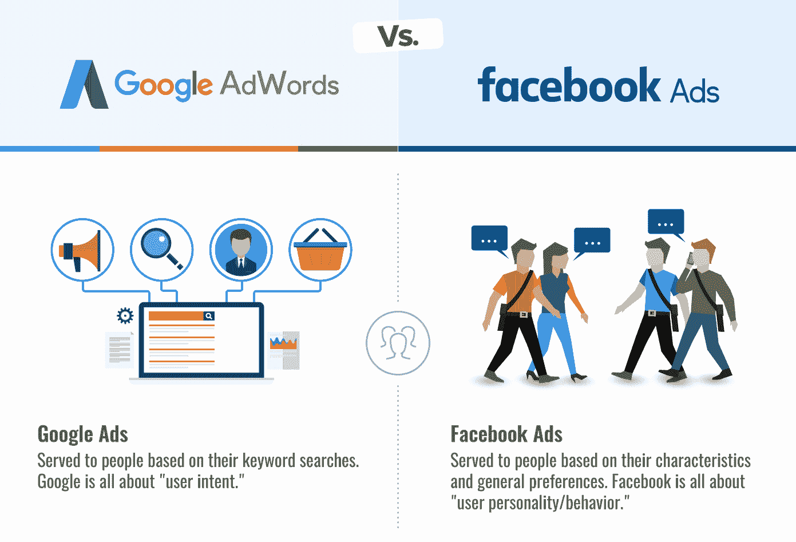
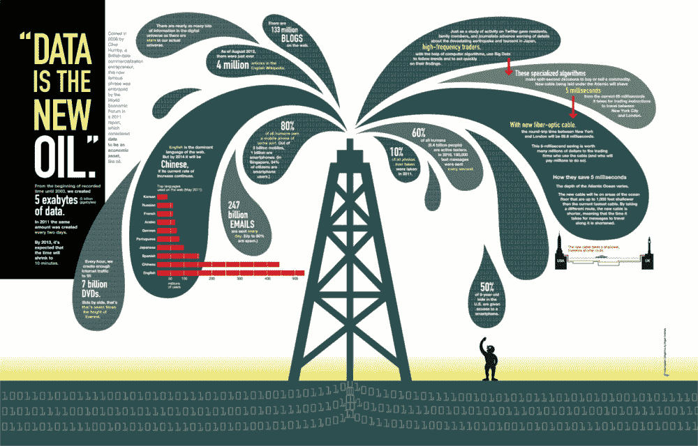
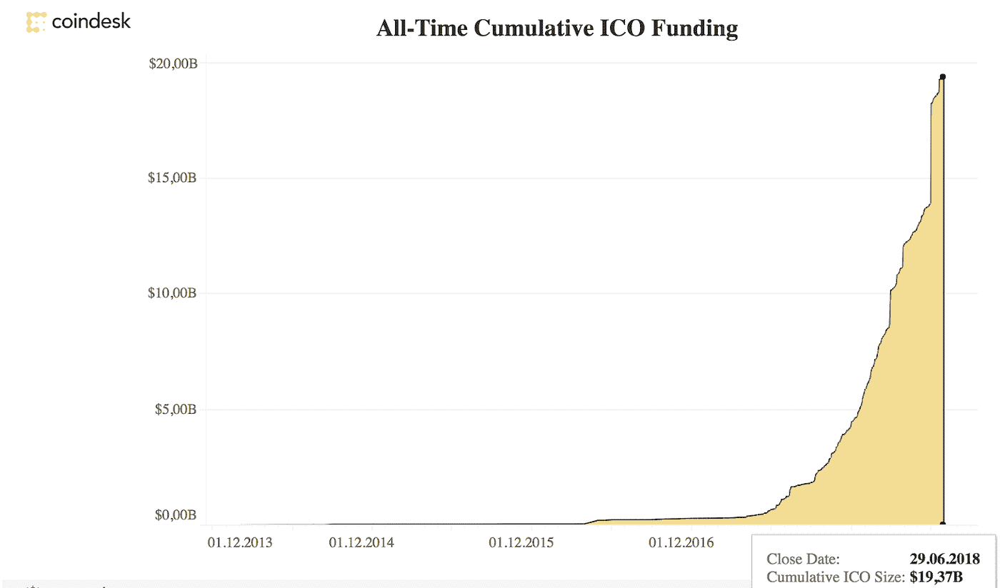

# 数字广告被打破了。问题是，区块链能解决这个问题吗？

> 原文：<https://medium.com/hackernoon/digital-advertising-is-broken-the-question-is-can-blockchain-fix-it-c6d9b7231791>

数字媒体是广告和促销的圣水——至少在 21 世纪初是这样认为的。然而，最初看起来很有希望的事情，现在似乎陷入了危机。

谷歌和脸书似乎是广告领域的革命者，但现在他们阻碍了它的发展。

【https://walkwest.com/blog/google-adwords-vs-facebook-ads/】来源:

*尽管我们很愿意相信互联网最终给了小公司相对于大竞争对手的自由，但事实上，它正在自己创造垄断——包括数字广告。*

***垄断企业控制数据***

*我们很多人都听说过这样一句话“ ***数据是新石油*** ”。*

**

**来源:*[*http://789 marketing . com . ng/data-new-oil-every one-needs-know-they-leaking/*](http://789marketing.com.ng/data-new-oil-everyone-needs-know-theyre-leaking/)*

> *事实上，如果我们将数据视为一种能源或燃料，那么考虑它与太阳、风和潮汐等可再生资源的相似性会更有意义。它是丰富的——比我们可以使用的还要多——我们不应该把它隔离起来，减少供应，而是应该思考如何让每个人都能更广泛地获得它。*
> 
> *[2018 年福布斯](https://www.forbes.com/sites/bernardmarr/2018/03/05/heres-why-data-is-not-the-new-oil/#65c099b13aa9)*

*起初，这些实体似乎不适合与石油相比，石油是市场上最重要的商品之一，数据是一个抽象的概念。*

*然而，这是在过去十年中，广告商和公司了解收集客户数据的力量，并利用它来推广商品和服务。*

*许多公司开始通过使用 cookies、创建电子邮件列表等等来收集数据。但只有少数几家公司有能力深刻洞察数亿用户——脸书、谷歌、亚马逊和苹果。*

*不清楚像脸书这样的平台收集了多少关于用户的数据。有人说每个简介大约有 239 页。脸书的活跃用户超过 10 亿，Instagram 的活跃用户超过 1 亿，该公司存储和处理的数据量非常庞大。*

*我们都知道，从收集的数据中获益的主要方式是广告。GAFA 几乎控制了整个市场，如下图所示。*

*像 GAFA 这样的公司之所以运转良好，是因为它们基本上是一把双刃剑——一方面控制供应，另一方面控制需求。对用户的控制让谷歌、脸书和其他主要科技巨头也能控制广告商。*

# *但是这对广告专家来说是好消息吗？*

*乍一看，数据垄断似乎没有什么害处。毕竟，一个用户分享他的个人数据实际上是没有任何成本的。)而广告主只能从用户密度高的平台中获益。*

*深入探究一下，我们可以看到主要数字广告商弊大于利的十几个**原因**。*

*   *控制美国和全球的广告成本。*
*   *第三方关系使得广告商浪费金钱，低效地瞄准他们的商品和服务。*
*   *集中化危及用户的隐私，并导致信任的丧失任何类型的广告:*
*   *由于使用显示系统而不是订阅，广告的内容开始受到影响——现在广告商严重依赖 clickbait，而实际的广告可能与其预告不同。*

*这份清单还可以更长，但基本的问题是上面那些。**广告商可以清楚地看到，过去十年的数字营销一团糟。但是我们能指望任何事情来改变现状吗？***

# *区块链在游戏中的步骤*

*人们早就认定，区块链拥有改变世界经济的所有潜力。考虑到广告是最重要的经济现象之一，可以有把握地得出结论，变化也将改革这个行业。*

*事实上，这已经发生了。2018 年通常被认为是区块链年，这是理所当然的。至少，看一眼累积的 ICO 基金:*

**

**来源:*[*https://www.coindesk.com/ico-tracker/*](https://www.coindesk.com/ico-tracker/)*

*2017 年底，技术的普及浪潮持续高涨并保持稳定，2018 年跟上这一趋势也是顺理成章的。广告业只是另一个证明。*

*基于区块链的广告工具的主要焦点是确保广告商和消费者之间的个人接触。该技术允许避开第三方中介，直接与潜在客户联系。*

***1。不要只是把你的数据送人，而是要卖掉它。***

*如果用户可以自愿分享他的购买和浏览习惯，并直接从广告商那里获得报酬，而不是基本上给一种方式提供个人数据这样有价值的资源，这不是更好吗？*

*事实证明，区块链已经赋予了一个工具这样的目标。一个例子: [Papyrus](https://papyrus.io/) ，一个广告平台，声称他们的系统可以**节省高达 50%的广告预算**，并保护企业免受广告欺诈。*

***2。为结果付费，而不是欺诈***

*Juniper Research 显示，2018 年**用户因欺诈损失了 190 亿美元**，为不存在的结果买单。这种情况不太可能改变:Statista 预测广告欺诈的成本将增加到 440 亿美元。比 2018 年多了 3 倍。*

> **这意味着数字广告欺诈导致企业主在整体数字活动中每花费 3 美元就要花费 1 美元。至少 1 美元。**

***3。过高的期望***

*为广告服务付费永远是买一只装在麻袋里的猫。当然，经验丰富的提供商试图通过 A/B 测试、受众分析和全面的大数据分析尽可能精确地预测未来的结果。*

*然而，没有办法知道你是否为实际结果付费，而不是为已经提到的欺诈付费。*

***4。解决信任缺失***

*2015 年，[尼尔森](http://www.nielsen.com/us/en.html)发表了一份评估全球广告信托的报告。毫不奇怪，这一结果低于此前的 2013 年和 2009 年。趋势很明显——广告失去了效率，更准确地说，失去了数字形式。*

***企业主被承诺将获得看起来几乎像用户生成的内容或特色材料的原生广告。***

*然而，全球结果表明，客户已经学会识别这种尝试，“本地”方法开始失败——缓慢，但肯定。*

*随着区块链和人工智能的组合，广告商可以收集客户的见解，并取得更好的效果，创造出真正吸引目标客户的广告，因此更值得信赖。*

***5。制定营销和广告战略***

*广告只有在其策略奏效时才有效。*

*对于企业主来说，手动进行分析、集思广益和规划是一件非常棘手的事情，因此他们求助于辅助工具。然而，问题就在这里。所有的规划工具都需要大量的数据，这意味着，企业主只是把机密信息交给他们的客户。*

*现在想象一下，如果服务器遭到黑客攻击，数据被泄露或删除。企业主让自己陷入了巨大的麻烦，无法控制企业。当然，这使得规划更加困难，风险也更大。*

*然而，已经有持续的区块链创新解决了这个问题。 [Triggmine](https://www.triggmine.io/) ，一个营销自动化的分散平台，将分析、营销和广告结合在一个现成的组合中。*

*这种组合包括所有的集中营销传播，包括重新定位、信使、推送通知、语音助手、网络个性化、展示广告、呼叫中心、销售点、社交网络、社交广告和表格(调查)。*

*现在，企业主不仅可以让数字活动变得更容易，而且有一个平台来为他们做这件事。几年前似乎是虚构的，现在是现实了。*

# ***广告坏了，这是真的。然而，区块链有所有正确的措施来解决这个问题。***