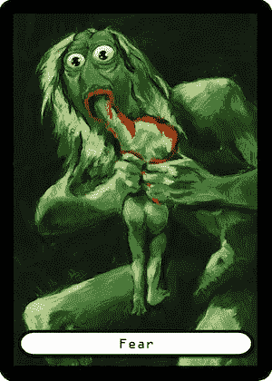

# 区块链上的数字艺术🎨

> 原文：<https://medium.com/hackernoon/digital-art-on-the-blockchain-718a631c446b>

## 迷因经济是真实存在的，而且会一直存在下去。

[PepeDapp Card](http://www.pepedapp.com/), “Pepe Devouring His Son” by [CryptoDrawz](https://twitter.com/cryptodrawz)

区块链为交易、签名和存储信息的新方式开辟了一个充满机会的世界。虽然大多数人都听说过 CryptoKitties，但这个故事不仅仅是一个繁殖可爱小猫的游戏。区块链技术正在将迷因经济带入现实。

一般来说，像模因、艺术和音乐这样的创意产品很难在互联网上发布内容，而不用担心盗版。一旦内容被复制并免费分发，其价值就会下降，该产品的市场前景也会消失。对于这些数字产品来说，要建立和保持价值，就需要用稀缺性来定义。

区块链像交易对手和以太坊通过提供一种确定和同意稀缺性的方法来帮助解决数字艺术的这个问题。这些工具创建了一个平台，通过将所有权放在区块链上来发行有限的艺术品供应，这造成了这些资产的全球公认的稀缺性。

**查看佩佩达普——以太坊区块链上罕见的佩佩卡**

 [## Pepes dapp-ETH 上罕见的 Pepe

### 区块链以太坊上的稀有人物

www.pepedapp.com](http://www.pepedapp.com/) 

# 艺术给区块链带来的好处:

1.  **认证:**艺术家/创作者可以在交易被添加到区块链时“签名”，允许数字艺术品带有艺术家的签名，有效地充当真实性验证。
2.  **数字自动化:**在区块链创作和销售艺术品的过程为自动化委托创造了新的范例。在区块链，艺术家可以证明他们创造了一个模因，并因其使用而获得报酬，允许通过智能合同自动化获得持续佣金。
3.  **供应:**艺术家可以发放限量供应的艺术品。可以在分散式分类账(区块链系统)上跟踪与一件物品相关的编号。一旦艺术品的供应被发放到区块链，供应就不能改变。
4.  **所有权:**你所拥有的，都是你自己持有的，只有你自己。只要您拥有资产的私钥，您就是所有者。
5.  **全球:**通过互联网，艺术家可以参与并在全球市场上销售他们的作品。
6.  **去中心化:**工具和指导方针旨在减少把关者和中间人的权力，增加艺术家的自主权。
7.  **隐私:**使用假名可以让艺术家在匿名的情况下创作和出售艺术品，让他们在没有判断的情况下进行创作。
8.  数字艺术通常因其相关性和快速传播的能力而受到重视。现在，模因和艺术有能力以数字原生方式创作、编辑和销售艺术，可以捕捉当前事件并实时共享。
9.  **抗审查:**作品一旦发布，就无法删除。

这场数字艺术革命已经开始了。一张罕见的佩佩卡，交易对手协议上发行的数字交易卡，霍默·佩佩拍出了 3.5 万美元。截至 2018 年 5 月，已售出 367，286 只 CryptoKitties，平均价格为 65 美元。

**看看佩佩达普——以太坊区块链上罕见的佩佩卡**

 [## Pepes dapp-ETH 上罕见的 Pepe

### 区块链以太坊上的稀有人物

www.pepedapp.com](http://www.pepedapp.com/) 

在推特上关注我[乔希·佩蒂](http://twitter.com/jashpetty)