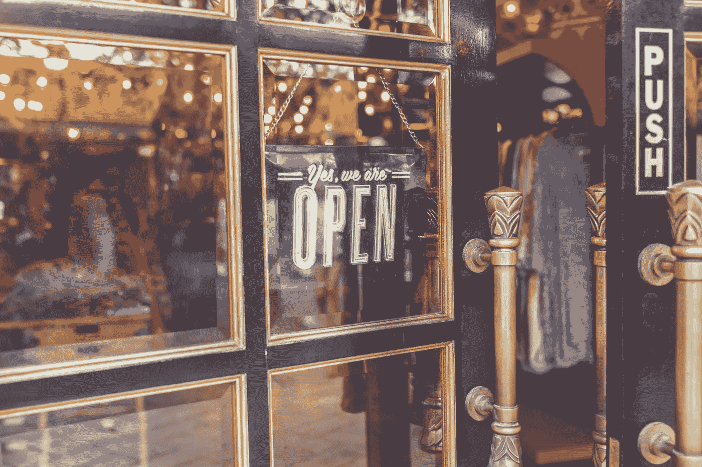
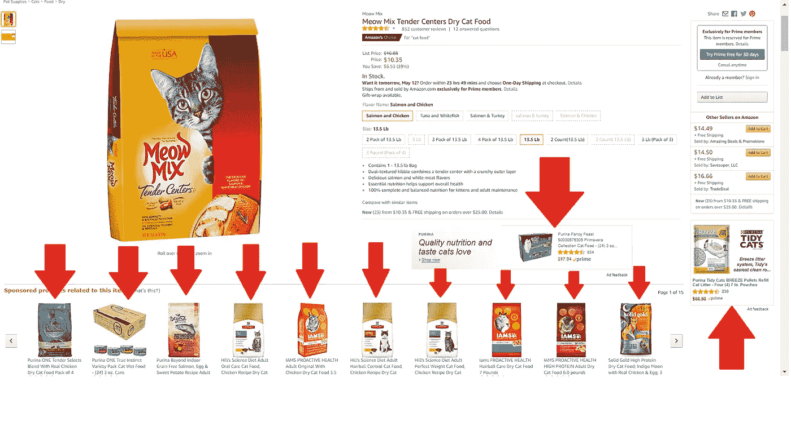

# 数字资产所有权:为什么重要&区块链将如何拯救世界

> 原文：<https://medium.com/hackernoon/digital-asset-ownership-why-it-matters-how-blockchain-will-save-the-day-79847e7d554a>

在前数字时代，零售商在实体建筑、农贸市场摊位或柠檬水摊位出售所有商品，零售商拥有并负责公司的所有资产。

他们的顾客了解他们，他们控制着如何向市场展示自己的一切。商人，尤其是那些自己生产商品的商人，知道他们的顾客想要什么，以及如何展示他们的商品。

这种性格不仅仅是一种自豪感，而是当地企业家的工作方式。这是资本主义的基础。

我不必告诉你数字时代如何改变了我们的购物方式。但这也改变了我们销售 T1 的方式。

今天，小商家必须玩一个由他们根本无法与之竞争的力量运行的游戏:在线巨头——亚马逊、易贝等。他们必须遵守这些平台的规则，才有生存的机会。

虽然小企业在这些大网站上开始销售相对容易(尽管不一定便宜)，但这不是一个让他们受益的游戏场。

一个很大的原因是小企业不再拥有数字意义上的商店橱窗。平台有。

这些数字资产包括产品图片、描述、客户评论以及页面的浏览结构。一个拥有亚马逊卖家账户的小企业在如何展示他们的产品方面有一些投入——使用什么图像和描述，以及卖什么价格。但最终决定权在亚马逊，因为他们拥有自己平台上的每一项数字资产。

这给了亚马逊巨大的商业杠杆，而这是自由企业从未想过的。这是一种对共有制服装的垄断。

因为零售商在亚马逊上不拥有他们的数字资产，他们的算法可以在他们认为合适的时候操纵你的页面。他们可以根据自己的市场评估提高或降低其存在。他们甚至可以把竞争对手的产品 ***放在你的页面*** 作为推荐选项。

That’s a lot of advertising placed at extremely important parts of a product page. Side note: I have 2 cats.

想想那个。你有没有去过附近的五金店，看到竞争对手的商店在街上卖锤子的海报？你有没有走过一家麦当劳，看到橱窗里的巨无霸广告？我们面对的是这种荒谬的程度。

亚马逊可以将其描述为“为我们的客户提供选择”但是，事实并非如此。它控制了整个市场——降低了一些零售商的产品价值，同时提升了出价最高者的价值(即他们的竞争)。

这就是为什么数字资产的所有权在今天的电子商务生态系统中是一个非常重要的问题。使用亚马逊和其他大平台的小商家几乎别无选择，只能将控制权交给公司实体，这些实体的唯一关注点是回报自己和股东。

这值得增加流量和降低投资回报率吗？

不。这就是为什么区块链的新领域将小企业的权利带到聚光灯下。小企业主必须尽可能多地拥有他们的数字商品——资产、技术和数据。

有了区块链技术，所有数字资产的所有权都可以在一个不可信的环境中被记录下来，以便在所有者认为合适的时候进行买卖、租赁或转让。

一个很有前途的项目， [ECoinmerce](https://www.ecoinmerce.io/) ，正在致力于解决这个问题。ECoinmerce 电子商务平台允许所有企业所有者保留自己的数字资产。*他们*决定登陆页面上的内容，并保持对如何访问、修改和展示的控制。

ECoinmerce 没有集中的团队，对股东负责，对卖家的利润没有佣金，只是为店面的存在建立了一个框架。销售人员决定他们的客户需要看到的最重要的元素。他们控制外观。他们的营销特权驱动着他们的产品页面；他们自己的客户数据可以让他们设定库存和优先级。

再加上区块链上数据的安全性、[加密货币](https://hackernoon.com/tagged/cryptocurrency)的灵活性和一个自我监管的社区，你会看到 ECoinmerce 如何让企业在没有入侵或他人设计的人工算法的反复无常的结论的情况下控制自己的命运。

ECoinmerce 正在建立一个电子商务平台，让小企业主对自己品牌的投资真正有价值——而不会拿走他们努力建立的东西。

这种创新是我们拥有自由市场的首要原因。这种创新最终为电子商务带来了公平的竞争环境。

思想？区块链还在改善什么？请在下面的评论区告诉我你的想法，或者在下次聚会时开始讨论。