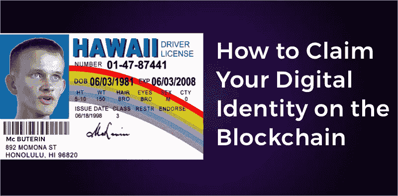
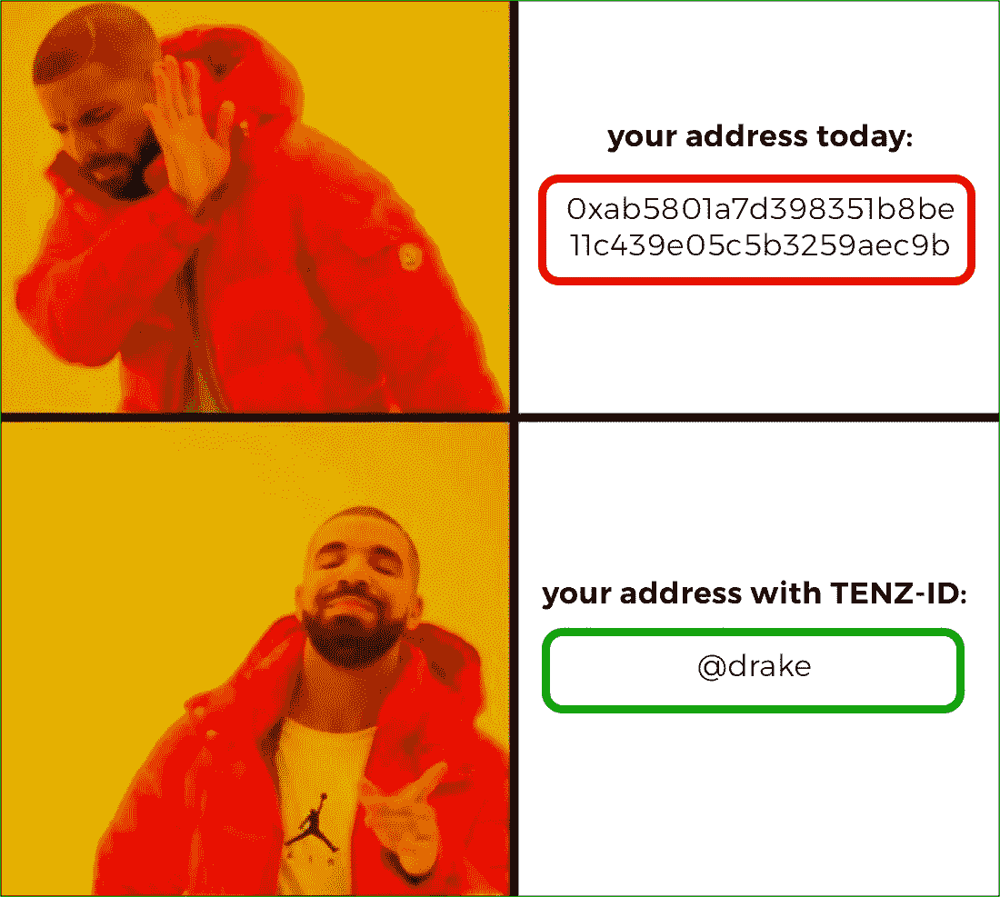
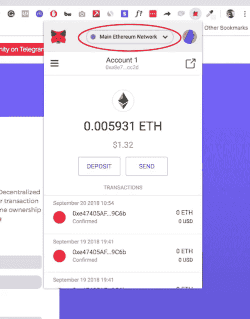
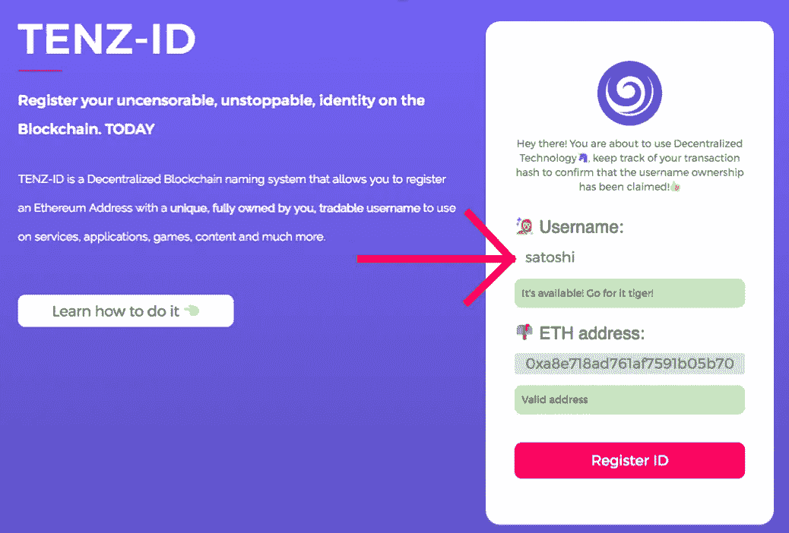
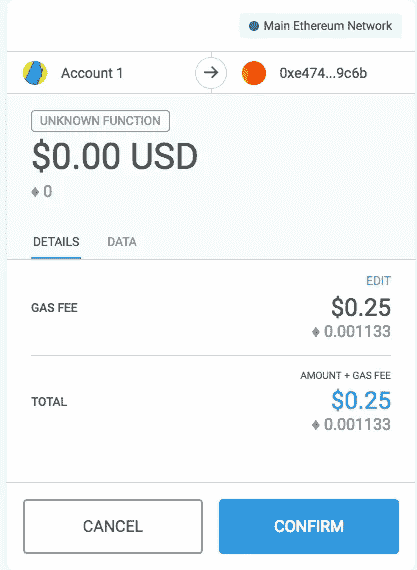
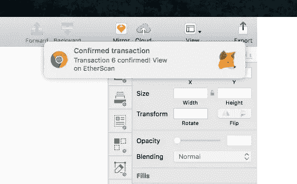
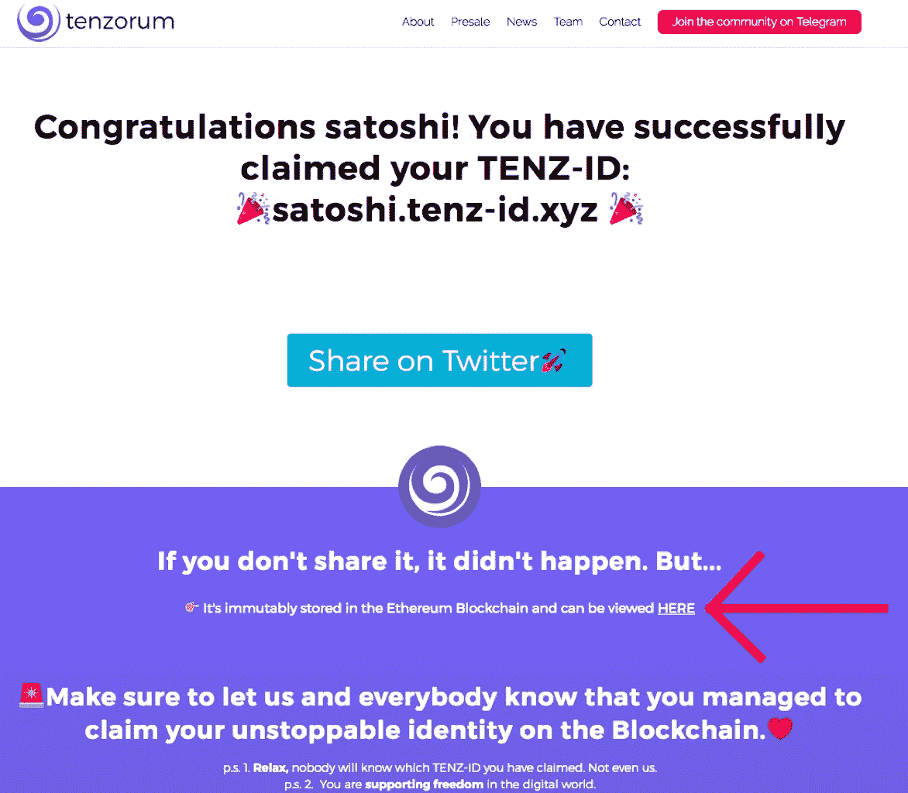
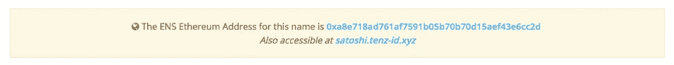

# 区块链上的数字身份。你今天可以要求你的。

> 原文：<https://medium.com/hackernoon/digital-identity-on-the-blockchain-you-can-claim-yours-today-e5ee19ddd6c5>

## TENZ 身份证。由区块链技术驱动的不可审查、不可阻挡的身份。

TENZ-ID 是一个去中心化的[区块链](https://hackernoon.com/tagged/blockchain)命名系统，允许你用一个**唯一的、完全归你所有的、可交易的用户名**注册一个以太坊地址，以便在由区块链驱动的服务、应用和游戏上使用。你可以在 tenzorum.org/tenz_id 的[做你自己的。🎉](https://tenzorum.org/tenz_id/)

Whaaaaat?

***—哇哇哇。冷静一下莫里茨的话，你是在告诉我，今天我可以拥有自己的使用区块链技术的数字身份吗？？？***

> 酷毙了。这是什么💩甚至刻薄？

放松点。握住我的手穿过你的键盘。我不仅会告诉你为什么这很神奇，我还会教你如何在不到 10 分钟的时间里得到一个，并成为去中心化世界的一部分。

是的。几分钱。不到 10 分钟。无限可能。

我们将一起努力。

我会给你指路。

## 什么是 TENZ 身份证，为什么它很重要？

TENZ-ID 是由 [Tenzorum 项目创建的一个系统，该项目正在开发用户友好的工具，以分散的技术授权人们解放网络](https://tenzorum.org/)。我们正在帮助任何人在区块链上注册一个用户名，只需点击几下(准确地说是 2 次)**，而无需了解智能合约**及其背后固有的复杂性。

> 几下点击。即时价值。好处多多。

***—为什么我在区块链上需要用户名，我可以用它做什么？***

Drake knows.

好了，这就是区块链目前对你的看法，我们称之为**公众号**:

**0x ab 5801 a7 d 398351 b 8 be 11 c 439 e 05 C5 b 3259 AEC 9b**

让我们在某件事上达成一致吧…

我真的为你感到高兴，如果你有疯狂的记忆能力，或者如果你喜欢输入那种散列，但是在用户体验方面…

这真是太糟糕了。

在每一个去中心化的应用中(完全由区块链驱动)，你在某种程度上是一个哈希/一个公共地址。要执行交易，给朋友汇钱，注册成应用，要在区块链上做任何事情，你都得有一个属于你的公共地址。

区块链上:**你就是那个公共地址。**

但是它们很丑。令人恐惧。并且对用户不友好。而且不方便。而且很丑。

# TENZ 身份证解决了这个问题。🎉

我们创建的是一个分散的解决方案，允许您将唯一的用户名附加到您的公共地址。

好吧，好吧，我明白了，用户名之类的东西，但是创建一个 TENZ ID 的核心好处和价值是什么呢？

伊隆在圣诞节带给你一辆特斯拉。就是这样。🚘

不，我开玩笑的，抱歉。

虽然如果你有一个我会很高兴，但基本的好处是:

# 👨‍🎨可达性。

这是显而易见的。如果我们希望区块链成为主流，并让下一个 10 亿人进入去中心化的世界，那么认为人们甚至必须以原始形式与公共地址进行交互就太天真了。

如果你曾经买过 ICO，有一些密码或者是一个传奇的密码朋克，你需要一个个人地址作为用户名，宜早不宜迟。这就是一切工作的方式！

# **🙌自由。**

> TENZ 身份证是由设计；不可阻挡和不受审查。

当你在表哥扎克的平台(又名脸书)或佩奇叔叔的电子邮件系统(Gmail)上注册时，你是在请求他们允许你使用他们的服务。作为回报，你给他们你的数据。

你可以被审查，禁止，停止，抹杀(不是这个)。因为是**他们的**平台。这就是中央互联网的工作方式。

TENZ-ID 不是这样的，因为这不是我们的平台， ***它属于世界*** 。这是一个链上解决方案，使用以太坊区块链地址注册您的用户名。你不要求存在或运作的许可，你只是要求。

# 💸你会先听到。

@ [Tenzorum 服务节点网络！！！](https://medium.com/u/587a00dbce51#tsnn)

与此同时:

**你需要在 ETH 有几分钱，不要做一个廉价的韧皮👾💩👽去拿这些钱吧！**

# 第一步:

转到[tenzorum.org/tenz_id](https://tenzorum.org/tenz_id/)。

确保你的元掩码在以太坊主网络上。

**这是什么意思？**

👉这是真正的以太网，你真的得到了这个用户名。就像真的…合法的… 10/10…

不管怎样，我们继续吧。

Stop judging my balance.

# 第二步:

输入您想要的用户名并确保它可用，确保 ETH 地址与您的元掩码地址相同，当您准备好加入分散世界时，按**注册 ID。🎉**

然后你会被重定向到另一个页面，或者在你的屏幕上弹出一个 Metamask 窗口，显示类似下图的内容。选择**确认。🎉**

Less than 30 cents as I said before.

我们就要到了，我美丽的人类，不要放弃我们，now❤️.

# 第三步:

您将被重定向到确认页面！你所需要做的就是等待你的提交被确认。

有两种方法可以确认你获得了 TENZ 身份证，区块链中的事情进展顺利:

1.  等待一个弹出式窗口最终出现(可能需要大约 5 分钟)，耐心，冷静，坚持不懈，就像生命之河中流动的水一样🔥

The pop up looks like this.

2.点击确认页面上显示的消息**“此处”**👇。

你将被送到**以太扫描。在那里，你可以看到你的提交状态。**

**🚨现在注意这个:**

如果您的交易状态为**“未决”。TENZ 身份证还不是你的。它是待定的💡…我不控制区块链( ***)，如果我控制了，价格只会一直上涨🤷🏻‍*** )，所以有时候事情可能会以一种有趣的方式进行，你可能不得不再试一次。**

但是假设一切顺利，你收到了确认…

# 你还有一件事要做…而且真的很重要。

# 第四步:

这是迄今为止你做过的最重要、最关键、最重要的事情之一…

这对我意义重大…

你看到那个蓝色的大按钮写着:**在 Twitter 上分享🚀？**

是的，莫里茨，我确实看到了，我的朋友。

> 你点击了它并在推特上分享了它。👊

这就是你如何让我知道你通过了教程，现在有你的 TENZ 身份证！记得给我贴标签！[***@ mrtzneto***](https://twitter.com/mrtzneto)***。***

## BOOOOOM。就这样，你通过了🔥

# 让我们验证您的用户名！

来看看你在区块链上注册的**用户名**！！！！

转到[以太扫描](https://etherscan.io/)，在浏览器栏上输入你刚刚宣称的 TENZ ID。

> 这意味着从现在开始，你不再需要在以太网扫描上输入你的公共地址，你可以直接输入你的用户名🤯。拜托，我知道你很感动。

我的情况:***Satoshi . tenz-id . XYZ***

这就是你将要看到的:

这是你应该有的感觉:

You own it. Welcome to Tenzorum. Welcome to a better Decentralized World.

# 我怎么把这个转给别人？

💰我们将推出一个浏览器供您交易这些用户名。💰

我会用更多的细节来更新这篇文章，解释如何用 mycrypto 和$oon 用我们的交易$y$tem 来做这件事，如果你想知道它什么时候可用，请在下面的 ***(我不会随意给你发垃圾邮件👩‍🚀).***

> 👉很快你就可以在应用程序、游戏、交换和以太坊生态系统中使用这个身份了！

# **最后的考虑:**

你在区块链上打出了自己的身份。🎉这基本上就是我们所说的子域工厂。这意味着您已经使用我们的智能合约与以太坊区块链进行了交互，以创建您的个人用户名。欲了解更多关于[背后的](https://hackernoon.com/tagged/technology)、[、**的技术，请访问本文**](/tenzorum-project/the-ultimate-ens-and-đapp-tutorial-a4f2ede94b08) **来自传奇**[**Radek ostr owski**](https://medium.com/u/afbdfe071582?source=post_page-----e5ee19ddd6c5--------------------------------)、首席区块链工程师 [**Tenzorum**](https://tenzorum.org/) 曾打造所有智能合约🚀s🚀🚀。

**你刚刚解锁了一些区块链超能力**，我希望这有助于你对这个神奇的空间更加感兴趣和参与。但是请记住，权力越大，责任越大。

如果你正在做一些有趣的事情，请在下面的部分留下任何问题或评论，并与大家分享。Tenzorum 社区总是热衷于帮助很酷且有意义的项目。

[**既然你已经经历了一切，别忘了让我知道你对这篇文章的体验如何，你已经建立了什么，你正在做什么！**](https://twitter.com/mrtzneto)

**🌻鸣谢:**

🍄智能合同和人们根本不懂的东西-> [拉德克](https://medium.com/u/afbdfe071582?source=post_page-----e5ee19ddd6c5--------------------------------)

🦄UX 与设计-> [**@mrtzneto**](https://twitter.com/mrtzneto)

🌴前端和实现-> [标记](https://medium.com/u/6183bc726482?source=post_page-----e5ee19ddd6c5--------------------------------)

🌀正在改变区块链世界的隐藏宝石-> [**@tenzorum**](https://twitter.com/tenzorum)

# 👏另外，请给我至少 20 次掌声，祝我今年在 crypto 中好运；)