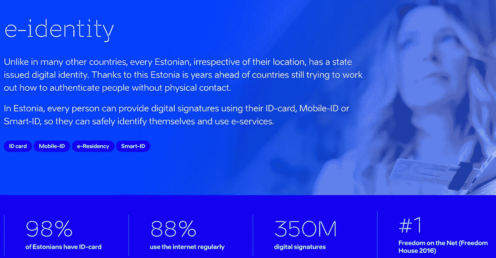

# 数字身份——为什么它永远不会真正全球化

> 原文：<https://medium.com/hackernoon/digital-identity-why-it-will-never-be-truly-global-4f041ac87e90>

> ˌīˈden(t)ədē名词作为一个人或事物的事实。
> 同义词:姓名，身份证

“身份”一词有许多含义。关于它是什么，谁拥有它，谁有权发行它，有不同的想法和争论。

这不是这篇文章的内容。

在这里，我们将讨论数字识别的**本质，因为它在实践中被使用。没有与现有经济条件和监管机构相关性有限的空想。以下是目前的情况，这将向你展示为什么我们有一个隔离的、低效的系统；更重要的是，为什么这暂时没有错。**

# 为什么提供公民服务是其他任何事情的先导

## 印度

辖区差异如此之多，覆盖面如此之广，以至于数字身份全球化毫无意义。

社会保障等政府服务，以及口粮和儿童保育福利等基本需求，是世界上更多人口的必需品。

政府实体需要确定个人是他们所说的人，并有办法跟踪和分发他们的服务；尤其是在潜在恶意行为者较多的地区。这超出了信用卡盗窃的范畴，会威胁到基本需求，如[食物](https://www.thenewsminute.com/article/when-red-tape-creates-hunger-how-aadhaar-linking-denying-food-people-ktaka-77023) **。**

这让我想到了 Aadhar 印度最近发布的数字身份服务，使用指纹和虹膜扫描等生物特征，以及唯一的身份号码，实现无缝验证方法。现在，让我们不要粉饰它。这是一个有争议的话题，尤其是对自由主义者而言。但是对于一个拥有 14 亿人口的国家来说，这是一个进步。

我有没有提到它和印度堆栈有关？IndiaStack 是一组 API，允许政府、企业、初创公司和开发者利用 Aadhar 进入印度市场，开发解决方案，并简化业务处理方式。

一个到 Aadhar 的开源链接，支持文档交付、支付网关和基础设施。所有这些都是为了简化做生意的方式。

*我在这里不是要给出一个意识形态上的论证，只是简单地阐述一下世界的状态。*

## 新加坡

我最近访问了人口约 560 万的新加坡。与印度类似，新加坡政府拥有资本和基础设施，因此有能力传递经济和社会变革。因此，他们的服务效率更高，相信我，新加坡绝不是死气沉沉的。

SingPass 是一个身份识别系统，可与 60 多个政府机构进行交互。请想一想，60 个不同的机构，560 万人口

## 爱沙尼亚

爱沙尼亚约有 130 万人口，拥有目前世界上最先进的电子身份系统。更容易在较小的人群中实现，但是原理本质上是相同的。特定的政府服务，超高层次的理念，如便携式自我主权 ID:

*   爱沙尼亚公民在欧盟境内旅行的合法旅行 ID
*   国民健康保险卡
*   登录银行账户时的身份证明
*   对于数字签名
*   为我投票
*   检查医疗记录，提交纳税申报等。
*   使用电子处方

这又回到了试图整合跨辖区的一刀切解决方案的概念。与寻求全球扩张的跨国公司类似，有许多变量需要考虑，包括当地文化和标准，以及当地监管机构、系统和基础设施。令大多数人沮丧的是，世界并不和谐。

**瑞&芬玛**

有趣的是，我们可以看到不同的政府和监管机构是如何处理在线身份表单的。虽然你可能会看到很多关于自我主权 ID 和互联网的炒作，但人们没有看到的是，典型的金融交易的范围在监管机构之间往往是不同的。那些数字 KYC 机制被扔出窗外，你不能参与金融系统。

瑞士金融监管机构 FINMA 提出了一种新的在线身份验证方法。这显示了改善个人入职程序的积极步骤。

与以前的数字化入职方法不同的一个因素是要求从瑞士的一家银行转账。这一要求对全球业务来说是限制性的。他们还取消了在视频识别过程中使用一次性密码的要求，这是另一个有时违反直觉的障碍。

在新批准流程的这些新增内容中，包括要求在数字入职期间使用活动检测；这是世界各地正在出现的一种趋势，它要求在入职流程中进行检查，以确认实际上是一个真实的人在使用一个系统进行注册，该系统不仅仅是自拍，而是实际上要求个人“向上看，向左看，向下看”，并从该流程中随机抽取一个屏幕。

这份名单上还有更多国家，包括一些拥有电子身份服务以及正在开发这些服务的国家。全球范围内所有这些迷你世界的交叉将是一个有趣的现象。

# 数字身份和客户入职

这一切都很棒。不同的 ID，不同的系统，不同的政府福利…我们都看到了用例。但是产品和服务呢？我们都在网上做过某种身份验证和商业交易，那么，那里发生了什么？

从监管角度来看，身份是必需的，而 KYC 则围绕两个基本问题:

> 你是你所说的那个人吗？
> 
> 你是恶意演员吗？

金融交易在地区和全球范围内属于不同的监管机构。在严格的指导原则下对其进行监控的一个根本原因是反洗钱和反恐怖融资导致了不同的要求，如上述 FINMA 示例所示。

# 证券和 KYC

这就引出了我的最后一个话题:筹集资本。当购买一家公司的股票时，人们会想知道其资本表的细节，这意味着要遵循监管规范。在某些情况下，身份空间中的最佳实践是违反直觉的——但有时世界远非完美。

在这里，我们可以区分多种元素，如文档认证、活性检查、条形码检查以及与全球制裁和观察列表数据库的匹配。这方面的一个例子是加拿大的 FINTRAC，这是组织必须遵守的财务标准。根据 FINTRAC，仅仅使用护照、活跃度和支票是不够的。就像我说的，违反直觉。为了满足要求，你必须做一个信用局和 SIN 检查或文件认证，并获得居住证明。前者可以自动化，后者通常不能，这使某些公司在提供这些服务时处于有利地位:然而最终对最终用户来说仍有摩擦。最后

本文绝不是包罗万象的，但它旨在展示世界上不同的电子身份计划和数字入职制度，并强调根据您执行的交易类型，可能存在巨大的管辖差异。出于这个原因，虽然我对保护隐私和创建数字身份的新方法持乐观态度——最终各国公民需要获得政府服务和参与金融市场的能力，但我认为短期内——甚至中期内，一些新服务不仅仅用于下一个消费者网络应用程序。

# 最后

这篇文章决不是包罗万象的。它旨在展示世界上不同的电子身份计划和数字入职制度，并强调根据所执行的交易类型，可能存在巨大的管辖差异。因此，尽管我对保护隐私和创建数字身份的新方法持乐观态度，但公民需要获得政府服务和参与金融市场的能力。我没有看到一个短期甚至中期的解决方案，其中一些服务不仅仅用于下一个消费者网络应用程序。

这个世界有点奇怪。

Gridlock — Photo by [Jakob Owens](https://unsplash.com/photos/i7tQ08k9ZV0?utm_source=unsplash&utm_medium=referral&utm_content=creditCopyText)

Q

感谢[扎菲拉·拉詹](https://medium.com/u/cffb28504e70?source=post_page-----4f041ac87e90--------------------------------)和[亚历克斯·沃森](https://medium.com/u/7a09f0ad561b?source=post_page-----4f041ac87e90--------------------------------)的编辑

*评论、问题、建议？我很想收到你的来信，请在下面留言…*