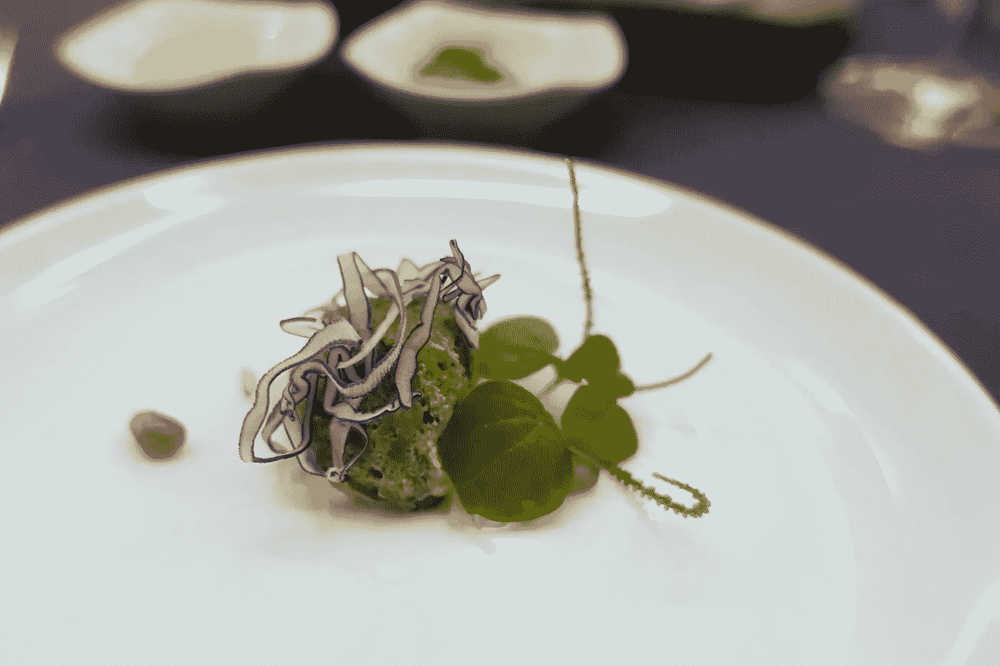

# 数码奢侈品

> 原文：<https://medium.com/hackernoon/digital-luxury-d4c3aa5c1767>

我们有时会听到关于奢侈品崛起的报道，但我们在数码产品中并没有看到太多。也许人们不知道什么是数字奢侈品，也不知道它如何体现自己？如果一个比特币百万富翁想要炫耀一个奢侈的加密钱包，它会是什么样子？可能是这样的:

奢侈品是由设计和稀缺创造的。对于实体产品，这通常意味着由昂贵材料制成的限量版产品。但 app 或游戏等数码产品中的材质是什么呢？而当数字产品可以被无限复制时，我们如何创造排他性？这里有两种方法可以让数码设计师给他们的产品增添光彩。

## 1.奢华源于设计

奢侈品经常使用不必要的昂贵材料。例如，手表不需要黄金才能发挥功能。我们可以浪费什么类型的材料来增加数码产品的奢华感？

**浪费屏幕空间。**高端印刷品使用过多的空白来增加页面内容的丰富性和重要性。

Use of white space in Kinfolk

同样，设计师可能会在数字布局中浪费像素，并使用比所需更多的空白空间。旧的“少即是多”的设计模式也适用于数字产品。

**浪费时间。**我们希望质量需要时间。例如，在高级餐厅用餐时，平静而精心的服务是奢华体验的一部分。

Fine dining is worth waiting for

数字设计师花了很多时间制作软件，但很少有人考虑真正降低部分用户界面的速度。在选定的过渡中浪费时间可能是提升特定用户体验的一种方式。例如，当一名玩家即将赢得一场佩吉游戏时，动画[会放慢速度](https://www.youtube.com/watch?time_continue=557&v=UjGeaiY1cg0)来开始一场惊人而可笑的视觉庆祝。

通过将空白与不必要的动画相结合，我们得到了这样的结果:

## 2.独家带来的奢华

对于模拟产品，最简单的方法就是限制某个产品的版本。对于数字产品来说，稀缺很难实现，因为软件可以被无限复制。直到最近，独家数字商品只能存在于受控环境中，如魔兽世界和其他在线游戏。

如今，开发者可以使用区块链令牌来保证数字对象的排他性。[不可替代的代币](https://hackernoon.com/an-overview-of-non-fungible-tokens-5f140c32a70a)使人们能够完全拥有独一无二的数字资产，而不受特定游戏规则或环境的约束。今天最著名的非可替代物是[的 CryptoKitties](https://www.cryptokitties.co) ，我们期待在前方看到[更多数码艺术和收藏品的例子](/@Manuel_Zeiler/crypto-collectibles-non-fungible-tokens-nfts-the-killer-app-for-the-blockchain-96fe229b7b57)。也许甚至会有团队利用这项新技术来设计和开发专属应用程序？

Rare Bits is a marketplace for non-fungible crypto assets

因此，奢华的设计和稀缺性对于数字产品的创造者来说终究是可以实现的。顺便说一句，如果你碰巧知道有人想要一个专属的数字钱包来存放他们的比特币，请[联系](http://www.nobiz.se)！我们可以做一些非常非常昂贵的设计工作。