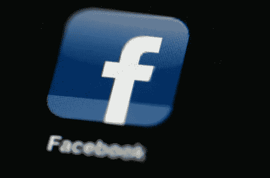

# 第一部分:社交媒体、抑郁和多动症

> 原文：<https://medium.com/hackernoon/digital-media-and-mental-health-part-1-social-media-18c25c01ed34>

社交媒体的使用可能会导致抑郁，部分原因是新闻提要简化了同伴比较——“幻想的社会比较”——在下意识地将他人的浪漫化投影与我们在电子屏幕后的孤立自我进行对比后，我们会感到自卑。此外，当人们虚弱和有压力时，他们会首先与社交媒体互动，从而加剧后果。

然后，用户通过上传内容寻求外部验证来响应同行比较。在最好的情况下，当照片获得很多喜欢时，这会导致外部化的自尊，而在最坏的情况下，当照片没有获得喜欢时，会适得其反。即使你获得了很多喜欢，外在化的自尊也可能削弱而不是加强我们内在的自尊。带有“喜欢”的图片通常不代表我们的内在自我，所以我们从非真实自我的东西中获得自我价值。

我们已经看到美国国内外的学术研究表明，更多的社交媒体使用与抑郁症症状有关。这可能是因为用户体验是两个东西之间的反馈环:同行比较和外部自尊。两者都与抑郁症状有关。

我们不断回到社交媒体，从我们社区的人们那里获得精简的新颖社交信息，以获得短期刺激。

现在，社交媒体的使用可能会导致多动症。人们在社交媒体上与我们互动的偏执——这可能在任何时候发生，并且对其他人可见——使我们不断检查社交媒体的通知。您可以更改您的设置，使互动大多是私人的，但这不是默认的。

通知通知您有人与您的个人资料进行了互动。检查他们的存在可以减少人们对您的个人资料做了什么以及其他人可以看到什么的担心。

有了通知，如果我们没有通知，其他人就看不到我们的个人资料，或者我们有通知，我们可以立即查看发生了什么。我们可以努力保护自己免受有害互动的影响，比如删除一条充满仇恨的评论。或者我们可以享受自我膨胀的评论或喜欢。

问题是这些通知——我们检查它们是为了减少对交互的担心——在随机的时间到达。我们与不可预测的通知的互动可能会令人着迷，就像与所有随机奖励的互动一样。

通知推动了对社交媒体的强制性检查，也解释了为什么我们使用社交媒体，尽管我们现在在研究中看到了可能的心理后果。

让我们在网上易受攻击的是永久的评论和我们大量的朋友和上传的内容。由于评论，我们上传的每张图片都容易受到攻击。我们有大量的朋友，增加了我们在网上的脆弱性。但我们还是会上传，以回应新闻源上的同行比较。因此，我们可能会不断地查看社交媒体，以减少因脆弱而产生的压力，并经常分心。

在我的书中，我做了更深入的探讨。我还探讨了社交媒体设计如何改善内容文化和对用户的长期价值。我研究了社交媒体的商业需求和用户心理健康需求之间的利益冲突。

我写了一本关于数字成瘾的书。现在购买从 [*巴诺*](https://www.barnesandnoble.com/w/trapped-in-the-web-an-turner/1129986845) *或*[*indie bound*](https://www.indiebound.org/book/9781732182196)*。*

研究:使用社交媒体和不快乐之间的因果关系:[http://journals.plos.org/plosone/article?id = 10.1371/journal . pone . 0069841](http://journals.plos.org/plosone/article?id=10.1371/journal.pone.0069841)