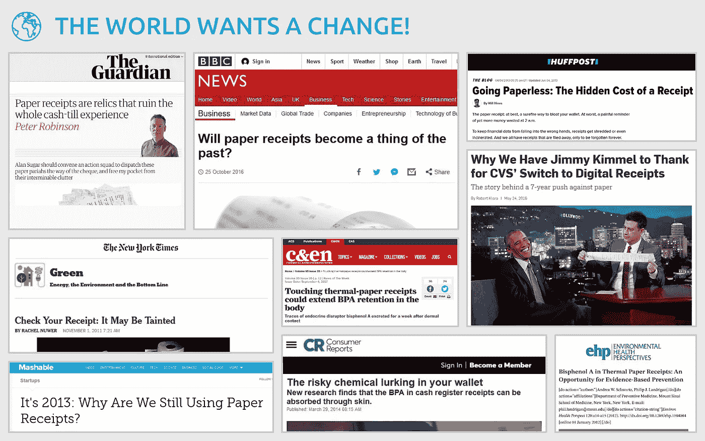
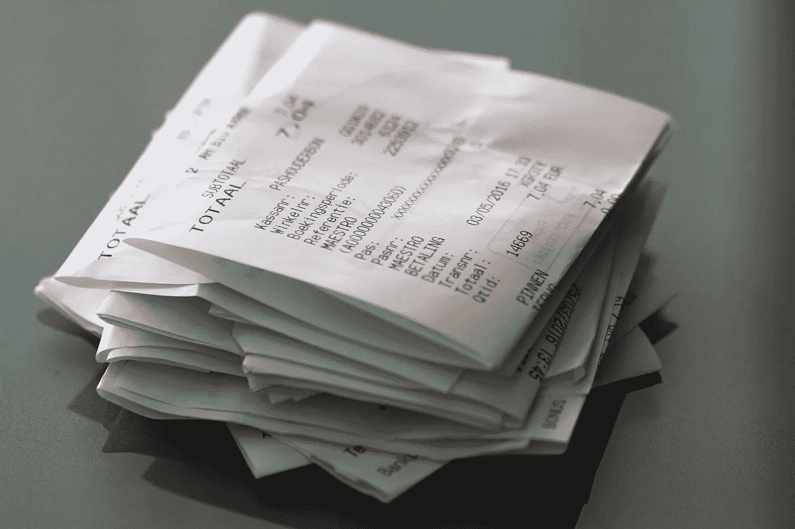
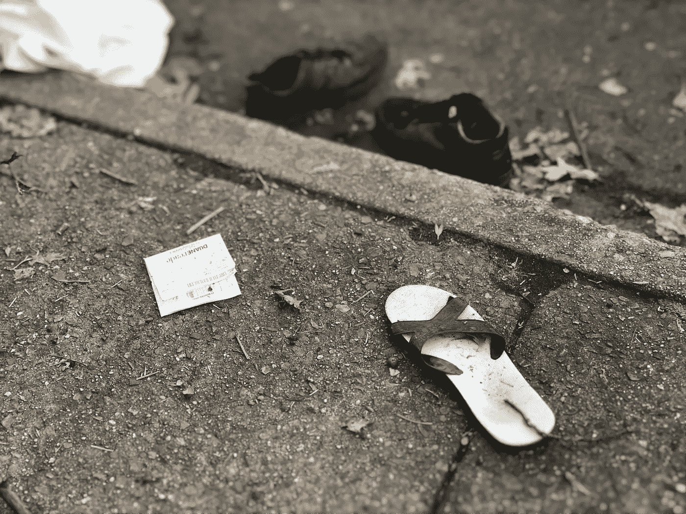
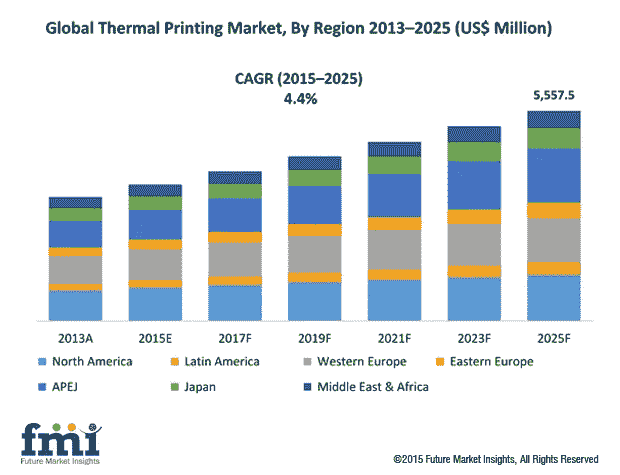

# 每个人都想要数字收据，那么为什么零售业不采用它呢？

> 原文：<https://medium.com/hackernoon/digital-receipts-in-retail-b415fbdfde3f>

统计数据显示，大约 90%的纸质收据最终被扔进了垃圾桶。大多数人在收款后不久就与他们的收据分道扬镳，还有许多人根本不记得他们把收据放在哪里了。但是，有些情况下，您需要收据作为保修索赔和退货、税收减免、个人费用跟踪和业务费用报告的购买证明。在这些情况下，未能出示您的收据可能会导致重大的财务损失，或者在税务或办公相关费用方面受到纪律处分。人们丢失纸质收据有几个原因，包括:

**不便于存放和维护**

大多数纸质收据都不耐用。它们来自质量最差的纸张，在某些情况下，油墨可能在打印后几个小时就开始褪色。在许多情况下，热敏墨水会随着时间的推移而开始脱落，只有在需要时才能生产出无墨纸。根据设计，纸质收据不容易存储和维护，因为零售商试图尽可能地降低收据的成本。

**经常迷路或者被冲走**

Photo by [Lance Grandahl](https://unsplash.com/photos/nfJUeowR_h4?utm_source=unsplash&utm_medium=referral&utm_content=creditCopyText) on [Unsplash](https://unsplash.com/search/photos/receipt?utm_source=unsplash&utm_medium=referral&utm_content=creditCopyText)

纸质收据很容易丢失或被洗掉。由于它们的尺寸小且易碎，大多数人在收集后将收据粉碎放入口袋中，并且可能不记得在取出口袋中的内容物或清洗他们的衣服之前取出收据。收据就这样永远丢失了。数字收据几乎不会丢失，即使丢失，也很容易被替换。

然而，这并不是纸质收据的唯一缺点。除了不方便之外，他们还

**不易回收**

虽然在像我们这样一个极度污染的世界，回收废物是正确的事情，但在这种情况下，纸质收据是一个例外。纸质收据含有 BPA 或双酚 a，这是一种塑料成分，被怀疑会导致癌症、肥胖、二型糖尿病、青春期提前等。仅仅触摸涂有 BPA 的表面就会暴露在这种物质中，因为它可以通过皮肤吸收。更糟糕的是，你不能堆肥双酚 a 涂层纸，因为它会污染地下水。远离 BPA 和含有 BPA 的材料，如纸质收据，对健康非常有益。数字化将使我们免受这种化学物质可能带来的毒性影响，特别是收银员和其他整天都要处理这些材料的人。虽然不是每张纸质收据都有 BPA 外衣，但很难发现这两种纸质收据之间的区别。

> **在美国，每年创建纸质收据要消耗 1240 万棵树和 130 亿加仑水，产生 15 亿磅废物和 40 亿磅二氧化碳**。纸制品占垃圾填埋场所有固体废物的四分之一以上，包括收据。
> 
> **此外，估计有 93%******的纸质收据涂有 BPA(禁止在塑料瓶中使用的同一种化学物质)或 BPS(一种类似的替代化学物质)，不应回收利用**。研究表明，这些纸质收据会导致人类健康问题。纽约州卫生部的一项研究将 BPA 与发育、生殖和神经问题联系起来。研究显示，人们接触收据后，血液中的双酚 a 含量会激增。在环境工作组委托进行的一项测试中，五分之二的纸质收据都是用热活化纸制作的，其中 BPA 的含量在 0.8%到 3%之间。这些收据来自主要的零售商、杂货店、便利店、加油站、快餐店、邮局和自动取款机。零售工人体内的双酚 a 含量比其他成年人平均高出 30%。**

**[**——青美，跳过**](https://www.greenamerica.org/skiptheslip)**

**除了不便和潜在的健康风险之外，纸质收据还花费了商家的金钱和环境宝贵的资源。**

****财务和环境成本****

**每张纸质收据的平均成本在 0.015-0.05 美元之间。这意味着一个每天打印 1000 张收据的商家每年仅在热敏纸上就要花费 5475 到 18250 美元。无纸化可以大幅削减收据费用，因为不再需要印刷材料。**

****

**Credit: [https://www.futuremarketinsights.com/reports/thermal-printing-market](https://www.futuremarketinsights.com/reports/thermal-printing-market)**

# ****阻碍采用数字收据的因素****

**有一些零售商和 POS 提供商可以通过电子邮件和短信的形式向他们的客户发送数字收据。但是这些方法的采用率一直很低，部分原因是人们对私下与陌生人分享电子邮件和电话号码深感不安。**

**一些商店还使用应用程序和基于手机的服务，允许买家扫描或拍摄纸质收据，但这种方法效率低下，并存在许多问题。**

**困扰数字收据采用的另一个主要问题是零售技术可用解决方案缺乏标准化和现代化。大多数领先的零售连锁店仍然依赖 90 年代的过时 POS 软件，这些软件没有**API 或集成功能**。采用数字收据系统要求对现有销售点系统进行昂贵且耗时的升级和集成。然而，零售行业的大公司目前似乎没有升级的动力，这进一步推迟了智能环保收据系统的采用。**

**一些关心此事的人认为，我们可以利用创新技术创造一个解决方案来改变零售业的现状。 [**TillBilly**](https://tillbilly.com) 是一家前瞻性的科技公司，致力于解决这一问题的创新解决方案，以使数字收据系统易于访问和用户友好，而不损害人们的隐私或环境的可持续性。**