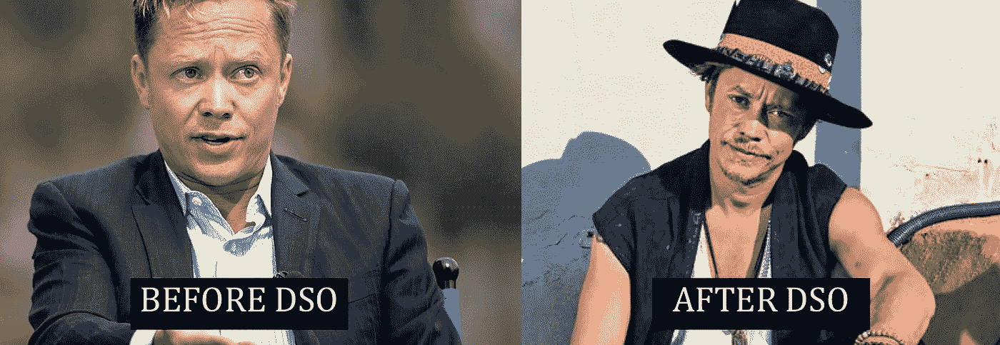
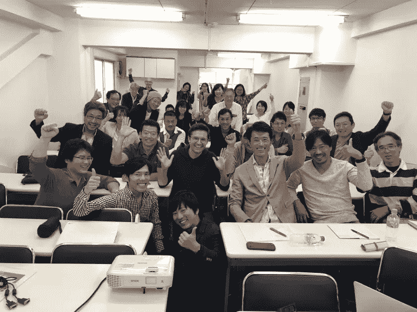

# 数字证券:为发行者选择你自己的冒险指南

> 原文：<https://medium.com/hackernoon/digital-securities-for-issuers-1e7e285fd67f>

Also found where paperbacks are still sold…

在过去的 9 个月里，我一直在与我在 [CityBlock Capital](http://www.cityblockcapital.com) 的合作伙伴合作，根据美国法律成功发行符合监管要求的数字证券。我们的目标是使用数字证券来创造更大的风险投资渠道和流动性，在整个过程中，我收到了来自各个行业的人们提出的许多问题，关于他们是否应该将公司的资产或股权令牌化。我创建了这个关于数字证券发行的概述，以帮助其他人了解生态系统目前所处的位置，并为整个行业带来更多关注和繁荣。

**背景:**

数字证券有机会通过二级交易在资本形成、监管合规性和流动性方面创造效率，从而升级我们的全球金融体系。但 2018 年数字安全生态系统的现实就是:*一个机会*。数字安全产品(“DSO”或安全令牌产品，“STO”)由区块链资本于 2017 年率先推出，作为 ICO 的合规替代产品。在许多方面，BCap 令人难以置信的众筹成功(6 小时 1000 万美元)让数字安全行业走上了一条不明智的道路，即追随一种泡沫融资趋势，希望加密投资者最终会转向合规产品。由于 ico 在 2018 年受到 SEC 的严格审查，直销组织无法捕捉到同样的投资者势头，因为认证标准以及对回报潜力和流动性的预期存在巨大差异。这种情况对潜在发行者很重要，因为这意味着抛出单词*‘token’*并不会为受监管资产创造新的市场，你今天应该拥有与 tokenization 存在之前相同的目标投资者。如果你对资产的令牌化感兴趣，因为你认为你的公司成为新兴行业的一部分是有价值的，那么重要的是将众筹作为发行数字证券的必要步骤，并对你试图通过这一过程创造的价值采取一种有分寸的方法。根据一般经验，发行数字证券不应定义或分散您核心业务的价值主张。

**(Pictured: Blockchain Capital’s Brock Pierce)** The question you gotta ask yourself is…are you ready for this?

***用 DSO 众筹:***

如前所述， [Blockchain](https://hackernoon.com/tagged/blockchain) Capital 发行了第一只数字证券，当时他们对一只风险基金进行了令牌化，随后是 Science Blockchain Fund、SPiCE VC、22X 和 tZero，他们也采取了 ICO 风格的众筹方式。众筹对于 ico 和推出去中心化网络来说是必不可少的，对于汇集资本来说，[比特币](https://hackernoon.com/tagged/bitcoin)和以太坊网络比银行电汇要高效得多，但数字证券不是去中心化网络，众筹将继续存在于数字资产之外(即 Kickstarter、天使名单)。毫无疑问，当众筹奏效时，这是不可思议的。对于一个企业家来说，没有什么比让一个陌生人从世界的另一端发现你的直销组织，通过五步申请流程，立即将加密货币转入托管账户，并在 10 分钟内完成 SEC 合规证券的购买(等待 KYC/AML)更令人兴奋的了。这种用户体验代表着我们如何在统一的全球市场上买卖资产的巨大飞跃，但在 2018 年，持续捕捉众筹的魔力是广阔的互联网沙漠中的海市蜃楼。如果你的公司或想法今天没有高度参与的人群，你将花费大量的时间和金钱去创造一个。为了有效地众筹你的直销组织，你可能需要属于以下一个或两个类别:

1.  你的发行得到了高度可见的加密投资者的支持，你的融资正在利用愿意打破常规的辛迪加和网络，特别是你的一年锁定期和流动性的不确定性。(例如:区块链资本)。
2.  你的产品有一个真正的病毒钩，激发整个互联网或狂热社区的分享。获得一个著名的顾问，一个名人的推特或社区经理的支持并不符合病毒挂钩的条件。你需要销售一种证券，或者有一个媒体愿意创造数百万印象的故事，或者准备在多个渠道上花费数十万美元做广告。

**(Pictured: CityBlock Capital meet-up in Tokyo, Japan)** Crowdfunding can produce exciting results but there are important tradeoffs to consider.

为了与散户和合格投资者一起执行合规的 DSO 众筹活动，你的产品需要向 SEC 提交 Reg A+豁免，这对早期公司来说可能是成本和时间上的限制。大多数募集资金超过 100 万美元的私募都是通过注册 D/S 豁免进行的，这些豁免不需要向美国证券交易委员会备案，但总投资者不得超过 2000 人(在美国，根据发行的规模和结构，总投资者不得超过 99 人或 250 人),而且所有美国投资者都必须获得认证。一般来说，典型的注册 D/S 发行依赖众筹作为主要资本来源是不现实的，因为发行人创造一群合格投资者的能力有严格的限制。

通过直销组织进行的众筹也带来了需要考虑的合规挑战。根据我们的经验，如果你接受比特币或以太坊作为货币，我们会看到对反洗钱合规性的审查越来越严格。简单来说，很多服务商(即。银行、托管代理、保险提供商、基金管理人)在你接受比特币作为投资时，不愿意核实资金的来源。这并不是说你找不到愿意与你合作的供应商，但这将是一种溢价，反洗钱法规的任何变化都可能对你的业务构成生存威胁。 [FATCA / CRS 合规性](https://tax.thomsonreuters.com/en/fatca-crs/what-is-crs-fatca)(如果您接受国际投资者，这是必要的)可能成本过高，因为许多供应商根据每位投资者每年的*报价*。如果你的众筹活动最终获得了 1000 名国际投资者，满足 FATCA / CRS 要求的每位投资者每年 150 美元很容易超过长期投资的价值。

通过直销组织进行众筹的另一个重要考虑因素是，你是否想让投资者/社区管理成为你业务的核心部分。电报小组、电子邮件营销、社交媒体活动和积极的企业沟通只是众筹参与者希望认真对待某项产品的营销举措中的一部分。这些努力也会带来一些人，如果他们对你的产品有异议或者有客户服务问题，他们会公开贬低你的公司。此外，你可能会吸引“快钱”投资者，即希望通过你的产品快速致富的人。大多数私募可能需要数年才能产生任何有意义的回报，因此你必须问问自己，你是否真的想在未来 5-10 年内在一个可能与你的业务现实不一致的投资者“社区”上花费大量时间和资源。

***资产所有权与 DSO***

如果你跳过众筹作为你的直销组织的一部分，这意味着你通过私人网络筹集了资金，或者你雇佣了一个 FINRA 注册的经纪自营商。在这种情况下发行数字证券的主要原因是为了实现二级交易，但请记住，今天发行数字证券将与您的投资者和/或经纪交易商产生更多摩擦，而不仅仅是使用纸张。如果你认为把你的资金限额表移植到 Carta 很困难，试着让同样的投资者团体创建并使用一个兼容 ERC 20 的钱包。此外，美国证券交易委员会监管的数字证券二级交易所刚刚开始与初创公司 OpenFinance、tZero、Fluidity 和 Templum 一起与老牌公司比特币基地、纳斯达克和纽约证券交易所融合，但这些平台完全发挥作用并产生可观的交易量还没有立即的时间表。

11/1/18: we’re still very early in the development of the industry

即使私人数字证券的二级交易按计划进行，你也可以上市，但重要的是要让投资者对你的资产能够产生的流动性水平有一个合理的预期。当然，有一些处于后期阶段的风险投资和私人股本公司为优步、Lyft、SpaceX 和比特币基地等顶级私人公司的股权创造了强大的二级市场，但你的普通私人公司或资产不会创造这种需求，而且根据股东数量，供应总是有限的。像在它之前的无数行业一样，数字**将**取代纸张，围绕私募股权二级交易的低效率将从交易中消除(经纪人、特殊目的载体、不必要的法律费用)，但这些资产的市场可能会像易贝那样运作，而不是电子交易。例如，[流动性](https://www.fluidity.io/) (AirSwap)，以及他们最近推出的 [*公告板*和*空间*](/fluidity/bulletin-boards-and-blockchain-improving-the-way-private-securities-trade-943eeb93dcb1) 产品，在合规发现和 1:1 对话方面采取了以用户为中心的方法，他们认为这创造了促进私人数字安全交易的最佳环境*(翻译:这不是 sto 的币安)*。考虑到这一点，潜在发行人必须确定投资者对流动性是否有足够的实际需求，以证明聘请发行平台之一的当前成本是合理的。请记住，仅仅因为一项资产的结构更具流动性，并不意味着它就有市场。

关于资产所有权的最后一点是，加密货币和 ico 对数字证券应该如何发行和托管产生了误解。数字证券不是无记名工具，这意味着如果您丢失了保存您的数字证券的钱包的私钥，发行者可以简单地从中央分类帐创建一个新的。如果你因为装有比特币或其他加密货币的钱包而丢失了私人钥匙，那你就彻底倒霉了。当您考虑执行您的数字证券发行策略时，这一关键差异应该是您的首要考虑，因为这意味着没有人会关心持有他们的令牌，除非他们想出售它们，而这在资产的生命周期内可能永远不会发生。总的来说，发行过程将需要变得商品化，达到普遍存在的企业 SaaS 产品的典型价格点和用户体验，以使数字证券成为资产所有权的新标准。

**展望未来**

数字证券仍处于非常早期的阶段，我们还有许多艰苦的工作要做。总的来说，我相信我们越早将数字安全所有权从众筹/ ICOs 中分离出来，我们就会越快看到该技术被更广泛地采用。关键是重复:每一个经历这一过程的发行者都会发现新的问题，提出解决方案，向新的供应商和投资者介绍该技术，随着时间的推移，该行业将扩大规模，直到每一种证券都成为数字证券。一旦形成规模，我相信受影响最大的将是传统金融机构、它们的后台业务，以及最终它们销售的衍生品，私人发行者的感受将会相对较轻。作为一个潜在的发行人，你的关键决定是，确定成为建设过程的一部分是否有内在价值，或者你是否想在 24 个月后事情进一步发展时再回来。在 CityBlock Capital，我们投资于数字安全基础设施的股权，因此经历发行过程使我们更加了解该行业的机会，我们将长期参与其中。下面我将播放 CityBlock Capital 团队讨论全数字化金融系统的视频。想想就很鼓舞人心，这个行业的镐和铲可以赚很多钱，但这肯定不是一蹴而就的。如果你正在经历发行过程，并想谈商店，随时拍我在 max@cityblockcapital.com 的说明。

***免责声明*** *:本博客帖子中的信息仅用于一般信息目的，帖子中包含的任何信息都不应被解释为财务或法律建议。*