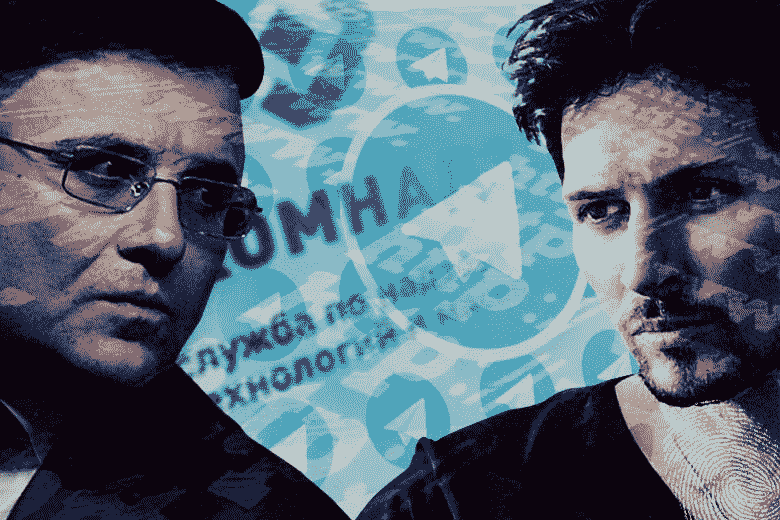
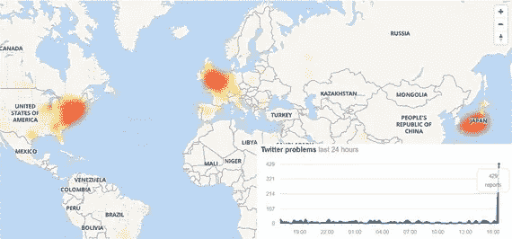
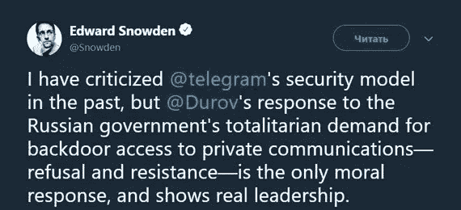
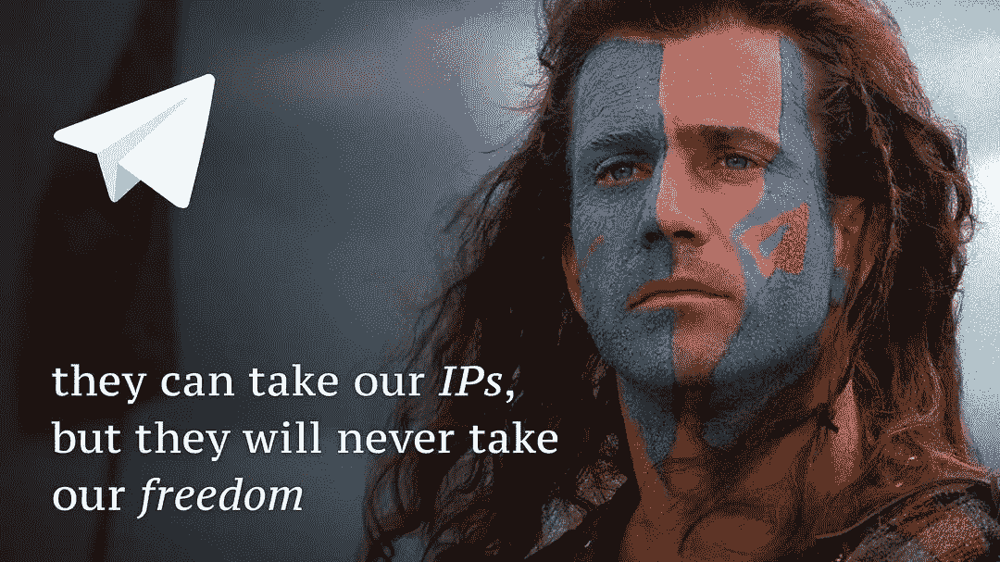
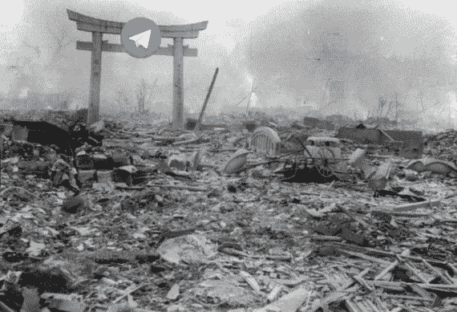

# 数字战争:政府 vs 电报

> 原文：<https://medium.com/hackernoon/digital-war-government-vs-telegram-8933fe2ae51c>

现在，一场全面的数字战争正在俄罗斯展开，以这样或那样的方式影响着数百万互联网用户。我们正在目睹第一个先例，即拥有一切可以想象的资源的政府，却无法禁止其领土上的特定资源。

这条新闻类似于一场军事冲突，参与者使用了大量的军事术语，双方都慷慨地花费了数百万美元，而普通企业却遭受了可怕的损失。

在那篇文章中，我将提供冲突前事件的摘要，以及在文章写作时发生的事件的描述。

Mascot of Telegram digital resistance

# 2016 年—搭建舞台

俄罗斯联邦议会通过了一揽子反恐法律，根据这些法律，所有互联网提供商必须在相当长的一段时间内存储所有传输的数据，并应俄罗斯联邦安全局(FSB)的要求，与该机构共享解密全部流量所需的数据。

[帕维尔·杜罗夫](https://en.wikipedia.org/wiki/Pavel_Durov)发表声明，称他不会屈服于法律要求，在任何情况下都不会向任何第三方提供数据。

# 2017 年——第一次冲突

## 夏天

俄罗斯联邦信息技术、通信和大众媒体监督局([Roskomnadzor](https://en.wikipedia.org/wiki/Federal_Service_for_Supervision_of_Communications,_Information_Technology_and_Mass_Media))[负责人亚历山大·扎罗夫](https://en.wikipedia.org/wiki/Aleksandr_Zharov)抱怨说，Telegram 的创始人帕维尔·杜罗夫无视了他与他联系讨论可能在俄罗斯禁止信使的所有尝试。

Roskomnadzor 和第一频道(一个政府经营的电视频道)宣称 Telegram 是恐怖分子的信使，并严厉批评其创始人不愿意向 FSB 提供加密密钥。

帕维尔·杜罗夫反过来指责 Roskomnadzor 官员未能理解数据加密的机制。拥有加密密钥的是电报用户，而不是信使的创建者，因此，无论如何也不能交出密钥。

Zharov vs Durov

## 秋天

据宣布，7 月 14 日，联邦安全局向 Telegram 发出请求，要求交出加密密钥。杜罗夫先生有五天的时间来做这件事，尽管他的请求直到 7 月 21 日才送达。

电报拒绝与俄联邦安全局合作。这名信使被罚款 80 万卢布(合 1.5 万美元)。尽管 Roskomnadzor 有权对 15 天内第二次未能遵守要求的情况启动信使禁止程序，但他们决定推迟该程序。

# 2018 年——战争的开始

## 3 月 20 日

Roskomnadzor 正式警告 Telegram 违反法律，并可能在 15 天内禁止该信使。

帕维尔·杜罗夫先生回答说:

> 威胁禁止电报，以防他们不提供用户的个人数据是没有用的。电报在保护自由和保密方面坚守阵地。

## 4 月 6 日

Roskomnadzor 开始在俄罗斯对 Telegram 采取执法行动。

## 4 月 13 日——黑色星期五

法院决定禁止电报。

Roskomnadzor 的负责人 Aleksandr Zharov 先生在采访中被问及何时禁止电报。他把禁止信使的过程比作一次军事行动。

> 想象一下，一场战争正在如火如荼地进行，你突然问:“你什么时候发动进攻？”嗯，我想在不久的将来。但无论如何我不会透露确切的时间。

## 4 月 16 日

Roskomnadzor 当天上午在俄罗斯启动了电报禁令程序。同一天，messenger 的创始人设法通过不断改变 IP 地址来避免被禁止，这使他们能够在不使用代理服务器和 VPN 服务的情况下继续工作。

Roskomnadzor 已经了解到这一点，他们必须努力计算 Telegram 使用的 IP 地址池，并发布一份新的黑名单，并将其转发给互联网提供商和运营商。

从当天下半年开始，Roskomnadzor 开始大规模禁止亚马逊和谷歌的 IP 地址。两家公司都是主机提供商，IP 地址被分配给由他们的服务器托管的任何网站或互联网项目。与此同时，Roskomnadzor 将整个子网而不是特定地址列入了被禁网站名单。列表中的 52.58.0.0/15 行意味着超过 130，000 个“相邻”IP 地址也被禁止。

到晚上，被禁止的 IP 地址的数量已经超过了一百万。Roskomnadzor 命令互联网提供商禁止亚马逊的几个子网(总共超过 80 万个地址)和一个谷歌子网(超过 100 万个 IP 地址)。

简单地将它与 [Roskomsvoboda](https://ru.wikipedia.org/wiki/%D0%A0%D0%BE%D1%81%D0%9A%D0%BE%D0%BC%D0%A1%D0%B2%D0%BE%D0%B1%D0%BE%D0%B4%D0%B0) 活动进行比较，后者的任务是监控被禁止网站的列表。在这些臭名昭著的事件发生之前，他们的名单包括大约 100，000 个 IP 地址。他们收集它们已经有五年半的时间了。

## 4 月 17 日

被 Roskomnadzor 禁止的亚马逊 IP 地址被数以千计的网站以及包括商店和银行在内的不同组织使用。他们的禁令立即导致许多服务运作中断。

成千上万的互联网资源在运行中出现了故障。这份名单包括微软服务，堡垒之夜和 Playerunknown 的战场游戏，谷歌照片和谷歌盾牌，Evernote，Twitter，PlayStation Network，Viber，社交网络 Odnoklassniki 和 Vkontakte，Spotify 和 Twitch 流媒体服务，以及云存储服务。阿尔法银行和俄罗斯储蓄银行的自动取款机暂时出了故障。

Heat map of reports about Twitter problems

杜罗夫还宣布，他将投入数百万美元的自有资金，支持那些有助于绕过禁令的工具。

> 在“数字抵抗”( Digital Resistance)这个支持数字自由和进步的去中心化运动的框架内，我已经开始向代理和 VPN 管理员支付比特币补助金。在这一年里，我将自愿捐出数百万美元的个人资金来支持这项运动。

前中情局和国家安全局雇员爱德华·斯诺登支持帕维尔·杜罗夫:

大约 50 家公司的代表向地区间人权组织协会的律师申请法律帮助，该协会因 IP 地址被大量禁止而与 Telegram 合作。

律师 Damir Gainutdinov 先生通报说，数百家网店店主、送货服务、代理服务、在线服务和店铺已经申请帮助。

> 他们都有同样的问题。我们突然被封杀了。我们该怎么办？

# 4 月 18 日

[Telegram 的创始人帕维尔·杜罗夫先生在他的 Instagram 账户上发表了以下帖子，呼吁](https://www.instagram.com/p/Bhr1Ca9lcT0/)俄罗斯公民为自由而战:

> 在过去的两天里，俄罗斯封锁了超过 1500 万个 IP 地址，试图在其领土上禁止电报。不管怎样，大多数俄罗斯居民仍然可以使用电报。我们将继续捍卫我们俄罗斯同胞的隐私和言论自由。

Roskomnadzor 负责人 Aleksandr Zharov 先生就俄罗斯试图禁止 Telegram 而导致的服务失败发表了以下声明:

> 这一信息与事实不符。认真地从技术上说，在 99.9%的情况下，我们已经达到了禁止电报的目标。
> 
> 我们不打算禁止整个互联网，我们表现得相当聪明，我们的技术专家研究这个或那个子网，以找出他们有哪些资源。一般来说，电报管理局负有全部责任，因为他们故意将自己隐藏在第三方公司的 IP 地址后面，从而设置了很多。

# 4 月 19 日

俄罗斯总统新闻秘书佩斯科夫先生发表了一份官方声明，敦促等待。

> 显然，执行法律需要一些时间。也应该认同和理解，it[电报取缔]不是一天的事。让我们等一会儿。

美国公民自由联盟(ACLU)敦促亚马逊、谷歌、微软和苹果尊重人权，允许电报改变 IP 地址而不受限制。

在本文撰写之时，联邦监管机构已经禁止了几千万个属于亚马逊和谷歌的 IP 地址。

Russian Internet after few days of Telegram ban

# 本周结果

Android 版 messenger 的下载量[翻了一倍](https://www.rbc.ru/technology_and_media/19/04/2018/5ad73de09a7947ef845fa03d)。Telegram 的网站流量(人们可以从这里下载基于网络的 messenger 版本)已经在[增加了三分之一。根据 RBK 新闻频道的调查，通过这项禁令的官员、议员和参议员都没有停止使用电报。在他们的情况下，就像在许多其他用户的情况下一样，即使没有 VPN 或任何额外的操作，messenger 也会继续工作。](https://www.rbc.ru/politics/19/04/2018/5ad7524f9a794707903b96e8?from=main)

与此同时，Roskomnadzor 就可能禁止脸书社交网络发表了声明。联邦监督局将在 2018 年底前完成脸书检查，如果该社交网络未能满足国家当局的要求，也可以考虑将其取缔。

