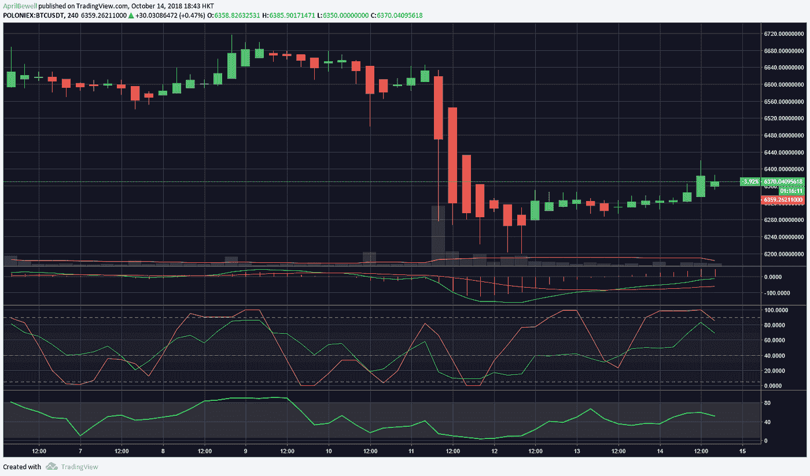
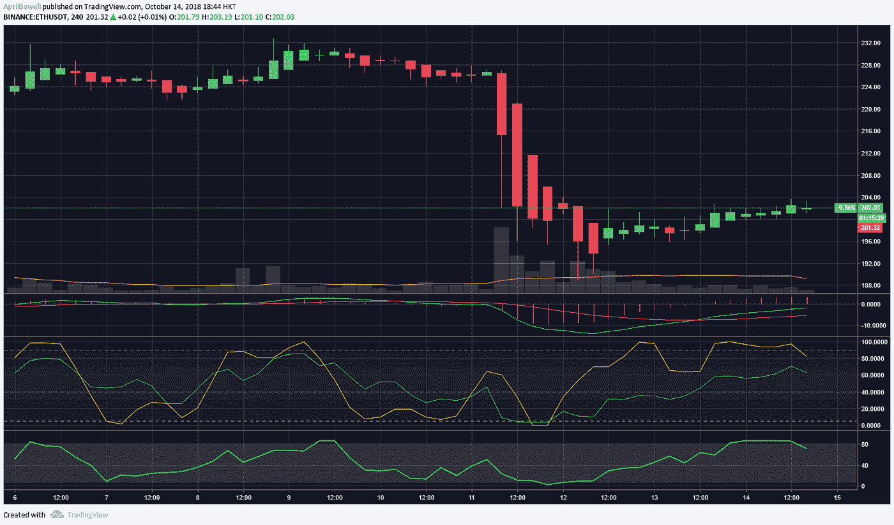

# 尽管市场动荡，Digitex 期货上涨，周日加密市场仍然下跌

> 原文：<https://medium.com/hackernoon/digitex-futures-ramping-up-despite-market-turbulence-sunday-crypto-market-still-down-83fbf0ff54c7>

**加密市场回顾:2018 年 10 月 14 日**

随着我们进入本周日，加密货币市场仍然没有找到它的魔力。上次抛售似乎进一步拉低了市场情绪，因为昨日的价格走势没有变化。

市值仍然略高于 2000 亿美元，但交易量并不乐观，因为它下降了 95 亿美元。这是自去年 8 月以来首次跌破 100 亿美元。昨天 BTC 的统治地位已经下降了一个档次，但现在它已经慢慢回到 54%，这可能不是一个好兆头的替代硬币。

自昨日以来，比特币仍保持目前 6370 美元的价格不变。在一周内，比特币价格上涨至 6600 美元，然后大幅下跌，触及 6400 美元和 6200 美元的支撑。然后昨天开始了半复苏，实际上在亚洲市场早些时候达到了 6400 美元，但是交易量只有 31 亿美元。随着 MACD 在四小时图上攀升，图表现在略微处于看涨区域。下周一，我们可能会看到比特币艰难前行，或者如果熊市强劲，跌至 6100 美元左右也不会太遥远。

以太坊目前面临着很多绊脚石。在过去的三天里，它一直停留在 202 美元，交易量没有在 11 亿美元上下波动。本周以太坊和比特币一起从 234 美元跌至 185 美元。它做了一个向上的运动，但是它被限制在 200 美元，在我写这篇文章的时候它仍然在。以目前的成交量，短期内可能不容易越过 207 美元的阻力，尽管它正在慢慢移动图表上的看涨区域。

前十名的价格波动几乎不明显。在撰写本文时，卡尔达诺是今天最大的输家，跌幅为-1.68%。接下来，莱特币回到 53.30 美元，当日跌幅为-1.20%。另一方面，我们只有 0.24%的勉强为正的 Monero。其余的损失在 0-1 %,今早持平。

TRON 依然以 2.06%领先前 25。Dash 也开始反击，以 1.93%的速度开始复苏。经过昨天的修正后，0x 又回到了正值。NEO 也在 1.26%的绿色线上。正如你所看到的，目前波动很小，从上周 10%的跌幅中恢复过来还需要一段时间。另一边是 Tezos 修正在-1.44%。

前 100 名是绿色和红色的混合，但除了 Digitex Futures 目前的 fomo 之外，也相当平淡。Digitex Futures 是一家计划在今年年底推出的交易所。继昨日 46.15%的涨幅后，该指数在第二天又上涨了 20.26%。Aion 也飙升至 17.62%，Digibyte 实现了当天的两位数涨幅。

*CoinDNA 是一个教育网站，帮助用户进行研究，这是他们投资之旅的第一步，提供见解以帮助导航投资决策，包括单个代币的市场数据、每日市场报告和定制的常见问题分析。*