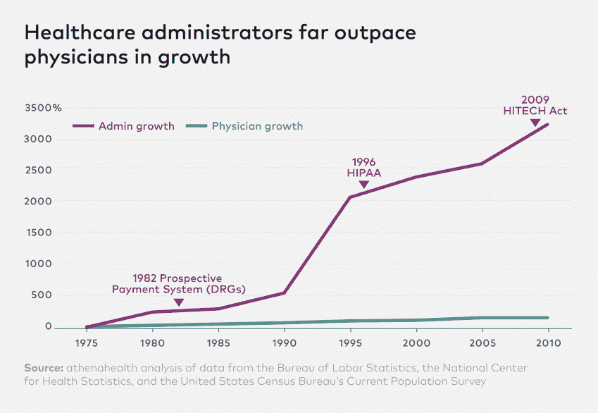

# 直接初级保健是健康的未来。

> 原文：<https://medium.com/hackernoon/direct-primary-care-is-the-future-of-health-233ccc04425e>

## 现代健康计划应该把 DPC 放在中心位置。原因如下。

想象一下完美的医生出诊。

你安排了一个方便的当天约会。你到达诊所，跳过候诊室和写字板，径直走进医生的办公室。也许有人请你喝茶。医生——你认识并喜欢的个人和职业医生——准备好了你的基本信息和最近的实验室结果，并花时间讨论你想讨论的任何问题。你们两个庆祝自己的健康，并一起制定计划让自己保持健康。

如果这听起来像一个幻想，事实甚至更糟:今天的收费医疗保健系统实际上惩罚了想用这种方式治疗你的医生。

这对我来说是私人的。

我的父母，迈克和萨拉，是退休的初级保健医生，他们喜欢行医，热爱他们的病人。他们在进入团体健康合作社(Group Health Cooperative)担任行政职务之前，曾在家庭诊所工作了很长时间。团体健康合作社是太平洋西北部一家屡获殊荣的健康维护组织，为 650，000 名会员提供服务。但当他们与我和我妹妹谈论工作时，他们总是加上同样的告诫:这是最近 50 年来成为医生最糟糕的时候。

为什么？像大多数医生一样，他们从事医学是为了服务病人。但随着管理者、中间人和金融家的影响力上升，医疗保健的重点已经从保持患者健康转移到让大型保险公司和医院系统赚更多的钱。结果是，今天的美国人面临着飞涨的医疗费用，[痛恨他们的医疗保险胜过一切，除了康卡斯特](https://hackernoon.com/why-is-health-insurance-in-america-such-a-bad-deal-part-1-8888976900e5)，医生基本上无法提供高质量的医疗服务。

>95% of new healthcare employees since 1975 aren’t actually thinking about your health.

[医疗保健问题的根本原因是，当成本上升时，除了患者以外的所有关键利益相关者都会受益](https://hackernoon.com/why-is-health-insurance-in-america-such-a-bad-deal-part-2-fd9b51606c0b)。当传统的健康保险公司每年向监管机构提出新的费率时，它们受到医疗损失率的制约:它们必须将收取的保费的 80%用于医疗，并可以扣留最多 20%的费用来支付管理成本和利润。这意味着他们只能在预期的医疗成本上升时赚取更多的利润——他们从不断增长的馅饼中拿走固定的百分比。当医疗成本上升时，大型医院系统会赚更多的钱。推高医疗成本的一个可靠方法是让医生尽可能多地看病人([每 11 分钟一个！](https://www.usatoday.com/story/news/nation/2014/04/20/doctor-visits-time-crunch-health-care/7822161/))并最大化“付费事件”——在把你推出门外之前，安排一次检查或转诊或处方。

If you always got 20% of a donut, wouldn’t you want it to get bigger every year?

对于患者来说，这意味着与医生相处的时间更少，个性化护理更少。你是一个庞大数据库中的一个数字，如果你生病了，这些人可以每年提高他们的费率。对于医生来说，这意味着减少服务患者的时间，增加管理任务的时间——请求保险公司对治疗的许可(事先授权),在复杂的保险方案中对每一项行动进行分类以申请报销，以及在遇到阻力时证明自己的立场。这增加了本已紧张的工作压力:在美国，每天都有一名医生自杀，这是 T4 自杀率最高的职业之一。在不太极端的情况下，医生只是更加努力地工作，与绝望作斗争，并思考大公司何时变得比他们一直渴望服务的病人更重要。

我看着父母这样，我很生气。[我也知道作为病人的医疗保健的痛苦。这也是我开始](https://hackernoon.com/us-health-care-needs-a-nervous-system-4dc743fac5f8)[体面](https://www.decent.com/)的部分原因。但是这个问题不仅仅是一个家庭的问题。当前医疗保健系统的核心激励不利于你和你的健康。借用伟大的查理·芒格的话来说，只有激励措施改变了，结果才会改变。

**直接初级保健治疗病因，而非症状。**

直接初级保健(DPC)是当今主导医疗保健的付费服务模式的快速增长的基于价值的替代方案。每个诊所都有所不同，但作为会员，您通常只需支付固定费用(每月 50 至 150 美元)就可以获得包含您所有初级保健的门房式诊所。您可以无限制地延长同一个医生每月的出诊时间，没有额外费用或隐藏费用。当天或第二天的预约和远程医疗(视频电话)，以及 24/7 电话，短信和电子邮件支持您的健康问题。您的医生负责管理您的所有护理，包括转诊至专科医生，以及在诊所外需要手术或程序的情况下提供指导护理。诊所安排任何需要的手术，您的医生管理术前和术后护理，以确保您的问题得到解答。许多类型的常规实验室工作，如血液检测或链球菌咽喉培养，以及预防性治疗，如常规体检和流感疫苗，都是免费提供的。

DPC 对病人和医生都更有效。

为无限制的初级保健支付统一的月费改变了医疗保健的核心激励机制。你的 DPC 医生开始专注于保持你的健康，因为当你需要更多护理时，他们的诊所花钱而不是赚钱——而且因为他们知道你会带着任何问题回来找他们，他们在推荐你接受专科护理时也会考虑价值。他们使定价透明，不会用意想不到的费用打击你。他们努力保持你的忠诚度，因为他们知道如果你没有得到你期望的服务或关系，你会换医生。对于技术行业的人来说，这些优势听起来可能类似于帮助软件即服务(SaaS)取代传统打包软件的优势。你知道你每个月要付多少钱。对你和你的医生来说，完美的医生出诊突然变得有意义了。

有证据表明[这种模式带来了更快乐的病人和更低的费用](https://www.colorado.gov/pacific/sites/default/files/NH_CaseStudy_AV%20HUB%20final.pdf)，难怪许多病人和医生喜欢 DPC。用美国家庭医师学会主席约翰·梅格斯博士的话说，“你不是在仓鼠轮上，根据你做的量来获得报酬。患者满意度上升。医生满意度上升。质量提高了，成本降低了，因为你不必向山姆大叔或保险公司证明这一点。”

**DPC 更适合新型的医疗保健公司。**

在[正派](https://www.decent.com/)我们相信“首先不伤害”也应该适用于医疗保健公司。通过健康保险来分担风险的概念是正确的:如果没有健康保险，我们都不希望成为真正生病的人。但是传统的保险公司有着与其职能不相称的激励和权力。你不需要汽车保险公司的批准来换油，你也不应该需要健康保险公司的批准来做检查。医患关系必须放在第一位。

考虑到这一点，我们正在管理世界上第一个以 DPC 为中心的全面健康计划。DPC 的固定费用包含在您的月保费中，因此您不需要支付两次，并且该计划以透明的费率提供高质量、可负担得起且协调的专业护理选项，以治疗在初级护理环境中无法治疗的任何疾病。它不需要事先授权，也不需要昂贵的行政工作，这使得 DPC 医生远离他们的病人和他们的家人。它不受医疗损失比率的控制，当成本得到控制时，会员和 DPC 合作伙伴可以受益。我们咨询了 DPC 创新者，如 T2 健康罗塞塔 T3 的 Dave Chase 和 Sean Schantzen 和 T4 直接初级保健联盟 T5 的 Jay Keese，并与为数百家 DPC 诊所提供软件基础设施的 T6 Hint T7 合作，建立我父母想要的护理模式，这也是我们今天的患者想要的。我们将于明年 4 月启动:首先在德克萨斯州的奥斯汀，然后扩展到其他地方。

如果您自己购买保险，您可以在[正派](https://www.decent.com/)注册，以便在您所在地区开始注册时得到通知。如果您有问题或想与我们合作，请联系 hello@decent.com。或者如果你只是想查看你所在地区的 DPC 选项，试试 [DPC Frontier 的互动地图](https://www.dpcfrontier.com/mapper/)。

直接初级保健使医疗保健行业对病人和医生都更好。我们在[正派](https://www.decent.com/)的团队迫不及待地想提供帮助。