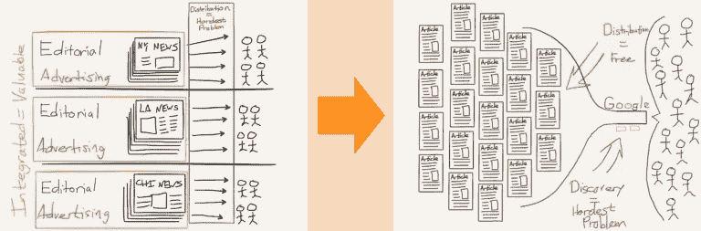
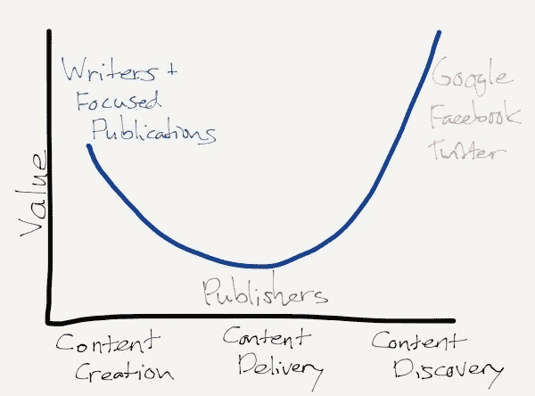
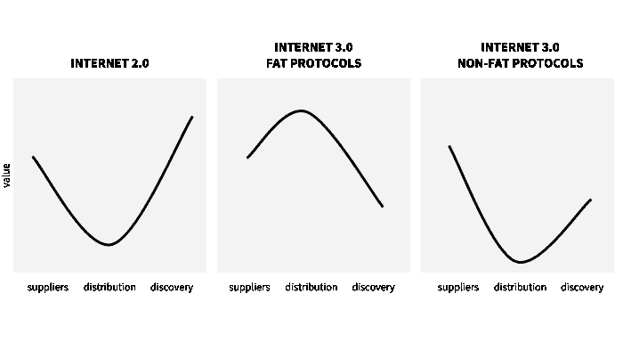
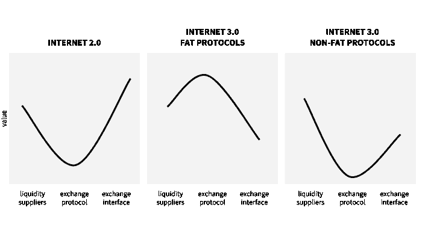

# 分解理论:分散网络的价值在哪里增长？

> 原文：<https://medium.com/hackernoon/disaggregation-theory-where-does-value-accrue-in-the-decentralized-web-19388066f645>

在[互联网 3.0 和国家聚合器的消亡](https://www.tonysheng.com/stateful-protocols)中，我提出，因为区块链可以在协议层面捕获国家(用户数据)，像脸书这样的国家聚合器将失去他们的护城河，为分散的竞争对手创造机会。如果我们将互联网 2.0 定义为状态聚合引起的大范围破坏，那么互联网 3.0 将被定义为将状态聚合移动到协议层面引起的大范围破坏。

在我的帖子之后的对话中，我想起了 Ben Thompson 2015 年关于[聚合理论](https://stratechery.com/2015/aggregation-theory/)的帖子:“一个理解互联网对几乎所有行业的影响的框架。”聚集理论认为，作为互联网的结果，服务用户从物质边际成本到零边际成本。在互联网出现之前，价值是在拥有分销渠道和反向整合到供应渠道中获得的。后互联网时代，价值在于拥有分销渠道并整合到发现和用户数据中。

[*Source*](https://stratechery.com/2015/aggregation-theory/)

本的理论侧重于供给的聚合及其下游效应:

> *“这从根本上改变了竞争的层面:分销商不再基于独家供应商关系进行竞争，消费者/用户是事后才考虑的。取而代之的是，供应商可以被大规模地聚集起来，把消费者/用户放在第一位。推而广之，这意味着决定成功的最重要因素是用户体验:最好的分销商/聚合商/做市商通过提供最好的体验而获胜，这为他们赢得了最多的消费者/用户，这吸引了最多的供应商，这以良性循环的方式增强了用户体验。”*

我专注于用户数据的聚合。

> “饼干是 USV 的阿尔伯特·韦格纳称之为“状态聚合”的最早例子。状态可以是浏览历史，但也可以是游戏动作、购买、消息等等。一些公司开始聚集状态，最终变得非常有价值。”

总之，我们看到了一个更清晰的画面:互联网 2.0 允许公司聚集供应，从而专注于拥有发现和用户数据。一旦发现和用户数据被拥有，用户数据的聚合允许公司创建竞争对手无法复制的独特用户体验。通过拥有客户关系，这些公司可以为相同的客户提供更多的商品和服务。想想亚马逊:一家以卖书起家的公司现在赢得了艾美奖，并为世界上最大的公司提供云服务。

# 互联网 3.0 会发生什么？

让我们先从 Thompson 涵盖的另一个框架开始，[“微笑曲线”](https://stratechery.com/2014/publishers-smiling-curve/)，它最初是用来描述价值如何在 [IT 制造业](https://en.wikipedia.org/wiki/Smiling_curve)中流动，但可以推广到许多其他互联网行业。

对于一家互联网 2.0 内容公司来说，发现的价值最高，供应的价值最高，分发的价值最低。

[*Source*](https://stratechery.com/2014/publishers-smiling-curve/)

> *“当人们在脸书(或谷歌或推特，甚至是电子邮件)上关注一个链接时，不会产生页面浏览量，因为浏览者对链接所在的出版物有任何特殊的亲和力，而且他们在阅读文章后的亲和力是否会增加也是不确定的。如果说有什么不同的话，读者可能会把任何积极的感受归因于作者，或许会瞥一眼他们的档案或 Twitter 信息。*

在互联网 2.0 中，价值累积到这个图表的末端。这个图表在互联网 3.0 看起来有什么不同吗？

**供应**

*   在互联网 2.0 中，供应是高价值的，因为消费者体验到的任何善意都将指向内容创作者(而不是出版商)。
*   在互联网 3.0 中，供给应该保持高价值。没有太大的变化，除了潜在的有利的替代货币化机会，通过区块链。

**分配**

*   在互联网 2.0 中，出版商分发内容的分散格局已经在很大程度上被商品化了。
*   在互联网 3.0 中，可以在基础协议级别(例如以太坊)或应用协议级别(例如建立在以太坊之上的假设内容协议)评估分发。无论哪种情况，价值要么很高，要么很低，取决于你的哲学。

如果你相信具有最高效用的协议也将是价值的最佳存储，用户将希望持有该协议的令牌，这意味着负责分发的协议将非常有价值。这与 Joel Monegro 推广的[“fat 协议”](http://www.usv.com/blog/fat-protocols)论点一致。如果你拒绝这个论点，那么价值应该趋向于零，因为边际成本下降到几乎为零。

**发现**

*   在互联网 2.0 时代，发现的价值很高，只有极少数玩家拥有。
*   在互联网 3.0 中，发现将是高价值的，但竞争空间将更加分散，因为互联网 2.0 公司享有的 UX 和数据护城河将被分解。

如果我们相信脂肪协议，我们会得到一个“皱眉曲线”如果我们不这样做，我们会得到一个“更小的微笑曲线”在皱着眉头的曲线中，不清楚总体上是获得了更多还是更少的价值，但我们看到了价值向分布的明显转移。在较小的微笑曲线中，总体上捕捉到的价值较少。

虽然互联网 3.0 的曲线形状更难预测，但我们可以观察到两个明显的潜在变化:分布的聚集和分解发现。挖掘这些转变有助于我们想象从互联网 2.0 到互联网 3.0 的转变。

# 解聚和再聚

聚合理论让占主导地位的互联网公司专注于供应链中最重要的部分:拥有用户关系。为了赢得用户，公司必须向用户提供最佳体验，为他们赢得“最多的消费者/用户，从而吸引最多的供应商，以良性循环的方式增强用户体验”(汤普森)。

状态聚合(用户数据的专有储存)使公司能够围绕他们的用户体验建立不可逾越的护城河。最了解用户的公司更了解在什么时间为这些用户提供什么服务。这导致了另一个 UX 良性循环，伟大的 UX 导致更多的使用，这导致更多的用户数据，这导致更好的 UX。

当状态聚合消失时会发生什么？这些占主导地位的公司用用户数据建立的护城河削弱了，降低了进入门槛，创造了一个更具竞争力的环境。

从短期来看，这些新进入者提供的 UX 与互联网 2.0 公司建立的相比将相形见绌，原因有二:用户数据较少和区块链技术的障碍。如果我们想象一个世界，用户拥有自己的数据，并与应用程序共享这些数据的子集，以换取个性化服务，应用程序将能够访问更少类别的用户数据。进一步阻碍了 UX，这些应用程序必须在区块链技术的限制下运行(例如，为链上交易支付费用，等待交易确认)。总的来说，去中心化网络的 UX 将不再那么神奇。

用户将不得不在当今互联网公司优越的 UX 和去中心化互联网公司优越的隐私和数据主权之间做出选择。从长远来看，随着用户可以向发现引擎提供更多的数据，UX 障碍被消除，这一差距将会缩小。但是仍然有可能分散的应用程序永远不会提供像今天的互联网公司一样的神奇(有时令人毛骨悚然)的体验。

这种思维是泛化了还是仅限于消费内容？让我们考虑一下去中心化交换这个热门话题。供应链是:流动性供应商、交换协议和继电器。

我们应该期待同样的曲线。对于集中交换，价值累积到交换接口(例如币安)。对于分散式交换，交换协议通常不同于交换接口。如果我们相信 fat 协议，像 ZRX 这样的项目将会获得价值。如果我们不这样做，ZRX 将无法获取价值，供应链中的整体价值也将丧失。此外，就像内容一样，我们希望在交换协议级别进行聚合，在交换接口(中继层)级别进行分解。

这个框架可以从左到右概括为供应、分配和发现。这种模式应该适用于任何由少数几个强大的参与者聚集和控制的互联网领域(例如:拼车、按需交付、房间出租等)。).因此，除了一些例外，这三个图表——“微笑曲线”、“皱眉曲线”和“较小的微笑曲线”——描述了集中网络中的价值和分散网络中价值的两种可能性。

# 因为言外之意…

最初的微笑曲线让施振荣对宏碁进行了重新定位，“从制造转向品牌个人电脑相关产品和服务的全球营销。”这些新曲线对互联网 2.0 的在位者和互联网 3.0 的挑战者意味着什么？这在很大程度上取决于在分销层面获得的价值是多还是少。如果更多，“皱眉曲线”建议重新定位到捕捉分布。如果更少，那么，这对现有者来说是坏消息(但对用户来说是好消息，因为他们享受更低的成本),他们应该尽可能地推迟去中心化网络。

对于建筑商来说，有两个主要问题。首先，我正在构建的东西有价值吗？如果我们相信“更小的微笑曲线”，那么从长远来看，建立分销渠道(协议)的动机就更低。否则，我们都应该争取自己的分配。第二，去中心化网络的固有优势是否足以克服可能永远存在的 UX 缺点？如果不是这样，去中心化的网络可能会比我们希望的更遥远。最近围绕滥用用户数据的骚动是一个强烈的迹象，表明用户将重视去中心化网络所提供的东西。因此，这可能是我们中的一些人充分优先考虑在 UX 竞争。

对建筑商来说，过多考虑长期价值获取可能为时过早。如果分散式网络成形，早期的空间建设者将有充足的时间重新定位他们的项目或开始新的项目，以利用价值流。更重要的是关注存在的风险:去中心化的网络永远不会出现。记住这一点，让我们在不断提升 UX 的过程中相互支持，这样我们就有足够的时间去担心去中心化网络中价值的增长。

*感谢* [*拉克什曼·尚卡尔*](http://twitter.com/lakshmansankar) *阅读本帖的早期草稿*

*原载于 2018 年 3 月 30 日*[*www.tonysheng.com*](https://www.tonysheng.com/disaggregation-theory)*。*