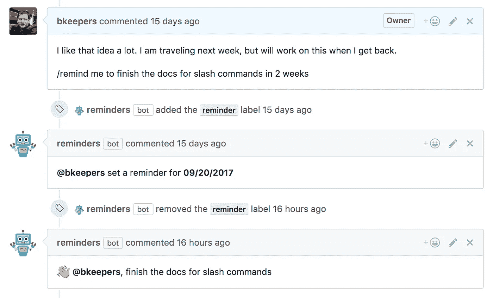

# 探索 Probot——为 GitHub 构建应用的框架

> 原文：<https://medium.com/hackernoon/discover-probot-framework-to-build-apps-for-github-686525c264d1>

构建和探索应用，扩展 [GitHub](https://hackernoon.com/tagged/github) ，并自动化和改进您的工作流程。

Probot — Framework to build apps for GitHub

[GitHub](https://hackernoon.com/tagged/github) 是一个非常流行的基于网络的托管服务，使用 [Git](https://git-scm.com/) 进行版本控制。当一个人想到开源时，GitHub 是他们首先想到的。

由于它的[越来越受欢迎，GitHub](https://github.com/about) 上托管了超过 2700 万用户和 8000 万个存储库，以及不断增长的功能需求，GitHub 于 2017 年 5 月推出了 [GitHub Marketplace](https://github.com/marketplace) ，它提供了一个通用平台来发现[工具](https://hackernoon.com/tagged/tools)，这些工具可以帮助您在使用存储库的同时改进您的工作流程。

> 是人们构建软件的方式

这里托管的一些流行的应用程序有 Travis CI、Codacy、Dependabot 等。

[The home page of GitHub Marketplace](https://github.com/marketplace)

# **GitHub 太棒了，但 Probot 是什么？**

[**Probot**](https://probot.github.io/) **是一个** [**框架**](https://hackernoon.com/tagged/framework) **用来构建**[**GitHub Apps**](https://developer.github.com/apps/)**[**node . js**](https://nodejs.org/en/)**。**它消除了接收和验证 [webhooks](https://en.wikipedia.org/wiki/Webhook) 以及进行认证倒立的所有枯燥工作，让我们专注于我们想要构建的特性。**

****

**Official Logo of Probot**

**此外，基于 Probot 的应用程序易于编写、部署和共享。许多最受欢迎的 Probot 应用程序都是托管的，因此您无需部署和管理任何东西。**

# ****基于 Probot 的一些应用****

**让我分享一些使用 Probot 构建的流行应用程序，只需点击安装即可使用。**

## **欢迎机器人**

****

**Example of a welcome GIF by Welcome Bot**

**当新用户创建新的问题、新的拉取请求或第一次合并时，该机器人欢迎新用户。就我个人而言，这是我最喜欢的*。***

*****安装链接** : [欢迎](https://probot.github.io/apps/welcome/)
**开发者:**[Bex Warner](https://github.com/hiimbex) **GitHub 资源库链接:**[behavior bot/欢迎](https://github.com/behaviorbot/welcome)
**实景看到:** [点击此处查看欢迎 Bot 实景](https://github.com/probot/probot/pull/464#issuecomment-373919155)
**使用人:** [Vue.js](https://github.com/vuejs) ，[电子](https://github.com/electron)***

## ***陈旧的机器人***

******

***Example of a comment by Stale Bot on a Pull Request***

***这个机器人关闭陈旧的问题和拉请求。如果有大量的贡献者在你的存储库上工作，并收到许多问题和请求，这将非常方便。
**安装链接** : [陈腐](https://probot.github.io/apps/stale/)
**开发者:**[Brandon Keepers](https://github.com/bkeepers) **GitHub 资源库链接:**[probot/陈腐](https://github.com/probot/stale)
**实景查看:** [点击此处实景查看陈腐](https://github.com/probot/probot/issues/380#issuecomment-379421222)
**使用人:** [原子](https://github.com/atom)，***

## ***工作进展***

******

***Example of Work In Progress Bot in action***

***这个 bot 通过在标题中添加 WIP 来防止拉请求的合并。
**安装链接** : [进行中的工作](https://probot.github.io/apps/wip/)
**开发者:**[Gregor Martynus](https://github.com/gr2m) **GitHub 资源库链接:**[gr2m/WIP-bot](https://github.com/gr2m/wip-bot)
**实景查看:** [点击这里查看实景进行中的工作](https://github.com/probot/probot/pull/372)
**使用人:** [微软](https://github.com/Microsoft)，***

## ***展开链接机器人***

******

***Example of links unfurled by Unfurl Links Bot***

***这个机器人在评论中添加了更多关于链接的信息。个人觉得这是*我第二喜欢的*。
**安装链接** : [展开链接](https://probot.github.io/apps/unfurl-links/)
**开发者:**[Brandon Keepers](https://github.com/bkeepers)
**GitHub 库链接:**[probot/展开](https://github.com/probot/unfurl)
**看实景:** [点此看实景展开链接](https://github.com/probot/ideas/issues/22#issuecomment-365030774)
**使用人:** [反应式](https://github.com/reactiveui)***

## ***Todo 机器人***

******

***Example of an issue opened by todo***

***这个机器人从你的代码中可操作的注释中制造新的问题。
**安装链接** : [todo Bot](https://probot.github.io/apps/todo/)
**开发者:**[Jason Etcovitch](https://github.com/JasonEtco)**GitHub 库链接:**[JasonEtco/todo](https://github.com/JasonEtco/todo)
**实景查看:** [点击此处查看实景 todo](https://github.com/JasonEtco/todo/issues/51#issue-264257509)
**使用人:** [Mas-CLI](https://github.com/mas-cli) ，，***

## ***提醒机器人***

******

***Example of a reminder opened by the reminder bot***

***这个机器人设置问题和拉请求的提醒。***

*****安装链接**:[todo Bot](https://probot.github.io/apps/reminders/)
**开发者:**[Brandon Keepers](https://github.com/bkeepers)
**GitHub 资源库链接:**[JasonEtco/todo](https://github.com/probot/reminders)
**实景查看:** [点击此处查看实景提醒](https://github.com/behaviorbot/welcome/issues/8#issuecomment-331207747)
**使用人:** [Git for Windows](https://github.com/git-for-windows) ，***

***这样的例子不胜枚举。[点击此处，探索更多基于 Probot 的应用。](https://probot.github.io/apps/)***

# ***Probot 听起来很有趣。但是我应该从哪里开始呢？***

******

***Probot 提供了一个非常简单易用的文档。Probot 的入门部分帮助你在*几分钟内*基于 Probot 构建你的基本 GitHub 应用。***

***[点击此处访问 Probot 文档并开始构建您自己的应用程序。](https://probot.github.io/docs/#getting-started)***

# ***“我希望 GitHub 能够…”***

******

***Have any idea? Share it with us!***

***有好主意？
请不要把想法局限在自己身上！
**与我们分享你的想法！我们都想听听。你还可以发现机器人的其他想法，并创建自己的机器人。
[点击此处与我们分享您的想法，并通过在此处发起问题来发现更多想法](https://github.com/probot/ideas/issues)。
许多开发人员已经开始工作，并根据人们的建议创造了一些机器人——比如 **you** ！*****

# ***需要帮助！？***

****“使用 Probot 构建 GitHub 应用程序很有趣。我一直在构建一个 GitHub 应用程序，但现在我震惊了。我怎样才能得到帮助？”****

***这就是开源社区的美妙之处！在某处受到打击，你来帮忙了。***

***Probot 有一个非常酷的社区，里面有非常聪明的开发者。除了在 GitHub 的 [Probot 上发生的讨论，](https://github.com/probot) [Probot 也可以在 Twitter](https://twitter.com/probottherobot) 上看到。***

***提供反馈、提出问题、获得帮助或只是讨论想法的最佳方式是加入 Probot 的 Slack 社区。点击此处访问加入 Probot 社区页面。***

***此外，您可以添加一个带有标签`[probot](https://stackoverflow.com/questions/tagged/probot)`的关于堆栈溢出的问题，并在社区中与我们分享这个问题***

***这就是 Discover Probot——一个为 GitHub 构建应用的框架。我希望我的文章能帮助你发现 Probot——为 GitHub 构建应用程序的框架。***

***那么，你还在等什么？[与我们分享您的 ***棒极了的 GitHub 应用程序创意***](https://github.com/probot/ideas/issues)和[加入这个棒极了的开发者社区](https://probot.github.io/community/)，*成为其中的一员！****

***我将发表另一篇关于如何使用 Probot 为 GitHub 构建应用程序的文章。在那之前，请继续关注。***

***你可以在 Medium 上关注我，接收我下一篇文章的更新。***

*****如果你喜欢我的文章，请销毁那篇**👏**按钮，并与您的朋友分享，让他们了解 Probot！还有，欢迎在下面评论分享你的想法。*****