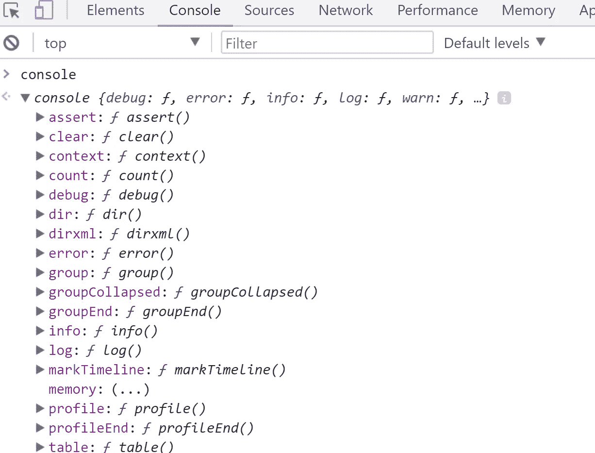
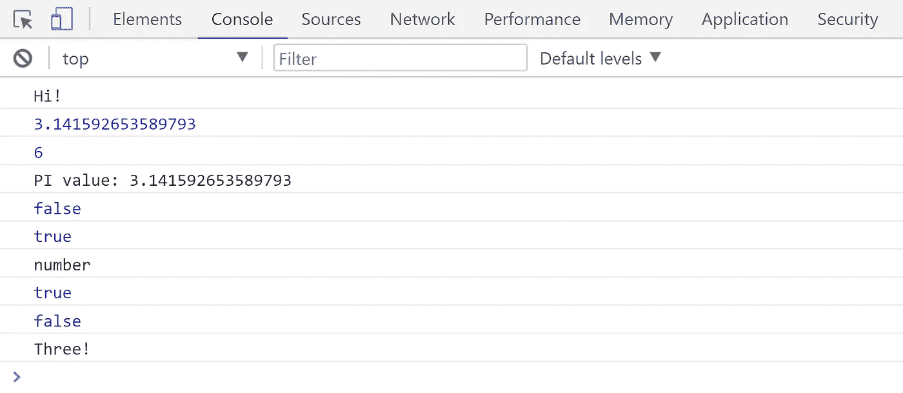
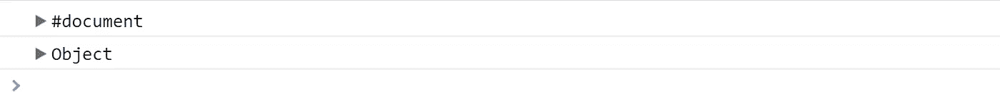
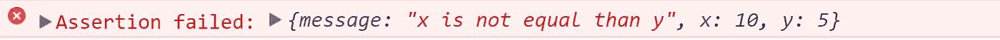
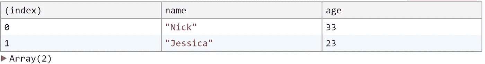
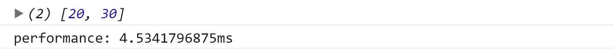
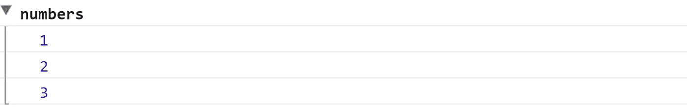

# 在 JavaScript 中发现控制台

> 原文：<https://medium.com/hackernoon/discovering-the-console-in-javascript-8c5ff77ee846>

JavaScript 中的控制台对象是我们开发项目的基础。

‼️你可以去我的 [**Github**](https://github.com/germancutraro) 找 JavaScript 例子。‼️


如果我们在我们的谷歌 Chrome 开发者工具中键入，在*控制台*标签中，单词: ***控制台*** *你可以看到那是一个在 de 全局窗口对象内的对象:*



因此您可以从窗口对象访问控制台对象。

```
window.console
```

**但不是必须的**👓

# 让我们更加了解她:

## 在控制台中打印:🔈

```
*// Printing text* console.log('Hi!');*// Printing a variable* const PI = Math.PI;
console.log(PI);// Expresions
console.log(2 + 4);
console.log(`PI value: ${PI}`);// Comparing
console.log(null === undefined);
console.log(3 > 2);
console.log(typeof NaN);
console.log(true || false);
console.log(true && false);// Ternary Operator
console.log( (3 > 2) ? 'Three!' : 'Two!');
```

**结果:**📍



## 打印错误:❌

```
console.error('Error!');
```

**结果:**📍


## 打印警告信息:⚠️

```
console.warn('Be careful')
```


## 检查对象:🔦

```
console.dir(document);
console.dir({a: 5});
```

**结果:**📍



## 断言:⛳

```
function isEqual(x, y) {
 console.assert(
    x === y, { "message": "x is not equal than y", 
   "x":   x, 
   "y": y });
}
isEqual(10, 5);
```



## 清除:⬜️

```
console.clear();
```

**结果:**将控制台清空。📍

## 表格输出:📋

```
const users = [
  {name: 'Nick', age: 33}, 
  {name: 'Jessica', age: 23}
];
console.table(users);
```

**结果:**📍



## **时间:** 〽️

```
const users = [10, 20, 30];
console.time('performance');
 const gThan10 = users.filter(n => n > 10);
 console.log(gThan10);  
console.timeEnd('performance');
```

**结果:**📍



## 组:📦

```
console.group('numbers');
 console.log(1);
 console.log(2);
 console.log(3);
console.groupEnd('numbers');
```



谢谢你😊！