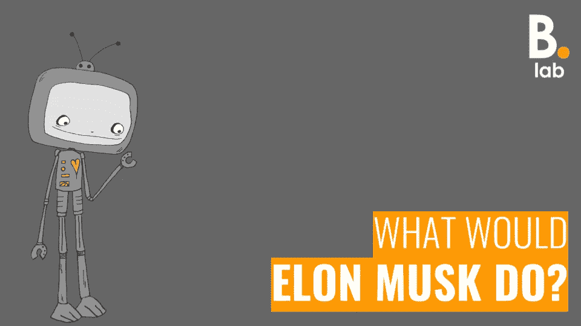
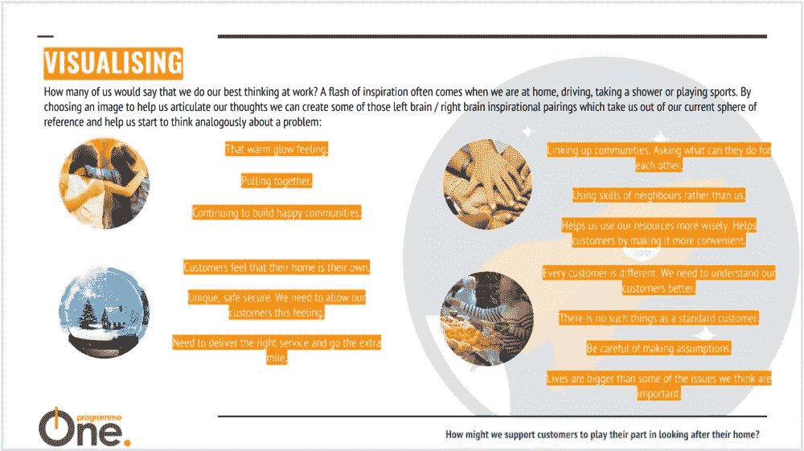
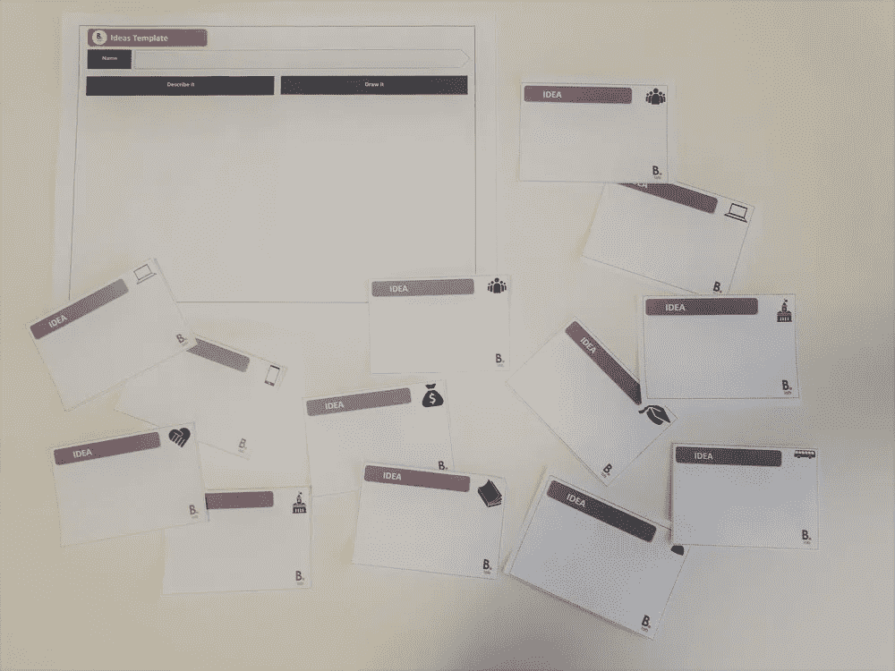
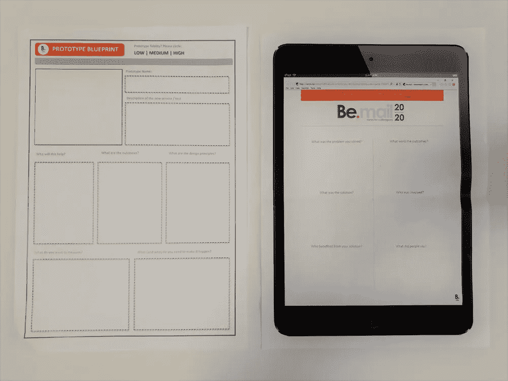
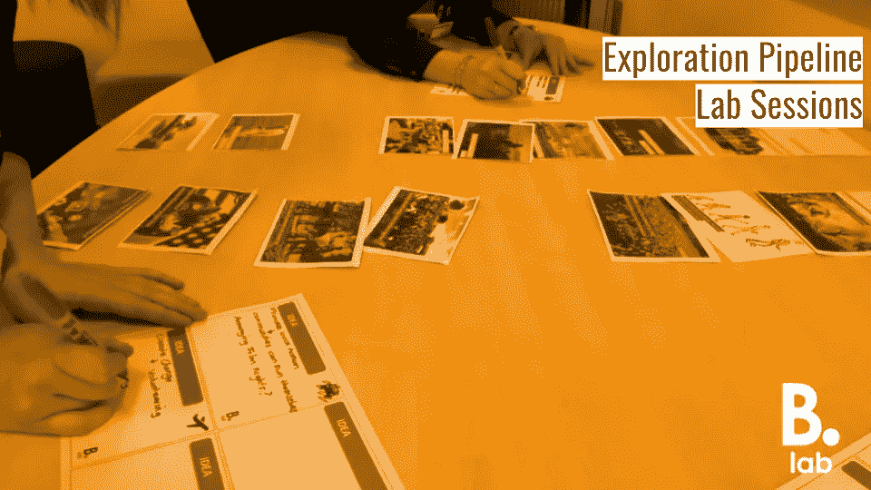

# 探索会议:反思

> 原文：<https://medium.com/hackernoon/discovery-sessions-a-reflection-57218573279>

> 预测未来的最好方法是创造未来

—亚伯拉罕·林肯

经过上周相当紧张的几天，我们现在刚刚进行了一半的探索会议，这是我们[探索管道](https://trello.com/b/DUUozEVO/bromford-exploration-pipeline)中的前 10 个‘我们会如何做’的问题。上周，我们迎来了来自整个组织的 23 名同事，他们来到实验室讨论与项目相关的 4 个问题；*项目 3 —资产管理(土地服务、住房规划和建设)*和*项目 4 —客户管理*。

我们将在本周晚些时候发布每场会议的高级摘要，但除此之外，由于我们还有 6 场会议要进行，我认为从主持人的角度看一下这些会议可能会有所帮助，回顾一下会议的形式，看看哪些有效，哪些可能会更好。

通过会议，我们希望召集一系列同事，看看我们如何以新的方式解决问题。通过问“埃隆·马斯克会怎么做？”我们希望引导一些[第一原则](/the-mission/first-principles-and-the-art-of-thinking-like-elon-musk-98658bb36569)思维，以帮助会议中的同事超越他们当前的参考范围进行思考，并最终帮助我们设计一些测试，挑战我们认为我们了解的一切*。虽然 Elon Musk 最近推广了第一性原理思维的理念，但亚里士多德、莱昂纳多·达芬奇和托马斯·爱迪生等人都使用过“第一性原理思维”来积极质疑每个已知问题或场景的假设，然后从头开始创造新的知识和新的解决方案:*

*   *步骤 1:识别和定义当前的知识和假设*
*   *第二步:将问题分解成基本原则*
*   *第三步:创造新的解决方案来减轻每个原则的影响*

**

*会议将活动分为三个相互关联的部分:*

*   *设想*
*   *思维能力*
*   *规划*

**

***视觉化***

***目的:**我们希望同事们能够从一系列不同的角度来看待这个问题。我们还想利用这部分会议让人们活跃起来，进行创造性的思考。*

**

***工具:**我们使用了一套图像卡来帮助同事清晰地表达他们对未来的愿景。我们请同事描述未来的积极和消极方面，以及阻碍因素、需要考虑的事项和需要注意的事项。令人惊讶的是，唐纳德·特朗普(Donald Trump)被大量使用，但幸运的是，只是在类似的背景下(不是作为未来领导模式的建议)。*

***评论:**这个工具的全部意义在于引发一场本来很难开始的对话。总的来说，效果很好。每个人都积极参与到活动中，其成果为随后产生的想法定下了基调。我们发现，当我们将图像卡用作引导式小组热身时，效果很好，而当我们要求同事在构思阶段将它们用作灵感时，效果就不那么好了。在第一次研讨会期间，我们要求同事们花一些时间就该问题达成一致。这个想法是为了就要解决的问题达成一致，并为构思提供一些背景，这也是图像出现的地方。然而，我们发现这是没有必要的，因为同事们在之前的设计会议上已经同意了这个问题。因此，我们决定在引导式热身活动中投入更多时间来使用这些卡片。*

**

***意念***

***目的:**我们希望帮助同事们就如何解决构成会议基础的问题提出一些想法。*

**

***工具:**我们使用了两种工具来帮助员工从“广泛”和“明智”的角度思考可能的解决方案。*

*   *快速想法生成器——我们为同事提供了一组基于定量或定性洞察的情境启发。给同事们一分钟时间，让他们对每个挑衅产生一个想法。*
*   *高层次想法生成器—我们要求同事将他们的想法整合成两三个高层次的想法。我们给同事们提供了一个模板，帮助他们同时利用左脑和右脑，先写下，然后画出建议的解决方案。*

*评论:同事们比我预期的更乐于接受快速的想法产生。在过去，我发现人们通常会纠结于缺乏细节或者无法摆脱脑海中的声音，这个声音提供了一百万个他们不应该做某事的理由；这通常会导致他们无法在会议记录中写下任何东西。然而，在这些会议期间，同事们能够产生一系列大胆的想法，然后将它们整合成少量高层次的想法。我们发现高层次的想法在他们的范围内更广阔，因为他们首先进行了疯狂和快速的思考。我们将在本周晚些时候打算发表的帖子中写下这些想法。*

**

***策划***

***目的:**虽然这项工作产生的测试、原型和试点将在这些会议之后由 Innovation and Insight 与相关同事合作进行设计，但我们希望同事们开始思考我们如何在会议期间将他们的想法转化为更实际的东西。*

**

***工具:**我们使用了两种工具来帮助同事思考他们想法的后续步骤。*

*   *原型蓝图—我们要求同事完成一个模板，要求他们考虑他们的解决方案将帮助谁，预期结果应该是什么，设计原则应该是什么，他们想要衡量什么，以及谁可以帮助实现他们的愿景。*
*   *BeMail —我们请同事回顾两年后实施的解决方案。我们使用了一个内部新闻更新模板，并围绕诸如*解决了什么问题*和*人们对解决方案有什么看法等问题来组织叙述。**

***评论:**我们发现原型蓝图模板工作得最好，但是通常，同事们发现思考测试的细节比产生想法更困难。这是意料之中的事，因为在研讨会期间，同事们只有很短的时间来完成这项活动。然而，由于我们总是打算在研讨会之外填充细节，这些工具成功地为以后的工作奠定了基础。*

**

***未来会议***

*随着最后 6 场会议的临近，我们能够利用我们在前 4 场会议中所学到的知识来帮助我们更好地开展研讨会:*

*   *由于每个研讨会的目的和目标都是相同的，因此很容易制定一个适用于所有研讨会的计划。虽然从管理的角度来看这将使事情变得更容易，但这并不实际，因为一些同事需要参加两个、三个甚至四个研讨会。为了保持会议的新鲜感，我们需要使用一些不同的工具来实现相同的目标。这不仅对保持参加多个会议的同事的理智是必要的，也是确保工具保持有效的一种方式。在反思过程中，我们发现了两个明显的机会，但随着研讨会的进行，我们将继续开发更多机会:*
*   *刷新快速创意生成器工具，让同事将洞察力/情境刺激与实验室中的随机对象配对，并提出包含两者的创意。这个想法是通过在等式中添加随机催化剂来挖掘更广泛的灵感来源。*
*   *我们想测试一下'[设计小说](https://simonpenny.wordpress.com/2017/06/25/speculative-prototyping/)的用途，作为帮助同事们想象未来的一种方式。通过向同事们提供一件能让未来看起来触手可及的人工制品(一件物品或更可能是印刷媒体)，我们希望能够取代图像卡练习，并为构思提供一个新的话题和发射台。*

*我们最初的计划是分发代表会议成果的高级笔记(给会议与会者和项目发起人),并在会议结束后 48 小时内发布 Bromford 实验室日志。然而，我们发现在举办背靠背研讨会时，这证明是困难的。当研讨会聚集在一起时，我们可能需要重新评估这些时间表。*

*我们将在本周晚些时候发布四场会议的高水平总结，因此请关注日志更新。我们的第五次会议定于 2 月 26 日举行，最后一次会议定于 3 月 19 日举行。*

**

*[评论](http://www.bromfordlab.com/lab-diary/2018/2/12/discovery-sessions-a-reflection#comments-outer-wrapper)*

**最初发表于*[T5【www.bromfordlab.com】](http://www.bromfordlab.com/lab-diary/2018/2/12/discovery-sessions-a-reflection)*。**