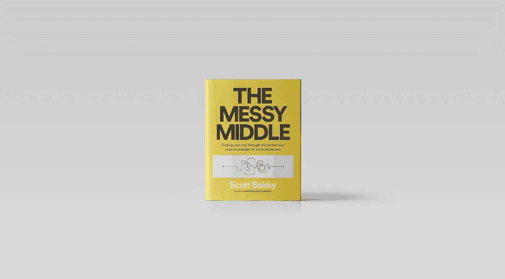

# 来自混乱的中产阶级的急件

> 原文：<https://medium.com/hackernoon/dispatches-from-the-messy-middle-ec1a5e98e921>

[*米卡·罗森布鲁姆*](https://twitter.com/micahjay1) *，管理合伙人*

斯科特·贝尔斯基是科技界最有趣的人之一。

作为 [Behance](https://www.behance.net/) 的创始人，他在网上为设计师建立了卓越的创意社区，将[650 万美元的风险投资](https://techcrunch.com/2012/05/14/behance-raises-first-round-after-5-years/)变成了[1.5 亿美元的退出](https://techcrunch.com/2012/12/21/adobe-acquired-portfolio-service-behance-for-more-than-150-million-in-cash-and-stock/)，让他团队中的十几个人在短短七年内成为百万富翁。他本可以以任何他想要的估值为另一家创业公司筹集资金。

他才刚刚开始。作为天使投资人，他是优步、Pinterest 和 Warby Parker 等公司的第一批投资者。他成为基准基金的风险合伙人，轻松跻身过去 15 年的前三大基金。他本可以继续做全职投资者。相反，他错过了“为有创造力的人建立团队和产品”的机会，并回到 Adobe，在这家有着 36 年历史的工具公司担任高管角色。

在一个创始人希望成名并快速致富的世界里，斯科特绘制了一条非典型的道路，这使得他的观点非常有价值，正如他所建议的创始人可以证明的那样。幸运的是，对于那些无法直接接触到的人来说，他写了一本书，名为《凌乱的中间》,列出了他的一些建议。这是一本重要的书。正如他最近在我和他一起主持的一次活动中所说的，这么多商业书籍和趣闻相当于“我中了彩票”。去玩我的数字吧”(这是他在《企业家安德鲁·威尔金森》(Andrew Wilkinson)一书中分享的一句话。这本书做了相反的事情，并在这个过程中不愉快但必要的部分发出了明亮的光。

我希望这个杂乱的外卖中间部分能说服你去读它。

# 资金不应该被庆祝，它应该让你紧张

在过去的几年里，斯科特支持了许多最具前瞻性思维的初创公司，但书中给出的建议却非常老派。在 378 页中，我认为斯科特没有分享一个帮助公司筹集资金的“技巧”。事实上，他喜欢这样的句子，“对于强大的公司来说，筹资是一种策略，对于弱小的公司来说，它是一个目标。”他并没有以任何方式推广自举，但这本书始终贯穿着一条主线，敦促创始人不要试图用短期解决方案或金钱来掩盖问题。这本书主要是关于建筑业，而不是银行业。

# 最好的初创企业是初创企业

另一个贯穿全书的古老建议是关于毅力的力量。“你可以把大事做好，但不会成功，因为你忍受的时间不够长，”这是所有创始人都应该牢记的一句名言。我们都已经太习惯于异数创业公司迅速获得牵引力的故事，以至于我们忘记了更常见的成功模式“一夜成功的十年故事”耐心是一种美德，对创业的成功至关重要。

# 资源会枯竭，但足智多谋不会

斯科特带领 Behance 公司发展了五年，却没有多余的时间增加新员工来解决问题。相反，他的一位高管想出了一个简单的格言，当对员工提出新的要求时可以使用——“重构，重构，雇佣。”基本上，找出哪些流程和工具可以改进、添加或删除，以解决与新 FTE 相同的问题。只有在经历两次这一过程后，引进新员工才有意义。

# 优秀的创始人战胜懒惰

“我一直认为，从生理和心理上来说，我们从出生开始就倾向于一个非常短期的奖励系统。想想在 18 世纪，平均寿命是 26 岁。“花 5 到 10 年的时间来建造东西的想法不仅深不可测，而且不明智，”斯科特说，他认为我们需要建立系统来侵入我们的自然反应。哈佛商学院教授 Teresa Amabile 证实了这一点，并证明了进步是未来进步的最佳动力。

Scott 认为你必须帮助你的团队理解他们正在取得进步，以取得更大的进步。这可以有多种形式，包括办公空间，比如“完工”墙，这是办公室中的一个空间，突出已完成的项目，为公司的发展势头提供有形的形式。

*凌乱的中间部分*充满了宏观的理论框架，但也对一些现代创业病理做出了快速诊断，比如“不安全工作”，Scott 将其定义为具有以下特征的任务:

*   没有预期结果
*   不会让球向前移动
*   并且足够快，你可以每天做多次

对于大多数人来说，电子邮件是一个很好的代理，但它可以是任何事情，从微观管理日历到痴迷于不太突出的统计数据。他的建议是拥抱这些抽搐，但是把它们限制在每天一次的短时间内。

# 过度优化是危险的

在一个生产力大师吹捧虚拟助手和工具的好处，让你远离时间的世界里，斯科特推销的是意外之喜的好处。例如，在照片分享初创公司还没有任何吸引力之前，斯科特通过他的一名员工半热情的介绍认识了 Pinterest 的联合创始人本·希伯尔曼。许多人会建议他避免这种低概率的介绍，但这很可能是有史以来最赚钱的会议之一！正如斯科特所写的，不要“优化你的业务中的艺术”，以及“最伟大的企业开始更多的艺术而不是科学，然后他们采用科学。”

# 产品市场契合度是一个旅程，而不是目的地。

斯科特将这本书将近一半的篇幅用于介绍产品设计艺术。他精心构思了几十句台词，在你读完这本书后仍会久久不忘。我最喜欢的一些是:

*   产品市场契合度是一个旅程，而不是目的地
*   不要寻找更好的答案，问不同的问题
*   激情不能弥补需求的不足
*   在你的产品之前建立你的叙述
*   如果一张图片胜过千言万语，那么一个模型就能回答一千个问题
*   优化前 30 秒的懒惰、虚荣和自私
*   简单是有粘性的
*   产品要么帮你节省时间，要么花时间
*   如果我们选择简单的方法，我们的竞争对手需要多长时间才能赶上？
*   对竞争对手保持好奇，但不要模仿他们
*   改善第一英里比任何新功能都更有影响力
*   当某样东西起作用时，关注是什么让它起作用，而不是粗糙的边缘

我无法对每本书背后的含义做出公正的评价，但我希望这个快速的概述能说服你去买这本书，或者听听《T2》的音频版。