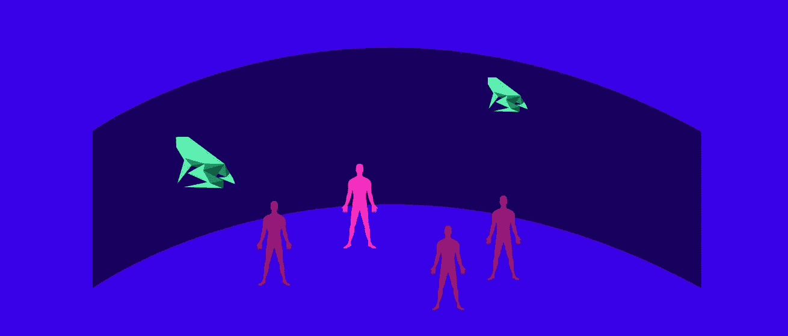

# 增强和虚拟现实显示器

> 原文：<https://medium.com/hackernoon/displays-for-augmented-and-virtual-reality-2d77b5199a8b>

用显示器来增强现实的想法还比较年轻。这些显示器中的大多数不是面向普通消费者的，因为缺少这些设备可以处理的日常场景。然而，国防、商业、工业和医疗保健环境已经显示了该技术解决的大量机会。这些显示类型可以大致分类如下:

# **增强显示**

增强显示器可以大致分为两种类型:

## **光学看透**

在光学透视眼镜中，用户通过光学元件直接观察现实，例如全息波导和其他能够在现实世界上进行图形叠加的系统。微软的 Hololens、Magic Leap One 和谷歌眼镜是光学透视智能眼镜的最新例子。光学透视眼镜可以是双目或单眼的。

视力是衡量看东西所需眼睛数量的指标。由于我们大多数人最多只有两只眼睛，智能显示器的视力极限也是如此。

**单目显示器** 这种显示器通常通过一个小型显示元件和镜头提供一个单一的观看通道。该频道位于一只眼睛前面，用户可以自由地通过另一只眼睛完全观看真实世界。单目显示器由于其小的形状因数而经常被用作信息显示器。然而，这些类型的显示器不提供立体深度提示，且经常导致非常低的对比度。谷歌眼镜和 Vuzix 智能眼镜都是单眼显示器的类型。

**Biocular** 这种类型通过内部反射为双眼提供单一的观看通道。双筒显示器缺乏立体视觉，适合近距离任务。

**双目** 在这些类型的显示器中，每只眼睛都获得单独的视图，从而创建立体视图。这些显示器类型提供了最深入的线索和沉浸感，但是，它们是最重、最复杂和计算密集型的显示器。微软的 Hololens，DAQRI 智能头盔和爱普生的 Moverio 都是双目增强显示器的类型。

## **视频看透**

通过这些类型的智能眼镜，用户可以看到首先由安装在显示器上的一个或两个摄像头捕捉的现实。然后，这些摄像机视图与计算机生成的图像相结合，供用户观看。HTC Vive VR 耳机内置摄像头，通常用于在设备上创建 AR 体验。

# **沉浸式显示器**

大多数虚拟现实耳机都是完全沉浸式的。这些立体显示器与传感器相结合，以跟踪位置和方向。它们像《Ready Player One》这本书里一样完全挡住了用户对外界的视野。

## **沉浸式耳机**

大多数高性能沉浸式系统，如 HTC Vive 和 Oculus Rift，都是由 PC/控制台驱动的，而谷歌 Cardboard 和三星 Gear VR 等更便宜的消费类系统可以作为独立设备与智能手机结合使用。

除了上面提到的 VR 头戴设备，还有另一个有趣的沉浸式显示器类别，它要求用户在身上佩戴很少或没有器具。以下是最受欢迎的两个。

## **洞穴和墙壁**

这些系统有各种形状和尺寸，从多壁显示器到多投影仪半球显示器。这些类型的显示器在科学和专业团体中最常见。这些大多是多用户场景，所有参与者都被动地体验 3D 模拟。这些显示器通常为有限数量的参与者提供交互性。

## **半球和圆顶**

这些在许多行业都很受欢迎，尤其是国防和航空。为多个用户提供了相当高的图形精度和空间。这些系统是无束缚的，这是优于其他沉浸式显示器的显著优势。

这些设备类型都是围绕为其他目的开发的技术而设计的。鉴于显示技术在发展中的极端分辨率，几乎可以肯定的是，基于平板的 HMD 可能会成为 AR 设备的历史。

**参考文献:**
1。[增强人——海伦·帕帕吉安尼斯](https://amzn.to/2C7k3c3)
2。[实用的增强现实——史蒂夫·奥克斯塔卡尼斯](https://amzn.to/2C6XDHR)

**相关文章:**
1。[人眼对增强现实空间的理解](/@akshaykore/human-eyes-understanding-of-space-for-augmented-reality-d5ce4d9fa37b)2。[一台机器和人类在增强现实中对世界的感知](https://hackernoon.com/a-machine-and-humans-perception-of-the-world-in-augmented-reality-2342f4a6750)
3。[增强与虚拟现实显示技术基础](https://hackernoon.com/fundamentals-of-display-technologies-for-augmented-and-virtual-reality-c88e4b9b0895)
4。[AR 装置的种类](https://uxplanet.org/augmented-reality-device-types-a7668b15bf7a)
5。[增强视觉的构建模块](https://uxplanet.org/building-blocks-for-augmented-vision-cc9b6172b461)
6。我们增强世界的未来。[计算机对增强现实空间的理解](https://uxplanet.org/a-computers-understanding-of-space-for-augmented-reality-c0fd40a52900)

**如果您喜欢这篇文章，请点击👏按钮(一次、两次或更多次)。
分享帮别人找！**