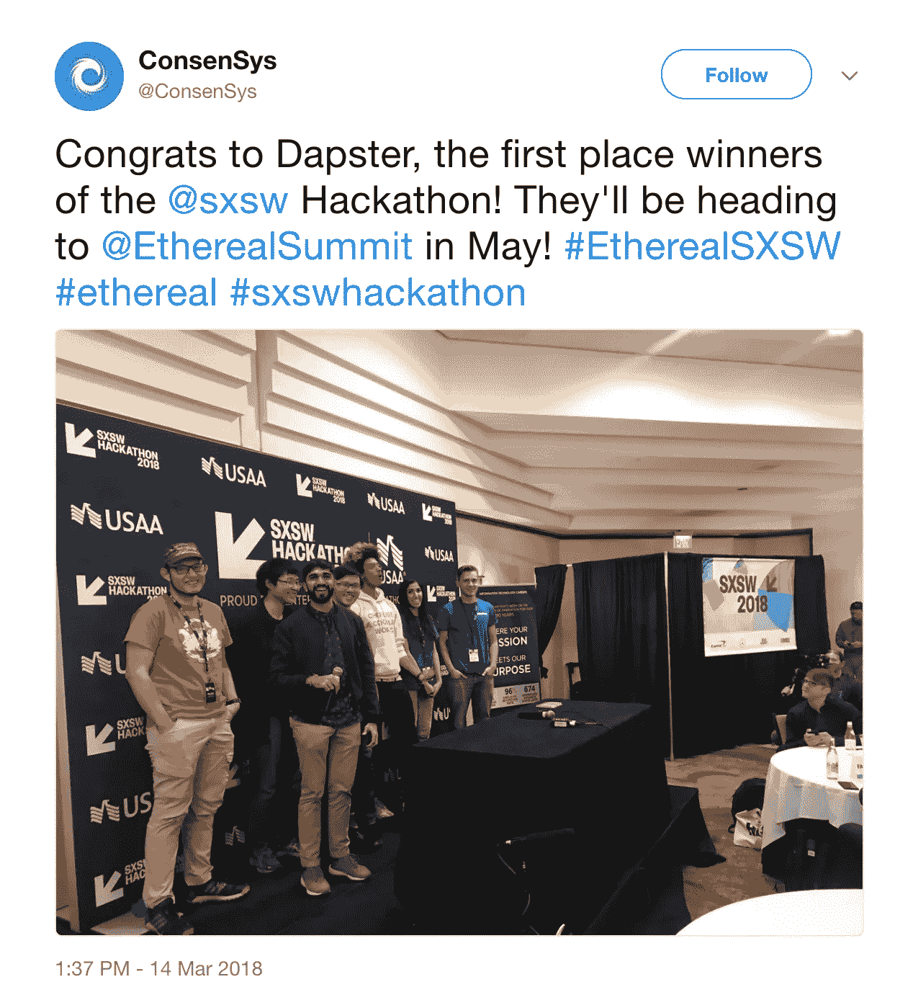

# 在 SXSW 2018 黑客马拉松上颠覆音乐行业

> 原文：<https://medium.com/hackernoon/disrupting-the-music-industry-at-sxsw-2018-hackathon-a13307908d7>

如果你可以自由地创造任何你想要的东西，与世界分享，立即获得报酬，并且知道它永远不会被偷走，你的生活会有什么改变？听起来像是白日梦；一个人类不再贪婪，拥有充分创作自由的乌托邦。在过去的一周里，我一直生活在 SXSW 的辉煌动荡中，这是音乐、电影、游戏和科技行业的全球融合。在我周围看到的所有社会和技术革命中，为什么这不能成为现实呢？

SXSW 举办了一次黑客马拉松，聚集了来自世界各地的创意技术专家，在 24 小时内构建令人兴奋的项目。目标是构建梦想，激发创造力，培养[社区](https://hackernoon.com/one-theme-was-hitting-the-high-note-at-the-sxsw-hackathon-f44a2ee30caa)。我的团队建立了 Dapster 建立了一个音乐流媒体服务，帮助崭露头角的艺术家更快地赚钱，同时与世界公开和安全地分享他们的创作内容。我们通过结合两种创新解决方案实现了这一目标，这两种解决方案都依赖于加密资产管理(也称为“区块链”)。虽然区块链可能看起来像是一个被夸大的时髦词，但它远不仅仅是比特币和加密货币。这是一项革命性的技术，可以让人们创造出令人惊叹的新事物。我们用它来构建 Dapster，它在 SXSW 2018 年黑客马拉松上获得了几项大奖。

我们黑客马拉松项目的前半部分包括建立一个音乐流媒体服务，这是我们在[国会音乐集团](https://www.universalmusic.com/label/capitol-music-group/)的帮助下创建的。他们通过环球音乐集团的目录为我们提供了超过 14000 首歌曲，供我们在黑客马拉松比赛中使用。Dapster 上的每个听众都可以获得免费的流媒体，没有广告，没有销售数据，艺术家仍然可以获得他们应得的钱。这样的梦想如何实现？你为音乐付钱，但不是用现金。当你在流式播放音乐时，我们使用你的计算机来生成加密货币，所以你不是在花钱，而是在创造金钱！但是等等，这只是我们破解的第一部分。

# H **如果你可以自由地创造任何你想要的东西，与世界分享，立即获得报酬，并且知道它永远不会被偷走，你的生活会有怎样的改变？**

“如果我不想卷入加密货币的黑魔法怎么办？”非信徒可能会问。你可以像 iTunes 一样为你喜欢的歌曲预付费用。这就是我们介绍区块链令人兴奋的新应用的地方。在我们向您发送您刚买的歌曲之前，我们会加密您的文件，在区块链上记录您的购买，并为您的个人歌曲颁发一个名为 [ERC721](/crypto-currently/the-anatomy-of-erc721-e9db77abfc24) 的令牌。下次您播放该歌曲时，我们会检查以确保您已经购买了该歌曲，并使用存储在与您的文件相关联的令牌中的购买信息为您解密。这意味着即使你买了这首歌，也只有你能听。不能发给你同样爱德雷克的朋友贝基(难道我们都不爱)，不能用在另一首歌里，也不能非法转卖给别人。与此同时，你仍然可以在任何地方任何设备上听你的歌曲，甚至可以像其他流媒体服务一样离线。

Dapster 允许音乐家有创意和财务自由来试验和培养他们的艺术风格，同时也能够接触到更多的粉丝。由于加密货币挖掘的工作方式，艺术家可以按你听他们歌曲的时间付费。换句话说，他们的奖励是基于粉丝对他们音乐的整体参与度，而不仅仅是随意点击播放按钮。这使得新贵艺术家和全球流行明星之间的经济补偿更加平等。

# 如果你想了解更多或者对使用 Dapster 感兴趣，我们正在 Dystrack.com**进一步建设我们的黑客马拉松项目**

**你能相信所有这些都是在 24 小时内建成的吗？如果没有 [SXSW](http://sxsw.com/) 、 [Capitol Music Group](https://www.universalmusic.com/label/capitol-music-group/) 、 [Hackernoon](https://hackernoon.com/) 或 [Consensys](http://consensys.net/) 赞助黑客马拉松并在接下来的几天里在一个私人孵化器中指导我们，这是不可能的。我们很高兴能继续打造 Dapster，并让它变得更大更好！**

***—由马利克·沃姆斯比撰写***

**团队适配器:**

**1.圣地亚哥·莫雷诺**

**2.[铜棒 6](https://github.com/copperstick6)**

**3.马利克·沃姆斯比**

**4.阿菲娅·艾哈迈德**

**5.[克伦德宁](https://github.com/Clendenin)**

**6.[陈亦飞](https://github.com/davidzchen-ut)**