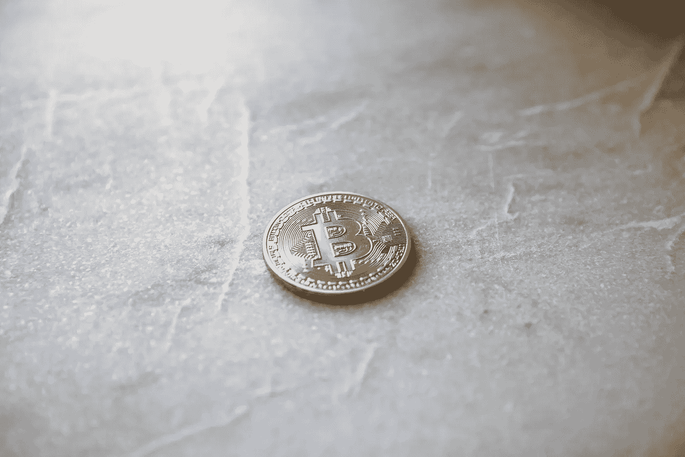
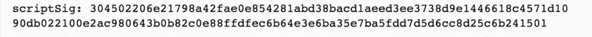

# 用四分钟剖析比特币白皮书

> 原文：<https://medium.com/hackernoon/dissecting-the-bitcoin-whitepaper-in-four-minutes-5c8c5e5f8010>

Photo by [Andre Francois](https://unsplash.com/photos/fZoLhGQIejU?utm_source=unsplash&utm_medium=referral&utm_content=creditCopyText)

# 简介:

互联网上的金融交易完全通过第三方服务完成，主要是 Visa、Mastercard、Paypal 和其他银行机构。这样一个体系的核心基础是**信任**。我们相信这些机构会**存储、验证和处理**我们的电子支付。

这些机构采取各种措施来调节维护基于信任的系统的费用，这反过来增加了金融网络中的交易成本。这些措施通过拒绝参与、要求身份证明或其他不公平做法，阻碍了个人和企业公平参与经济活动。这种货币体系不同于我们几个世纪以来所拥有的——通过现金或硬币进行的经济活动。但如今，这已被第三方信托所取代。

# 基于数学的电子支付:

中本聪在 2009 年提出的比特币被认为是第一种基于**数学而非信任**的数字化、去中心化货币。比特币是一个**点对点网络**，这意味着交易直接发生在用户之间，没有可信的第三方。就是**去中心化**，意思是没有人在控制“系统”，每个人都可以公开参与。是**数字稀缺**，也就是说没有人可以复制和花费同一个硬币两次。这些技术在当时的计算机科学领域是前所未有的，革命性发明的结合使得创造一种去中心化的点对点数字货币 **—比特币成为可能。**

# 银行系统(集中式网络)中的交易是什么？

交易是将$X 从 A 转移到 B 的请求。系统通过将 A 的余额减少$X 并将 B 的余额增加$X 来完成该过程。

在银行系统中，这很容易执行和维护。每当用户试图花钱时，网络会检查用户是否有所需的余额。如果是这样，它会从他们的帐户中扣除金额。如果没有，网络不允许交易，因为余额不足。

Centralized network

# 比特币网络(去中心化网络)中的交易是什么？

由于网络的性质，在分散式网络中，事务处理并不简单。在一个去中心化的网络中，没有一台“机器”掌握着绝对的真理。网络中的每一台机器都有自己的真理版本，它们都在其中的一个版本上找到共识。

Different types of network: Centralized, Distributed & Decentralized.

比特币网络使用分布式节点网络*通过使用加密技术和称为**区块链的公共分布式账本来验证交易。**区块链是一份公开的资产负债表，记录了曾经发生的所有比特币交易。这意味着网络中的所有参与节点一起维护区块链&的副本，并就区块链的一组更新达成一致。

*=加入网络的计算机和/或机器。

数据块由网络中的所有节点复制，如下所示:

Blockchain replication

从技术上讲，交易发生在比特币地址之间，而不是用户之间。比特币地址是一长串字母数字字符，带有相关的公钥/私钥对。把私钥想象成你唯一知道的实际密码。只有使用该密钥才能生成数字签名，并用于证明交易的所有权。稍后会详细介绍。

# 区块链的更新是如何发生的？

当用户之间发生交易时，它被广播到整个网络。节点验证并将它们添加到它们的区块链副本中，然后将它再次广播到其他节点，以通知它们有关更新的信息。为了保持网络的健全，每隔十分钟，一组事务(称为块)被“接受”或“确认”并添加到区块链中。节点向网络发布接受的块，并且循环继续。

Chain of blocks — blockchain

# 什么是双重消费？

在实物支票中，签名验证交易的所有权和有效性。它证明了支票的主人写了这张支票，并愿意从他的账户中转账给收款人。但在比特币网络中，所有者通过对比特币进行数字签名并将其附加到交易中来转移比特币。

数字签名看起来像这样:

Digital signature

收款人可以通过使用加密魔法来验证签名以确认所有权。但问题是当收款人想要确认付款人是否已经花掉了承诺给他的硬币时，即，硬币是否被重复花掉了。收款人需要证明在交易时，他的交易是第一笔&其他交易应该以正确的顺序处理。如果付款人试图花费“相同的”硬币超过一次，系统应该拒绝他们。

# 比特币网络如何防止重复消费？

比特币网络通过使用区块链和一个被称为**工作证明的共识过程来解决这个问题。**

我们知道网络中的节点知道所有的事务，并且它们都有一个单一的历史。工作验证机制期望节点消耗能量来更新区块链。电力的使用是证明他们已经完成工作以获得结果的一种方式。它们解决了一个很难(但可行)的计算问题，这个问题可以很快验证，但制作起来非常耗时。

这意味着如果节点想要在区块链中进行恶意更新，它们将不得不消耗能量。它们的计算资源必须高于网络中所有诚实的节点。这在数学上几乎是不可能的。

# 这个很难的计算问题是什么？

一个新形成的块包含一个随机数值作为工作证明。nonce 只不过是一个数字，当与块的主体散列时，产生网络所期望的“特定输出”。系统要求常量哈希具有一定数量的前导零才能被接受。

proof-of-work: finding the nonce value

因为 **SHA256 哈希**完全是伪随机函数，创建块的唯一方法是用随机数试错法。用 nonce 进行验证的过程很容易验证，但是预测 nonce 值几乎是不可能的。由于需要更多的零点，所需的平均功是指数级困难的。

Inside a block

# 如果两个节点找到一个 nonce 值会发生什么？

找到 nonce 值的第一个节点将其广播到网络，并开始处理链中的下一个块。有时会有多个节点找到正确的散列，或者新的块没有到达网络中的所有节点。这导致同时创建几个分支。它看起来像这样:

Several branches created during mining

工作证明表示最长的链在 CPU 能量方面做了最多的工作。因此，一旦节点接收到具有最长分支的块，它就会忽略所有较短的分支，并开始处理新的块。

注意:节点将总是选择它从其他节点接收的第一个块，并将其他块保存在其缓存中。

# 采矿:

挖掘是在不断增长的区块链中反复收集、验证和更新广播交易的过程，以确保每个人都同意交易的顺序。矿工是网络中的节点，他们保持区块链的一致性和安全性。由于没有发行硬币的中央机构，所以每当矿工成功开采一个新区块时，系统就用新的比特币来激励他们，即，解决了困难的计算问题并向区块链添加了一个区块。这是新的比特币在网络中产生的唯一方式。

注意，矿工和那些只是利用比特币网络转移比特币的用户(比如你我)是不同的。

Bitcoin mining

# 很高兴知道一些概念:

## 默克尔树:

梅克尔树是一种二叉树，数据位于叶节点。中间节点由两个子节点的散列组成。哈希向上传播到树的顶部，这有助于验证欺诈性交易，因为数据的微小变化将改变上面所有节点的哈希。默克尔树提供了一种非常有效的方法来识别一个块是否不同于链中的其他块。

另一个称为**“简化支付网络”(SPV)** 的协议只下载块头和与之相关的交易分支。它有助于保护区块链&通过下载一小部分区块链来恢复平衡。

Visualizing Merkel tree inside a block

# 结论:

比特币白皮书提出了一种独特的革命性系统，用于在没有可信第三方的情况下转移电子支付。拥有自己的交易历史副本的节点网络——区块链，维护系统的一致性；数字签名授权交易和所有权；工作证明保护了交易历史，使攻击者无法通过计算篡改交易历史。

# 参考资料:

*   [比特币白皮书](https://bitcoin.org/bitcoin.pdf)
*   [维基百科:比特币](https://en.wikipedia.org/wiki/Bitcoin)
*   安德烈亚斯·安东诺普洛斯
*   [bitcoin.org](https://bitcoin.org/en/)
*   [比特币. it](https://en.bitcoin.it/)

## 图像来源:

*   [纸张选择](https://www.paperalternative.com/workflow-management)
*   [以太坊:Stackexchange](https://ethereum.stackexchange.com/questions/7812/question-on-the-terms-distributed-and-decentralised)
*   [无法估量的事情](http://www.imponderablethings.com/2013/07/how-bitcoin-works-under-hood.html)
*   [pcauthority](https://www.pcauthority.com.au/news/bitcoin-mining-eats-up-more-energy-than-the-entirety-of-ireland-uses-in-a-year-478360)
*   矿工工会

# 感谢阅读！如果您相信区块链可能带来的技术影响，并且喜欢您刚刚阅读的内容，请点击并按住*👏，或者在下面留言评论。这将有助于我们接触到更多的观众。*

*这个故事是由*[*pra shish Rajbhandari*](/@prashishh/)*撰写的，最初发表在*[*info urminutes*](https://infourminutes.co/whitepaper/bitcoin)*上。*

*阅读白皮书每周摘要，请订阅* [*邮件列表*](http://eepurl.com/dkTrvz) *。*

你在推特上吗？请 [*关注我们*](https://twitter.com/infourminutesco) *保持更新。*

*特别感谢* [*阿维纳什*](https://avinash.com.np/)*[*安科曼*](/@ankurmans) *和基莎·普拉丹的反馈。**