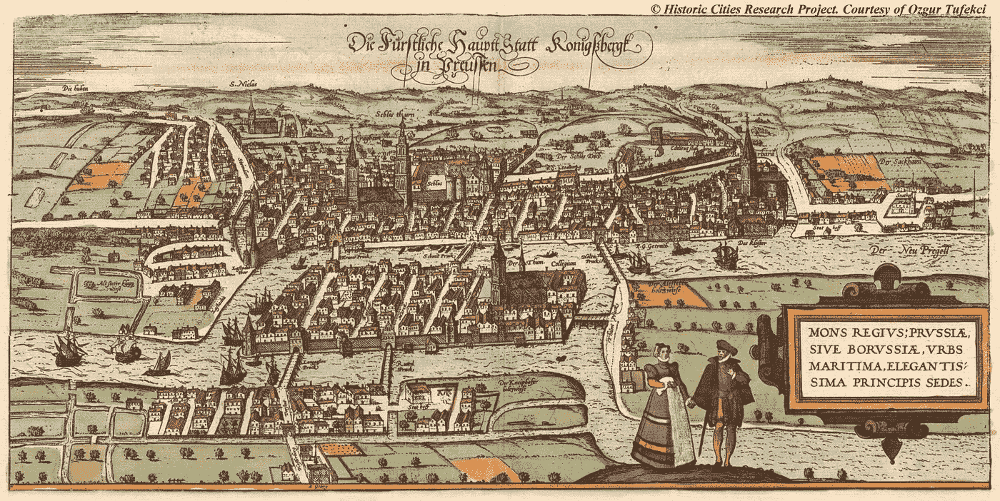

# Spark GraphX 的分布式图形处理

> 原文：<https://medium.com/hackernoon/distributed-graphs-processing-with-spark-graphx-f0ceea695220>

> 简单是可靠的先决条件

**开场白**

图是一种明显且易于理解的数据结构。自从伦纳德·欧拉的时代以来，图论迫使人类思考不同的任务，例如一个人如何能够走过柯尼希斯堡的所有七座桥而不经过其中任何一座两次，或者旅行推销员应该如何找到最有利可图的路线。

Seven Bridges of Königsberg — is a notable problem in the graph theory

从欧拉的时代开始，出现了很多东西:晶体管，编程语言，分布式计算都出现了。这个列表的最后一项极大地简化了图形的存储和处理。这就是本文将要讨论的内容。

如果您不熟悉 Apache Spark 的基本概念，如 RDD、驱动程序、工作节点等。在继续阅读本文之前，我建议您阅读来自 Databricks 的文档[。](https://spark.apache.org/)

对我来说，对付任何技术的最好方法就是试着用它写点东西。在本文中，我们将利用图论的基本概念来分析*【社交网络】*的相似性。

**练习**

存储我们的“社交网络”的方式我选择了一种简单直观的方式:磁盘上的 tsv 文件。当然，它可以是任何其他格式的文件，如 Parquet、Avro。在这一步，文件的存储位置并不重要，它可以是 HDFS 或 S3，即使我们需要更改某些内容，Spark SQL 也会无缝地进行迁移。网络结构看起来像这样:第一个文件是用户的 Id 及其名称，第二个文件是用户的 Id 及其对等方的列表。Apache Spark 支持以下编程语言 Java、Scala 和 Python 作为 API。我选择了第二种。

我只想回答一个流行的问题，即当您有许多插入/更新操作时，是否使用 Spark GraphX 来存储图形—答案是否定的，RDD force 上的所有更改操作都是为了更改集群中的整个 RDD，这不是最佳解决方案，对于这种情况，NoSQL 的解决方案如 Neo4J、Titanium 甚至 Cassandra、HBase 都可以提供帮助。没有什么可以阻止你使用 Spark GraphX，还有前面提到的 NoSQL 解决方案，用于处理图形、从数据库下载数据/通过调度程序检索，以及通过 Spak 以事件驱动的方式进一步处理，这些都是很好的用例。

好了，让我们开始写代码吧。首先，我们需要将图形加载到内存中，获取源文件并提取必要的顶点和边:

**预凝胶**

GraphX 中图形迭代的主要机制是 Pregel 算法。该算法由 Google 开发，Pregel 模型使用[图中顶点之间的消息传递](https://stanford.edu/~rezab/classes/cme323/S15/notes/lec8.pdf)。通过称为超步的迭代序列传输消息，这是该算法的基本思想。还有，主要思想可以描述为:“像顶点一样思考”换句话说，当前顶点的一个状态只取决于它的邻居的一个状态。

如果用通常的 MapReduce 解决问题变成一个复杂的过程，Pregel 就变得非常必要。有趣的是，Pregel 这个名字来源于这条河的名字，这条河横扫了柯尼斯堡的七座桥。

遍历图的主要原语是三元组——它由以下部分组成:当前顶点、我们要经过的顶点以及它们之间的边。同样，您必须指定顶点之间的默认距离；通常，它是 PositiveInfinity，每个顶点的 UDF(用户定义的函数)函数处理传入的消息并计算下一个顶点，UDF 合并两个传入的消息，这个函数必须是可交换的和关联的。由于 Scala 是一种函数式语言，最后两个函数将表示为，两个 lambda 表达式。

我们实现的第一个算法是 Dijkstra 算法，用于查找从任意顶点到所有其他顶点的最短路径。

一切都很清楚:从一个给定的顶点开始，使用最小值函数来确定每一步的最小距离。Pregel 中使用的第一个函数保持传入消息和当前顶点之间的最短距离。第二个功能是在保持距离的同时向邻居传播消息。最后一个功能类似于 Reduce 阶段，它在有多个传入消息的情况下选择最小值。此外，我们用字符串形成了一个方便的图形表示。

**分离度**

我相信这篇文章的许多读者都听说过[六度分离](https://en.wikipedia.org/wiki/Six_degrees_of_separation)理论，这是一个未经证实的理论，即地球上的任何人都可以通过不超过五个中间人的熟人链与地球上的任何其他人联系起来。关于图论，这听起来像这样:对于地球上的任何两个人，图的直径不超过 6。

*特朗普先生和我的分离程度:*

我很好奇我和唐纳德·特朗普(Donald Trump)或马克·扎克伯格(Mark Zuckerberg)等一些名人之间的分离程度。想了想，我记起了下一个:我的同事在脸书工作，并且认识马克，因此我和马克的分离度是两个:我——我的伙伴，我的伙伴——马克。当然，马克和川普先生是认识的，结果，+1:川普先生和我的分离度是三。如果你个人认识我，就意味着你对这些人的分离度相应地至少是 3 和 4。很好奇，不是吗？

An example of the degree of separation graph

让我们开始编写该任务的代码，我们需要在[广度](https://en.wikipedia.org/wiki/Breadth-first_search)中遍历一个图，以便找到指定顶点的联系人，为此我们需要修改 Dijkstra 算法的代码:

一切都与上面的 Dijkstra 算法非常相似，但是我们必须指定迭代次数——对于我根据经验得到的图表，值为 10，对于您的图表，这可能是一个不同的数字。接下来，我们使用用户名执行 join，并获取任意用户的前 100 个值:

找到两个任意顶点的分离度也是可行的:

Spark GraphX 从框中可以得到关于图的许多信息，例如，得到图的连通分量:

以图形中三角形的数量(三角形计数)来获取此指标:

**PageRank**

PageRank 为图的每个顶点分配重要性。例如，如果一个 Twitter 用户有来自其他用户的大量订阅，那么他就有很高的评级，因此，这个用户可以很容易地在搜索引擎中找到。

PageRank representation

GraphX 有 PageRank 实现的静态和动态版本。静态版本具有固定的迭代次数，而动态版本运行直到秩收敛到指定值。

我们的图表看起来是这样的:

**结论**

细心的读者注意到，本文的主题是图的分布式处理，但是在编写代码时，我们没有做任何事情来使处理真正分布式。让我们想起埃德格·迪克斯特拉在开头的话。Spark 通过承担分布式计算的负担，极大地简化了我们的生活。编写将在分布式集群上启动的代码并不像一开始看起来那样困难。Spark 的集群资源管理甚至有几个选项:Hadoop YARN、Apache Mesos(我个人最喜欢的选项),最近还有对 Kubernetes 的支持。本文中考虑的所有源代码都可以在这个 GitHub [资源库](https://github.com/arukavytsia/spark-graphx)中找到。