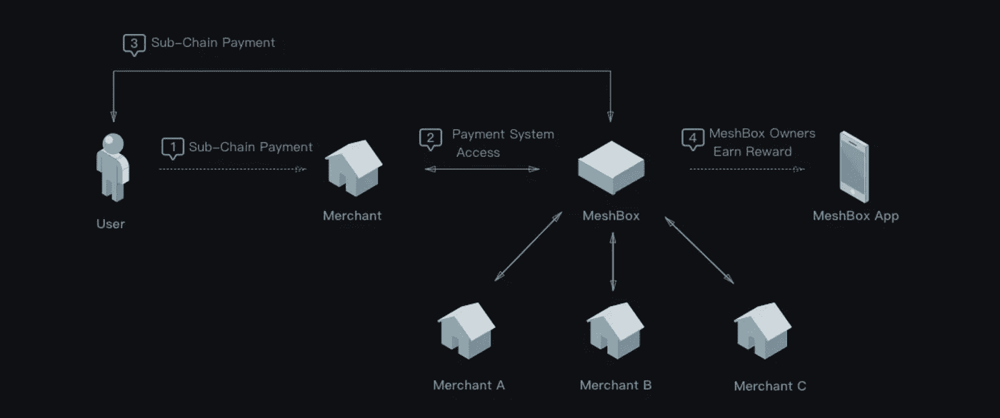

# 下一代互联网上的分布式华为和思科:MeshBox

> 原文：<https://medium.com/hackernoon/distributed-huawei-and-cisco-on-the-next-generation-of-internet-meshbox-6d514d14f1e3>

互联网接入通常被认为是理所当然的，但连接发达国家的过程一直是硅谷精英们的热门话题。已经提出了许多建议，并且一些高概念的尝试最终在其部署中失败了。MeshBox 基金会正在寻求将他们的 MeshBox 技术与即将发布的 MESH token 相结合，为这些远程位置引入连接。

脸书和谷歌等科技巨头此前的尝试最终都因过度设计而失败。基于卫星和无人机的 WiFi 可能会成为常态，但在短期内，发展中国家需要一种可以快速有效部署的措施。最合理的解决方案是开发一个强大的网状网络系统，允许本地社区通过自己的内部网络访问互联网的许多功能。任何数量的计算机、平板电脑或智能设备都可以连接到网状网络，并访问本地网站、媒体和文件存储。如果任何一台设备连接到互联网，其他设备也可以使用网状网络来访问此连接。即使网状网络从因特网上被切断，网络功能仍然完全可用。

**网状网络背后的技术**

MeshBox 设备充当直接开箱即用的网格网络集线器。不同于在不同设备之间创建网络的固有困难，它们可以直接连接到网格盒并立即访问其中的网格网络。多个 MeshBox 设备可以链接在一起，以创建更大的地理区域，以及更大的媒体和文件共享存储库。

在 MeshBox 网络中，设备将通过 SmartMesh 协议以极快的速度访问本地页面和媒体，即使在互联网连接不良或不存在的地区也是如此。在中央位置可能只有一个互联网连接的位置，安装的 MeshBox 可以与 SmartMesh 网络上的任何其他设备共享该连接。

**如何在偏远地区部署网格箱系统**

在 MeshBox 的开发过程中，互联网和电力基础设施的缺乏都被考虑在内。一个单独设备就能使用太阳能，并能在 2 公里之外发射信号。一系列这种自给自足的设备可以将整个偏远和不发达的村庄或城镇连接成一个社区范围的内联网。从那里，地方政府可以提供快速访问关键信息；有事业心的个人可以创建媒体或音乐市场，甚至建立本地电子商务系统。

这种程度的连接可以对发展中国家产生巨大的影响。投资于一个单一的互联网接入点可以将他们的整个村庄连接到全球网络中，并提供几乎无限的信息供应。这些信息——从关键设备的计划到天气和大气数据——可以存储在本地网状网络上，供该地区的任何人快速访问。

**MeshBox 如何减轻发达地区的服务器负载**

即使是第一世界也可以从 MeshBox 提供的网状网络中受益。吸引了远远超过正常网络流量的大型活动可以提前计划，在场馆周围分发适当数量的设备。有了足够的容量，网状网络可以让与会者容易地访问事件信息，而不需要直接路由到互联网网站。其直接结果是，通过本地蜂窝网络和无线路由器的流量将呈指数级下降，不再像爬行一样缓慢。

如果活动策划人愿意，他们还可以将网状网络连接到互联网，并使用内部 SmartMesh 协议来分配流量和减轻服务器负载。通过这种方式，上传到社交媒体的个人用户不会使当地网络陷入瘫痪，每个人都可以在活动过程中继续访问。

**整合网状令牌**

在 SmartMesh 协议中，Mesh 区块链令牌可用于资助某些操作，并可通过促进这些操作而获得。希望在本地网格网络上存储文件和媒体的用户可以通过花费他们的网格令牌供应的一定量来这样做。然后，他们可以向其他人收取访问该媒体的费用，或者免费提供。连接到互联网的 MeshBox 设备可以对接入该连接进行收费，这有助于创建一个内部社区电子商务市场。

一旦网状代币被确定为具有货币价值，它就可以被用作现实世界商品的一种形式的数字货币。可以通过网状网络进行购买，并且可以在完全不知道电子银行的地区来回交易网状代币。最终，MeshBox 基金会可能已经找到了世界连接问题的解决方案——一个具有成本效益、可扩展且易于实施的 SmartMesh 协议网络。

## 感谢阅读！:)如果你喜欢，请鼓掌支持👏🏻还有分享帖子。请随意发表评论💬下面。