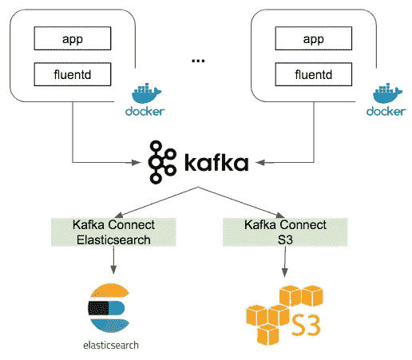

# 使用 Apache Kafka、Kafka Connect 和 Fluentd 的分布式日志分析

> 原文：<https://medium.com/hackernoon/distributed-log-analytics-using-apache-kafka-kafka-connect-and-fluentd-303330e478af>

## 一个实用的流数据基础设施用例


“brown cutted log” by [Tyler Lastovich](https://unsplash.com/@lastly?utm_source=medium&utm_medium=referral) on [Unsplash](https://unsplash.com?utm_source=medium&utm_medium=referral)

在 [Cloudbox Labs](https://cloudboxlabs.com/) ，我们认为日志是一个非常有趣的数据集。它们是我们技术堆栈的核心。它们让我们深入了解用户如何与我们互动。它们提供实时应用智能。因此，我们构建了一套强大的数据基础设施，可以处理来自所有应用程序的大量日志，并允许实时分析和批处理。

对于运行分布式服务的数据处理架构来说，从生产服务中收集和聚合日志可能是一项挑战。对于我们的一些客户，我们部署基于 [Docker](https://docs.docker.com/) 的分布式服务，确保我们从所有容器中捕获日志并将它们路由到各种下游分析引擎的任务变得非常有趣。

我们的日志处理管道使用 [Fluentd](https://docs.fluentd.org/v1.0) 在 Docker 容器内进行统一日志记录，使用 [Apache Kafka](http://kafka.apache.org/documentation/) 作为持久存储和流管道，使用 [Kafka Connect](https://docs.confluent.io/current/connect/index.html) 将日志路由到 [ElasticSearch](https://www.elastic.co/guide/index.html) 进行实时索引和搜索，并使用 S3 进行批量分析和归档。

[Fluentd](https://docs.fluentd.org/v1.0) 是一个开源的统一日志应用，可以智能地收集许多不同类型系统的日志，从 app 日志、nginx 日志到数据库和系统日志。它配有各种插件[用于连接 fluentd 和外部系统。我们将使用其](https://www.fluentd.org/plugins) [Apache Kafka 插件](https://github.com/fluent/fluent-plugin-kafka)以 JSON 格式将日志转发到 Kafka 主题。

[阿帕奇卡夫卡](http://kafka.apache.org/documentation/)几乎无需介绍。这是一个流行的分布式发布-订阅消息平台，提供持久存储和高可伸缩性。在 Kafka 上聚合我们所有的 Docker 容器日志允许我们处理高消息吞吐量，并从那里使用 Kafka Connect 将它们路由到任意数量的下游系统。

[Kafka Connect](https://docs.confluent.io/current/connect/index.html) 是一组[连接器](https://docs.confluent.io/current/connect/managing/connectors.html)的统称，用于连接 Kafka 与外部系统，如 JDBC 数据库、AWS S3、Google Cloud BigQuery 等。每个连接器可以单独安装在 Connect 平台上，用户可以通过 Kafka Connect 上的 REST 接口与连接器进行交互。我们将在日志处理中使用 S3 和 ElasticSearch 连接器。

[Elasticsearch](https://www.elastic.co/guide/index.html) 是一款流行的开源索引和搜索软件。出于我们的目的，我们将把我们的日志下沉并索引到可以实时分析的弹性搜索中。

整体架构是这样的。



在本文中，出于演示目的，我们将使用 [Docker Compose](https://docs.docker.com/compose/overview/) 加速整个日志处理管道，包括 web app、fluentd、kafka、zookeeper、kafka connect 和 elasticsearch。 [Docker Compose](https://docs.docker.com/compose/overview/) 允许我们在隔离的环境中轻松运行多容器 Docker 应用，快速迭代开发。

整个堆栈可以通过使用一个 YAML 文件来创建。下面是[的完整代码](https://github.com/cloudboxlabs/blog-code/blob/master/distributed-logging/docker-compose-dist-logging.yaml)。

关于容器之间的网络，以便它们可以互相交谈。Docker compose 建立了一个每个容器都可以加入的网络。在默认网络中，每个容器都可以通过其容器名称被发现。例如，Kafka bootstrap 服务器可以通过 kafka:9092 访问，Zookeep 可以通过 zookeeper:2181 发现。Docker compose 负责所有底层网络设置。

现在让我们浏览一下我们的 Docker 容器。

1.  为了模拟我们的 web 应用程序，我们简单地创建了一个 Docker 容器，它使用现有的 [httpd 图像](https://hub.docker.com/_/httpd/)运行 Apache HTTP 服务器。它有一个 REST api，每次收到 GET 请求时都会生成日志。我们还将主机端口 8080 映射到容器端口 80，apache 服务器在该端口上运行，因此我们可以在 [http://localhost:8080/上运行 web 应用程序。](http://localhost:8080/.)它还链接 fluentd 容器，以便日志可以跨容器转发。最后，我们设置了一个名为 fluentd 的日志驱动程序，带有一个标签。

2.接下来，我们设置一个运行 fluentd 的容器。我们没有使用现有的 Docker 映像，而是选择运行我们自己的 Docker 文件，这样我们就可以安装 fluentd [kafka 插件](https://github.com/fluent/fluent-plugin-kafka)来将日志转发到我们的 kafka 容器。

我们的 docker 文件如下所示。它运行 fluentd:v0.12-debian 镜像并安装 kafka 插件。

kafka 插件配置文件被挂载到 Docker 容器的/fluentd/conf/fluentd.conf 中。

这很简单。它指定了一个名为 kafka_buffered 的插件类型，因为它将日志缓冲到位于/buffer/td 的本地文件中，并每 3 秒钟将内容刷新到 kafka。在默认网络中，kafka:9092 联系到 Kafka 经纪人。日志以 gzipped JSON blob 的形式发布到 Kafka 主题“log-messages”。

3.接下来，我们使用现有的 Docker 映像设置 Apache Kafka 和 Zookeeper 对作为我们的主要 pubsub 主干。

有趣的是，我们指定 Kafka 应该创建 4 个主题进行处理。

*   log-messages:这是我们所有容器日志的存放位置。出于演示目的，这是一个 1 分区，不兼容的主题。
*   connect-config/offset/status:这 3 个主题由 Kafka connect 使用，它们必须是 Connect 要求的紧凑主题

4.现在是整个堆栈中最有趣的容器。Kafka 连接容器。

在这里，我们以分布式模式运行 Kafka 连接器。分布式模式提供了更多的可伸缩性和容错能力，因为所有的连接器工作人员都可以相互协调。分布式工作者是无状态的，可以通过运行在容器中的 REST api 来控制。Kafka 连接器有丰富的[工人配置选项](https://docs.confluent.io/current/connect/references/allconfigs.html#connect-allconfigs)。这里我们使用无模式 JSON 转换器进行消息解编/序列化。

我们还使用 docker 文件，这样我们就可以安装 Elasticsearch 和 S3 连接器，并将连接器配置安装到容器文件系统上。

Confluent Inc .发布了 Elasticsearch 连接器的 tarball，但是我找不到预打包的 S3 连接器，所以我们打包了自己的连接器，并将 jar 安装在/opt/connectors/connector_jars 中的容器中，Kafka Connect 可以加载它们。

5.最后，我们基于官方 Docker 图像建立了一个 elasticsearch 容器，这样日志就可以被索引和搜索。

现在让我们按照这些简单的步骤来运行日志处理堆栈。

1.  从撰写构建 Docker 映像

```
docker-compose -f docker-compose-dist-logging.yaml build
```

2.运行将设置所有容器的 Docker 映像

```
docker-compose -f docker-compose-dist-logging.yaml up
```

3.Exec 进入 kafka_connect 容器，使用 REST api 添加 Elasticsearch 和 S3 连接器

```
docker-compose -f docker-compose-dist-logging.yaml exec kafka_connect bash>> curl -X POST -H "Content-Type: application/json" --data @/opt/connector_conf/connector_elasticsearch.json [http://localhost:8083/connectors](http://localhost:8083/connectors)>> curl -X POST -H "Content-Type: application/json" --data @/opt/connector_conf/connector_s3.json http://localhost:8083/connectors
```

就是这样！现在有了完整的数据管道，可以从分布式 Docker 容器中收集和聚合日志，并将其发送到 Elasticsearch 进行实时索引和搜索，以及发送到 S3 进行批处理和长期存档。

一如既往，你可以在 [Cloudbox Labs github](https://github.com/cloudboxlabs/blog-code/tree/master/distributed-logging) 上找到这篇文章中讨论的完整代码。