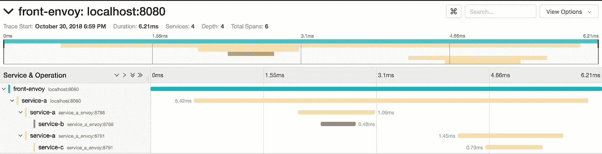

# 使用特使服务网格和 Jaeger 进行分布式跟踪

> 原文：<https://medium.com/hackernoon/distributed-tracing-with-envoy-service-mesh-jaeger-c365b6191592>

如果你是“服务网格”和“特使”的新手，我有一篇文章解释这两者[在这里](/@dnivra26/service-mesh-with-envoy-101-e6b2131ee30b)。

对于微服务架构，可观察性变得非常重要。我想说，如果你想走这条路，这是先决条件之一。我的一个前同事列出了一个令人敬畏的要求清单，如果你想做微服务[这里](https://news.ycombinator.com/item?id=12509533)。

你可以观察到很多东西

*   监视
*   发信号
*   集中伐木
*   分布式跟踪

这篇文章将只讨论特使服务网格环境下的分布式追踪，我试图给出分布式追踪、OpenTracing、特使服务网格和 Jaeger 如何结合在一起的总体情况。在[的下一篇](/@dnivra26/microservices-monitoring-with-envoy-service-mesh-prometheus-grafana-a1c26a8595fc)文章中，我们将与特使服务网讨论关于监听的问题。

## 分布式跟踪

由于有大量的服务和请求来回流动，您需要能够快速找出哪里出了问题，以及出在哪里。分布式追踪因谷歌的 Dapper 而流行。它本质上是在微服务的整个生命周期中跟踪请求的能力。

因此，最简单的方法是在前端代理上生成一个惟一的请求 id (x-request-id ),并将该请求 id 传播给请求与之交互的所有服务。您基本上可以将唯一的请求 id 附加到所有日志消息中。因此，如果您在像 kibana 这样的系统中搜索惟一 id，您将会看到该特定请求的所有服务的日志。

这非常有帮助，但是它不会告诉您请求是以什么顺序完成的，哪些请求是并行完成的，或者每个服务消耗的时间。

让我们看看 OpenTracing 和 Envoy service mesh 如何帮助我们。

## OpenTracing

如果我们能传递更多的数据，比如哪个服务在请求的根级别，哪个服务是哪个服务的子服务，等等，而不是传递一个 id (x-request-id ),我们就能找出所有的答案。标准的方法是开放追踪。它是分布式跟踪的语言中立规范。你可以在这里阅读更多关于规格[的信息。](https://opentracing.io/specification/)

## 特使服务网格

服务网格就像微服务的通信层。服务之间的所有通信都是通过网格进行的。它有助于负载平衡、服务发现、流量转移、速率限制、指标收集等… [Envoy](https://www.envoyproxy.io) 就是这样一个服务网格框架。在我们的例子中，envoy 将帮助我们生成根唯一请求 id (x-request-id)，生成子请求 id，并将它们发送到跟踪系统，如[耶格](https://www.jaegertracing.io/)或[齐普金](https://zipkin.io/)，该系统存储、聚合并具有跟踪的视图层。

在这篇文章中，我们将使用 Jaeger 作为我们的追踪系统。Envoy 可以基于 zipkin 的格式或 lighstep 的格式生成跟踪数据。我们将使用 Zipkin 的标准，它与 Jaeger 兼容。

## 只是给我看代码已经…

下图显示了我们试图构建的内容的概述

Service setup

对于这个设置，我们将使用 docker-compose。您需要为 Envoy 提供一个配置文件。我不打算解释如何配置特使。我们将集中讨论与跟踪相关的部分。你可以在这里找到更多关于配置特使[的信息。](https://www.envoyproxy.io/docs/envoy/latest/configuration/overview/v2_overview)

## 前线特使

前端特使的角色是生成根请求 id，您可以配置特使来生成它。这是前线特使的配置文件

Front Envoy Configuration

第 1–8 行启用跟踪并配置跟踪系统和跟踪系统所在的位置。

第 27–28 行指定了这是传出还是传入流量。

第 38 行提到特使必须生成根请求 id。

第 66–73 行配置 Jaeger 跟踪系统。

启用跟踪和配置 Jaeger 地址将出现在所有 envoy 配置中(前端、服务 a、b 和 c)

## 服务 A

在我们的设置中，服务 A 将调用服务 B 和服务 c。关于分布式跟踪，非常重要的一点是，即使 Envoy 支持并帮助您进行分布式跟踪，**也是由服务将生成的头转发给发出的请求**。因此，我们的服务 A 将在调用服务 B 和服务 C 时转发请求跟踪头。服务 A 是一个简单的 go 服务，只有一个端点在内部调用服务 B 和服务 C。这些是我们需要传递的标题

Forward request tracing headers

您可能想知道为什么在调用服务 b 时 url 是 service_a_envoy。如果您记得我们已经讨论过服务之间的所有通信都需要通过 envoy 代理。因此，类似地，您可以在调用服务 c 时传递消息头。

## 服务 B &服务 C

剩下的两个服务不需要特别修改代码，因为它们是在叶子级别。如果这两个服务要调用其他端点，那么您必须转发请求跟踪头。也没有特使的特别配置。服务 B & C 将如下所示

Service B & C

因此，完成所有这些后，如果运行 docker-compose up 并点击 Front Envoy 端点，就会生成跟踪信息并推送到 Jaeger。Jaeger 有一个非常好的用户界面来显示轨迹，我们的设置的轨迹看起来像这样

trace from Jaeger

如您所见，它提供了总时间、系统每个部分所用的时间、哪个服务调用哪个服务、服务到服务的关系(服务 b 和服务 c 是兄弟)。我会把探索耶格的任务留给你。

你可以在这里找到所有的特使配置，代码和 docker 组成文件

 [## dnivra 26/envoy _ distributed _ tracing

### 使用 envoy、zipkin|jaeger 和 open tracing 进行分布式跟踪的演示-dnivra 26/envoy _ distributed _ tracing

github.com](https://github.com/dnivra26/envoy_distributed_tracing) 

就是这样，伙计们。谢了。请让我知道你的反馈。

如果你正在寻找一个特使 xDS 服务器，我的同事已经建立了[一个](https://github.com/tak2siva/Envoy-Pilot)。一定要去看看。

[这里](/@dnivra26/microservices-monitoring-with-envoy-service-mesh-prometheus-grafana-a1c26a8595fc)是系列的下一篇文章(与特使普罗米修斯&格拉夫纳一起监视)。