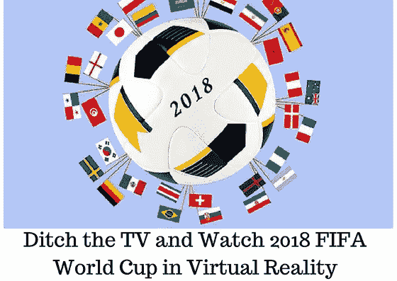

# 抛弃电视，在虚拟现实中观看 2018 年国际足联世界杯

> 原文：<https://medium.com/hackernoon/ditch-the-tv-and-watch-2018-fifa-world-cup-in-virtual-reality-c7ebfc7c3f3a>

有史以来第一次，虚拟现实(VR)正在进入足球场。

现在，您可以使用令人振奋的虚拟现实技术沉浸在 2018 年国际足联世界杯中，并确保您享受这一体验——即使您最喜爱的球队没有带着梦寐以求的奖杯回家。

今年的比赛于 6 月 14 日在俄罗斯开始，将持续到 7 月 15 日。这项四年一度的热门体育赛事预计将吸引约 34 亿观众，几乎是世界人口的一半。

2018 年世界杯的独特之处之一是技术的广泛采用。国际足联引入了不同的技术，以确保今年的世界杯更加令人耳目一新，更具娱乐性。

而且，虚拟现实似乎获得了最多的关注。VR 是旨在通过创造全人工环境来实现完全沉浸感的技术。

有了这项神奇的技术，你可以在一个完全沉浸式的环境中观看世界杯比赛，摆脱电视等传统观看方式。

这里有一些渠道，你可以使用虚拟现实捕捉足球运动。

*   **OCULUS 场馆**

Oculus Venues 是脸书拥有的一款应用程序，允许耳机用户在虚拟现实中一起观看现场活动。

它具有通过语音聊天与其他人进行对话的能力，这使得虚拟现实更具吸引力和社会参与性。

该应用可通过 Oculus Go 耳机或三星 Gear VR 耳机免费获得。

由福克斯体育提供，四场选定的世界杯比赛将在 Oculus 平台上免费直播:德国对墨西哥(6 月 17 日)，葡萄牙对摩洛哥(6 月 20 日)，巴西对哥斯达黎加(6 月 22 日)，以及英格兰对巴拿马(6 月 24 日)。

*   **BBC 体育**

如果你想在 VR 中观看更多的比赛，但没有社交活动的魅力和兴奋，那么 BBC Sport VR 2018 FIFA 世界杯应用程序就是你需要的。

该应用程序将从英国广播公司网络直播 33 场比赛，以及其他有益的行动和亮点，让你以为你去了俄罗斯观看比赛。

BBC Sport VR 应用程序在 Android、iOS 上免费提供，为了增强体验，还可以在 Oculus GO、索尼 PlayStation VR 和 Gear VR 上提供。

*   **TELEMUNDO DEPORTES VR**

Telemundo Deportes VR 应用程序(针对西班牙语用户)将对 2018 年国际足联世界杯的所有 64 场比赛进行[直播](http://blog.liveedu.tv/coding-games/)。这是对这项流行体育赛事最雄心勃勃的虚拟现实报道。

因此，如果你是美国的足球迷，你可以通过虚拟现实应用程序在完全沉浸式的环境中观看整个比赛。

该应用可通过 Gear VR 免费获得。当然，你需要通过付费电视提供商的认证才能享受所有的足球刺激。

*   **其他频道**

此外，这里还有一些其他选择，可以帮助你在虚拟现实中体验观看 2018 年国际足联世界杯:

*   通过 Gear VR 提供的 DIRECTV Sports VR 应用程序将覆盖多个地区，包括智利、哥伦比亚、委内瑞拉和阿根廷。
*   MYTF1 VR 应用程序通过 Gear VR 提供，将向法国的足球爱好者直播。
*   通过 Gear VR 提供的 ERT VR 应用程序将处理希腊的流媒体任务。
*   福克斯体育虚拟现实应用(iOS 和 Android 设备)将允许美国的虚拟足球爱好者观看比赛。
*   SBS 可以通过 Gear VR 获得，将向澳大利亚人转播实时行动。

# 包扎

虚拟现实是一项很有前途的技术，它正在改变我们对世界的看法。

因为国际足联已经在今年的世界杯上采用了它，这表明它在向用户提供个性化、可访问和精心设计的体验方面的影响力越来越大。

你想了解这项令人兴奋的技术吗？您想知道如何使用 VR 概念来创建能够提供沉浸式体验的应用程序吗？

那么， [LiveEdu](https://www.liveedu.tv/guides/vr-and-ar/) 应该是你的首选。你会发现现场直播的实用项目会让你完全沉浸在虚拟世界中。

你打算在虚拟现实中观看 2018 年国际足联世界杯，而放弃你的电视吗？

请在下面的评论区分享你的经历。