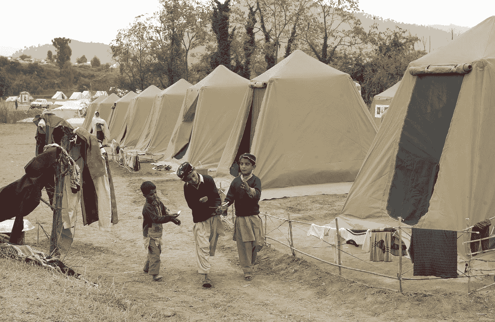
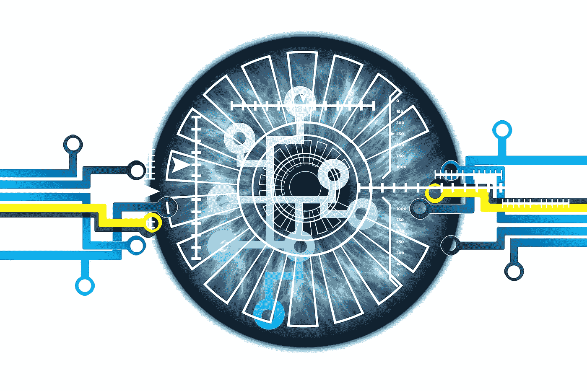

# 潜入运行在区块链上的约旦难民营

> 原文：<https://medium.com/hackernoon/dive-into-the-refugee-camp-in-jordan-that-runs-on-blockchain-924a8fde2d9d>

想象一下，你无法向世界证明你的存在。你活着却无法证明你的物质存在。听起来很恐怖，对吧！但是根据世界银行的数据，世界上有超过 10 亿人没有办法证明他们的身份。

没有合法的身份证明，你就没有任何权利。你不能做很多事情，比如你不能投票，你不能享受政府服务，你不能开车等等。属于这一未经核实的类别的人通常包括难民、无家可归者、被贩卖的儿童以及在社会上没有发展任何机构联系的人。

联合国粮食援助分支机构:世界粮食计划署(World Food Programme)是世界上最大的解决饥饿和促进粮食安全的人道主义组织，它现在打赌，基于以太坊的区块链技术是向难民有效提供援助的关键，与传统方法相比，它可以削减 98%的成本。世界粮食计划署是为数不多的通过其区块链实验为社会带来切实成果的例子之一

这项名为“积木”的计划始于 2017 年初，已帮助 WFP 向约旦的 10 万多名叙利亚难民发放了现金换食品援助。该计划旨在到 2018 年底覆盖该国所有 50 万难民。如果该项目成功，它最终可能会加快区块链技术在联合国姐妹机构和其他机构的采用。

> “我们需要把这个项目从目前的产能提高到很多很多，”领导这个项目的 WFP 高管 Houman Haddad 说。“我指的是每天 100 万笔交易。”

这个名为**积木**的项目是为了每天省钱而启动的。WFP 帮助养活了全球 8000 万人，但自 2009 年以来，该组织已从运送食物转向向需要食物的人转移资金。根据联合国的说法，这种方法可以养活更多的人，改善当地经济，增加透明度。但它也引入了一个显著的低效点:与当地或地区性银行合作。对于 WFP 来说，2017 年转移了超过 13 亿美元的此类福利(约占其援助总额的 30%)，交易和其他费用本来可以用于数百万顿饭。区块链项目的早期结果宣称这些费用减少了 98%。还有许多其他好处，如更快的交易，增加受益人的隐私和更快的账户对账，因为该机构是在自己的支付网络上运行，而不是等待支付公司的定期报告。

WFP 将区块链集成到其生物认证技术中，因此叙利亚难民可以在超市盯着视网膜扫描仪兑现他们的代金券。WFP 目前通过难民营内的超市在约旦难民营内分发食品券。收银员没有配备收银机，而是配备了虹膜扫描仪，通过与各种联合国数据库核对数据，识别客户身份并结算其应得款项。这些交易被记录在一个名为“积木”的私人以太坊区块链上。由于区块链消除了 WFP 为促进交易而向银行付款的需要，仅在约旦，积木盒子每月就可为 WFP 节省多达 15 万美元的银行费用。

> WFP 的执行官 Houman Haddad 说，区块链的这个项目不仅仅是省钱。它将解决任何人道主义危机中的一个核心问题

WFP 解决方案旨在扩展。它使用以太坊代码库的一个“分支”,这个分支已经被工程公司 Parity 修改为私有的，所以交易不会被暴露。这意味着以太坊矿工——增加新的加密货币供应的人——不需要验证这些交易。积木技术首次在巴基斯坦尝试，但该系统建立在区块链的公共以太坊上，导致交易缓慢，费用过高。约旦使用的当前版本的积木运行在许可或私人版本的以太坊上，中央当局决定谁可以参与，WHF 可以更快更便宜地处理交易。

WFP 计划很快在约旦推广这项技术。区块链的这种实际应用让区块链的狂热分子们设想了一个未来，在这个未来，难民不仅可以获得食品券，还可以积累交易历史，当他们试图重新定居时，这些交易历史可以作为信用历史。

除了帮助援助组织节省银行费用并确保援助直接到达难民手中，一个基于区块链的系统还可以帮助难民建立一个更永久的身份。现在，当难民进入联合国难民署管理的难民营时，他们会得到证件，但一旦你离开，就没有办法延长你的难民署身份。但是，通过在区块链上记录这些交易，这保持了不可磨灭的记录，有可能该系统可以在一个新的国家发挥身份识别的作用。

WHF 的目标是在未来实现这样一个目标:难民可以控制自己的密钥来存取他们的资金。这一要素对于使援助更容易和更广泛地获得可能至关重要，因为这些密钥将打开目前滞留在不同援助机构的数据，包括世界卫生组织的医疗记录、联合国儿童基金会的教育证书和 WFP 的营养数据。

## 值得注意的提及

许多组织已经在研究这个想法的各个方面。在芬兰，芬兰移民局向难民提供由赫尔辛基初创公司 MONI 开发的预付万事达卡，该卡还链接到数字身份，由个人金融交易记录组成，存储在区块链上。即使难民没有护照和开设芬兰银行账户所需的文件，MONI 账户也可以让难民直接从政府那里获得福利。该系统还允许他们建立信用记录，这可能使他们获得机构贷款成为可能。

另一个例子是在摩尔多瓦，该国政府正在与联合国项目事务厅(项目厅)的数字身份识别专家合作，寻找新的方法，利用区块链为生活在农村地区的儿童提供数字身份，最终使贩运者更难将他们偷运出境。

纽约市一家名为“区块链改变”的初创公司开发了一款名为 Fummi 的 Android 应用程序，允许无家可归的人进入食品储藏室和避难所，并管理他们的数字身份。

由埃森哲(Accenture)和微软(Microsoft)等大公司与联合国机构、非政府组织和政府组成的联盟 ID2020 正在开发一项技术，该技术将帮助无证人员保护身份元素，从驾驶执照到选民登记。这项任务是向联合国为每个人提供合法身份的目标迈出的一大步，首先是 11 亿缺乏官方认可的生存证明的人。

## 结论

区块链爱好者认为，最终，在区块链追踪身份最终将允许人们对他们的个人信息进行更多的控制。但在急于将区块链技术应用于所有问题的过程中，许多人指出，依赖账本可能会产生意想不到的后果。早期网络的成果应该是区块链爱好者的一个教训，当他们宣传区块链的潜力时。我们有能力设定方向，可能会有危险，但潜力是巨大的。最后，积木或任何类似系统的问题是，它是否会将数字身份证的所有权放在被代表的人手中，或者它们只是成为公司和国家控制人们的数字存在的更容易的方式。

来源:[http://www.worldbank.org/](http://www.worldbank.org/)，[https://www.technologyreview.com/](https://www.technologyreview.com/)