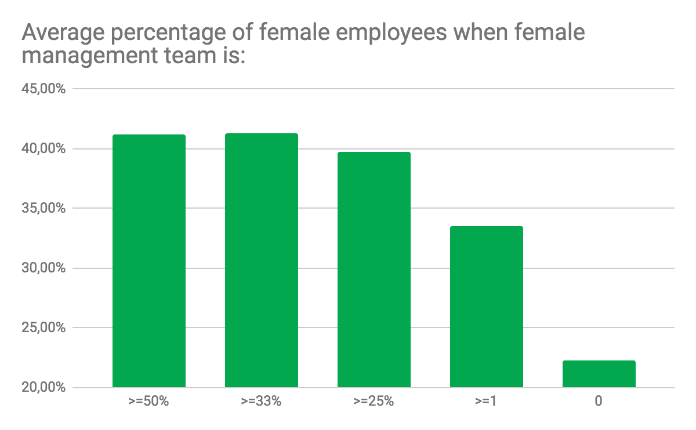
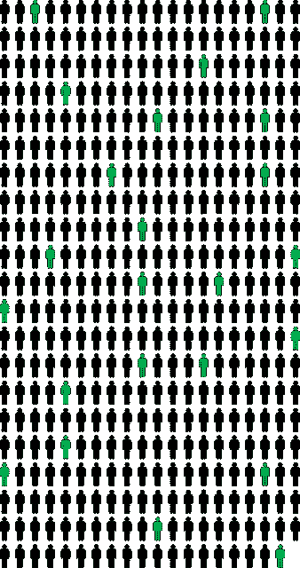

# 欧洲风险投资的多样性——需要做更多的工作。

> 原文：<https://medium.com/hackernoon/diversity-inside-european-vc-more-work-needed-c545353b7e4c>

在过去的 15 年里，[crea dum](http://creandum.com)与早期技术公司和雄心勃勃的企业家合作，从而在塑造未来方面发挥了很小的作用。长久以来，我们也知道女性和少数族裔被系统地排斥在我们的行业之外。多年来，这一直是一个备受关注的问题，到 2018 年，我们希望看到更多的变化。但是希望是不够的。

在你无法改进你没有衡量的东西的前提下，我们开始衡量和分享 Creandum 产品组合中与*性别平等*相关的数字，让自己对公众负责。我们知道多样性有多种形式(例如👩 👱,👴 👵, 🕌 🕍, 🤘🏻🤘🏿)，作为起点，我们选择关注性别。这是小小的第一步，我们希望通过定期衡量这一点，我们将有助于在我们的投资组合公司内部推动这一主题的重要性，从董事会会议室到其他地方，随着时间的推移，我们可以看到积极的趋势。

# 如果你还想知道为什么。

有很多原因可以让科技行业的性别分布更加均衡，人们已经写了很多关于这方面的文章。我们或许可以简单地就这个话题写一个长长的博客系列，但是这里有 Creandum 关注它的三个主要原因。

首先，这样做有商业意义。不是主观的自由主义。这是事实！彼得森国际经济研究所的这份 2016 年工作报告调查了来自 91 个国家的 21，980 家公司，发现女性领导角色与公司绩效之间存在相关性。这篇论文总结道，“这些相关性的估计值并不小:对于盈利的公司来说，从没有女性领导到 30%的代表比例，净收益边际增加了 15%。”

其次，我们重视思想的多样性，以打造最具颠覆性的公司。[我们看到的最强大的公司都有相互挑战的创始人](https://blog.creandum.com/10-years-later-getting-to-know-spotify-before-series-a-2279e7e54be0)，但这样做需要不同观点和信念的创始人。如果你要从零开始，建立一个思想高度多元化的行业来解决新的挑战，你不会只让 27 岁的白人男性从同一所学校毕业。

第三，这是简单的*正确的*事情！♀︎♂︎🦄

# 结果。

正如我们所知，组织受到来自高层的严重影响，我们选择从三个维度来衡量性别多样性——整个组织、管理团队和董事会。我们投资组合中的 46 家公司接受了调查，其中 3 家没有参与研究。

## 整个组织:35%是女性。

在整个投资组合组织中，我们有 5398 名员工。其中 1901 人是妇女，占整个组织的 35%。这个数字应该是 50%才能让我们满意。事实上，当你更深入地观察这些数字时，这样的平均值也会掩盖真实情况。

在这项研究的 43 家投资组合公司中，只有三家公司雇佣了与男性相等或更多的女性，还有三家公司雇佣了 45%或更多的女性。我们为这些打破常规的公司感到兴奋，但我们投资的公司中只有 18 家雇佣了超过三分之一的女性员工。29 家公司只统计女性员工超过 25%。其余公司雇用的男性员工占员工总数的比例压倒性地高…

Distribution of Female (green) to Male (grey) employees in the 43 studied companies in the Creandum portfolio.

## 管理层:21%为女性。

纵观我们投资组合中的所有管理职位，性别多样性比整个组织都要差。我们统计了整个投资组合中的 312 个管理职位，其中 66 个由女性担任，占 21%。

我们认为增加这一数字是最重要的变革。如果我们希望增加其他数字，我们必须从这里开始。如果管理决策完全由男性做出，那么你的组织就不太可能也更难雇佣女性。随着越来越少的女性个人贡献者加入快速增长的初创企业，我们也就越来越少有经验的经营者能够成长为管理者。

数据证明了这一点。在我们的投资组合中，当女性至少占管理职位的三分之一时，我们看到平均 40%的员工是女性，这使数字朝着正确的方向发展。与此同时，我们看到，如果管理团队中没有女性，女性员工的平均比例会减半至 20%左右。高层女性雇佣更多女性。

幸运的是，作为董事会成员，我们经常参与组建投资组合公司的管理团队。因为这个…

> …在 Creandum，我们承诺在我们接触的任何管理团队中推动性别多元化议程，无论是现在还是将来！

## 董事会:女性占 10.5%。

无需多说:我们在 Creandum 的投资组合中拥有 219 个董事会席位。只有 23 个由妇女担任。这太可怕了。

Gender distribution (female in green) across our portfolio company board seats.

数据中一个令人惊讶的细节是，我们没有看到女性董事会成员在提高管理职位或普通员工中女性聘用率方面发挥多大作用——这似乎有太大的差距。但作为董事会成员，我们知道我们需要更多女性同行。

我们还认为，一些最好的董事会成员过去曾担任过管理职务。因此，上述建立性别多元化管理团队的重点也将有助于培养下一代董事会董事。

# 我们是问题的一部分。

Creandum 是问题的一部分。我是问题的一部分。我们每天都会对创始人进行评估，尽管我们经常认为创始人与我们合作是双方共同的决定，但我们确实在决定哪个创始人有机会获得资金、哪个创始人没有机会获得资金方面发挥了作用。

我们也在董事会任职。但是我们的投资部门只有一名女性。尽管我们过去聘用过女性，但这些年来，我们显然没有培养女性风险投资人才，也没有聘用顶级人才担任负责人或合伙人。如果没有这一点，我们将帮助男性获得董事会席位。

因此，我们已经开始实施一些新的流程和策略。我们所有的团队成员都必须经历一次无意识的偏见训练。不管我们愿不愿意承认，我们都有偏见，通过认识到大脑在做决定时走了精神捷径，我们可以更好地迫使自己超越它。

我们还开始每年两次举办多元化研讨会，在研讨会上，我们跟进我们在这一主题上的进展，围绕新的想法和工具进行头脑风暴，以在我们自己的组织和产品组合中培养多元化，并决定团队的明确行动项目和责任。我们还在努力确保任何视觉创意材料(如我们的网站)都是不分性别的展示。我们[还积极推动我们参与的活动](/startup-grind/fighting-inequality-through-silence-1d6fb1201326)中的性别平等。

最后，谈到我们自己的招聘，我们确保我们团队中的女性在招聘过程中发挥非常积极的作用，我们通过主动接触女性和其他代表性不足的群体来扩大我们的人才漏斗。我们认为这里没有灵丹妙药，但我们所有人都必须更加努力工作。

让我们指出，雇佣合适的人从来都不容易，最成功的公司都知道如何不择手段地招聘。但是，如果我们唯一一次思考这个问题是在技术会议上走进人山人海的大门时，我们可以把这个问题推给别人，不做任何改变。我们鼓励整个行业在这个问题上变得更加透明，这样我们才能继续朝着正确的方向前进。

在这个话题上，我们一直在寻找技术领域的聪明女性加入我们的团队以及 Creandum 的投资组合公司。如果有兴趣，请随时在[hello@creandum.com](mailto:hello@creandum.com)联系我们。向前向上！💪👊