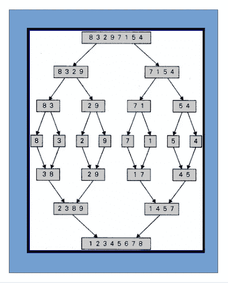
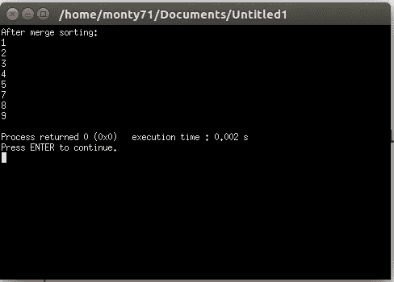

# 分而治之(合并排序)

> 原文：<https://medium.com/hackernoon/divide-and-conquer-merge-sort-11c673470427>


分而治之是一种算法策略，通过将一个问题分解成两个或更多相同或相关类型的子问题，解决它们并添加子问题。让我们弄清楚。在分而治之技术中，我们需要将一个问题分成子问题，递归地解决它们，并组合子问题。所以我们可以假设，为了遵循这个策略，我们需要**将** a 分成一些部分，然后**征服**或者解决这些部分，最后将它们组合起来。因此，我们可以很容易地解决问题。

有许多算法遵循分治技术。如递归二分搜索法、归并排序、快速排序、选择排序、斯特拉森矩阵乘法等。

我想做一个系列，在其中我将讨论一些遵循分而治之策略的算法。

今天我讨论的是归并排序。合并排序是一种排序算法。我们采取分而治之的策略。在归并排序中，我们将把一个数组分成两部分，然后分别排序，最后合并。

首先我们需要输入一个数组。然后，我们将应用以下步骤:

**第一步:**如果数组不超过一个元素，那么数组已经排序过了。

第二步:然后我们将数组中的一半元素保存在一个名为 left 的新数组中，并合并排序后的数组。

**第三步:**然后数组的另一半元素应该保留在右边的数组中，合并排序后的数组。

**第四步:**最后合并两个合并排序后的数组。

假设一个数组有八个元素，分别是 8，3，2，9，7，1，5，4。现在我们将它们分成两部分。那我们就按照之前的步骤来。通过看这些图片，你可以得到一个清晰的解释。



要在程序中应用这些步骤，首先我们需要一个合并排序程序，然后我们需要一个合并程序。所以我们来写程序吧。

**合并排序功能:**

```
//ara is needed to merge sorted
//left is the index of first element
//right is the index of last elementvoid merge_sort (int ara[], int left, int right){if(left >=right)
    {return;}

    //ara is divided into two parts
    // one is from left to mid
    // other is from mid+1 to rightint mid = left+(right-left)/2;
    //applying merge sort from ara[left] to ara[mid]
    merge_sort(ara,left,mid);
    //applying merge sort from ara[mid+1] to ara[right]
    merge_sort(ara,mid+1,right);
    //finally merging them
    merge(ara,left,mid,right);}
```

然后我们需要做一个**合并函数**。

```
void merge(int ara[],int left,int mid,int right)
{int i;
    int index_a, index_l, index_r;
    int size_left, size_right;
    size_left = mid - left + 1;
    size_right = right - mid;
    int L [size_left], R[size_right];

    //copying from ara[left] to ara[mid]
    for(i=0;i<size_left;i++)
    {L[i]=ara[left+i];}

    ////copying from ara[mid+1] to ara[right]
    for(i=0;i<size_right;i++)
    {R[i]=ara[mid+1+i];}
    index_l = 0;
    index_r = 0;
    for(index_a = left;
    index_l < size_left && index_r < size_right;
    index_a++)
    {if(L[index_l]<R[index_r])
        {ara[index_a] = L[index_l];
            index_l += 1;}
        else
        {ara[index_a] = R [index_r];
            index_r += 1;}}while (index_l < size_left)
    {ara[index_a] = L [index_l];
        index_l += 1;
        index_a += 1;}
     while (index_r < size_right)
    {ara[index_a] = R [index_r];
        index_r += 1;
        index_a += 1;}}
```

最后，该计划将是:

```
#include <iostream>using namespace std;void merge(int ara[],int left,int mid,int right);//ara is needed to merge sorted
//left is the index of first element
//right is the index of last elementvoid merge_sort (int ara[], int left, int right){if(left >=right)
    {return;}//ara is divided into two parts
    // one is from left to mid
    // other is from mid+1 to rightint mid = left+(right-left)/2;
    //applying merge sort from ara[left] to ara[mid]
    merge_sort(ara,left,mid);
    //applying merge sort from ara[mid+1] to ara[right]
    merge_sort(ara,mid+1,right);
    //finally merging them
    merge(ara,left,mid,right);}void merge(int ara[],int left,int mid,int right)
{int i;
    int index_a, index_l, index_r;
    int size_left, size_right;
    size_left = mid - left + 1;
    size_right = right - mid;
    int L [size_left], R[size_right];//copying from ara[left] to ara[mid]
    for(i=0;i<size_left;i++)
    {L[i]=ara[left+i];}////copying from ara[mid+1] to ara[right]
    for(i=0;i<size_right;i++)
    {R[i]=ara[mid+1+i];}
    index_l = 0;
    index_r = 0;
    for(index_a = left;
    index_l < size_left && index_r < size_right;
    index_a++)
    {if(L[index_l]<R[index_r])
        {ara[index_a] = L[index_l];
            index_l += 1;}
        else
        {ara[index_a] = R [index_r];
            index_r += 1;}}while (index_l < size_left)
    {ara[index_a] = L [index_l];
        index_l += 1;
        index_a += 1;}
     while (index_r < size_right)
    {ara[index_a] = R [index_r];
        index_r += 1;
        index_a += 1;}}
int main()
{int i, n = 7;
    int ara[] = {8,3,2,9,7,1,5,4};
    cout<<"After merge sorting:"<<endl;
    merge_sort(ara,0,n);
    for(i=0; i<=n; i++)
    {cout<<ara[i]<<endl;}
    return 0;}
```

我们将得到如下输出:



**合并排序的复杂度:**

这里，我们将数组分为两部分。所以它的复杂性在于

o(日志 *n* )。但是我们也合并了他们。对于 merge()函数，复杂度是 O( *n* )。

所以归并排序的复杂度是 O((log *n* ) x *n* )或者 O( *n* log *n)。*

编码快乐！

**参考:**

[电脑编程](http://dimik.pub/book/245/computer-programming-3-data-structure-algorithm-by-tamim-shahriar)由[塔米姆·沙里亚尔·苏宾](https://medium.com/u/efa50d3355e6?source=post_page-----11c673470427--------------------------------)

迪米克的孟加拉语编程书籍改变了我的生活。

感谢[塔米姆·沙里亚·苏宾](https://medium.com/u/efa50d3355e6?source=post_page-----11c673470427--------------------------------)瓦伊亚:)