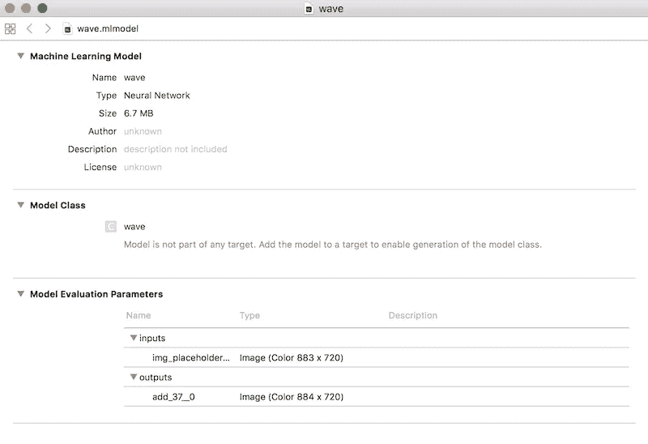

# DIY Prisma，快速风格转换应用程序—使用 CoreML 和 TensorFlow

> 原文：<https://medium.com/hackernoon/diy-prisma-fast-style-transfer-app-with-coreml-and-tensorflow-817c3b90dacd>


使用 CoreML、快速风格转换和 TensorFlow 创建一个类似 Prisma 的 iOS 应用程序。

## 目录:

*   介绍和设置
*   初步步骤
*   CoreML 转换
*   iOS 应用程序

# 介绍

本教程的基础来自 [Prisma Lab 的博客](https://blog.prismalabs.ai/diy-prisma-app-with-coreml-6b4994cc99e1)和他们的 PyTorch 方法。但是，我们将对模型使用 TensorFlow，特别是 Logan Engstrom 的[快速风格转移](https://github.com/lengstrom/fast-style-transfer)，这是一个 [MyBridge Top 30 (#7)](https://medium.mybridge.co/30-amazing-machine-learning-projects-for-the-past-year-v-2018-b853b8621ac7) 。

本教程的结果将是一个可以使用 CoreML 运行 TensorFlow 模型的 [iOS](https://hackernoon.com/tagged/ios) 应用程序。 [**这里是 GitHub repo**](https://github.com/mdramos/fast-style-transfer-coreml)**—这也包含了对 fst & tf-coreml 的所有调整和添加。**

**是什么让这成为可能？**

*   **[斯坦福研究公司](http://cs.stanford.edu/people/jcjohns/eccv16/)**
*   **[快速风格转换](https://github.com/lengstrom/fast-style-transfer)**
*   **[苹果的 CoreML](https://developer.apple.com/documentation/coreml)**不支持 TensorFlow***
*   **[Google 发布 tensor flow Lite](https://www.tensorflow.org/mobile/tflite/)**不支持 CoreML***
*   **[谷歌发布 CoreML 支持](https://developers.googleblog.com/2017/12/announcing-core-ml-support.html)**不提供全面支持***
*   **我们做了一些调整，拼凑出一个解决方案**

# **设置**

****模型:**我们将使用 fst 的预训练模型，定制模型也可以(你需要做一些小的调整，我会注意到的)。[下载预先训练好的模型。](https://drive.google.com/drive/folders/0B9jhaT37ydSyRk9UX0wwX3BpMzQ?usp=sharing)**

****快速风格转换:**[https://github.com/lengstrom/fast-style-transfer](https://github.com/lengstrom/fast-style-transfer)**如果需要，克隆并运行设置***

****TensorFlow:** 使用 fst，我使用 TensorFlow 1.0.0 取得了最大的成功，而使用 tf-corml，你需要 1.1.0 或更高版本**本教程不需要使用 GPU***

**【https://github.com/tf-coreml/tf-coreml】**安装说明***

****iOS:**11**Xcode:**9
Python:2.7**

# **初步步骤**

**我们需要做一些准备工作，因为快速风格转移更多的是一个研究实现，而不是为重用和生产而做的(没有命名约定或输出图)。**

****步骤 1:** 第一步是为我们的图找出输出节点的名称；未明确设置时，TensorFlow 会自动生成此值。我们可以通过在 evaluate.py 脚本中打印 net 来获得它。**

**之后，我们可以运行脚本来查看打印输出。我在这里使用的是预先训练好的模型*波*。如果你使用定制模型，检查点参数只需要是你的元文件和输入文件所在的目录。**

```
$ python evaluate.py --checkpoint wave.ckpt --in-path inputs/ --out-path outputs/ > Tensor(“add_37:0”, shape=(20, 720, 884, 3), dtype=float32, device=/device:GPU:0)
```

**这里唯一重要的数据是输出节点名，即 **add_37** 。这是有意义的，因为网络中最后一个未命名的操作符是加法。**

****第二步:**我们需要对 evaluate.py 再做一些补充，这样就可以把图形保存到磁盘上了。请注意，如果您使用自己的模型，您将需要添加代码来满足检查点目录条件，而不是单个检查点文件。**

****第三步:**现在我们在一个模型上运行 evaluate.py，我们将保存我们的图形文件。* *在训练模型时，我们可能会使用大于 1 的批处理大小以及 GPU，但是 CoreML 只接受输入大小为 1 的图形，以及 CPU 优化—请注意要调整的 evaluate 命令。***

```
$ python evaluate.py --checkpoint wave/wave.ckpt --in-path inputs/ --out-path outputs/ --device “/cpu:0” --batch-size 1
```

**太棒了，这创建了 output_graph.pb &我们可以继续进行 CoreML 转换了。**

# **CoreML 转换**

**感谢 [google](https://hackernoon.com/tagged/google) ，现在有了一个 TensorFlow 到 CoreML 的转换器:[https://github.com/tf-coreml/tf-coreml](https://github.com/tf-coreml/tf-coreml)。这很棒，但是实现是新的，缺少一些核心的 tf 操作，比如 *power。***

****第一步:**我们的模型如果不增加对 *power、*的支持就不会转换，但幸运的是苹果的 [coremltools 提供了支持 power 的一元转换](https://apple.github.io/coremltools/generated/coremltools.models.neural_network.html?highlight=add_unary#coremltools.models.neural_network.NeuralNetworkBuilder.add_unary)。我们需要将这段代码添加到 TensorFlow 的实现中。以下是你需要添加的 3 个文件的要点。**

****步骤 2:** 创建并运行转换脚本**

```
$ python convert.py
```

****

**实际的 CoreML 转换器不提供从模型输出图像的功能。图像由 NumPy 数组(多维数组)表示，这是实际的输出，并在 Swift 中编译成非标准类型的多数组。我在网上搜索帮助，找到了一些评估 CoreML 输出的图形的代码，然后遍历它，将输出类型转换成图像。**

****步骤 3:** 在上面输出的模型(my_model.mlmodel)上创建并运行输出转换脚本。**

```
$ python output.py
```

**还有…..🎉💥🤙 …..我们有一个工作的 CoreML 模型。* *我在输出脚本中将它的名称改为“wave ”,图像大小也与评估输入相对应。***

****

# **iOS 应用程序**

**与其说这是一个 iOS 教程，不如说你会想与我的回购工作。这里我只涉及重要的细节。**

****步骤 1:** 将模型导入到您的 Xcode 项目中。确保将它们添加到目标中。**

****步骤 2:** 导入后，您将能够实例化模型，如下所示:**

****第三步:**为模型输入参数创建一个类，这个类是 MLFeatureProvider。 **img_placeholder 是评估脚本*中定义的输入**

**第四步:现在我们可以在代码中调用这个模型了。**

****最终:**app 剩下的只是设置和图像处理。没什么新的或者和 CoreML 直接相关的，这里就不赘述了。此时，您将会很好地理解所有东西是如何组合在一起的，并且应该能够进一步创新。我认为 fst 的图表还有改进的余地。我们应该能够剔除过度设计的操作，让 iOS 上的风格转换更快。但是现在一切都很好。**

****

**✌️🤙**

> **跟我来**