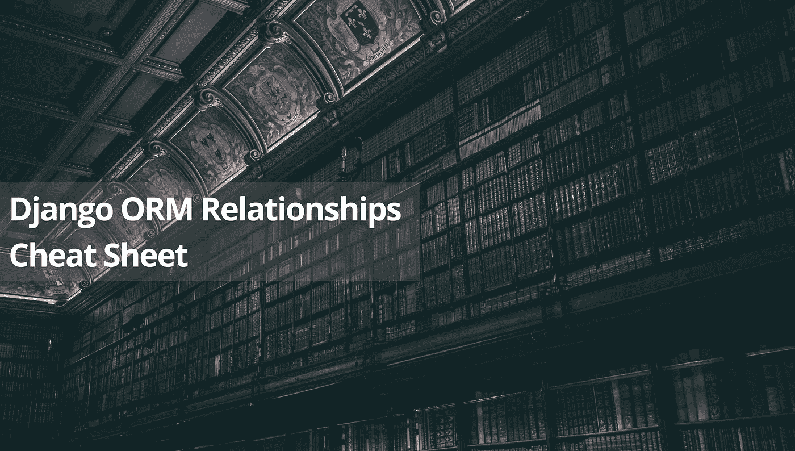
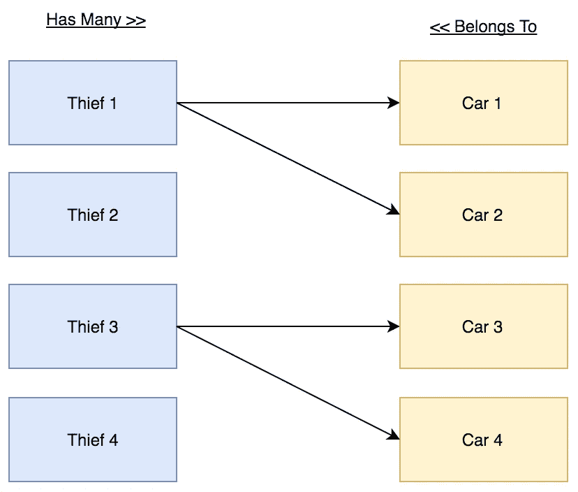
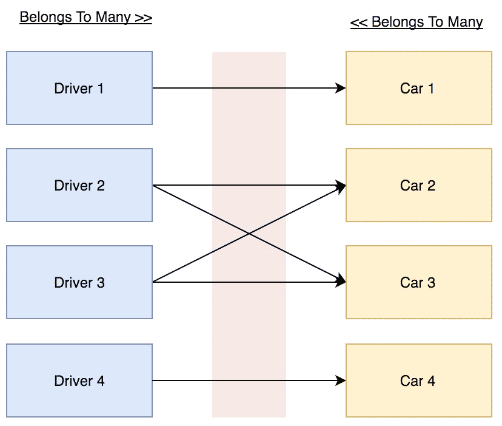
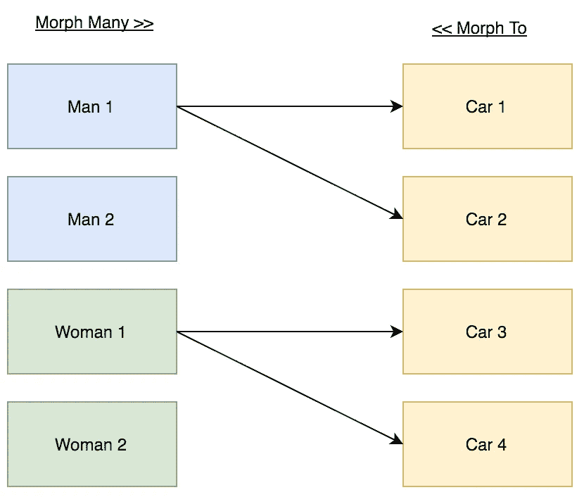
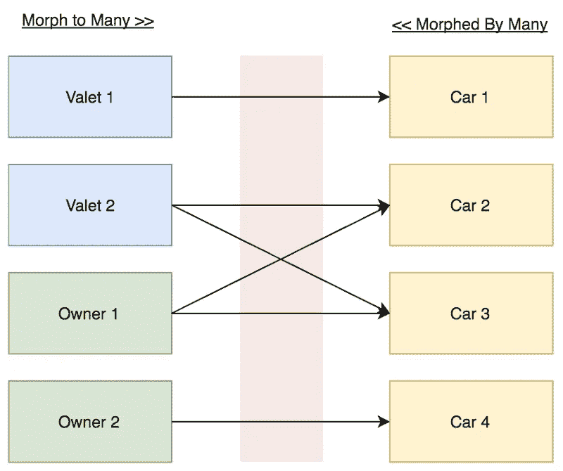

# Django ORM 关系备忘单

> 原文：<https://medium.com/hackernoon/django-orm-relationships-cheat-sheet-14433d6cf68c>



Credits — author : Jez Timms; illustrator : Tatuna Gverdtsiteli

Django ORM 关系的备忘单—版本 2.1

我想以感谢 name = models.CharField(max_length=255)*class* Car(models.Model):

#...
name = models.CharField(max_length=255)
owner = models.OneToOneField(
Owner,
on_delete=models.CASCADE,
related_name='car'
)

## 商店记录:

```
car = Car.objects.get(id=1)
owner  = Owner.objects.get(id=1)# Create relation between Owner and Car.owner.car = car
owner.car.save()# Create relation between Car and Owner.car.owner = owner
car.save()
```

## 检索记录:

```
# Get Owner Carowner.car # Get Car Ownercar.owner;
```

# 一对多关系

## 演示详情:

在这个演示中，我们有 2 个模型(**小偷**和**汽车**，以及 2 个表(**小偷**和**汽车**)。

## 业务规则:

**小偷**可以偷很多**车**。
汽车**汽车**可以被一个**小偷**偷走。

## 关系图:



## 关系详情:

**汽车**表应该存储**小偷 ID** 。

## 型号:

```
*class* Thief(models.Model):

    # ...
    name = models.CharField(max_length=255) *class* Car(models.Model):

    # ...
    name = models.CharField(max_length=255)
    thief = models.ForeignKey(
        Thief,
        on_delete=models.CASCADE,
        related_name='cars'
    )
```

## 商店记录:

```
thief  = Thief.objects.get(id=1)
car1 = Car.objects.get(id=1)
...# Create relation between Thief and Car.thief.cars.add(car1,car2, car3)# Create relation between Car and Thief.car.thief = thief
car.save()# When we creating new car : 
car = Car(name = 'test name', thief=thief)
car.save()
```

## 检索记录:

```
# Get Thief Car thief.cars.all()# Get Car Thiefcar.thief
```

# 多对多关系

## 演示详情:

在这个演示中，我们有 2 个模型( **Driver** 和 **Car)、**和 3 个表( **drivers** 、 **cars** 和一个名为 **car_drivers** 的数据透视表)。

## 业务规则:

**司机**可以驾驶多辆**车**。
**车**可以由很多**司机**驾驶。

## 关系图:



## 关系详情:

**Pivot** 表“car_driver”应该存储**司机 ID** 和**汽车 ID** 。

## 型号:

```
*class* Driver(models.Model):

    # ...
    name = models.CharField(max_length=255)*class* Car(models.Model):

    # ...
    name = models.CharField(max_length=255)
    drivers = models.ManyToManyField(
        Driver,
        related_name='cars'
    )
```

## 商店记录:

```
# Create relation between Driver and Car.driver  = Driver.objects.get(id=1)
car1 = Car.objects.get(id=1)
car2 = Car.objects.get(id=2)driver.cars.add(car1,car2)# Create relation between Car and Driver.
car = Car.objects.get(id=1)
driver1  = Driver.objects.get(id=2)
driver2  = Driver.objects.get(id=3)

car.drivers.add(driver1, driver2)
```

## 检索记录:

```
# Get Driver Cardriver.cars.all()# Get Car Driverscar.drivers.all()
```

# 多态一对多关系

**与 Django 的类属关系**

## 演示详情:

在这个演示中，我们有 3 个模型(**男人、女人**和**汽车)、**和 3 张桌子(**男人**、**女人**和**汽车**)。

## 业务规则:

这个**人**(买家)可以买很多**车**。
那个**女人**(买家)可以买很多**车**。
汽车**汽车**可以由一个买家(**男**或**女**)购买。

## 关系图:



## 关系详情:

**汽车**表应存储**采购员 ID** ，采购员表应存储 **ID** 和**类型**之间的关系。

## 型号:

```
*from* django.contrib.contenttypes.fields *import* GenericForeignKey
*from* django.contrib.contenttypes.fields *import* GenericRelation
*from* django.contrib.contenttypes.models *import* ContentType*class* Car(models.Model): # ...
    name = models.CharField(max_length=255) content_type = models.ForeignKey(ContentType,         on_delete=models.CASCADE)
    object_id = models.PositiveIntegerField()
    content_object = GenericForeignKey()*class* Woman(models.Model): # ...
    name = models.CharField(max_length=255)
    cars = GenericRelation(Car)*class* Man(models.Model): # ...
    name = models.CharField(max_length=255)
    cars = GenericRelation(Car)
```

## 商店记录:

```
man = Man.objects.get(id=1)
woman = Woman.objects.get(id=1)# Create relation between buyer (Man/Woman) and Car.car = Car.objects.get(id=1)
woman.cars.add(car)# Create relation between Car and buyer (Men/Women).man = Man.objects.get(id=1)
woman = Woman.objects.get(id=1)c = Car(name = 'test name',content_object=man)
c.save()c = Car(name = 'test name',content_object=woman)
c.save()
```

## 检索记录:

```
# Get buyer (Man/Woman) Carsman.cars.all()
woman.cars.all()# Get Car buyer (Man and Woman)car.content_object
```

# 多态一对多关系

**同包——**[**姜戈——多态**](https://github.com/django-polymorphic/django-polymorphic) **。**

## 演示详情:

在这个演示中，我们有 4 个模型(**买家**、**男人、女人**和**汽车)、**和 4 张桌子(**买家**、**男人**、**女人**和**汽车**)。

## 业务规则:

**人**(买家)可以买很多**车**。
**女**(买家)可以买很多**车**。
**车**可以由一个买家(**男**或**女**)购买。

## 关系图:


## 关系详情:

**汽车**表应存储**采购员 ID** ，采购员表应存储 **ID** 和**类型**之间的关系。

## 型号:

```
*from* polymorphic.models *import* PolymorphicModel*class* Buyer(PolymorphicModel):
    *pass

class* Woman(Buyer):

    # ...
    name = models.CharField(max_length=255)

*class* Man(Buyer):

    # ...
    name = models.CharField(max_length=255)

*class* Car(models.Model):

    # Fields

    name = models.CharField(max_length=255)
    buyer = models.ForeignKey(
        Buyer,
        on_delete=models.CASCADE,
        related_name='cars'
    )
```

## 商店记录:

```
man = Buyer.objects.get(id=1) # or Man.objecets.get(id=1)
woman = Buyer.objects.get(id=2) # or Woman.objecets.get(id=2)# Create relation between buyer (Man/Woman) and Car.man.cars.add(car1, car2)woman.cars.add(car1, car2)# Create relation between Car and buyer (Men/Women).c = Car(name = 'test name', buyer = man)
c.save()c = Car(name = 'test name', buyer = woman)
c.save()
```

## 检索记录:

```
# Get buyer (Man/Woman) Carsman.cars.all()
woman.cars.all()# Get Car buyer (Man and Woman)car.buyer
```

# 多态多对多关系

**同包—**[**django—多态**](https://github.com/django-polymorphic/django-polymorphic) **。**

## 演示详情:

在这个演示中，我们有 3 个模型(**男仆、车主**和**汽车)、**和 4 张桌子(**男仆**、**车主、** **汽车**和**司机**)。

## 业务规则:

**代客**(司机)可以开多辆**车**。
**车主**(司机)可以开多辆**车**。
**车**可由多名司机驾驶(**代客**或/和**车主**)。

## 关系图:



## 关系详情:

**Pivot** 表“drivers”应存储 **Driver** **ID** 、 **Driver** **Type** 和 **CarID** 。
*“司机”是对一群模特(代客和车主)的称呼。而且不限于两个。驱动类型是模型的真实名称。*

## 型号:

```
*from* polymorphic.models *import* PolymorphicModel*class* Driver(PolymorphicModel):
    *pass* *class* Owner(Driver):

    # ...
    name = models.CharField(max_length=255)

*class* Valet(Driver):

    # ...
    name = models.CharField(max_length=255)

*class* Car(models.Model):

    # ...

    name = models.CharField(max_length=255)
    drivers = models.ManyToManyField(
        Driver,
        related_name='cars'
    ) 
```

## 商店记录:

```
# Create relation between driver (Valet/Owner) and Car.owner.cars.add(car1, car2)# Create relation between Car and driver (Valet/Owner).car.drivers.add(owner, valet)
```

## 检索记录:

```
# Get driver (Valet/Owner) Carsvalet.cars.all()
owner.cars.all()# Get Car drivers (Valet and Owner)car.drivers.all()
car1.drivers.instance_of(Valet)
car1.drivers.instance_of(Owner)
```

我也强烈推荐阅读[文章](/@MicroPyramid/django-generic-many-to-many-field-implementation-dd53ad642473)，它描述了与另一个 django 包(django-gm2m)的多态多对多关系。

感谢阅读并停留在[触摸](https://twitter.com/entGriff)。