# DL06:深梦(附代码)

> 原文：<https://medium.com/hackernoon/dl06-deepdream-with-code-5f735052e21f>

DeepDream 解释(用 PyTorch 代码)

往期帖子:
[DL01:神经网络理论](https://hackernoon.com/dl01-writing-a-neural-network-from-scratch-theory-c02ccc897864)
[DL02:从零开始编写神经网络(代码)](https://hackernoon.com/dl02-writing-a-neural-network-from-scratch-code-b32f4877c257)
[DL03:梯度下降](https://hackernoon.com/dl03-gradient-descent-719aff91c7d6)
[DL04:反向传播](https://hackernoon.com/dl04-backpropagation-bbcfbf2528d6)
[DL05:卷积神经网络](https://hackernoon.com/dl05-convolutional-neural-networks-1d3bb7fff586)

# 代码可以在这里找到[。](https://github.com/thesemicolonguy/deep-dream-pytorch)

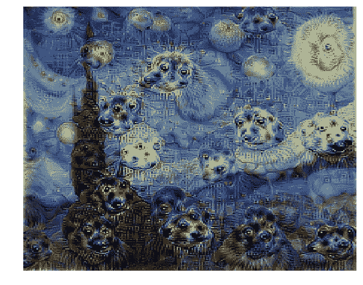

Image generated by my code

## 什么是 DeepDream？

这是一个有趣的算法来生成迷幻般的图像。它也给了一种感觉，什么特征，CNN 的特定层已经学会了。这是一种可视化预先训练的 CNN 层的方法。

## 它是如何工作的？

使用基本图像，该图像被馈送给预先训练的 CNN(它甚至可以是随机噪声)。然后，向前传递直到特定层。现在，为了了解这一层学到了什么，我们需要通过这一层最大化激活。

该层的梯度被设置为等于来自该层的激活，然后在输入图像上进行梯度上升。这最大化了该层的激活。

然而，只做这么多并不能产生好的图像。各种技术被用来使结果图像更好。高斯模糊可以使图像更平滑。

使图像更好的一个主要概念是使用**八度音阶**。输入图像被反复缩小，并且梯度上升被应用到所有图像，然后结果被合并到单个输出图像中。下图将有助于更好地理解八度音阶:

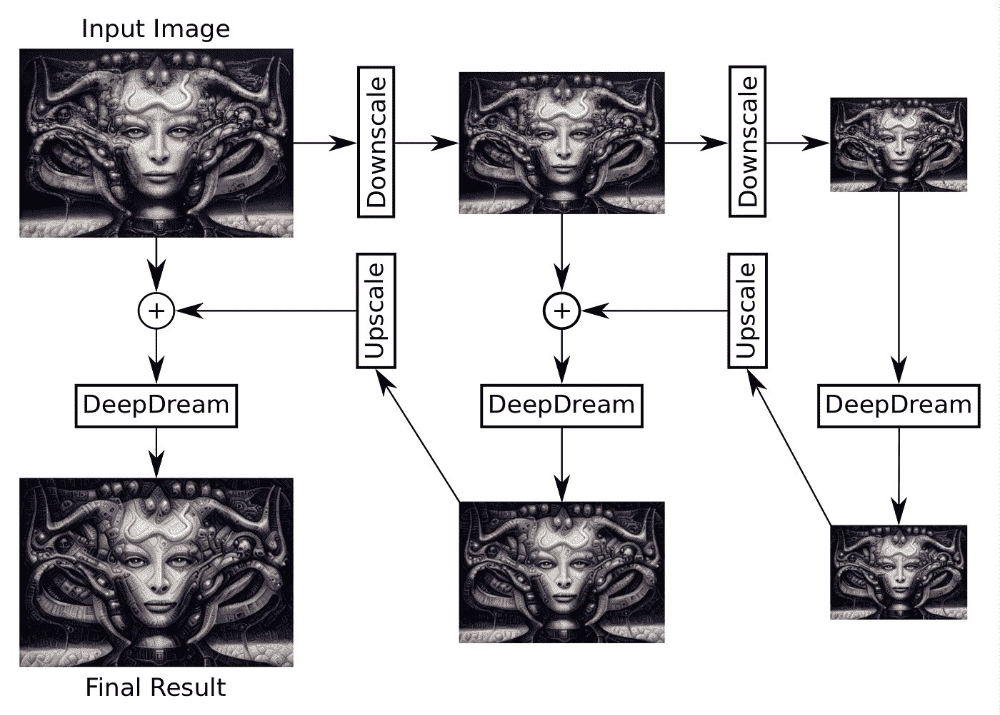

Source: [https://www.youtube.com/watch?v=ws-ZbiFV1Ms&t=35s](https://www.youtube.com/watch?v=ws-ZbiFV1Ms&t=35s)

## 代码？

我用 VGG16 创建了这些 DeepDream 可视化。

该代码主要有两个功能:

*   dd_helper:这是实际的 deep_dream 代码。它获取一个输入图像，向前传递到一个特定的层，然后通过梯度上升更新输入图像。

*   deep_dream_vgg:这是一个**递归**函数。它反复缩小图像，然后调用 dd_helper。然后，它对结果进行升级，并将其合并(混合)到递归树上更高一级的图像中。最终图像与输入图像的大小相同。

# 不同 conv 层的输出(从浅层到深层):

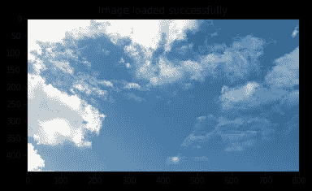

Input image

> 注意，浅层学习基本的形状、线条和边缘。之后，层学习模式。更深的层次学习更复杂的特征，如眼睛、脸等。

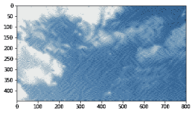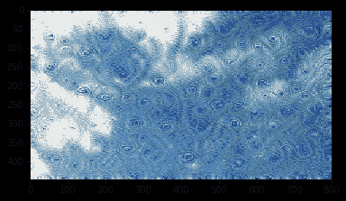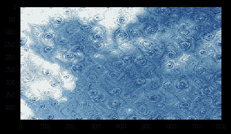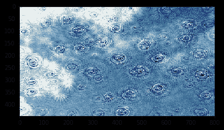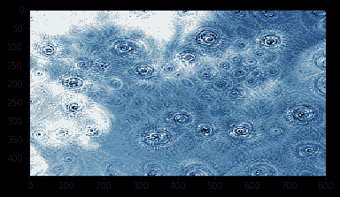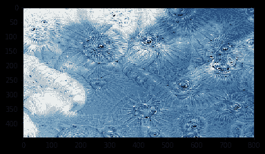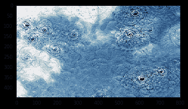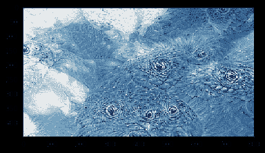

# 如果你喜欢这个，给我一个 Github 上的⋆！