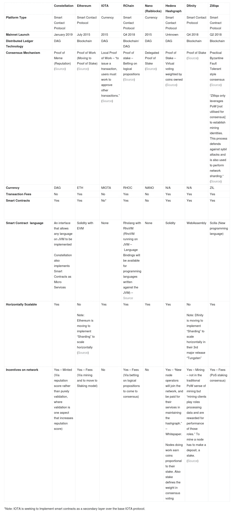
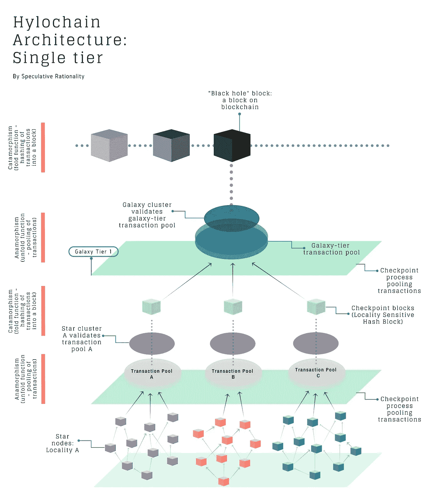
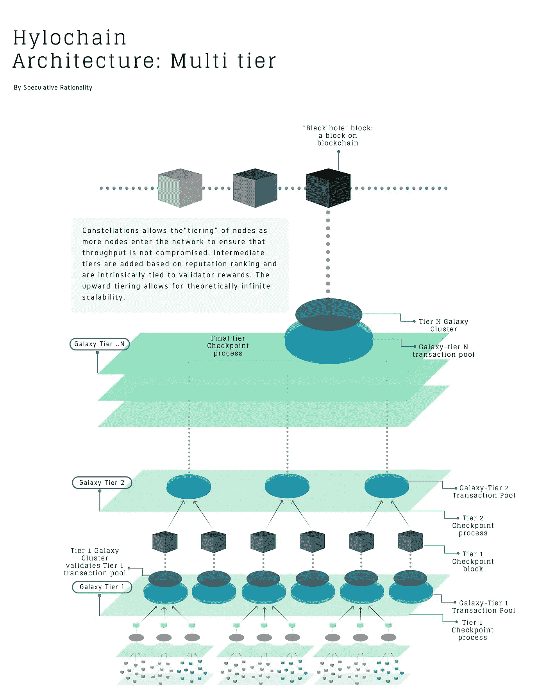
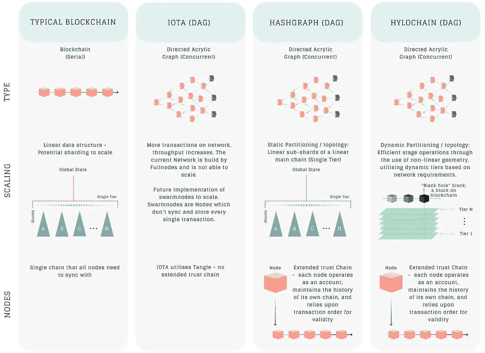
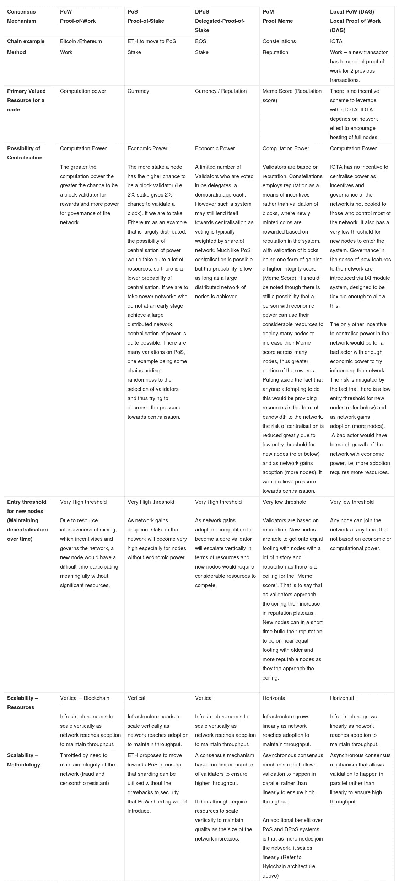

# 星座|通过 HyloChain 共识架构进行扩展

> 原文：<https://medium.com/hackernoon/dlt-scaling-through-the-hylochain-consensus-architecture-6970b1773c5b>

声明:投机理性只关注和报道我们相信、已经投资或计划投资的项目。以下信息旨在保持公正；然而，这不是投资建议。尽职调查。祝你好运！

请将本文内容和图片的来源归于

**— — — — — — — — — — — — — — — — — — — — — — — — — — — — — — —**

**推荐阅读以帮助更好地了解这篇文章:**

*   ****深度阅读:** [白皮书](https://github.com/Constellation-Labs/Whitepaper)**
*   ****补充阅读:** [TreeReduce 和 TreeAggregate 揭秘](https://umbertogriffo.gitbooks.io/apache-spark-best-practices-and-tuning/content/treereduce_and_treeaggregate_demystified.html)**
*   ****视频采访:** [Constellation 高管与 BlockchainBrad 谈论他们的横向可扩展分布式操作系统](https://youtu.be/zldK1_-oc14)**

**随着分布式账本技术(DLT)逐渐走向成熟，可扩展性是其面临的最大挑战之一。人们投入了大量精力来寻找合适的解决方案，提出了多种形式的建议——从第二层解决方案、备选共识方法，甚至到备选数据结构。如何扩大一个真正去中心化的公共账本，这个问题仍然没有一个明确的答案。**

**到目前为止，区块链一直是故事的中心，比特币和以太坊在吸引人们对这个领域的关注方面发挥了重要作用。随着对区块链网络需求的增长，我们看到了关于如何最好地扩展这些网络的激烈辩论，有时会出现分歧。一类解决方案是实施“2 级解决方案”，如 Lightning 和 Plasma，它们“离线”承担增加的交易量或计算复杂性的负担。另一类解决方案是推动共识机制，这种机制比工作链证明更容易扩展解决方案；最流行的替代共识方法之一是利益证明(PoS ),以太坊等巨头在未来的升级中转向 PoS 模式，以期实现分片。**

**也许最有趣的提议之一是远离区块链本身，用新颖和新的数据结构在不同程度上摆脱传统的区块链架构。有向无环图(Dag)是另一种 DLT 体系结构的一个例子；DAG 本身并不是同质的，各种迭代表现出它们自己，并且出现了不同的达成共识、安全性和适应性的方法。**

**Constellation 是一个引入 DAG 空间的新项目——Hylochain，一个轻量级的 consensus 架构。Hylochain 将基于声誉的共识模型与有向无环图(DAG)数据结构相结合。下表说明了星座在当前环境中的位置。**

****

**View Table: [Projects Comparison](http://spec-rationality.com/constellation/#table1)**

**在 DAG 架构的背景下，Constellation 特别值得注意的是，它引入了一种有趣的新共识方法，称为“模因证明”,并以微服务的形式实现了智能合同。本文将有助于说明 Hylochain Consensus 架构及其独特的属性，后续文章将介绍智能契约作为微服务的实现。**

# **实现可伸缩性:Hylochain 共识架构**

**星座共识架构的显著特征:**

*   ****HyloChain** — Hylochain 得名于潜在一致性架构中使用的基因多态性功能。一个技术描述——同形是一个递归函数，对应于一个变形的合成(它首先构建一组结果；也称为“展开”)，然后是变形(然后将这些结果折叠成最终返回值)。将这两个递归计算融合到一个递归模式中避免了构建中间数据结构。Hylochain 还利用网络内节点的动态分区(共识协议之上的第二个协议)来确保网络始终以最佳状态工作。**
*   ****ExtendedTrustChain** —实现多种节点类型的架构，每种节点类型在网络中都有自己的职责和角色，以异步管理协议的不同方面。标准节点、检查点节点和验证器节点。在 ExtendedTrustChain 中，每个节点作为一个帐户运行，维护自己链的历史，并依赖事务顺序来保证有效性(类似于 HashGraph)。([白皮书](https://github.com/Constellation-Labs/Whitepaper))**
*   ****模因证明—** 基于声誉的共识机制**
*   ****MapReduce** —将计算分解为简单操作的过程，这些操作可以被送入异步 DAG 计算，从而提高已经并发的程序的效率。**
*   ****八卦协议** —允许大型网络在比现有区块链技术高几个数量级的规模上传达整个网络状态。**

**星座中的共识在实践中是什么样子的？**

***“一轮共识取得前一轮的结果散列块，并将其作为常规事务添加到事务池。事务池的填充与展开操作是同构的。一旦这个检查点块被前一轮加上新的事务填充，它就被散列。这与折叠操作是同构的。*——[白皮书](https://github.com/Constellation-Labs/Whitepaper)**

**为了形象化这一过程，让我们来看看在整个共识过程中采取的必要步骤。**

**下图说明了以下步骤:**

1.  **Bob 是一个**星形节点**，他的交易记录在他的节点的本地分类账上，所有与网络的交互也是如此。**
2.  **交易由发起者(Bob)和交易对手签署，然后广播到网络(通过 gossip)**
3.  **该消息与其他八卦消息一起汇集到本地事务池中(变形—展开)**
4.  **由选择参加共识的恒星形成的**恒星簇**形成位置敏感散列块。它通过对所有事务及其在事务池中出现的顺序达成一致来形成块，并将其散列到一个位置敏感的(属于一个区域)散列块中。局部敏感散列块是事务池的变形(折叠)函数，它也包括前一个块的变形值。**
5.  **随着位置敏感散列块被向上传播，它们被汇集到更高层的事务池中，即银河层池(**位置敏感散列块的变形**)。然后，一个**星系团**通过同意所有的事务及其形成黑洞区块的顺序来形成共识(**变形**)。他们还将先前黑洞的散列添加到这个变形函数中。黑洞是散列的位置敏感散列块的块。相当于把它们称为区块链的区块。”—白皮书**

****

****那么，与其他架构相比，该流程的独特之处是什么？****

**Constellation 利用动态分区/拓扑，不断更新网络共识结构，以达到最大效率。也就是说，Constellation 在普通共识之上实现了一个二级协议，该协议平衡了 [trie 结构](https://en.wikipedia.org/wiki/Trie) ( [进一步解读](https://umbertogriffo.gitbooks.io/apache-spark-best-practices-and-tuning/content/treereduce_and_treeaggregate_demystified.html))。这实际上允许基于信誉的节点“分层”,并且本质上与验证者奖励相关。例如，当节点进入网络时，为了确保网络负载平衡且吞吐量不受影响，网络会添加中间层，使网络达到最高效的结构。向上分层允许理论上无限的可扩展性，因为当达到一定数量的节点时，网络不会停滞。简而言之 Constellation 开发的架构在各轮共识之间动态调整其结构，以确保网络资源的高效吞吐量和有效负载平衡。**

****那么这与当前或提议的典型分片实现有什么不同呢？****

**分片利用线性拓扑结构，即连接到线性主链的线性子分片(从单个主链开始的增量推进)。当新节点进入网络时，它们被分配到一个分片中，其中每个分片具有节点的上限，该上限标记了功能和操作的最佳点。随着网络的增长——它随着每个额外的分片而增长(线性),但是在缺乏动态重新排序/重新构建的能力的情况下，分片作为一种扩展解决方案在某个时候会被淘汰。例如，当一个给定的分片变得拥塞时，网络不会自动重新排序以缓解问题，节点或参与者将不得不移动到另一个不太拥塞的分片，或者等待拥塞自然解除以恢复最佳吞吐量。Constellation 试图确保当节点进入网络时，动态分区通过反复重组为最有效的结构来防止网络“流失”。这实际上意味着，当资源密集型/高吞吐量事件发生时，它可以做到这一点，而不会拥塞网络的某些部分。**

**如果我们以上面的示例为例，并使用其他层进行推断，我们可以设想以下步骤:**

1.  **Bob 是一个**星形节点**，他的交易记录在他的节点的本地分类账上，所有与网络的交互也是如此。**
2.  **交易由发起者(Bob)和交易对手签署，然后广播到网络(通过 gossip)**
3.  **该消息与其他八卦消息一起汇集到本地事务池中(变形—展开)**
4.  **由选择参加一致意见的恒星组成的**恒星簇**形成位置敏感散列块。它通过对所有事务及其在事务池中出现的顺序达成一致来形成块，并将其散列到一个位置敏感的(属于一个区域)散列块中。局部敏感散列块是事务池的变形(折叠)函数，它也包括前一个块的变形值。**
5.  **随着位置敏感散列块被向上传播，它们被汇集到更高层的事务池中，即银河第 1 层池(**位置敏感散列块的变形**)。然后，一个星系团通过同意所有的事务和它们的顺序来形成共识，从而形成第一层区块(**变形**)。他们还将先前第 1 层块的散列添加到这个变形函数中。**
6.  **与步骤“e”类似，第 1 层数据块被向上传播，并汇集到相应层的事务池中，启动与“e”相同的流程。**
7.  **这是一个正在进行的循环，区块“向上”向“黑洞”区块移动。来自“较低”星系的区块向上传播它们的区块，当它们到达顶层节点时，它们被合并到网络的全局状态中。**

****

**Constellation 的 Hylochain 架构支持基于网络资源的动态自动扩展，从而实现一致的吞吐量。星座的动态一致考虑到了“休眠节点”的问题。**

***“星座中的所有节点都可以“休眠”，即它们可以随时加入和离开网络。随着新节点加入网络，它们的资源被分配给子网。一旦子网达到交易吞吐量和加密安全性的阈值(促进者的数量与参与者的数量),进入的节点必须形成一个新的子网。因此，当成员离开和加入网络时，新的子网将被动态分配。这种架构展示了无标度网络固有的幂律，这是微不足道的，无标度网络因其在分布式计算等复杂系统中的容错应用而臭名昭著*。*—[星座白皮书](https://github.com/Constellation-Labs/Whitepaper/blob/master/constellation_whitepaper_v0.1.pdf)***

***下表将这种共识架构与典型的区块链和 DAG 架构进行了比较，以更好地说明关键差异:***

******

# ***迷因的证据——减轻集中化的压力***

***重要的是要承认 Constellation 通过减轻基于声誉的共识机制——模因证明(PoM)——的集中化压力，努力创建一个真正去中心化的网络。我们可以从当前的世界体系和去中心化网络(如比特币和以太坊)的尝试中推断出，在网络治理权或垄断网络激励方面，总会有一种持续的压力。迷因的证明为新节点进入和参与(激励和治理)引入了一个与节点平等的低门槛(即使那些其他节点拥有更多的资源和历史)。下表分解了流行的共识机制及其对集权化的压力。***

******

***View Table: [Consensus Mechanism](http://spec-rationality.com/constellation/#table2)***

# ***通过:首要任务***

***Constellation 的首要任务是收养。广泛/可持续采用的关键很难破译，尤其是在日益饱和的加密空间。如果我们谈论的是采用——Constellation 的技术创新方法(可扩展的 DLT——hylo chain 共识),参与的容易程度(模因的证明)和开发人员的影响是显著的。***

***在通过 Hylochain Consensus 架构引入可扩展 DLT 的过程中，Constellation 团队试图解决太空面临的一个关键障碍——可扩展性。一个真正可扩展的智能合约协议肯定可以被视为广泛采用的前兆，我们将饶有兴趣地观察随着我们接近 testnet，该平台将如何发展。***

***吞吐量和可伸缩性是目前该领域的主要话题，但是社区参与也同样重要。Constellation 团队认识到这一点，实施了迷因共识机制的证明，确保低门槛——广泛参与。虽然我们应该注意到，在足够的经济激励下，总会有一些人从事垄断行为，但 Constellation 在证明模因方面的努力应该在一定程度上缓解这种压力。***

***对任何有希望的智能合约平台来说，开发人员接触是另一个关键要求。Constellation 正在实现一个接口，在这个接口中，JVM 可以被 constellation 网络上的所有开发人员使用，确保任何与 JVM 兼容的语言都可以被使用。他们更进一步，将智能契约实现为微服务，为应用程序和契约的创建提供了一个模块化的方面(超出了本文的范围，将在后续文章中展开)。***

***当前的加密领域已经变得越来越饱和，竞争非常激烈，现在比以往任何时候都更难选择这个领域的赢家。在我们对 Constellation 架构的分析以及与该团队的接触中，我们发现它将强大的技术、商业敏锐度和社区意识综合到一个连贯的平台和项目叙述中。我们将饶有兴趣地关注像 Constellation 这样的新兴技术推动太空前进。***

****“竞争对手有两件事做得非常好。他们验证你正在做的事情，因为在这个领域中还有其他人在用类似的方法解决同样的问题，这通常是很好的。它还推动你以更精益的方式更快地发展，以击败他们，这不一定是竞争，而是刺激创新。”— Brendan Playford，Constellation 首席执行官(来源:[区块链 Brad 访谈](https://www.youtube.com/watch?v=zldK1_-oc14))****

***— — — — — — — — — — — — — — — — — — — — — — — — — — — — — — —***

******

***加入 [SpecR](https://t.me/SpecR_Mainchat) Telegram，更积极、更专注地讨论技术和分散经济的理念及其影响。***

******

***加入[星座](https://t.me/constellationcommunity)电报，围绕项目进行社区讨论。***