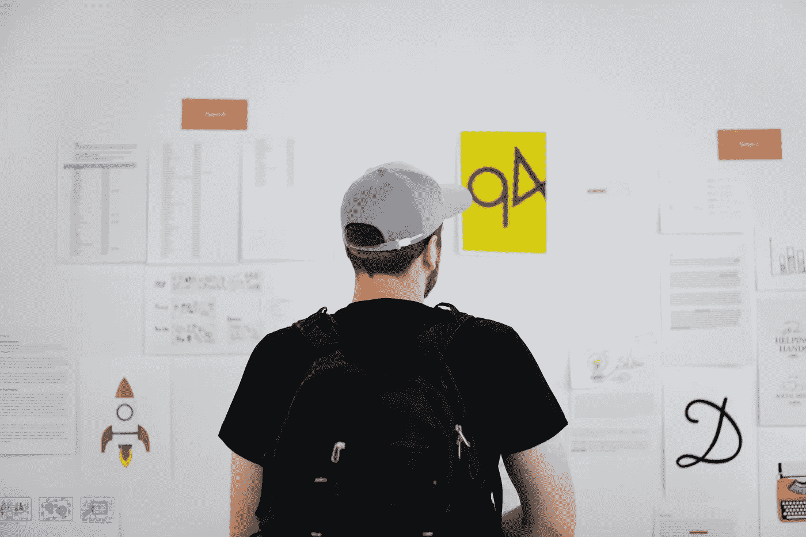
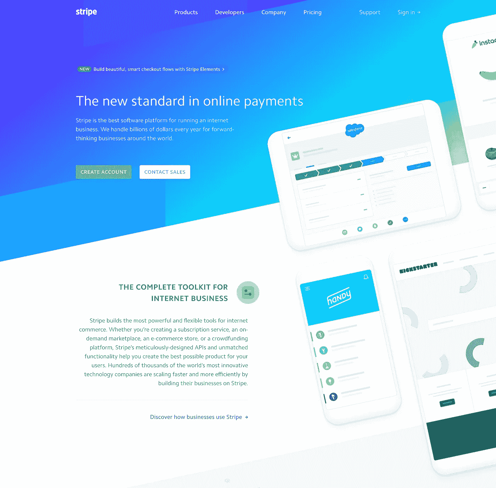

# 审美重要吗？

> 原文：<https://medium.com/hackernoon/do-aesthetics-matter-41407a8b1a45>

## 我们投入了大量的时间和精力来设计我们的软件。但是美是空心的吗？

[Source](https://unsplash.com/photos/AJCNM8JrzT8?utm_source=unsplash&utm_medium=referral&utm_content=creditCopyText)

作为一名产品设计师，有时我会质疑软件的美观有多重要。

看看互联网上一些最受欢迎的网站列表:

*   克雷格列表（网站名）
*   Reddit
*   黑客新闻
*   维基百科(一个基于 wiki 技术的多语言的百科全书协作计划ˌ也是一部用不同语言写成的网络百科全书ˌ 其目标及宗旨是为全人类提供自由的百科全书)ˌ开放性的百科全书
*   德鲁吉报告

这些网站几乎没有美学吸引力，但总的来说，每天有数千万人访问它们。

所以我问自己…

*我们只是在向其他设计师炫耀我们的设计技巧吗？普通消费者注意到了吗？审美对营收有直接影响吗？*

这些都是值得回答的问题。

# “不，审美不重要！”

有些人会举出以上例子(以及更多例子)来证明美貌是无关紧要的。他们会说视觉设计大多是不可测量的糊状营销。

毕竟软件是工具。我们用它来*完成任务*，比如交流、写作、核对待办事项或与朋友社交。

> 给予用户执行独特任务的能力远比让它看起来更重要。

我们跳到维基百科上，因为很容易获得免费的百科信息。我们打开 Craigslist 是因为我们想在本地购买或销售一些东西，而不必付钱。我们访问 Reddit 的独特之处。

这些网站难看也没关系，因为它们是特定工作的最佳工具。

事实上，这些网站受欢迎的一部分已经成为他们的丑陋。这就好像用户群在说，“我们只是嘲笑 Reddit/Drudge Report/Hacker News 有多丑，因为我们从中获得了相当多的效用，这才是最重要的。”

你不能制造一个没有价值的产品，给它一些吸引眼球的东西，然后期望它能持久。

The ever-stunning rain poncho. [Source](https://commons.wikimedia.org/wiki/File:Shanghai_cyclist_in_rain.jpg)

带上雨披。这件衣服丑得令人难以置信。但是每年都有数以百万计的产品售出，因为它们非常擅长自己的工作——让你保持干爽。

# “是啊，审美确实很重要！”

其他人说美丽至关重要。

[stripe.com](https://stripe.com/)

对于试图建立或维持品牌的公司来说，视觉设计很重要，因为它是包装的一部分。例如，人们之所以认可条纹，部分是因为它们出众的审美。保罗·兰德说:

> “设计是你品牌的无声大使。”

漂亮的东西用起来也赏心悦目。满意的顾客不断回来。这是用户体验的一部分(无论多小)。

当某样东西很美时，你能感觉到它的创造是有思想的。这让它看起来很专业，给人一种有意为之的感觉——这种感觉是，无论是谁创造了它，他们在创造它的时候，都考虑到了你这个用户。反过来的时候，感觉就像有人刚一起黑的。

上面提到的那些网站——Craigslist、Reddit 等。—这些都是例外。尽管很丑，但它们还是很受欢迎，因为它们是第一批上市的产品，拥有根深蒂固的用户基础。对于我们这些建造新事物的人来说，没有理由故意放弃美学。

回想十年前第一部 iPhone 问世的时候。毫无疑问，可用性和实用性非常丰富。但是人们也被它的美丽所震惊。没有其他手机看起来像这样。许多人过去(现在仍然)愿意为它支付天价，很大程度上是因为它的美丽。

# 我的外卖

你站在哪一边？

我觉得不是非黑即白。这是个轻重缓急的问题。

“形式服从功能。”功能当然是第一位的，但这并不意味着形式是不存在的。

对我来说，优先级是这样的:

1.  **效用**。你的软件是否以一种独特的方式帮助消费者完成一项独特的任务？如果它没有，你的软件的核心就不见了，它最终会死去。谁想要一个不能帮你完成某件事的工具？
2.  **可用性**。你有没有避开他们的方式，让他们可以轻松直观地执行任务？它可靠、快速、有条理吗？
3.  **审美**。从有助于实用性和可用性的角度来看，它有吸引力吗？

想尽一切办法，增加美感。美是美好的。但是实用性和可用性是第一位的，因为这是人们存在的首要原因。围绕目的构建，然后在此基础上增加美感。

你的用户会感谢你的。