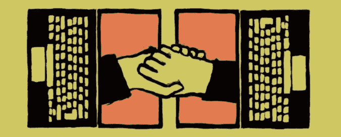
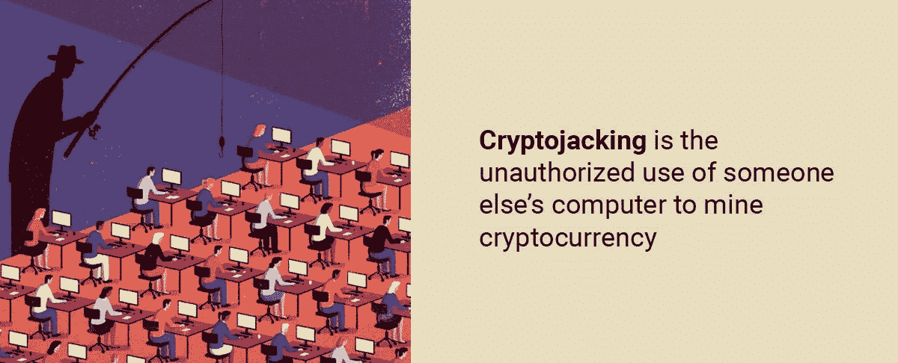
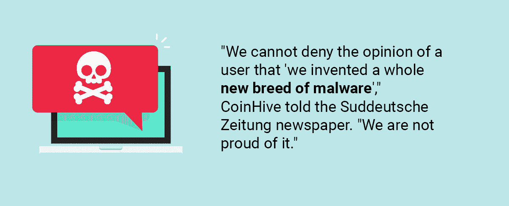
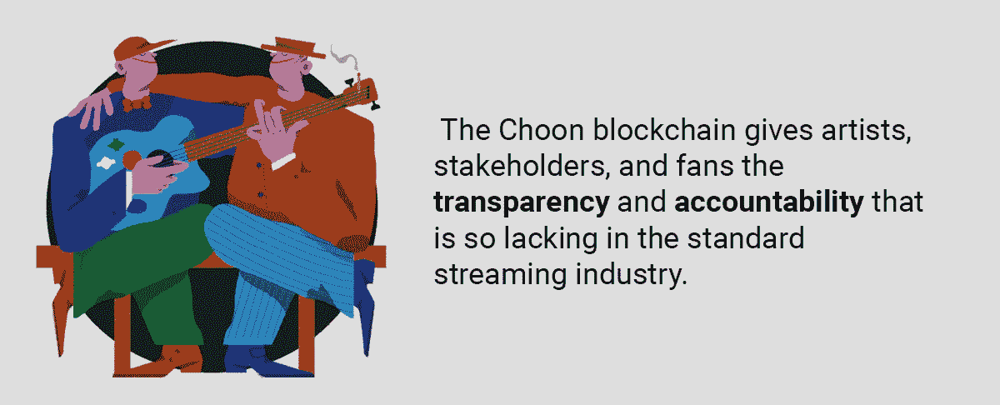

# 是不是所有流媒体网站都偷偷在你的设备上挖矿来买单？

> 原文：<https://medium.com/hackernoon/do-all-streaming-sites-secretly-mine-on-your-device-to-pay-their-bills-3e167cbf9733>

密码劫持是未经授权使用他人电脑挖掘加密货币。一些分散的直播网站试图通过这种方式获得“气体”，但他们要么陷入加密劫持，要么被迫采取其他策略。有没有可能把挖掘和流媒体整合起来，让公司和用户都受益，或者它们是两个不可分割的功能？

> 感谢[agency.howtotoken.com](http://agency.howtotoken.com/)对创建该主题的支持(第一个拥有成熟 ICO 承包商的平台)

# 1.常规采矿是如何工作的

标准的加密货币开采通过一个强大的计算机系统来工作，该系统运行加密软件(该软件是免费的)，只要你能运行，就运行。计算机系统被称为“节点”，它是区块链网络上帮助围绕加密货币网络发送交易的许多节点之一。

挖掘节点将未完成的事务分组到块中，并将它们添加到区块链中。这个过程是通过求解复杂的数学方程来验证这些交易的准确性。每 10 分钟解决一次障碍，获胜的矿工将获得 12.5 个比特币，目前价值近 20 万美元。

众所周知，加密采矿是无利可图的，因为你需要极其强大的处理器和数十万兆瓦的电力，才能与你网络上的其他矿工竞争。

出于这个原因，一些人已经采取了加密劫持的方式，他们偷偷使用他人的计算机来挖掘加密货币。

# 2.密码劫持

因为你需要的只是大量的计算能力来挖掘加密货币，所以网络黑客使用 CoinHive 插件(或类似的变体)在他们的主页上植入 Javascript 代码。浏览这些网站的计算机感染了这种代码，受害者的 CPU 被劫持，以获取硬币，这些硬币又流回给黑客。最近，聪明的黑客也开始感染手机和平板电脑。据英国电讯报[报道](https://www.telegraph.co.uk/technology/2017/12/04/cryptojacking-hijackers-mining-digital-currencies-computer/)，黑客们一年能攫取数百万美元的利润。

2016 年，博客 [Bad Packets Report，](https://badpackets.net/)的安全研究员 Troy Mursch 检测到 30，000 个网站在后台运行 CoinHive 的软件，降低了计算机的速度，并使用了大量的电力。2018 年 5 月，默施[报告](https://badpackets.net/large-cryptojacking-campaign-targeting-vulnerable-drupal-websites/)称，一场密码劫持活动袭击了 300 多个网站，包括圣地亚哥动物园和墨西哥奇瓦瓦州政府的网站。一个月后，默施[补充道](https://badpackets.net/)超过 10 万个网站易受该恶意软件攻击。广告拦截公司 AdGuard[2017 年的一份报告引用了来自](https://adguard.com/en/blog/crypto-streaming-strikes-back/) [CoinHive Stratum Proxy](https://github.com/cazala/coin-hive-stratum) 的数据，显示 CoinHive 每天被下载约 2500 次。相比之下，jQuery(最受欢迎的库之一，超过 70%的网站使用它)每天只有大约 100，000 次下载。AdGuard 还[发现](https://adguard.com/en/blog/crypto-mining-fever/)被感染的网站包括 CBS Showtime、UFC 直播以及摩尔多瓦和孟加拉国政府的官方网站。

根据英国网络安全公司 Digital Shadows 的 Rick Holland 和 Malwarebytes 的安全研究人员的说法，加密劫持是 2018 年的头号恶意软件趋势。就连 CoinHive 也不情愿地承认，它的插件已经演变成了一股恶意力量。“我们不能否认用户的观点，即‘我们发明了一种全新的恶意软件’，”CoinHive 告诉《南德意志报》，“我们并不以此为荣。”

今天，CoinHive 的变体出现在谷歌 Playstore 上，黑客们已经将该插件编程为即使在用户关闭违规标签后也能继续运行。

# 3.直播和挖掘

2017 年 AdGuard 的一份报告[宣布](https://adguard.com/en/blog/crypto-streaming-strikes-back/)几个流行的流媒体网站正在秘密使用用户设备进行加密货币挖掘。在每种情况下，用户都没有意识到这些播放器内置了隐藏挖掘功能。其中四个站点是 Openload、Streamango、Rapidvideo 和 OnlineVideoConverter.com。另一个著名的种子流媒体网站[海盗湾](https://thepiratebay3.org/)的主页上也有比特币矿工，他们的[推理](https://www.gizmodo.com.au/2017/09/the-pirate-bay-added-a-cpu-hijacking-bitcoin-miner-to-some-pages/)是其网站用隐形采矿取代烦人的广告来支付他们的账单。

事实上，海盗湾因这种做法而受到谴责，因此无法实现其目标，其他四个分散的网站也被 AdGuard 指控为公然盗窃。

# 常规直播平台(无采矿系统)

如果你认为直播平台需要某种加密方法来赚钱(支付他们的“汽油”或为艺术家提供收入)，以下是许多没有采矿系统的直播网站中的一些:

1.  [作品](https://opus-foundation.org/)，

去中心化的音乐平台 Opus 为艺术家提供了一个谋生的机会，而不必将多达 80%的收入交给苹果音乐、iTunes、Spotify 和其他几个集中的平台。Opus 系统采用了四层技术，有一个全球分类账，记录了所有已经上传的音乐。这一层音乐随时随地都可以访问，已经购买的歌曲也随时可以收听或下载。

这个系统是完全透明的，所有的交易都可以在以太坊区块链上公开查看。

2. [UjoMusic](https://ujomusic.com/)

Ujo Music 是一家总部位于以太坊、由 ConsenSys 支持的音乐软件服务公司，旨在实现交易透明、公平的音乐竞争环境，并帮助艺术家获得更多收入。仍处于测试阶段的 UjoMusic 使用智能合同和 Ether 来数字化音乐权利和元数据，并在民主和开放的环境中共享记录，随后帮助艺术家许可他们的产品并以最小的摩擦获得报酬。

唯一一个似乎能够在保持平衡的同时有效整合流媒体和挖掘的去中心化直播平台是 Choon。

3.[春](https://choon.co/)。

这家区块链音乐流媒体服务公司通过其可定制的智能合约，在一个名为 NOTES 的 ERC-20 令牌中分发其付款，艺术家和其他各方在每天结束时获得他们的流媒体付款。艺术家使用音符来推广曲目，利用推广平台，以及样本和许可曲目，以及其他方式从他们的音乐中获得收入。听众使用 NOTES 进行平台活动，如下载、私人音乐会、与艺术家聊天，以及销售非数字产品。

不像标准的音乐流媒体平台因其惨淡的支出而臭名昭著，Choon 给其艺术家高达 80%的广告和订阅收入，以及高达 100%的挖掘奖励——这比 Spotify 等类似服务更高，Spotify 支付的费用低得令人不安([一些音乐人](https://www.digitalmusicnews.com/2016/05/26/band-1-million-spotify-streams-royalties/)估计每条流低至 0.004891 美元)。

春晚区块链还为艺术家、利益相关者和粉丝提供了传统流媒体行业所缺乏的透明度和问责制。

# 春矿业公司

春春使用了[一个叫做“流媒体挖掘](http://www.6am-group.com/the-bitcoin-for-music-how-choon-is-disrupting-the-music-industry-an-interview-with-co-founder-bjorn-niclas)的系统，它承诺在未来十年将 NOTES token 总量的一半直接分配给艺术家，另外还有一个雄心勃勃的 80%的艺术家流媒体收入和广告收入回报。

Choon 的采矿方式如下:

1.  总共将供应 20 亿张纸币，其中 10 亿张将在 10 年内分发给艺术家。该分布将基于当天最受欢迎的艺术家的听众数据。头五年每天将发放 375，000 张钞票，其余部分将在最后五年发放。此后，该比率将继续降低，直到所有剩余的代币在五年内被分发。
2.  当粉丝们播放音乐时，音符通过 Choon 可定制的“智能唱片合约”发布(或挖掘)。这些智能合同还在以太坊区块链上存储版权凭证。
3.  春还将 80%的收入直接给了音乐人。所有的收入都来自于听众的收益，所以如果听众每月支付 5 美元的订阅费，其中的 80%(4 美元)将直接归艺术家所有，而 Choon 则获得其余部分作为提供服务的报酬。
4.  代币被编程为直接分配到艺术家的钱包中(根据一首曲目被流化的次数)。
5.  Choon 是完全透明的，每天发布总流量和注释。

Choon 似乎是一个能够有效整合流媒体和挖掘的分散式直播网站。他们把它融合成一个开放的系统，公司和用户都从中获利，因为音乐家和粉丝们挖掘他们自己的特殊需求。

# 结论。

除了 Choon 之外，没有其他分散式直播网站能够成功地将挖掘和直播结合起来。那些这样做的人被判为密码劫持，而其他人，如 Opus 和 UjoMusic，则通过其他方式获得“气体”。唯一一个似乎成功地以透明和受欢迎的方式将流媒体和挖掘结合起来的去中心化直播网站是 Choon。这个直播的区块链利用其采矿来造福用户和自己，同时使其采矿活动透明。

## 关于作者:

基里尔·希洛夫——geek forge . io 和 Howtotoken.com 的创始人。采访全球 10，000 名顶尖专家，他们揭示了通往技术奇点的道路上最大的问题。加入我的**# 10k QA challenge:**[geek forge 公式](https://formula.geekforge.io/)。