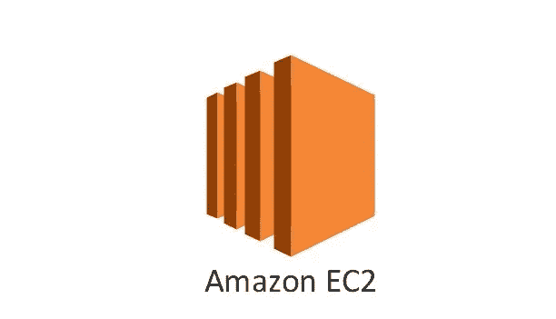

# 照我说的做，不要照我做的做:在不破坏基础设施的情况下获得 EC2 实例名

> 原文：<https://medium.com/hackernoon/do-as-i-say-not-as-i-do-get-your-ec2-instance-name-without-breaking-your-infrastructure-1da4a0963af0>



## 包含 Python 代码片段的分步指南

我第一次尝试将 EC2 实例名记录到[page duty](http://pagerduty.com)和 [Airbrake](http://airbrake.io) 时，破坏了我们的大部分基础设施。我没有考虑到未发布的 AWS 速率限制，当意外的大量错误导致我的代码达到这些速率限制时，当错误在我们的异常记录器中抛出时，不充分的错误处理导致了无限循环。

我希望这个教程可以让你少一些我的头疼。我将带您了解如何使用`boto3` Python 客户端从 EC2 实例中访问正在运行的 EC2 实例的名称，在此过程中，我将包括一些警告和陷阱，帮助您避免我犯的一些错误。

# 先决条件

*   [Boto3](http://boto3.readthedocs.io/en/latest/index.html) 。本教程假设您熟悉使用 AWS 的 boto3 Python 客户端，并且您已经按照 AWS 的说明配置了您的 AWS 凭证。
*   [请求](http://docs.python-requests.org/en/master/)，一个 Python HTTP 库。

# 获取实例 Id 和区域

关于实例的大部分信息可以通过 [boto3 实例资源](http://boto3.readthedocs.io/en/latest/reference/services/ec2.html#instance)获得。为了创建资源，我们首先需要检索实例 id 和实例区域。

AWS 通过 url `http://169.254.169.254`提供[实例元数据和用户数据](http://docs.aws.amazon.com/AWSEC2/latest/UserGuide/ec2-instance-metadata.html)，您可以从任何正在运行的 EC2 实例请求这些数据。我们尤其对[实例身份文档](http://docs.aws.amazon.com/AWSEC2/latest/UserGuide/instance-identity-documents.html)感兴趣，该文档可在`http://169.254.169.254/latest/dynamic/instance-identity/document`获得。

```
import requestsr = requests.get("http://169.254.169.254/latest/dynamic/instance-identity/document")
response_json = r.json()
region = response_json.get('region')
instance_id = response_json.get('instanceId')
```

如果您不熟悉`requests`库，我建议您查看[响应状态代码](http://docs.python-requests.org/en/master/user/quickstart/#response-status-codes)，尤其是`raise_for_status`函数，作为错误处理的起点。

# 获取实例资源

然后我们可以使用实例 id 和区域来检索 [boto3 实例资源](http://boto3.readthedocs.io/en/latest/reference/services/ec2.html#instance)。

```
import boto3ec2 = boto3.resource('ec2', region_name=region)
instance = ec2.Instance(instance_id)
```

> 在将`region`和`instance_id`传递给`boto3`之前验证它们

[boto3 错误处理](http://botocore.readthedocs.io/en/latest/client_upgrades.html#error-handling)的第一步是捕捉`ClientError`和`BotoCoreError`，两者都在`botocore.exceptions`包中。

根据我的经验，`boto3`客户端对无效或`None`区域或实例 id 的错误处理非常混乱。除了上面提到的错误，任一字段中的`None`值都会引发 Python 内置的`ValueError`。如果`region && instance_id`为假，我建议您不要尝试使用`boto3`客户端。

# 得到名字

实例的“名称”实际上是带有关键字“名称”的实例标记。您可以从实例资源中检索标签，并过滤`Name`标签。

```
tags = instance.tags or []
names = [tag.get('Value') for tag in tags if tag.get('Key') == 'Name']
name = names[0] if names else None
```

> 因为属性是延迟加载的，所以一些无效的实例 id 会在这里抛出错误

根据 [boto3 文档](http://boto3.readthedocs.io/en/latest/guide/resources.html#identifiers-attributes-intro)，资源属性是延迟加载的，这意味着第一次访问属性时会进行第一次 API 调用。这意味着，虽然在创建`ec2.Instance`资源时会验证`None`或空字符串，但在第一次调用`DescribeInstances`时，会验证类型正确但值错误的非空字符串 id。为了解决这一问题，您需要尝试捕捉上一节中的`botocore.exceptions`异常。

# 抓住你了。

从*AWS*开放指南的 [EC2 章节中了解到的问题和限制](https://github.com/open-guides/og-aws#ec2-gotchas-and-limitations):

> ❗if ec2 API 本身是您的基础设施的一个关键依赖项(例如，用于自动服务器替换、自定义扩展算法等)。)并且您正在大规模运行或进行许多 EC2 API 调用，请确保您了解它们何时可能会失败(对它的调用是有速率限制的，并且这些限制不会公布，并且可能会更改)，并针对这种可能性进行编码和测试。

`boto3`客户端通过`DescribeInstances` API 调用加载关于实例的信息。例如，如果您每次记录错误时都调用这个 API 来检索实例名，那么您很容易就达到了`DescribeInstances`速率限制。

除了上面提到的错误处理之外，您将希望合并对 [AWS](https://hackernoon.com/tagged/aws) API 的调用，以避免触及未发布的 AWS 速率限制。我们的解决方案是在 API 服务器的[启动](https://hackernoon.com/tagged/startup)时获取一次实例名，并将结果缓存在一个全局数据结构中。我们不再每次需要记录错误时都调用 EC2 API，而是在向机器部署新代码时只调用一次。

# 把它们放在一起

下面是一个最终的`get_instance_name`函数的例子。