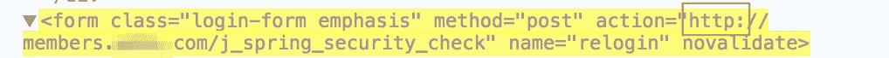

# 如果我没有什么可隐藏的，我需要 VPN 吗？

> 原文：<https://medium.com/hackernoon/do-i-need-a-vpn-if-i-have-nothing-to-hide-a6640ac69325>

VPN 适用于所有人。这就是为什么。

是的。故事结束。别读了，去买一本。动手吧。现在。

好的。我在这里做的不仅仅是告诉你如何获得 VPN。我们来分解一下你为什么需要 VPN(即使你没什么好隐瞒的)。

首先，除非你是巴赫国王，并且你的大部分生活都是向全世界传播的，否则你可能会有一些不想公开的事情。但是，即使你是一个专业的“分享者”，你也有可能有你想要保守的秘密，或者只是一些全世界都不需要知道的事情。巴赫国王可能不想让世界知道他的社会安全号码(SSN)，他在给谁发邮件，以及他访问的每个网站。VPN 可以帮助解决这个问题。

## 被盗凭据

网上传输的许多信息容易被窃听。许多网站仍然拒绝使用超文本传输协议安全(HTTPS) *，即使*他们要求敏感信息，如用户名和密码。

让我们来看看实际情况。下面是一个不安全登录页面的例子。请注意，在地址栏中没有“HTTPS”。这使得同一网络上的攻击者能够进行所谓的数据包捕获，或者在凭据提交到网站时对其进行嗅探。

Insecure Login Page

其他网站是部分安全的，仅通过 HTTPS 提交凭证，但所有后续通信都是通过 HTTP 不安全地发送的。结果是，具有网络访问权限的攻击者可以篡改初始登录站点，并在您不知情的情况下将登录更改为 HTTP。下面的代码展示了这一变化——这是普通用户不会注意到的。

Submission URL Tampered and Changed to HTTP

如果凭证是通过 HTTP 发送的，那么使用现成工具(如 [Wireshark](https://www.wireshark.org/) )的攻击者就可以看到它们。下面是一个通过常规 HTTP 提交表单并使用 Wireshark 窃取凭证的示例。

Stealing Credentials

以上情况都是不好的，因为攻击者完全可以窃取你的登录凭证。即使攻击者无法通过在登录过程中篡改提交 URL 来窃取您的凭据，他们也可以劫持您对网站的访问。这是通过获取您的“会话 cookie”，并在网站上冒充您来实现的。下面是一个在没有任何初始 URL 篡改的情况下窃取会话 cookie 的示例。

Stealing Session Cookie

## 泄露隐私

即使你所有的浏览都是在 HTTPS 进行的，窥探的眼睛仍然可以了解你的一些事情，而这些事情你可能更愿意保密。攻击者使用他们用来查看您的密码和窃取您的 cookie 的相同方法，可以嗅探您的 DNS 流量，并查看您要访问的域。例如，如果你喜欢在 [GIPHY](https://giphy.com/) 上看 gif，攻击者可以看到你在那个网站上浏览的时间和时长。他们将看不到你正在看的 gif，但是他们可以开始开发你的互联网使用概况，以便策划随后的有针对性的攻击。

Background Traffic from the nsurlsessiond Background Process

除了你通过网络浏览器进行的网上冲浪之外，你的电脑和手机上还运行着一些后台程序，它们会不断地寻找更新、同步，并产生网络噪音。使用像[小飞贼](https://www.obdev.at/products/littlesnitch/index.html)或[网络限制器](https://www.netlimiter.com/)这样的本地防火墙来查看你的电脑发送的所有后台数据。

一个熟练的攻击者可以利用这种噪音来了解你的更多信息，例如你使用什么应用程序。然后，攻击者可以使用这些信息对您进行有针对性的网络钓鱼攻击。

## 但我不是目标

人们一直认为，只有罪犯或那些“有所隐瞒”的人才会使用 VPN。确实如此。但我们普通人也应该使用它们来为我们的互联网活动增加一层安全，保护我们的隐私，并说服潜在的攻击者，我们根本不值得麻烦。

*这是一篇来自* [*以赛亚书*](https://medium.com/u/c9fabda04fb1?source=post_page-----a6640ac69325--------------------------------)*[*的帖子。如果你喜欢这篇文章，一定要鼓掌，看看他在*](https://www.revissolutions.com/) [*Revis Solutions 博客*](https://medium.com/revissolutions) *上的其他文章，并在 Twitter 上关注*[*@ isaiahsarju*](https://twitter.com/isaiahsarju)*[*@ Revis solution*](https://twitter.com/revissolution)**