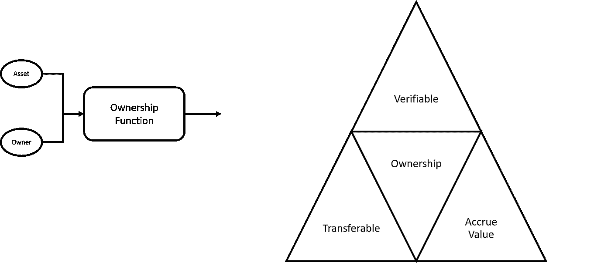
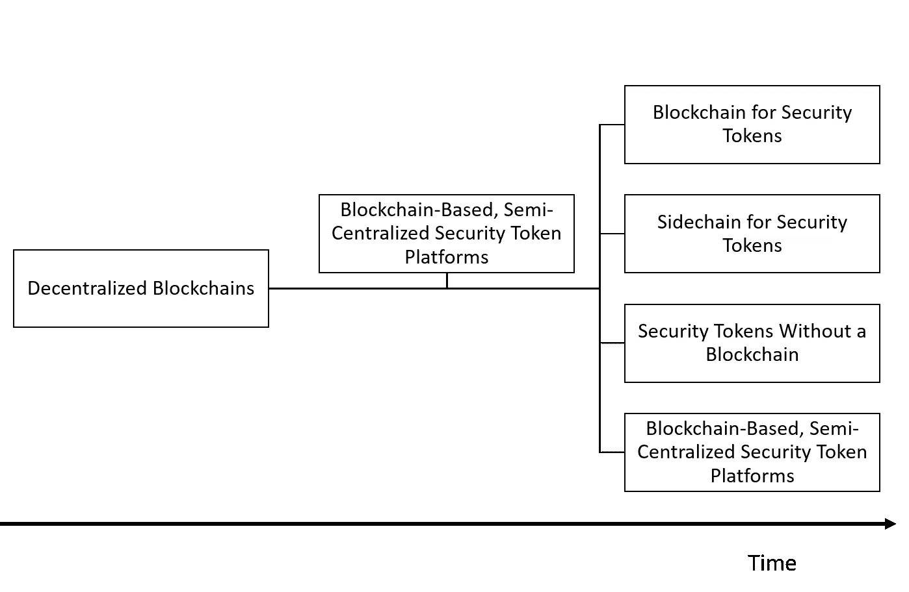

# 安全令牌需要新的区块链吗？好处和挑战[第一部分]

> 原文：<https://medium.com/hackernoon/do-security-tokens-need-a-new-blockchain-benefits-challenges-part-i-48f281f5101e>

本周在 [Crypto Invest Summit](https://cryptoinvestsummit.io/) 上，Spice VC 的合伙人 [Ami Ben-David](https://twitter.com/amibendavid) 公布了他对 [Ownera](http://ownera.io/) 的愿景，这是一种新的安全令牌区块链。几个月前，Ami 好心地向我简要介绍了他对 Ownera 的想法，从那以后我就一直在思考这个问题。加密证券新区块链的概念远非无足轻重，而且肯定是加密证券界的敏感话题。为了尝试详细探讨这个主题，我将这篇文章分为三个主要部分，以介绍这个新角度在安全令牌市场中的好处和挑战。

如果我们去除所有的技术复杂性，安全令牌的区块链的想法可以归结为一个非常简单的问题:*我们可以通过简单地使用智能合约来有效地表示所有权吗？*数学上，所有权可以表示为身份(所有者)和资产之间的关系。从概念上讲，所有权必须具备一些基本属性:它必须是可验证的、可转让的，并根据市场动态增加价值。

所有权是安全令牌的主要原则。目前，我们正在尝试在为资产转移设计的区块链运行时之上建立所有权动态模型。问题是，在区块链，所有权是否值得成为一等公民。

# 矛盾证明

确定安全令牌是否值得拥有自己的区块链的一个有趣方法是尝试验证相反的断言。矛盾证明是一种数学技巧，试图通过否定相反的命题来证明一个断言。从这个意义上来说，让我们假设我们相信所有的安全令牌都将在以太坊这样的区块链运行时中构建，并尝试反驳这一断言。

任何区块链运行时都可以分解为技术层、激励机制和节点架构。技术层负责诸如块发布、事务记录等方面。激励机制抽象了共识、代币铸造等领域。最后，节点体系结构描述了不同节点在网络中扮演的角色类型。像以太坊这样的区块链从根本上是为资产转移而设计的，因此已经建立了技术构件、节点架构和激励机制来支持这种模式。

在以太坊上构建安全令牌本质上意味着我们将调整那些机制来支持所有权动态。虽然区块链的技术构建模块可以一致地用于资产转移和所有权，但我不认为我们可以声称节点架构和激励机制也是如此。认为验证以太坊交易的同一个挖掘器能够在特定节点上进行资本要求验证有点牵强。类似地，认为挖掘以太坊交易的动机与验证双方之间的房地产令牌的转让是一样的似乎是一个糟糕的概括。

如果前面的几点不足以让你相信依靠以太坊获得安全令牌的挑战，我们还有身份这个主题。安全令牌事务依赖身份作为一级构建块。然而，像以太坊这样的运行时是为假名设计的，引入身份违反了它的一些核心原则。这算不算矛盾？😉

# 风险:重新集中区块链

前一节中列出的挑战使得像以太坊这样的区块链很难适应安全令牌的世界。如果是这样的话，公司现在是如何发行安全令牌的呢？非常简单，通过在安全令牌架构中引入集中式组件。我喜欢称这些组件为再集中化矢量。

当前一代的安全令牌平台通过引入再集中载体，如合规性验证器(KYC/AML)、离线处理等，在分散运行时作为集中实体运行。这些类型的捷径是必要的，不仅是为了克服以太坊的技术限制，也是为了在一个非常不成熟的市场中简化安全令牌的发行。然而，如果我们引入太多的再集中向量，我们可能最终会忽略区块链的价值主张。如果我们将这一设想发挥到极致，我们可能根本不需要区块链来作为安全令牌。

# 专业化区块链的出现

区块链生态系统正在发展成为通用和专用区块链的结合体。EOS、Ethereum、Hyperledger 属于通用区块链的阵营，能够实现几乎任何分散的用例。Stellar、Ripple 或 IOTA 等区块链专注于解决支付或设备交互等专业用例。第二组区块链的出现是因为用例的激励足够强大，足以证明一个新的运行时的合理性。如果你相信这个前提，那么我们需要问问自己，安全令牌是否值得拥有自己的区块链。

在本文的第二部分，我计划探索安全令牌的潜在区块链的技术构件。