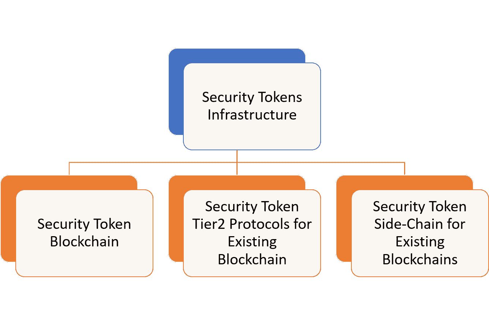
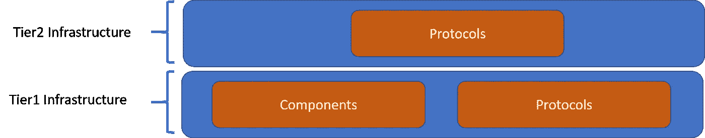
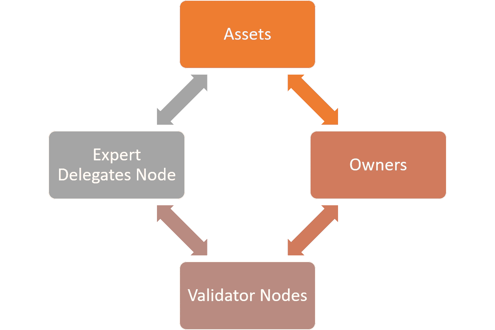
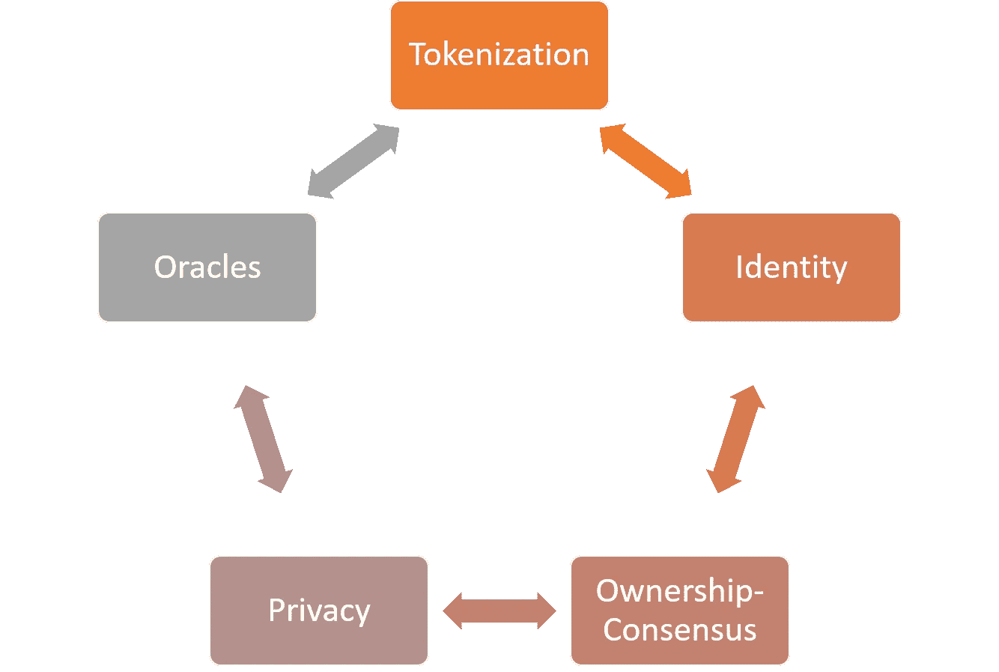
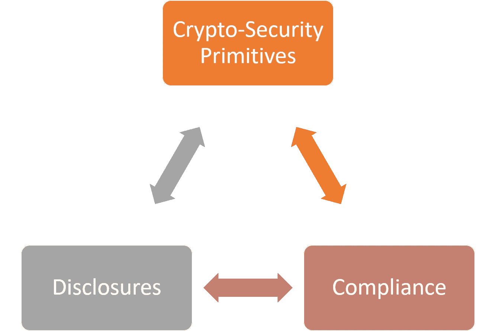

# 安全令牌需要新的区块链吗？第三部分:积木

> 原文：<https://medium.com/hackernoon/do-security-tokens-need-a-new-blockchain-part-iii-the-building-blocks-7adfa7239bb0>

这是文章的第三部分，探讨了区块链在安全令牌方面的优势和挑战。在第一部分,,我们提出了证明加密证券的区块链是该领域自然发展的论点。[第二部分](https://hackernoon.com/do-security-tokens-need-a-new-blockchain-benefits-and-challenges-part-ii-de480e54c12a)探讨了一些非常实际的挑战，这些挑战可能会使安全令牌区块链变得非常不切实际。随着支持和反对安全令牌区块链的激烈争论，可能是时候更深入地挖掘和探索这种类型的区块链中存在的一些实际功能了。

安全令牌市场中的几乎每个人都同意，我们需要一个新的/更好的加密证券基础设施。我们今天实现安全令牌的方式几乎不能解决一些基本的权益用例，并且在大多数复杂的令牌化场景中几乎没有用。此外，缺乏基础设施是阻碍投资者参与证券代币发行的无形因素之一。更广泛的问题是，新的安全令牌基础设施是否会作为新的区块链运行时的一部分，作为现有区块链中的 tier2 协议，或者作为一种混合模型，使用与以太坊等通用区块链挂钩的侧链。

为了更明智地判断市场是否需要专门用于安全令牌的区块链，我们可能需要探索这种类型的运行时的一些关键组件。如果安全令牌需要一个新的区块链，它会是什么样子？

# 安全令牌区块链的构建模块

在市场上关于安全令牌区块链的论文中，SpiceVC 的管理合伙人 [Ami Ben-David](https://twitter.com/amibendavid) 在他的 [Ownera 论文](https://ownera.io/)中捕捉到了一些最有思想的论点。从概念上讲，Ownera 提供了专门用于安全令牌的区块链的核心构建块。在 Ownera 的一些观点上，我确实与 Ami 有过分歧，但我仍然觉得他论文中的一些概念非常有说服力。区块链在安全令牌方面的专业知识非常复杂，没有明确的黑白答案。用充满激情的、一般性的论点而不是理性的严谨来分析这个问题，只会对这个新兴行业造成伤害。

为了理解安全令牌区块链的可能架构，我们可以设想两个主要层。tier1 将代表核心区块链运行时，并将包括分散式安全令牌网络的核心组件和协议。第二层将承载与大多数安全令牌场景相关的协议。

使用该高级架构作为指南，让我们开始探索与安全令牌区块链相关的一些关键概念。

# Tier1:区块链运行时

如前所述，安全令牌的核心运行时可以分为两大类:组件和协议。组件抽象了安全令牌网络中的主要参与者，而协议则模拟了这些参与者之间的交互。下图显示了安全令牌区块链中应该考虑的一些最基本的组件和协议。

## 成分

安全令牌区块链应包括以下组件:

**资产:**资产代表物理或虚拟实体的合法所有权要求。具体地说，资产可以由一组证明特定实体的存在和所有权的文档来表示。

**所有者:**所有者是对特定资产拥有所有权的实体或个人。

**验证器节点:**资产的存在和所有权应由合法信誉良好的金融机构来确定。这些机构应作为验证节点参与区块链网络，负责资产的接收、保管或移除等功能。

专家代表节点:安全令牌区块链网络应该由代表金融系统架构中不同参与者的节点组成。专家代表节点抽象功能，例如法律评估、经纪交易商、清算托管和加密安全交易的其他关键参与者

## 协议

第 1 层安全令牌区块链运行时应考虑的一些关键协议包括:

**令牌化:**安全令牌最基本的协议区块链将负责创建真实资产的链上表示。

**身份:**安全令牌区块链中的参与者和资产在法律上和技术上都应该是唯一可识别的。为所有节点建立身份的 KYC 型协议应该是安全令牌区块链的关键元素。

**所有权一致:**一个一致的协议，不仅根据财务正确性，而且根据不同资产的所有权的不可改变的转移来断言交易的有效性。

**隐私:**在与资产和所有者相关的不同信息集上建立隐私保护的能力应该是安全令牌区块链的关键组成部分。

**Oracle:**就像在其他区块链一样，Oracle 将负责访问与加密证券相关的链外数据。

# 第二层:加密安全协议

安全令牌区块链的第二层应该启用与安全令牌交易相关的协议。

**加密安全原语:**实现债务、权益或衍生令牌的协议应该存在于安全令牌区块链中。

**合规:**有数百条合规规则与不同资产类别、行业和管辖区的安全令牌交易相关。安全令牌区块链应该包括一种简单的方法来实现那些符合性规则，该方法可以在安全令牌传输中使用。

**披露:**所有者和验证者应能够披露与安全令牌的价格和验证相关的重要信息。这种公开的机制应该抽象在安全令牌协议中。

还有许多其他有趣的构建块可能与安全令牌区块链相关，但是希望本文能够涵盖一些最重要的构建块。无论您是否相信安全令牌区块链的理论，毫无疑问，安全令牌行业将极大地受益于在不同运行时上实现这些构建块。