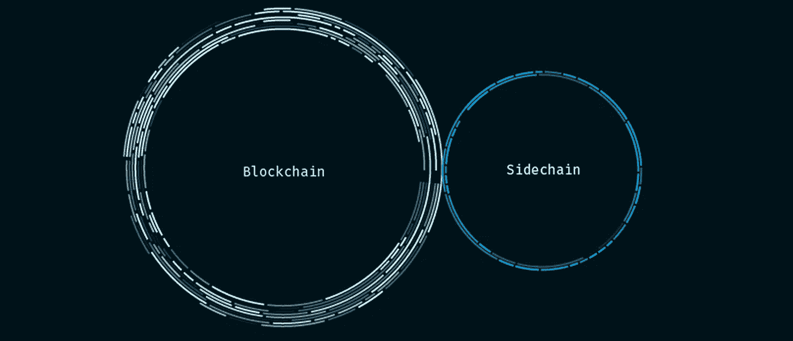
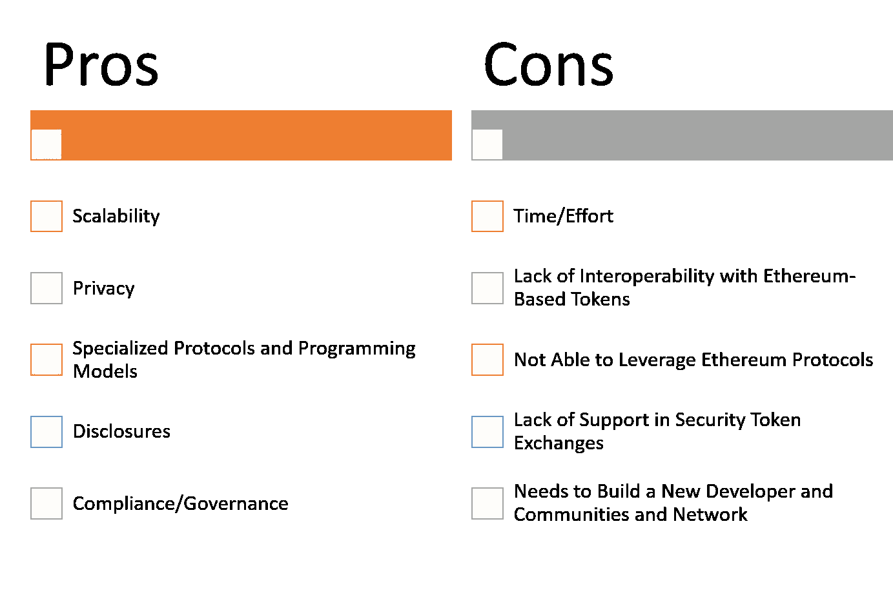
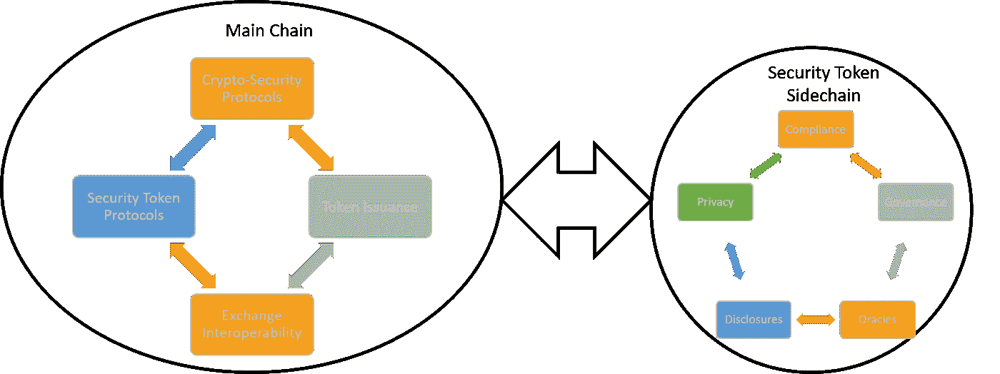

# 安全令牌需要新的区块链吗？第四部分:侧链怎么样？

> 原文：<https://medium.com/hackernoon/do-security-tokens-need-a-new-blockchain-part-iv-how-about-a-sidechain-acd8686d8fae>

这是一篇文章的第四部分，也是最后一部分，探讨专门研究安全令牌的新区块链的主题。在第一部分,,我们提出了证明加密证券的区块链是该领域自然发展的论点。[第二部分](https://hackernoon.com/do-security-tokens-need-a-new-blockchain-benefits-and-challenges-part-ii-de480e54c12a)探讨了一些非常实际的挑战，这些挑战可能会使安全令牌区块链变得非常不切实际。[第三部分](https://hackernoon.com/do-security-tokens-need-a-new-blockchain-part-iii-the-building-blocks-7adfa7239bb0)深入探讨了安全令牌区块链中可能需要的特定架构组件和协议。今天，我想探讨一个中间论点，并提出一个以太坊侧链的想法，专门用于安全令牌。您应该考虑本文中解释的一些概念，不是作为一个全新的论题，而是作为加密证券区块链的一些元素的一个实用的实现机制。

正如本文不同部分所探讨的那样，专门研究安全令牌的区块链的想法具有非常强的价值主张，同时也有一些非常明显的缺点。一方面，新的区块链将解决以太坊在安全令牌方面的一些限制，并将包括披露、所有权主张、资产表示等方面，作为可用于加密证券实现的一级构造。另一方面，新的区块链将无法利用以太坊中现有的丰富的协议生态系统，它将不得不建立完整的开发者社区、专家节点、交易所和安全令牌市场的许多其他关键组件。

越来越多的支持和反对安全令牌区块链的争论呈现出一种非常有趣的二分法。加密证券缺乏新的运行时意味着我们将不得不继续通过以太坊入侵，并且在最好的情况下，建立大量的 tier2 协议来简化安全令牌的创建和管理。然而，着手实施全新的安全令牌区块链可能意味着多年的基础设施开发，而没有任何实际应用交付，这可能会给这个新生的生态系统带来非常大的风险。在中间的某个地方(或者至少我喜欢这样认为😉)是使用集成到以太坊主网的新的分散运行时的想法，它可以卸载与安全令牌相关的计算，同时仍然利用基于以太坊的协议。输入安全令牌侧链。

# 安全令牌的侧链？

大约在 2014 年，Adam Back 等人在论文[“使用钉住的侧链实现区块链创新”](https://blockstream.com/sidechains.pdf)中首次引入了“侧链”概念。该论文描述了“双向钉住的侧链”，这是一种机制，通过证明你已经“锁定”了一些先前由你拥有的硬币，你被允许在侧链内移动一些其他硬币。侧链可以利用主链中的加密协议，但通过将特定的计算集卸载到隔离的环境中来扩展它们的功能，然后可以在主链中反映出来。

在安全令牌的上下文中，可以使用侧链来实现加密安全生命周期的水平功能，这在以太坊运行时中很难实现。然而，安全令牌侧链仍将利用基于以太坊的加密安全协议，如 Securitize 的 DS 协议或运行在以太坊主网上的 Fluidity 的双令牌瀑布。安全令牌的哪些特定功能将在侧链级别实现，哪些功能将保留在主链中？嗯，在高层次上，计算开销大的方面，如披露、合规性、与外部数据源的集成、投票/治理或隐私，可能是侧链的良好候选，而针对股权、债务、衍生品等的加密金融协议似乎更适合以太坊区块链。

# 安全令牌侧链的优势

从体系结构上来说，侧链从来都不是一个理想的解决方案，它更像是一个必须忍受区块链主机局限性的恶魔。说到安全令牌，sidechain 运行时感觉像是一种解决方案，可以帮助推进安全令牌的基础设施，而不会忽视迄今为止取得的所有进展。在安全令牌专用侧链的优势中，我们可以列举以下几点:

**可扩展性:**通过将计算卸载到侧链，安全令牌将能够实现更高水平的可扩展性。

**隐私:**隐私协议可以在侧链级别轻松集成。

**以太坊互操作性:**加密证券侧链中的令牌将与以太坊主网挂钩。

**披露:**安全令牌的侧链可能会消除存储与安全令牌相关的披露文档的计算负担，同时仍然维护正确的隐私级别。

**合规:**像以太坊智能合约那样构建合规逻辑可能有点牵强。专注于安全令牌的侧链可以通过使用更丰富、更简单的编程模型来简化这一过程。

**加密金融协议:**与以太坊的互操作性将允许安全令牌的侧链在安全令牌传输中利用复杂的协议，如 Dharma 或 dYdX。

**交换互操作性:**专注于加密证券的侧链不会强加任何额外的努力来集成安全令牌交换。

**简单性:**实现安全令牌的侧链比构建新的区块链运行时要简单得多。

# 一些可以启用安全令牌侧链的技术

专注于安全令牌的侧链理论的一个好处是，它可以利用侧链领域出现的几个平台。以太坊的持续斗争引发了侧链领域的创新浪潮，创造了许多可能与安全令牌侧链相关的关键构建模块。下面，我列出了一些我最喜欢的:

[平价基础](https://www.parity.io/substrate/):最近发布的基础为实现与任何平价区块链挂钩的新区块链提供了一个相对简单的机制。Substrate 利用 WebAssembly、Libp2p 和 AfG Consensus 等技术为实现新的侧链提供基础设施和编程模型。

[block stream Elements](https://elementsproject.org/):side chain 领域最成熟的项目之一，Elements 主要针对比特币区块链进行了优化，但它的许多机制在以太坊上运行良好。

Skale 实验室是这个领域的新成员，它正在等离子体链上建造以太坊虚拟机(EVM)的首批实现之一。Skale 的目标是将完全无许可、可扩展的第二层基础设施与以太坊主网集成。

[POA](https://poa.network/) : POA 网络是一个以太坊侧链，使用授权证明作为其主要的共识机制。POA 中许多与节点身份相关的想法都与安全令牌相关。

[织机](https://loomx.io/):织机网络也是基于等离子的以太坊侧链。该平台已经运行了几个月，支持一些大型项目，如多人游戏。

以太坊安全令牌侧链的想法当然是有争议的，但仍然很有趣。通过将以太坊丰富的协议与更高级的计算能力相结合，侧链可能会提供适当的折衷，从而实现第一个专门用于安全令牌的运行时。