# 技术指标真的对加密货币起作用吗？

> 原文：<https://medium.com/hackernoon/do-technical-indicators-really-work-on-cryptocurrencies-aab1ae3d6df3>

Photo by energepic.com from Pexels

> ***TL；DR:*** *常用技术指标事件* ***在利用每日价格和单独使用时，似乎不是加密货币*** *高于平均水平或负回报的良好预测指标。此外，在以上涨为主的市场中，过分相信预测上涨表现的指标可能是不明智的。*

# 我们的假设

假设是，技术指标在这个市场上未经测试，因此，分析师和交易员可能会或可能不会正确地应用它们。我们开始寻找某些技术指标在预测上涨或下跌表现时是否有任何价值。

# 我们的流程

1.  我们定义了一组要分析的加密货币，使用市值和可用数据量作为我们的过滤标准。
2.  我们定义一组要测试的技术指标事件。请注意，这些指标并不代表所有的技术指标，而是一些有价值的、经常使用的指标，用来说明我们的分析。(注意:如果您希望在此分析中看到其他指标，请在下面的评论中告诉我们)。
3.  我们定义了“预测值”在这个练习中的含义，并利用这个标准分析了各种事件后的回报。

## 1.定义要分析的加密货币

首先，我们定义我们想要查看哪些货币。我们可以从[硬币市值](https://coinmarketcap.com)上看每枚硬币的市值开始。在这个练习中，我们没有选择市值最高的 20 个硬币，并删除了任何没有超过 2 年的每日数据的硬币。这就留给我们以下硬币来分析。

*   比特币(BTC)
*   [以太坊](https://hackernoon.com/tagged/ethereum) (ETH)
*   涟漪(XRP)
*   莱特币
*   破折号
*   韦钱(文)
*   莫内罗(XMR)

值得注意的是，很多比较流行的币如[比特币](https://hackernoon.com/tagged/bitcoin) Cash (BCH)、Cardano(阿达)、Neo(尼奥)等。拥有不到 2 年的数据。因此，它们目前已从该分析中移除。

> **为什么需要两年的数据？**两年的数据代表大约 730 个数据点，因为 crypto 在任何时候的任何日期都进行交易。我们的一些指标，如 200 个周期的简单移动平均线，至少需要那么多周期才相关。当你开始为其他指标如 RSI 和随机指数自举指数平均值时，这变得更加复杂。因此，首先要有一套涵盖许多指标启动期的良好数据，这一点至关重要。

## 2.定义技术指标事件

这项研究最重要的方面可能是选择要分析的技术指标事件。为了开始这项研究，我们选择了一些常用的技术指标事件，并评估了上方交叉和下方交叉事件，试图捕捉方向性。

例如，“RSI 低于 30”通常被称为“超卖”指标，表明价格应该从该点开始上涨。为了捕捉这个事件，我们使用进入条件`rsi(14) crosses below 30`和退出条件`rsi(14) crosses above 30`。

> **为什么为 RSI 选择** `**14**` **的值输入，或者为 MACD 选择** `**12,26,9**` **的值输入？**许多技术指标通常使用“默认”值。我们注意到，交易者也倾向于使用这些默认值来分析加密货币。虽然 Gatsiva 通过我们的遗传算法在内部进行了这种分析，但是为特定货币“调整”这些参数超出了本文的范围。

此外，为了便于分析，我们还将我们的事件分为两类:**下行**和**上行**事件。下跌事件将是那些通常预测超买情况，并预计未来价格下跌的事件。上行事件是那些通常预测超卖情况的事件，应该是未来价格上涨的指标。

## 3.定义“预测值”

在我们的分析中，我们将通过技术指标事件发生后的平均表现来定义该事件的“得分”。被认为是预测上涨表现的事件应该产生高于平均回报的回报。本应预测负面结果的事件应该会出现负面或最糟糕的中性回报。

因此，我们将使用以下方法对我们的事件进行“评分”:

Table 1\. Event Type and Score Definitions

> **注**:我们认识到，使用各种“预测值”标准，分析肯定可以重复进行。如果你有想法，请在下面的评论中留下。

最后，由于我们并不真正知道哪些时段值得关注，我们将比较事件发生后 1 天、7 天、14 天和 28 天的回报。

# 分析

我们已经用 Python 脚本编写了这个分析，但是可以用任何语言通过利用 Gatsiva API 来检索市场数据和检索特定事件为真的日期列表来完成。

有关更多信息，请参见我们 API 文档的[条件历史](https://gatsiva.com/docs/#condition-history)和[符号价格数据](https://gatsiva.com/docs/#get-symbol-price-data)交易。

## 查看事件

我们想做的第一件事是检查这些事件在我们的测试期间实际发生的频率。由于我们选择硬币的标准是谁拥有至少 2 年的数据，因此我们选择 2016 年 1 月 1 日至 2018 年 2 月 11 日作为我们的分析期。然后，我们可以很容易地检查每枚硬币发生这些事件的频率。

下面的图表显示了按硬币和事件分类的事件热图，并按下跌和上涨事件分开。

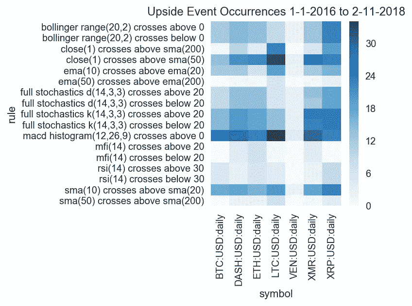

Figure 1\. Upside Event Occurrences

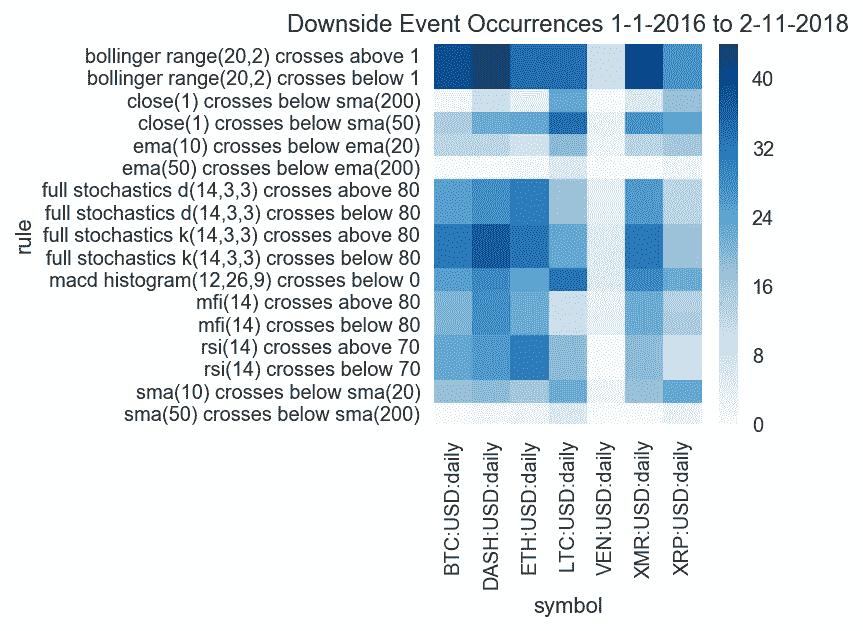

Figure 2\. Downside Event Occurrences

观察结果:

*   所有硬币的 SMA 和 EMA 50/200 交叉事件很少发生。这些事件可能对预测性能没有帮助，因为它们很少发生。
*   VeChain (VEN)一般很少有技术指标事件发生。因此，我们将把它从我们的分析中移除。
*   一般来说，价格高时发生的事件往往发生得更频繁(例如，布林区间突破 1，完全随机穿越 80 以上或以下，rsi 穿越 70 以上和以下，mfi 穿越 80 以上和以下)。这并不奇怪，因为加密货币在过去两年中一直在快速增长。

## 查看基线回报

接下来我们计算 1、7、14 和 28 天后的平均回报。在这个练习中，我们简单地计算每个周期后观察到的回报的平均值。这里可以看到，我们分析范围内的每一枚硬币都涨了。

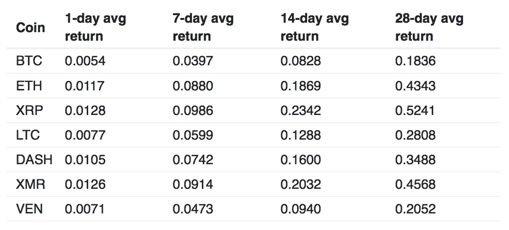

Table 2\. Average Returns For 1, 7, 14, and 28-day Periods

在我们分析事后回报时，这张表是需要记住的一组重要事实。**许多上涨的技术指标会出现，仅仅是因为价格的整体趋势是上涨的。**

然而，我们可以如上所述对此进行调整，将上行事件的“可预测性”定义为它们**超过平均回报**的程度，否则会被观察到。

## 计算和可视化“预测值”

现在是我们分析的主要核心。

首先，我们将查看事件发生后一段时间的收益，在本例中，是事件发生后 1 段时间的收益。

在上涨事件中，绿色单元格表示表现强于平均水平的区域，红色单元格表示表现弱于平均水平的区域。

在负面事件的情况下，如前所述，绿色单元格表示负面表现的区域(我们希望从负面事件中看到的)，红色单元格表示正面表现的区域(我们希望避免正面负面事件)。

所以记住，在这两种情况下，绿色是好的！

灰色区域代表没有结果的区域，因为没有观察到事件，因此没有分数。

## 上行事件观察:

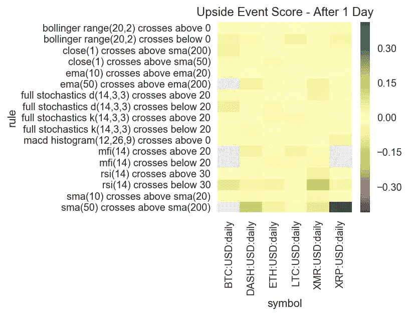

Figure 3\. Upside Event Returns - 1 Day After Event

*   对于上行事件，我们看到非常不一致的表现。除了潜在的`rsi(14) crosses below 30`，它只显示了 DASH 的负面表现。对于多个硬币，没有事件持续显示出比平均正绩效更好的绩效。
*   `full stochastics d crosses below 20`和`rsi(14) crosses below 30`显示了 BTC 每天有趣的潜在表现。然而，在过去的两年中，这两起事件都很少发生(分别为 12 次和 4 次)。
*   `sma(50) crosses above sma(200)`展示 DASH、XMR 和 XRP 每日有趣的潜在表现。然而，在过去 2 年中，这种事件发生不到 5 次。对于 LTC，此事件发生了 7 次，但性能并不高于平均水平。
*   此外，我们看到相当多的负面表现也蔓延到其他货币，这表明这些事件似乎并不能预测任何总体结果。

## 负面事件观察:

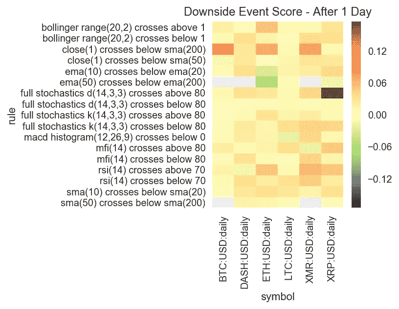

Figure 4\. Downside Event Returns — 1 Day After Event

*   总的来说，我们很少看到好的表现(记住:在这种情况下，好的表现将是负的回报)。这可能是因为在 2017-2018 年期间价值大幅上涨。
*   均线交叉似乎对 ETH 有一些价值。然而，只有 7 个 ema 10/20 交叉的观察值和 1 个 ema 50/200 交叉的观察值，我们现在不会太看重它。
*   还有一些其他非常小的表现良好的口袋，但总的来说，我们看到硬币之间的不一致，就像我们在上行事件结果中观察到的那样。

现在我们能做的就是看看其他时期。下图显示了事件发生后 7 天、14 天和 28 天的上涨和下跌事件表现。

## 事件后 7 天

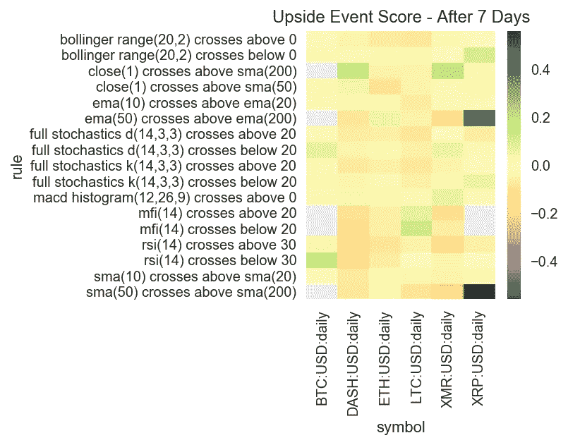

Figure 5\. Upside Event Returns — 7 Days After Event

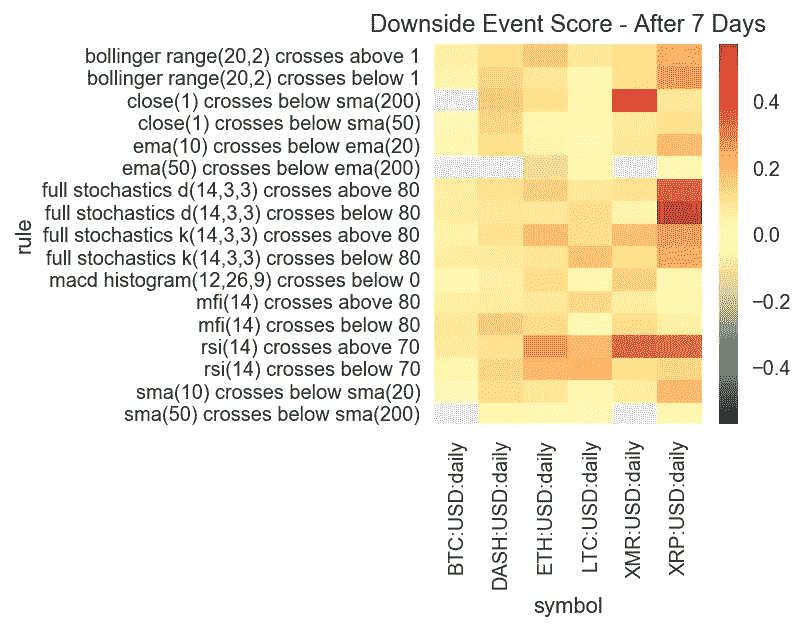

Figure 6\. Downside Event Returns — 7 Days After Event

## 事件后 14 天

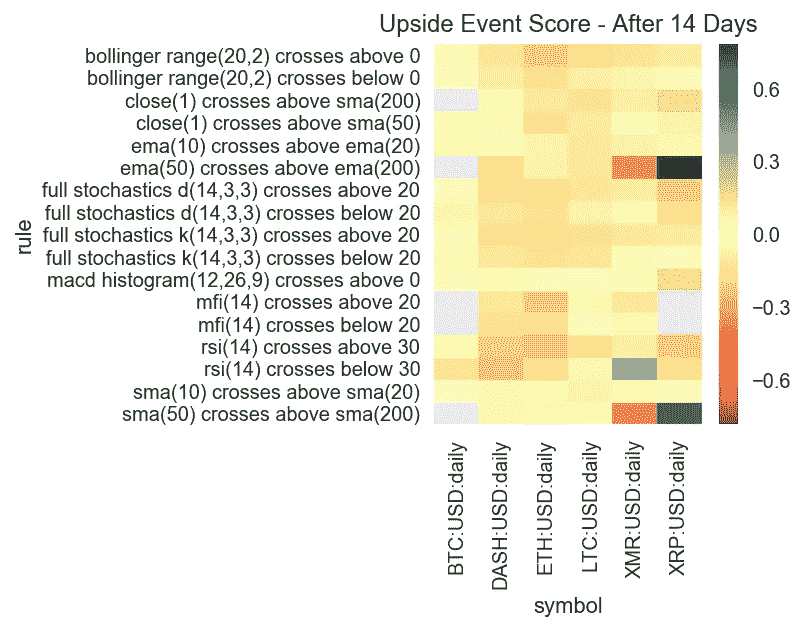

Figure 7\. Upside Event Returns — 14 Days After Event

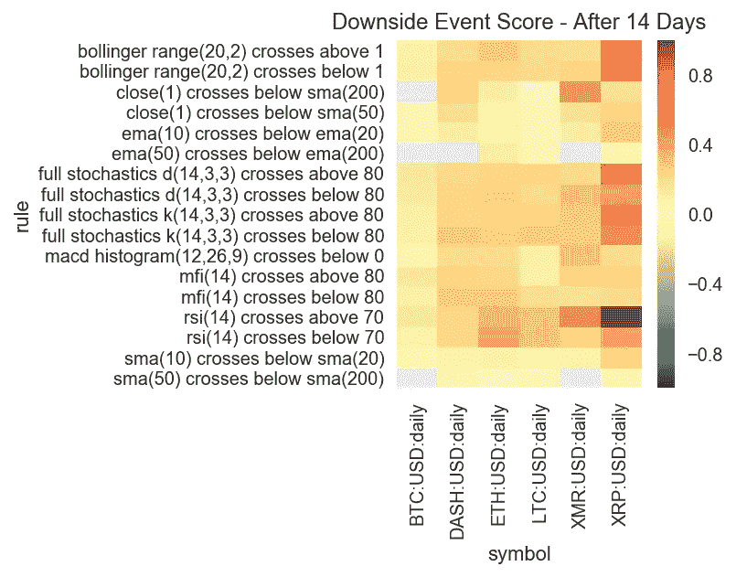

Figure 8\. Downside Event Returns — 14 Days After Event

## 事件后 28 天

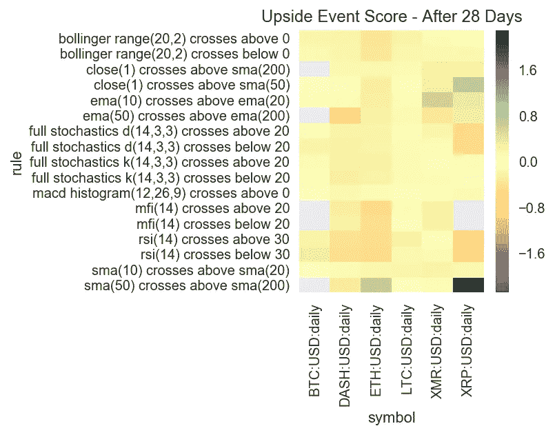

Figure 9\. Upside Event Returns — 28 Days After Event

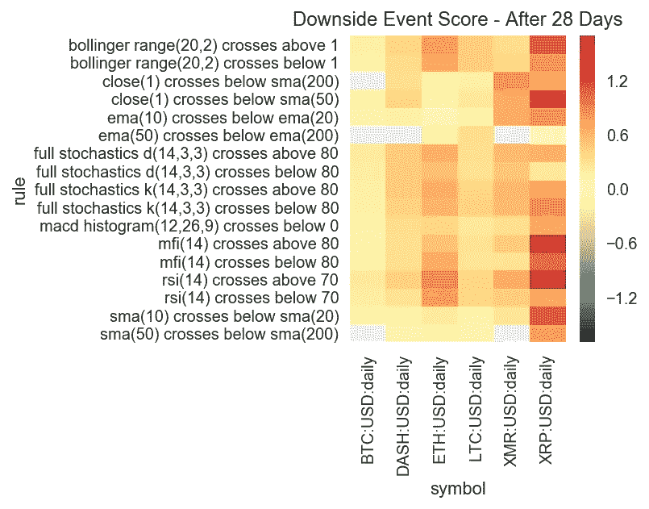

Figure 10\. Downside Event Returns — 28 Days After Event

总的来说，我们看到完全相同的模式，只有一个例外，可以进一步探讨。BTC 似乎在上升事件中表现相对较好，但只是在 28 天后。我们怀疑，这是因为 BTC 价格在分析期间的历史上强劲的上涨势头，与所讨论的具体指标事件关系不大。

# 结论

根据过去两年的每日数据，**我们为本次分析选择的技术指标事件****在以独立方式用于每日数据时，似乎对发现高于平均水平或负回报**没有很强的预测价值。

# 未来分析

虽然这些指标可能看起来不起作用，但我们不认为这一定是路的尽头。后续研究的一些潜在途径包括:

*   **扩展指标集:**我们知道我们只选择了一小部分指标。可能会有其他更好的加密货币。
*   **看指标的组合方面:**指标事件常用来支持一个论点，不单独使用。观察信号的组合可能会有所收获。
*   **调整指标时间段:**我们从经验中得知，用于股票的技术指标的标准时间段在用于加密货币时需要调整。我们的[遗传算法研究](/@gatsiva/using-genetic-algorithms-to-find-signal-in-cryptocurrency-noise-43206c5b2ad0)已经证明了这一点。探索哪些参数最有效是一项值得做的工作。
*   **观察这些回报如何随时间变化:**这是 Gatsiva 已经用我们的[置信带变动分析](https://twitter.com/gatsiva/status/957495638786232322)所做的。通过观察一段时间内指标的趋势，我们能够看出技术指标的趋势是变好还是变坏。
*   **应用“可预测性”的不同定义:**看待可预测性的方式不止一种。选项可能包括使用中间值而不是平均值，寻找回报的最小或最大阈值[等。](/@gatsiva/buy-on-dip-or-buy-on-rip-6a84fbe2cd08)
*   **更改分析的时间刻度:**每日数据的趋势可能太不稳定，但每小时的趋势可能会产生结果。我们现在正在进行这项分析，并将很快发布第 2 部分。

# 关于盖茨比

在 Gatsiva，我们提供 API 和工具，使分析师能够进行与上述类似的研究。我们还提供研究和教育文章，帮助交易者和分析师确定技术信号的可行性。

此外，Gatsiva 使用机器学习和遗传算法来寻找实际工作的技术指标事件，并跟踪它们在一段时间内的表现。我们认为，与使用通用指标(如本分析中提供的指标)相比，这是一个强大的优势。

要了解更多，你可以访问我们在 https://gatsiva.com 的[或在 https://twitter.com/gatsiva 的](https://gatsiva.com/)。

最后，如果你喜欢你刚刚读到的:请随意给这篇文章添加书签，鼓掌，或者留下评论！它帮助我们帮助更多的人！