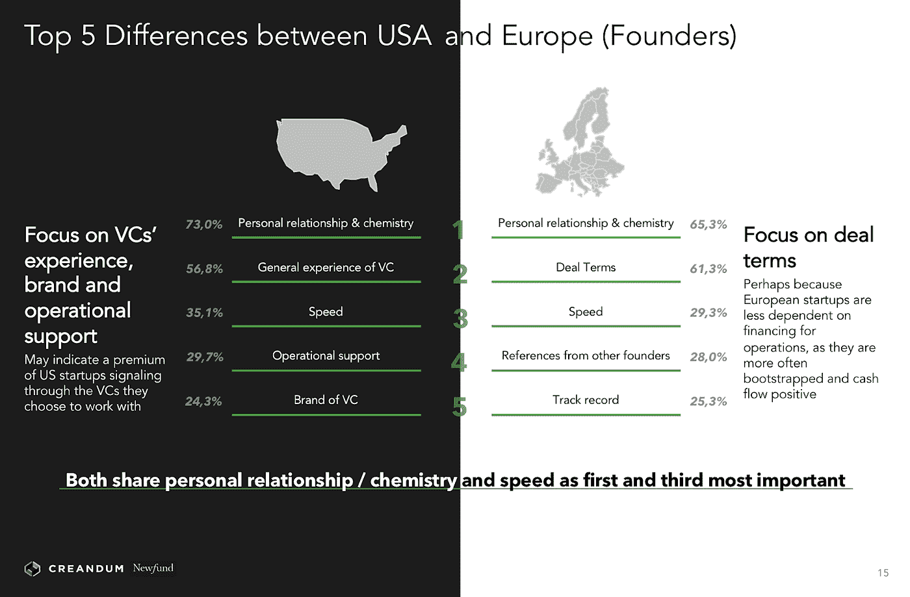
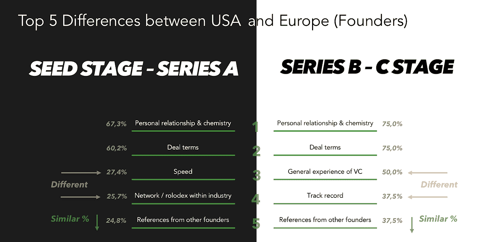

# 风投真的会增值吗？—创始人说有时候。

> 原文：<https://medium.com/hackernoon/do-vcs-really-add-value-founders-say-sometimes-f27bb956eb8c>

*注意:如果 Hacker Noon & Medium 允许多个作者，这篇文章将会有另外两个重要的名字。下面引用的研究，它的发现，以及本文的写作都是由来自芝加哥大学的亨利·德萨伊***[*new fund*](https://newfundcap.com/en)*和* [*欧文·雷诺兹*](https://medium.com/u/72beec1fde21?source=post_page-----f27bb956eb8c--------------------------------)***共同完成的。任何对这项工作的参考也应该包括他们的名字。*****

**作为风险投资家，我们为自己是“增值投资者”而自豪。我们不仅提供扩大公司规模的金融手段，还经常提供各种建议、关系和专业服务。我总是渴望成为我参与的任何公司最值得信赖和最有帮助的投资者和顾问。但老实说，我相当肯定风投往往会夸大我们对公司的影响以及我们带来的实际附加值。**

**基于这个想法，我和 [Newfund](https://newfundcap.com/en) 的[*Henri de says*](https://medium.com/u/e375cfb2cd66?source=post_page-----f27bb956eb8c--------------------------------)*着手更好地理解风投和创业者之间的微妙关系。风投真的会增值吗？创始人认为投资者的增值是什么？当创始人选择向谁融资时，他们如何评估投资者？***

***在来自芝加哥大学布斯商学院的考夫曼研究员项目和欧文·雷诺兹的支持下，我们就这个话题调查了 98 位风投和 121 位创始人。我们收集了来自各个融资阶段的受访者，以及管理资产在 3000 万美元至逾 3000 万美元 2B 的机构投资者。各行各业的创始人和风投都回答了一系列类似的问题，这些问题涉及他们对同行的看法。样本都是单独的库，所以没有匹配的样本对。***

******

# ***风投和创始人出现分歧***

***不出所料，创始人对这种关系的看法与风投不同。创始人报告的接触频率较低，获得的运营支持比风投报告的要少，而且——或许更直观地说——优先级也大不相同。***

***一个最鲜明的对比是，每个小组对风险投资对投资组合公司的影响和帮助程度进行评分的方式，从 1 到 10 分不等。从 1 到 10，普通风投给自己打了 7 分，而创始人给自己打了 5.3 分——相差 32%。***

******

***同样，风投们报告称，他们每周联系的频率几乎是创始人报告的每周联系频率的三倍。***

******

***结果反复指出，与创始人的观点相比，风投高估了他们在投资组合公司花费的时间以及他们的贡献。这种差异表明了创始人的失望，或许是对风险投资者角色的普遍误解。***

# ***投资和伙伴关系的决策驱动因素***

***该调查还详细描述了风险投资家和创始人之间如何做出合作决定的最能说明问题的方面。创始人列出了选择与风投合作的三个最重要的标准，风投列出了他们认为创始人评估他们的三个标准。***

***研究显示，创始人和风投都将私人关系和化学反应作为唯一最重要的决策因素。这支持了…的理论***

> ***…创业融资是一项关系业务。***

***然而，令人惊讶的是，这两个群体都将历史记录排在了榜单的较低位置。***

******

****Characteristics were ranked by percentage of founders and VCs that listed the item as top-three most important for decision-making.****

***这两个样本之间最大的区别在于速度和声誉。***

***创始人把速度列为第三重要的标准，事实上，风投把它列为最不重要的标准。这与创始人筹资时间表面临的严重限制是一致的，但令人惊讶的是，风投似乎并没有真正认识到这一点。***

***相比之下，风投认为创始人更看重合伙人的品牌和领导经验。风投通常认为他们的品牌能让他们赢得交易，但有趣的是，我们的研究显示…***

> ***…如果你能迅速提供令人信服的交易条款，你甚至有可能击败最强大的品牌公司。***

# ***操作支持***

***该研究的另一部分试图了解风险投资为他们的投资组合提供了哪些运营支持，以及投资组合公司使用了哪些服务。在这两个组之间也发现了类似的差异。***

******

****Perspectives of founders vs VCs and the operational support received.****

***超过 60%的风投声称为他们的投资组合提供人才/招聘和销售/业务发展支持，但不到一半的投资组合公司使用风投提供的任何此类服务。这项研究没有深入到这背后的细节，额外的研究可能有助于了解这种差异是由于此类服务的质量差还是投资组合公司缺乏需求。就运营(财务、法律和行政)和营销/增长而言，数字更接近，尽管…***

> ***…风投通常高估了初创公司创始人对其运营支持的影响的重视程度。***

***事实是，今天的风险行业花了很多时间向市场解释它提供的各种增值运营服务。最终，只有相当少的公司真正利用和使用这些服务。这可能表明，这些服务更多的是风投公司在竞争激烈的市场中脱颖而出的营销策略，而不是相信这些服务将对他们的投资组合产生改变游戏规则的影响。***

# *****美国 vs 欧洲*****

***不同地区的具体观点也有所不同。在决定与风投合作时，欧洲和美国的创始人都把个人关系&化学反应和速度作为第一和第三重要的特征。***

***欧洲创始人将交易条款的重要性置于美国同行之上。这可能是因为欧洲的初创企业更有可能自我发展，甚至在投资的早期阶段现金流也是正的。***

******

***根据我们的研究，专注于欧洲交易条款的风险投资公司可能会挤掉他们的竞争对手。尤其是美国的风投可能会利用他们的品牌来寻找交易，然而，这表明专注于对创始人的激励可能更有效。***

***相比之下，美国创业者报告称，风投的经验、运营支持和品牌比欧洲同行更重要。这可能表明，美国初创企业非常重视通过他们选择合作的风投公司传递信号。***

***尽管早期断言初创公司重视速度和交易条款，但这些子集表明，美国初创公司确实比欧洲初创公司更重视体验和品牌。***

***尽管大西洋两岸的创始人有不同的优先考虑，但美国和欧洲的风投认为创始人非常相似。这两类风投在做出合作决策时，拥有五个最重要特征中的四个。接受调查的风投们将个人关系&化学反应、合伙人的品牌和一般经验列为最重要的前三位，其余的只有微小的差异。***

# ***早期与晚期***

***在投资的不同阶段，创始人也有一些明显不同的优先事项。根据我们的调查，行业内的速度和网络在早期阶段更为重要。专注于早期投资的投资者可以通过更敏锐地关注速度和与潜在客户和合作伙伴的良好网络，在早期交易中获得比竞争对手更大的优势。***

******

***随着公司进入融资的后期阶段，经验和业绩记录取代了他们早期对速度和关系网的需求，这或许反映了谈判实力的增强。这似乎支持了风险投资家的做法，即等到他们获得了跟踪记录后，再进入更大的后期交易，因为这可能让他们有优势进入备受追捧的投资。***

***虽然各地的风投认为创始人的优先顺序非常相似，但从事后期活动的基金似乎认为，与专注于早期投资的基金相比，创始人的优先顺序截然不同。他们仍然将个人关系&化学反应和合伙人的品牌列为基金在决策中使用的首要特征，尽管其他优先事项有所不同。***

***将阶段限制在 pre-seed、seed 和 A 轮的投资者认为他们的创始人更重视交易条款、行业内的网络和合作伙伴的经验。条款的优先权反映了商业生命周期中期权价值的早期支点。相比之下，后期风投关注的是一般经验、跟踪记录，甚至适合运营支持。***

***然而，以管理的资产来衡量，不同规模类别的风险资本反应几乎没有差异，这是令人惊讶的，因为一个更大的基金将能够从运营支持职能中承担更多的成本。***

***这些排名和细节充实了风投和创始人之间的观点差异。这种差异表明双方之间存在一定程度的误解，也是弥合这些分歧的绝佳机会。***

***最后，风投和投资组合创始人通常有着相同的抱负——建立一家令人惊叹的公司。创始人和风投之间的个人化学反应最重要，风投认为他们提供的有形附加值被创始人打了折扣。无论如何，作为风投，我们将继续通过一切可能的方式支持我们的创始人，并推动我们的行业围绕这种支持的形式不断发展和迭代。💪👊***

***作为参考，此处提供了完整的研究报告:***