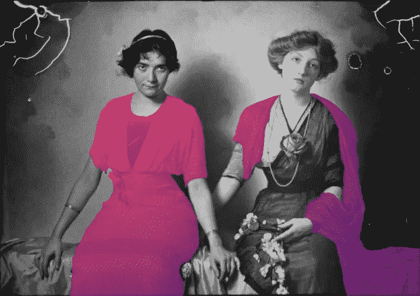

# 我们想要真实，还是足够真实？

> 原文：<https://medium.com/hackernoon/do-we-want-real-or-real-enough-2188995617b1>

有很多人强调虚拟现实如何很好地模拟现实世界。视觉效果和你的眼睛能看到的分辨率一样吗？当我们从悬崖上往外看时，如何让风吹到我们的脸上？我们能在酒馆里拿起一罐啤酒，喝下几个月大的花生在我们脚下嘎吱作响吗？

但有时，当虚拟现实没有试图成为世界的完美模拟时，它处于最佳状态。

还记得电视剧《重启》吗？那是计算机生成图像的早期，许多电视和电影试图通过一头扎进恐怖谷——或者更确切地说，是通过动画人物来展示它是多么令人印象深刻。他们是…很糟糕。毛发尤其困难，所有有毛的动物都是如此。另一方面,《重启》(由一个预算有限的加拿大小工作室制作)决定接受这种类型的弱点。他们创造的角色是[人形](https://hackernoon.com/tagged/humanoid)，但[卡通化](https://hackernoon.com/tagged/cartoonish)——有着块状的发型和不自然的肤色，符合这种类型的限制。

几个月前发布了 Reboot reboot，人们抱怨说自 1994 年以来 CGI 似乎变得越来越差。这并不是因为图像不好或者这部剧资金不足。相反，这是因为他们试图让它看起来更光滑，更现代，这样做，他们失去了使重启工作的简单性。

这是直接适用于 VR 的一课，也是一些游戏开发者正在接受的一课。

我们最近在办公室玩超级热游戏。该游戏以灰色块状景观为特色，充满红色多面人形。一切都是平面和边缘，加上相当现实的枪和刀。超级热的一个迷人的游戏机制是，敌人只有在你移动的时候才会移动。慢慢来(喘口气！)来瞄准，敌人就会停止移动。四处爬行，它们会向你爬来。开枪或挥刀，他们会在几秒钟内抓住你。

这种存在于视觉和时间中的非真实性不仅仅有助于游戏；它成就了游戏。这也不会减少沉浸感。速度是至关重要的，所需的身体素质会毫不费力地吸引你。

游戏不需要成为世界的完美再现。把这留给硬件开发人员吧，他们显然想把我们带到尽可能好的地方。目前，软件开发人员需要学会克服诸如优势等限制，创造足够真实的游戏，而不是真实的游戏。

*由鹪鹩手打为* [*锤子&獠牙*](http://www.hammerandtusk.com) *。*