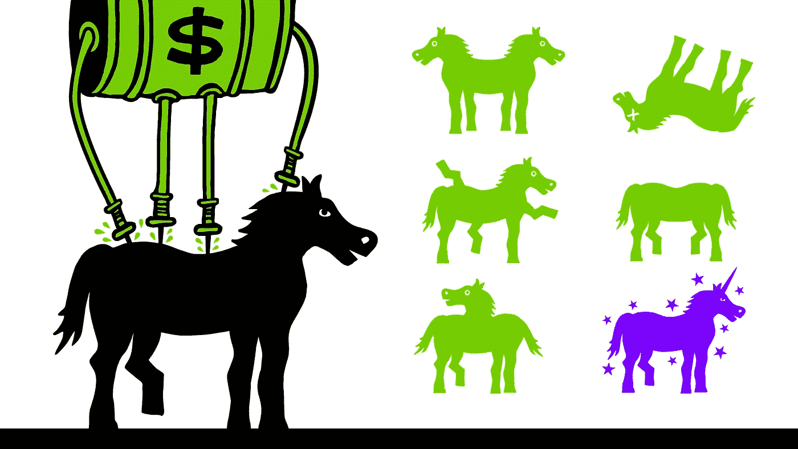

# 做品牌一定要两极分化吗？

> 原文：<https://medium.com/hackernoon/do-you-have-to-polarize-when-it-comes-to-branding-9a51789303e7>

## 黑客文化和接触你的人

Kanye West，Donald Trump， [Basecamp](https://basecamp.com/) ， [Nassim Taleb](https://twitter.com/nntaleb) 和 WWE 有什么共同点？

他们都利用了引人注目的两极分化观点的力量，并大声宣扬这些观点，以获得关注，并触及他们的核心受众。

每一个都是独立的案例研究，但要快速浏览它们，每一个都有一个背后的故事，在多个平台和媒体上大声重复。

有些人更为一致，比如 Basecamp 对“[硅谷心态](https://m.signalvnoise.com/reconsider-41adf356857f)”的否定立场，或者纳西姆·塔勒布最喜欢的“[知识分子兼白痴(IYI)](/incerto/the-intellectual-yet-idiot-13211e2d0577) ”群体。其他的，视情况而变，叙事可以用于利益。例如，唐纳德·特朗普在总统竞选期间的各种标签——不诚实的希拉里(克林顿)，说谎的泰德(克鲁兹)，低能的杰布(布什)等等。

The VC’s search for unicorns. (Image — Basecamp)

WWE 也知道如何使用这种策略来吸引人们对所谓的“脚跟”的关注，或者一个坏人应该创造转移观众对他的仇恨的动力，从而支持“娃娃脸”或好人，这是目前“推动”超级明星名册的排名。

我强烈支持这样一种观点，即更多的人应该开创自己的事业，而不是抱怨或对自己目前的就业状况感到不满，我就经历了这一点。

我还在想如何在我公司的网站上表达这句话，第一次迭代是“生命太短暂，不能成为一名员工”。

***注*** *:我确实意识到这种说法需要改进，因为真正快乐的员工比例很低。*

“低%”是这句话的关键部分，因为我相信大部分人对他们目前的职位没有积极的情感投入。

我们的信息旨在尊重和祝贺少数快乐的员工，他们可能会从我们的产品中受益，但我们的沟通和内容应围绕鼓励和帮助不满足于当前就业模式的人做些什么。

这也是我的真理，因为这个项目会让我在经济上，更重要的是在时间、地点和决策上独立。

希望通过分享我们的[流程](https://weardulo.com/blogs/origins)，我们可以在这个领域建立一个真实的声音，并通过大声疾呼和保持一致，达到我们可以为其提供最大价值的核心人群。

当坚定地支持一种观点时，总有冒犯他人的风险，但只要意图是好的，我就把它视为一次有趣对话的机会。

你坚定支持的立场/观点是什么？