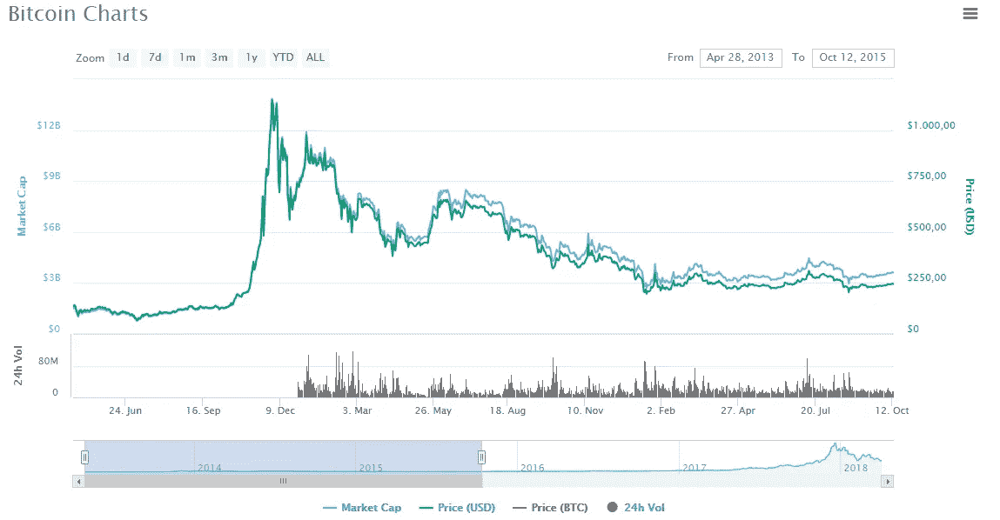
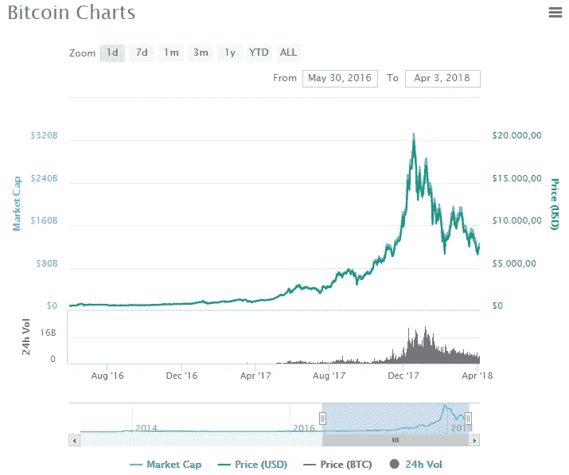
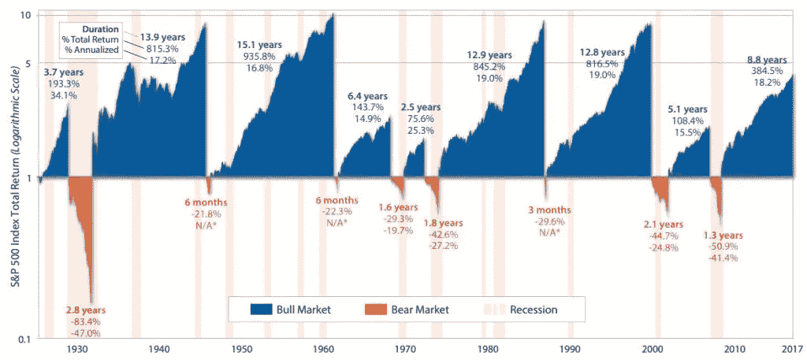
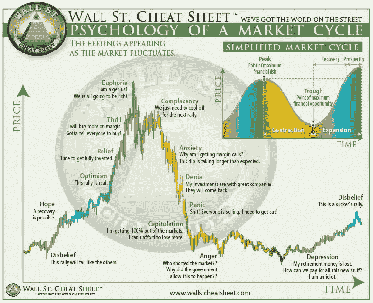
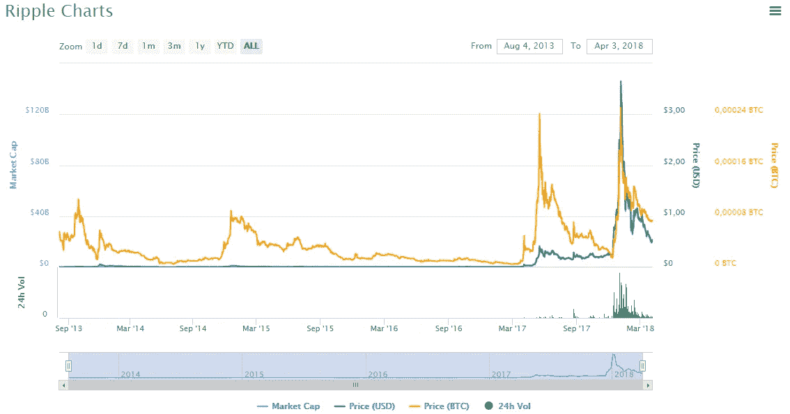
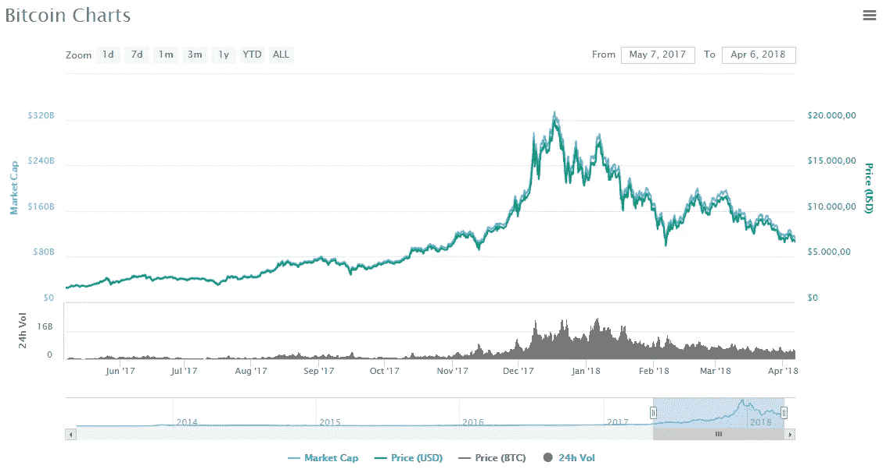
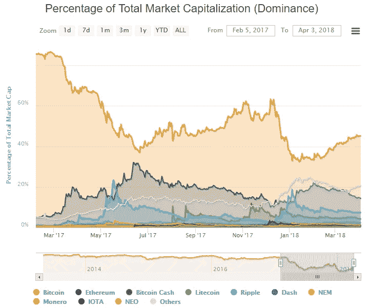
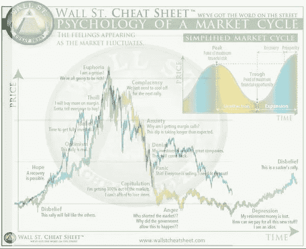

# 你知道密码市场周期吗？你应该

> 原文：<https://medium.com/hackernoon/do-you-know-about-crypto-market-cycles-you-should-c8976c3cde84>

比特币价值 2013 年 10 月 16 日——150 美元，比特币价值 2013 年 11 月 30 日——1150 美元，比特币价值 2013 年 12 月 19 日——560 美元。那是什么？

我们都记得 2013 年底巨大的比特币挤兑，或者给它一个更通俗的名字——“2013 年泡沫”。我并不是说称之为泡沫是对还是错，但我可以告诉你，这一切都与市场周期有关。2013 年后，比特币的[价格下跌，因为似乎出现了一次长期回调。之后的几个月，我们经历了长时间的盘整和跌势中的投降，直到 2015 年 10 月。](https://cryptopotato.com/bitcoin-chart-analysis/)

比特币图表 2013–2015。快进到今天的市场；比特币在 2016 年年中越过 500-600 美元大关时出现了巨大的反弹，从那里开始，唯一的出路是升至 20，000 美元。在触及峰值后，有一个快速的 2 个月回落到今年 2 月 6 日的 6000 美元。这是本文写作时的最低记录。当我们仔细观察比特币图表时，毫无疑问，2013 年的图表与 2017 年的图表几乎相同。

# 什么是市场周期？

一般来说，我们谈论的是市场的两个高点或低点之间的时间段。在保守的股票市场中，这样的市场周期平均会持续较长的时间(几年)。下图显示了美国证券交易所的历史周期，从 1929 年的大萧条开始到今天。

最近一次著名的周期低点是在 2000 年和 2008 年左右。它们分别是网络泡沫和次贷房地产危机。纳斯达克指数又接近峰值了吗？时间会证明一切。正如你所看到的——“市场上有楼梯，下有电梯”，这也适用于任何其他金融市场，包括加密市场。

保守的股票市场和秘密的股票市场的不同之处在于秘密的波动性。纳斯达克的每日大幅波动被认为是 1——2 %,而被认为是最稳定的加密货币和基础资产的比特币每天可以下跌超过 10%(上涨 17%,反之亦然)。这被认为是正常行为。

# 市场周期的心理学

cheatsheet.com 的作家凯伦·班尼特创造了一个惊人的图表(见上图),展示了市场周期的心理状态。它描述了市场波动时人们最常见的情绪。这些人类情感比市场基本面更能驱动我们的金融市场。

# 满足市场周期的 10 个阶段

**第一阶段:希望**

“希望”是“严重怀疑”阶段(见阶段 10——周期中的最后一个阶段)后复苏的第一个迹象。市场正显示出新一轮牛市的积极信号。然而，投资者仍然小心翼翼。少量的钱正在被投资。

**第二阶段:** **乐观**

乐观定义了第二阶段，即随着新资本的投入，价格不断上涨。当市场已经持续上涨了好几个月，这个阶段就到了。市场前景乐观，因此许多投资者愿意在这个阶段投资。

第三阶段:信念

随着时间的推移，乐观变成了信念。这个“信念”阶段被定义为牛市的最初迹象之一。投资者在市场中寻找新的机会。

**第四阶段:惊险刺激**

如果你知道自己在做什么，寻找其他投资选择可能是个好主意。当人们选择随机项目时，他们很容易陷入兴奋之中，因为他们相信没有什么会出错。一切都在上涨。
记录你的兴奋程度很重要，因为过度兴奋是平仓的明显信号。

**第五阶段:欣快感**

一个巨大的助跑的结束被定义为兴奋。人类的情感正在接管，现在没有什么能阻止我们，都是小狗和阳光。只有一个方向——向上。在牛市的这个阶段，“愚蠢的钱”跳上火车，这种钱是第一个离开的。在这个阶段，期待媒体报道牛市，你会看到“认识新的年轻百万富翁”的文章。在这个阶段，精明的投资者在整个抛物线运动中获利。

**第六阶段:自满**

在这个阶段，牛市停滞不前，因为人们的崇高期望没有得到满足。市场反转的最初迹象开始出现。这是一个非常危险的阶段，因为人们认为自满阶段只是牛市继续之前的短暂休息。许多投资者对即将到来的市场逆转准备不足。

**第七阶段:焦虑**

最后，人们意识到牛市不会永远持续下去。他们看到市场正在逆转，损失价值和金钱。对亏损的恐惧让交易者延迟了亏损的实现，然后亏损变成了更大的亏损。

**第八阶段:拒绝**

然而，你的投资价值继续下跌，许多投资者拒绝卖出，希望出现更大的向上修正。投资者的行为是防御性的，因为他们相信自己的投资是明智的。然而，一般来说，几乎没有硬币是可以逃脱惩罚的。下雨时，每个人都淋湿了。

**第九阶段:恐慌**

随着熊市成为新的现实，市场继续下跌。投资者试图通过拼命抛售他们的投资来挽救他们的资金，因为他们害怕失去一切。我们经常会在恐慌阶段看到大规模抛售。

**第十阶段:抑郁症**

人们对现有的市场状况失去了所有的希望和信心。市场处于当前周期的最低点(后面会注意到)。这是稳定和巩固再次开始的地方。这个阶段可能需要很长时间。

**一般情况下**

这 10 个阶段随着时间的推移不断重复，定义了一个市场周期。不是每个市场周期都会遵循这个图表和它所花费的时间。然而，它会给你一些关于市场周期心理学的有价值的见解。所有市场都会经历短期周期。这些周期的持续时间和幅度部分由风险决定(对于加密市场来说，风险非常高)。然而，市场周期很难预测。但是，我们知道，市场不会无限期地持续上涨或跌至零(在合法市场中)。过去，他们总是“回归中庸”

# 比特币不是唯一一个循环的

比特币不是唯一显示特定市场周期的密码。看一下波纹图。你可以发现两个大的市场周期和两个小的周期。这只是“山寨币季”的一部分。不仅仅局限于涟漪。

# 市场周期趋势

在加密市场周期中，我们通常会看到两种主要趋势:

1.  *流动性进入*:新的资金流入市场。大部分资金流向了比特币，因为这是加密市场的切入点。

1.  *比特币的统治地位*:比特币的统治地位从 2017 年 12 月开始下降，因为许多投资者都在寻找新的替代比特币投资。这种替代硬币购买的激增有时是一个指标，表明随着人们寻求新的机会，市场已经超买，因此可能预示着不久的将来新一轮下跌的开始。

# 在当前的市场周期中，我们处于什么位置？

第一，没人知道，只能估计。目前，我们似乎处于愤怒和沮丧之间(下图显示了实际价格和市场周期图)。如前所述，我们已经从 20，000 美元区域大幅回调至 6，000 美元(撰写本文时)。我们预计价格将暂时保持稳定或小幅下跌。这总体上是积极的吗？是的，肯定的。这是自然的，需要发生。欣快的感觉让区块链的空间变得臃肿。大萧条将扼杀许多不必要的项目，即愚蠢的资金，并将为更强大的真正项目创造一些空间，这些项目将继续存在，并为新的、更好的项目和新的明智投资资金创造空间。

# 市场周期投资的最佳方法

随着市场从熊市走向牛市，我们认为有必要经历一次“复苏”。在之前熊市的损失得到弥补之前，市场不太可能进入真正的牛市。乐观/信念阶段可以被视为新一轮牛市的切入点。一般来说，在市场疲软时(愤怒、抑郁或不相信的感觉)或在抑郁或积累期间(即 2014 年年中至 2015 年是 300 美元左右的长期积累期)买入，在市场强劲时(乐观、相信或欣快情绪的感觉)卖出。

小心，因为市场周期并不完全遵循这种模式。在一些极端市场中，熊市永远不会在陷入更深的熊市之前完全收复失地。

# 总之:理解市场周期的关键步骤

*   市场周期是很自然的事情，接受它吧。
*   切断情感，因为它们会成为你最大的敌人。
*   寻找能够引发新阶段的积极和消极的催化剂。
*   很难确定确切的起点和终点。
*   市场周期有助于分析师做出更好的决策。
*   低买高卖。就这么简单。

*原载于 2018 年 4 月 17 日*[*【cryptopotato.com】*](https://cryptopotato.com/what-are-crypto-market-cycles/)*。*