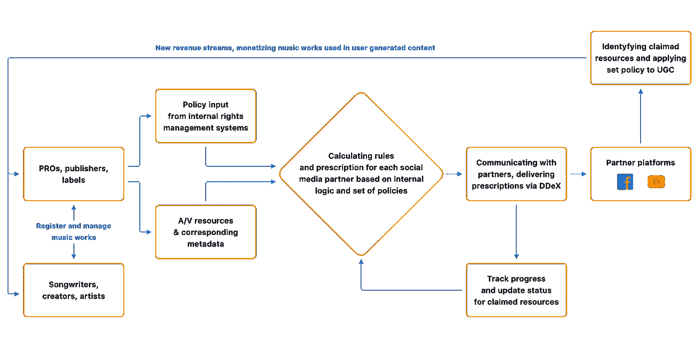

# 你会说 DDEX 语吗？如何管理用户生成内容中的音乐版权

> 原文：<https://medium.com/hackernoon/do-you-speak-ddex-how-to-manage-music-rights-in-user-generated-content-f30245d567de>

> “我们最终会看到一个全新层次的用户使用授权音乐生成内容，这将成为更大的一部分业务。在 UGC 领域与完全授权的玩家合作将意味着我们可以为音乐粉丝创造更好的体验，并公平地支付权利持有人。”— Ole Obermann，华纳音乐集团首席数字官兼业务发展执行副总裁。

[音乐和社交媒体](/the-mission/making-music-social-what-drives-streaming-revenues-4a41f665d6e8)的融合意义深远，这也是用户生成内容(UGC)成为现代音乐业务如此重要的组成部分的原因。从视频和照片到评论、博客和社交媒体帖子，个人贡献者在消费的内容中所占的比例迅速增加。与传统的广播和出版不同，UGC 以点对点的关系存在，因为社交媒体和其他互联网平台创造了一个前所未有的媒体世界，几乎任何人都可以经营自己的节目。

**从用户生成的内容中赚钱的漫漫长路**

音乐行业的 UGC 盈利潜力是巨大的。然而，这一收入流只是最近才被挖掘出来。大多数用户生成的内容需要音乐，但普通人缺乏知识和资源来合法授权一首歌曲的使用。建立一个允许内容创作者支付少量费用来换取音乐使用的系统，可以为中小型艺术家提供可观的收入流。然而，目前涉及许可交易的复杂性使得许多创作者难以接受。

不足为奇的是，在 YouTube 推出后不久，大量内容在未经许可的情况下使用有版权的材料上传。当然，版权所有者对这一快速趋势感到不安，他们对导致 YouTube 实施内容 id 的平台提起诉讼。艺术家或唱片公司等权利持有人将音频文件和相关元数据上传到公司，公司随后生成并存储数字指纹。上传到 YouTube 的新内容会自动与该数据库进行比较，如果与存储在内容 ID 数据库中的内容匹配，就会被标记为侵犯版权，从而导致未经许可的内容被阻止或通过广告货币化，这取决于受版权保护的内容的所有者所控制的设置。据估计，YouTube 每天有 13 亿用户和大约 45 万小时的视频被上传到 YouTube，该公司表示，去年它在全球向音乐行业支付了超过 10 亿美元。UGC 的收入潜力显然很大，但创作者经常指责互联网巨头低估音乐的价值，并支付很低的费率。每用户每年不到 1 美元，相比之下，Spotify 等广告支持服务的每用户每年为 20 美元。

YouTube 并不是这个不断增长的市场中唯一的大玩家。脸书已经进军音乐领域。多年来，在这个世界上最大的社交媒体平台上，推广和营销的好处被认为超过了任何版权侵权问题或缺乏货币化。然而，去年，情况终于发生了变化。脸书与华纳音乐集团、环球音乐集团和索尼/ATV 音乐达成协议，授权这些唱片公司的音乐出版目录用于用户在脸书、Messenger、Instagram 和 Oculus 上分享的视频和消息。这还不止于主要的唱片公司，脸书和 Merlin、Kobalt Music Publishing、TuneCore、SECAM、ICE Services 以及音乐许可生态系统中的其他重要参与者之间正在签订额外的许可协议。随着立法慢慢跟上现代音乐市场的现实，毫无疑问，来自这些许可证的收入可能成为艺术家、唱片公司和所有其他权利持有人的重要收入来源。

**社交媒体平台代言 DDEX**

到目前为止，DataArt 已经与音乐公司合作了近十年，我们亲身经历了在社交媒体平台上整合和正确管理用户生成内容的音乐版权的挑战。所需的技术架构还没有完全开发出来，还存在许多问题，例如标签和平台是否已经做好充分准备来实现最近的许可协议，以及如何最好地利用当前的 API 或完全不同的系统(如 DDEX)来标准化数字供应链。

[数字数据交换](http://ddex.net/) (DDEX)近年来在音乐行业获得了重要的立足点。DDEX 是由领先的媒体公司、音乐授权组织、数字音乐服务提供商和技术中介组成的联盟，旨在开发一套标准的 XML 消息，用于数字媒体供应链中运营的组织之间的企业对企业信息交流。与音乐行业中使用的其他格式(如通用作品注册(CWR)格式)相比，DDEX 的音乐作品标准支持一组不同的用例，如许可流程、传达 UGC 政策、发送与作品相关的音频文件(如音频指纹)等。DDEX 标准是公开的，可以免费获得标准实施许可。

可以说，DDEX 提供了迄今为止最好的统一机制来交换元数据和关于音乐作品所有权主张的其他信息，并且它特别适合管理用户生成内容中的音乐权利。出于这个原因，DDEX 目前正被脸书用于其与音乐公司沟通的不断发展的技术基础设施。YouTube 已经用 DDEX 消息取代了原来的 XML feed，过渡到一种更标准化的方式来支持其内容 ID 的效率(尽管“旧的”YouTube xml 仍在使用，但不建议用于任何新的集成)。

**DDEX 一体化的挑战**

DDEX 允许权利所有者要求特定的 A/V 资源，并传达可应用于上传到平台的现有和新内容的某些政策。概括地说，版权所有者和社交媒体合作伙伴之间的沟通过程是这样进行的:

有三个主要政策可以传达给平台，以规范用户生成内容中音乐作品的使用:

*   报告使用情况
*   阻止资产
*   货币化

根据这些指令，这些平台可以删除侵犯版权的内容，应用广告支持或其他货币化原则，或者向版权所有者提供统计数据。由于音乐交易通常包括许多特定地区和其他个别条款，因此可以传达更详细的规定，以适应基于这些规则的更复杂的政策。然而，并不是所有的内容都得到 YouTube 和脸书的同等支持，每一个合作伙伴的内容都需要单独验证。

使用 DDEX 的 XML feed 时要记住的重要事情是，每条新消息都必须传达关于资源和相应策略的所有相关信息，因为每条新消息都会使之前的指令失效。从这个角度来看，遵守 DDEX 音乐唱片公司和出版商标准的最大问题往往来自复杂且往往不协调的内部系统。根据我们的经验，很少有一个数据库或权限管理系统可以有效地与外部 UGC 合作伙伴集成。填充提要的数据通常来自不同格式的多个内部来源，需要仔细调整和验证。在这种情况下，我们建议音乐公司开发一个自定义接口，用于处理传入和传出的提要，将本地 XML 消息转换为 DDEX 标准，并存储所有交易的历史记录。

以下是我们的开发团队提供的其他一些提示，可以帮助避免 DDEX 与 YouTube 和脸书整合的隐患。

*   确保在 XML 文件的“Deals”部分包含所有区域。DDEX 支持多项交易，这些交易可以解释不同地区的不同条款。每个交易可以包括受同一政策管辖的区域列表。
*   验证所有内部数据源的 ISO 代码，以符合 DDEX 的要求。您可能需要转换某些遗留的 ISO 代码来准确填充 DDEX 源。
*   YouTube 每个 ISRC 只能接受一个二进制文件。二进制文件将用于识别用户生成内容中的音乐作品。
*   20 秒以下的音频文件此时不能用于音频指纹识别。
*   脸书目前只接受某些音频格式的二进制文件。推荐格式是 FLAC。不接受 DSF 音频格式。

一般来说，整合的成功和效率很大程度上取决于音乐公司内部元数据的质量。虽然 YouTube 有一个更成熟的系统，并已运行多年，但脸书仍在开发其技术基础设施，DDEX 的一些核心功能可能还不可用，或者只能在有限的能力内运行。

总而言之，许多复杂因素依然存在。与此同时，技术专家和其他行业参与者正在努力工作，以确定在快速增长的用户生成内容世界中全面推进简单而有效的音乐版权管理系统所需的答案。

*由* [***谢尔盖·布多夫***](https://www.linkedin.com/in/sbludov/) *高级副总裁* [*媒体与娱乐实践处* ***数据艺术***](https://www.dataart.com/industry/media-and-entertainment?utm_source=medium.com&utm_medium=referral&utm_campaign=m-regular&utm_content=sbludov-hn-ddex)