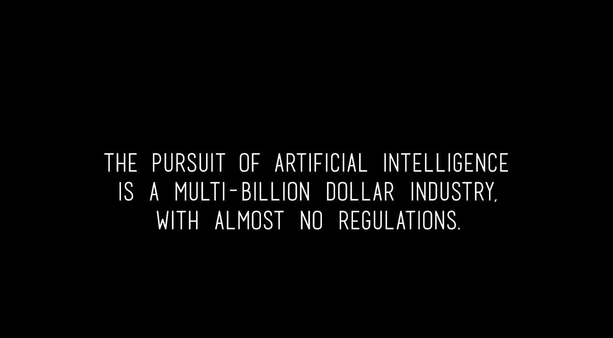

# 你信任这台电脑吗？

> 原文：<https://medium.com/hackernoon/do-you-trust-this-computer-bc4ce2865b36>

Source: doyoutrustthiscomputer.org

我们生活在 2018 年，每个人都是技术的粉丝。

我们大多数人几乎没有意识到我们与当今世界的数字互动的数量。

这部由克里斯·佩恩执导的电影以批判的姿态提醒我们“人工智能”不再是科学幻想。事实上，某种程度上它已经存在了。这是一个温和的提醒，让我们思考并重新思考人工智能的规则、控制以及如果我们不小心对待我们不理解的事情会发生什么。

如果你追随埃隆·马斯克，你现在可能已经看过这部电影了。如果你还没有，去 doyoutrustthiscomputer.org 的[看看吧](http://doyoutrustthiscomputer.org)

以下是我对这部电影的看法。

# 过去，现在，未来

## 过去

这部电影以对 90 年代“人工智能科幻”的酷炫引用开始。

接下来，它讨论了我们在技术上取得的惊人突破。

令人惊讶的是，我们作为有创造力的作家和导演所想象的“科幻”现在已经成为了普遍的现实。

## 礼物

我们与科技携手并进。
我是一名大学生，拥有一部手机、一台笔记本电脑或者智能手表、平板电脑是很正常的事情？

今天，我们正在以几年前无法想象的速度生成数据。

[脸书](https://hackernoon.com/tagged/facebook)本身就有 2B 用户。大学生几乎生活在 Instagram 上。你可以在推特上关注世界上几乎任何人，甚至不需要亲自了解他们。

提到了该领域的各种创业公司和研究。

## 将来的

你被警告‘人工智能’可能带来的负面影响。

从最伟大的前沿研究者，企业家，实践者的观点被提出。

我们有波士顿机器人公司的机器人，它们能够像人类一样做机械运动。

Affectiva 能够从我们的面部表情中检测出人类的情绪。

[自动驾驶汽车来了](https://hackernoon.com/how-far-are-we-from-a-fully-autonomous-driving-world-89fde97b5352)。

DeepMind 在我们认为至少需要 100 年才能打败我们的游戏中打败了人类。

# 警告

在整部电影中，甚至电影本身的动画都有一种黑暗的气氛。

我们不断被提醒如果事情出错会发生什么？

技术正以不可阻挡的速度发展，这是不可避免的。

举了飞机的例子:莱特兄弟在 20 世纪初进行了他们的第一次飞行，几年后我们有了商用飞机。

现在我们关心的不是飞行，而是我们是否能得到靠过道或靠窗的座位。

飞行汽车也将变得普遍！

我们知道各国都在研发自主武器。

提出的问题非常基本:
如果 AI 没有去中心化会发生什么？
与可以被罢免或暗杀的独裁者不同，AI 将是不朽的。

当我们的数据被用来对付我们时会发生什么？

即使是现在，研究人员也不了解他们构建的人工智能系统的每一点。

我们如何控制一个比我们更强大、更强大、更聪明的东西？

AI 就是代码。它没有情感。它有一个需要实现的目标。
如果我们在通往目标的路上会发生什么？

“我们的想法不是阻止黑仔机器人上街，而是防止它们发生。如果他们来了，那就已经太晚了。”
——埃隆马斯克。

*如果你觉得这篇文章很有趣并且想保持联系，你可以在 Twitter 上找到我* [*这里*](http://twitter.com/bhutanisanyam1) *。*