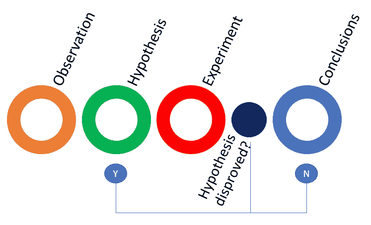

# 你知道“解决方案偏差”到底有多大吗？

> 原文：<https://medium.com/hackernoon/do-you-understand-how-big-of-a-problem-the-solution-bias-really-is-f6f10ec59e3>

我看了约翰·麦地那教授的演讲，他说了一句话，引发了这篇文章:

> “如果你在乎你所相信的，你永远不应该在调查领域”

我来解释一下原因。

# 解决方案偏差

关于通常被称为解决方案偏见或“爱上解决方案”的两个主题，已经有很多文章发表:

1.  在真正理解问题之前，我们如何倾向于直接进入解决模式。考虑到“*定义明确的问题是解决了一半的问题*，这是产品失败的主要原因。
2.  我们如何“致力于”我们的解决方案，使我们不愿意尝试和/或接受反馈

我们没有专注于获得对用户和痛苦的深刻理解，而是在不正确的假设基础上构建解决方案，最终得到一个没人想要的产品。

我们只是制造产品，而不是系统地实验我们的假设，当我们做实验时，我们用借口来证明负面反馈的合理性。

# 产品开发主要存在于研究领域

为什么约翰·麦地那的这句话能引起我的共鸣？

因为很长一段时间以来，我一直在与团队合作增加实验，我相信需要的一个根本变化是心态的转变。

而这种改变是朝着开放、好奇和愿意相信任何事情(并反驳任何解决方案)的方向。可能也是成为科学家所需要的特质。我们大部分的产品发现工作都生活在一个相似的地方，除了我们可能使用的不同技术之外，潜在的过程与科学方法使用的是一样的。

正如 Ash Maurya 所说，你必须[热爱问题，而不是你的解决方案](https://blog.leanstack.com/love-the-problem-not-your-solution-65cfbfb1916b)。