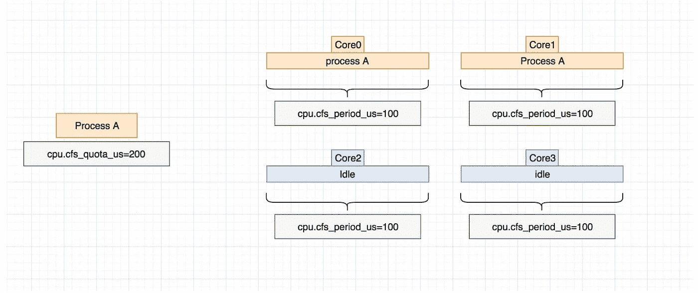
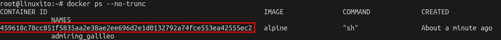
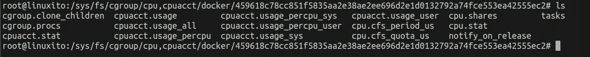

# 码头配额和马里奥兄弟

> 原文：<https://medium.com/hackernoon/docker-quotas-and-mario-bros-706aad98ba72>

# 简介:

很久以来我一直想写关于 **docker** 和[CFST5(完全公平调度器)的东西，但是我一直忙于工作等。](https://en.wikipedia.org/wiki/Completely_Fair_Scheduler)

我将使用 Docker 来限制进程的 **cpu** 使用率，我们将探索我们需要什么样的指标来对供应不足的应用程序进行故障排除，我们将使用 [**fceux**](http://www.fceux.com/web/home.html) 和 **mario**

# CFS(调度程序):

**CFS** 已经成为 **linux** 内核的默认调度程序有一段时间了，这并不是试图深入解释它，但是有很多关于这一点的有趣数据，尤其是关于主要开发者来自医疗领域之类的东西。

调度周期用 **cpu.cfs_period_us** 表示，它们实际上是以微秒表示的时间单位，你可以称之为一个 c **pu 周期**的长度，但重要的是

它可以做得更长或更短。没有 **cpu.cfs_quota_us，**周期就什么都不是，就像是在说，如果我们不打算在这段时间里节流或做任何事情，那么计算时间又有什么意义。

在下面的例子中，一个给定的**进程 A，**已经配置了一个:

```
**cpu.cfs_period_us = 100****cpu.cfs_quota_us = 200**
```

这可能看起来令人困惑，但是 **perdiod** 按照 **cpu** (内核，如操作系统所见)计算，这意味着该配置将允许进程 A“爆发”并运行 2 个周期(每个 **cpu** 中 1 个周期)而不被抑制。



yellow indicates your allowance

# 码头限额:

以上是理论，实际上你可以通过使用一些标志来达到同样的效果，例如:

```
docker run -ti **--cpu-period=50000 --cpu-quota=1000** alpine sh
```

这将创建一个新的 **cgroup** leaf，你可以这样找到它:



有了容器 ID，我们将会到特定的**组**叶:



这里有很多真正有趣的东西，但我们将重点关注 **cpu.stat，**它看起来像这样:

```
nr_periods **51**
nr_throttled **45**
throttled_time 2313838319
```

基本上这意味着我们已经运行了 **51** 个周期，其中有 **45** 个周期被节流，节流时间为 **2313838319** us。

这在分析您想要**停靠**的应用程序时非常有用，例如，调整限制指标应该会让您的进程不会受到太多限制。

# 马里奥呢？？

我想选择一个过程，让我用图形来展示它，而不是用 python 脚本来寻找质数或类似的东西，所以 Mario 是这样的:

## 马里奥周期= 50000 配额= 1000 [[~7 FPS]](几乎 100%节流)

```
docker run -ti — cpu-period=**50000** — cpu-quota=**1000** -e DISPLAY=$DISPLAY -v /home/jgarcia/Projects/games/games/:/games -v /tmp/.X11-unix:/tmp/.X11-unix -v /run/dbus/:/run/dbus/ — privileged 352b46a178cb
```

结果:

```
nr_periods **411**
nr_throttled **385**
throttled_time 22032678629
```

50000x1000

## 马里奥周期= 50000 配额= 2000 [[~15 FPS]](还是不好..)

```
docker run -ti --cpu-period=**50000** --cpu-quota=**2000** -e DISPLAY=$DISPLAY -v /home/jgarcia/Projects/games/games/:/games -v /tmp/.X11-unix:/tmp/.X11-unix -v /run/dbus/:/run/dbus/ --p
rivileged 352b46a178cb
```

结果:

```
nr_periods **419**
nr_throttled **397**
throttled_time 18784846882
```

50000 x 2000

## 马里奥周期= 50000 配额= 5000 [[~40 FPS]](非常好)

```
docker run -ti --cpu-period=**50000** --cpu-quota=**5000** -e DISPLAY=$DISPLAY -v /home/jgarcia/Projects/games/games/:/games -v /tmp/.X11-unix:/tmp/.X11-unix -v /run/dbus/:/run/dbus/ --privileged 352b46a178cb
```

结果:

```
nr_periods **385**
nr_throttled **32**
throttled_time 992353904
```

50000x5000

## **马里奥跑配额少[[~62 FPS]](完美！！)**

撒野！！

```
nr_periods 0
nr_throttled 0
throttled_time 0
```

No limits

## 最后备注:

我并不提倡运行无限马里奥，但我只是想展示获得一些过去很难收集的数据是多么容易，并对其进行微小的调整。

抱歉，gif 文件太大了，我已经尽力了。