# 无服务器架构语言

> 原文：<https://medium.com/hackernoon/documenting-serverless-architectures-69bf63fc67b0>

# 有什么问题？

有了[无服务器](https://hackernoon.com/tagged/serverless)计算平台，我们，[软件](https://hackernoon.com/tagged/software)开发者，终于可以抛开所有不相关的技术细节，开始交付我们所需要的东西——业务特性。事实上，这是软件行业潜在的结构性转变(S. Wardley 提出了一些关于这个主题的重要的[战略见解](https://hackernoon.com/why-the-fuss-about-serverless-4370b1596da0))。

 [## 为什么对无服务器大惊小怪？

### 为了解释这一点，我将不得不回顾一些旧的工作，特别关注共同进化。

hackernoon.com](https://hackernoon.com/why-the-fuss-about-serverless-4370b1596da0) 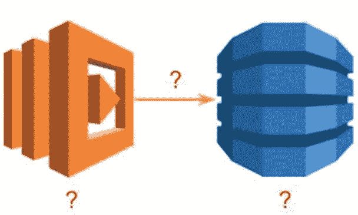

What does this picture mean and why we call it “Architecture”?

但是看看上图。这是我们通常记录无服务器架构的方式。不可能给单个元素或整个图赋予精确和明确的含义。这个图太模糊了。

Which one to use and when?

通常，很难决定在什么情况下选择哪种图标变体。是不是都是一个意思，只是口味问题？或者它们都是不同的，选择取决于上下文。那么，如何找到正确的上下文呢？

这是来自官方的 AWS 无服务器 Web 应用研讨会的图表:

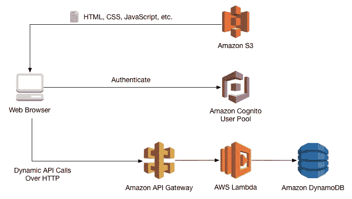

AWS Serverless Web Application Workshop Architecture

这个图似乎告诉我们，有五个 [AWS](https://hackernoon.com/tagged/aws) 服务，原则上它们可以相互对话，Web 浏览器也可以与其中一些对话。然而，它很少传达应用程序是如何构建的以及它是做什么的。

该图对于进行延迟、吞吐量、安全性、可用性、成本或生产率的架构分析不是很有用。没有办法将核心业务功能与通用或辅助组件分开。没有办法识别分散在多个应用程序中的重复。没有办法比较多种选择，也没有办法证明选择一种比另一种更合理。

此外，这种图表样式不会超出非常简单的应用程序的范围。当应用程序变大时，通常会失去对其结构的智能控制。在无服务器的会议上，经常会听到一些关于初创公司的令人担忧的故事，这些公司在 6 个月的开发时间内产生了大约 500 个 Lambda 函数；而现在，没有人知道发生了什么以及如何维护它们。有时给人的印象是，无服务器计算只是一种把我们自己搞得面目全非的新奇方式。

这里有一些更高级的主题。软件架构蓝图必须构成系统可观测性的坚实基础。相同的蓝图必须有助于战略规划:我们的应用程序的哪些部分最有可能被 can 供应商商品化(使用 [ILC 模型](http://blog.gardeviance.org/2014/03/understanding-ecosystems-part-i-of-ii.html))以及我们的开源战略应该是什么样子(为了正确理解，你可能需要阅读整本[书](https://medium.com/wardleymaps))。使用没有精确语义的图片怎么可能做到这一切？

 [## 沃德里地图

### 地形情报在商业战略中的应用

medium.com](https://medium.com/wardleymaps) 

今天，我们没有一个适当的、丰富的、但一致的语言来解决所有这些问题；我们非常需要它。

# 对此能做些什么呢？

作为一个运行示例，我将使用 AWS solution architects 在最近在特拉维夫举行的 2018 年 AWS 峰会的“使用无服务器基础设施的快速开发”主题中展示的示例应用程序。

该应用程序被称为 MakirOto(希伯来语中的“认识他”)。这是一个可爱的应用程序，展示了许多 AWS 无服务器功能。以下是 MakirOto 整体架构在舞台上的展示方式:

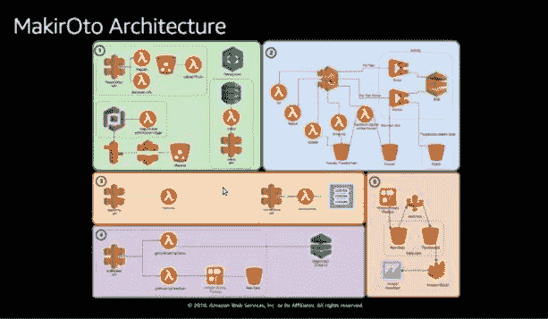

MakirOto Architecture

在这个图中，混合了表示 AWS 服务的图标，如 Rekognition 和 API 网关，以及单独的资源，如 Lambda 函数和 S3 桶。目前还不清楚代表 Lambda Function 的图标是指实例、Lambda Function 规范(又名 [SAM 模板](https://github.com/awslabs/serverless-application-model))还是特定 AWS 区域内的个别部署。

在我们开始改进之前，我们首先需要理解并准确记录系统做了什么。更具体地说，系统如何与其外部参与者交互(用例模型)，以及这些用例如何由系统内部组件实现(逻辑模型)。

# 用例模型

这是 MakirOto 的一个用例模型，我从演示文稿中理解了它(在 [YouTube](https://www.youtube.com/watch?v=OAo1qwXMqug&t=3s&index=10&list=PLhr1KZpdzukcpd__tGf2QNsnjyachcXEI) 上有希伯来语版本):

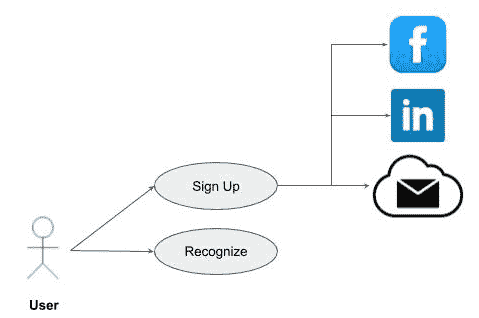

MakirOto UseCase Model

架构上基本用例的正确建模通常被忽略，导致任何随后的技术争论缺乏由用户需求定义的合理起点。如今,“用例”这个术语经常被错误地应用于任何可能带有一丝*使用*味道的事物。

为了保持本文的独立，这里是我通常使用的术语“用例”的半正式定义:“用例是外部参与者和系统之间的封闭交互，通常由一些参与者发起以完成特定的目标”。

上面的用例模型没有说太多，但是它确实为我们讨论架构决策提供了合适的上下文。这非常重要，我想再强调一次:

在我们对系统如何与其外部参与者交互以交付某种价值有了清晰一致的认识之前，我们不应该开始任何关于系统内部如何组织的技术讨论。

第一个用例“注册”，是许多交互系统的典型用例。在 MakirOto 中，注册新用户需要通过电子邮件发送确认码，上传用户照片，并从社交网络中提取额外的个人信息。

第二个用例，“识别”，反映了系统的主要价值主张——它是主要的架构上重要的用例，证明了系统首先要被开发。其余的，包括“注册”用例，将只需要支持“识别”用例。支持用例可能在技术上非常具有挑战性(或者有趣)，但是它们并不反映系统的真实性质，因此，只有在我们清楚地掌握了系统的主要用例之后，才应该进行分析。

那么，在“识别”用例的过程中会发生什么呢？典型的事件流可以用下面的序列图来说明:

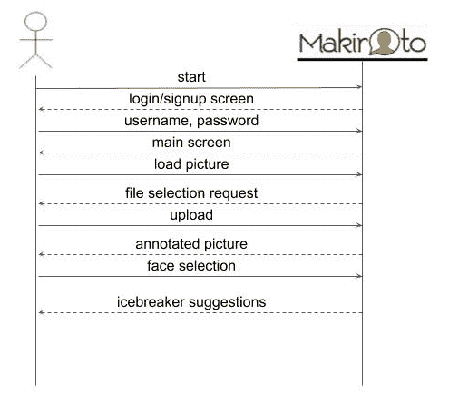

MakirOto “Recognize” Use Case Typical Event Sequence

序列图对于架构分析来说是一个非常强大的工具，但是经常没有被充分利用。我将在另一篇文章中讨论序列建模的一些重要的微妙之处，但是现在可以说所有的性能(延迟、吞吐量)和可用性需求分析都将从这里开始。

在 MakirOto 的例子中，有另一个场景，当识别请求被提交给现场摄像机时，但是由于这是第一个场景的一个小变化，我们将在这里跳过它。

前几个步骤，直到“加载图片”命令，对于任何用户识别过程都是常见的，它们本身并不十分有趣。成功登录后，用户上传一张照片，对照片上的人进行面部识别。之后，用户可以询问关于已识别的个人的附加信息:他可能在过去何时何地遇到过他们，他们的兴趣是什么，以及什么讨论主题将更好地用于开始对话。这是系统的核心，也是我们应该关注的地方。

# 逻辑模型

到目前为止，我们将该系统视为一个黑匣子——在深入研究细节之前，我们想知道外部发生了什么。下一步是看看系统内部做了什么来支持这些交互。为此，我们需要放大相应的序列图:

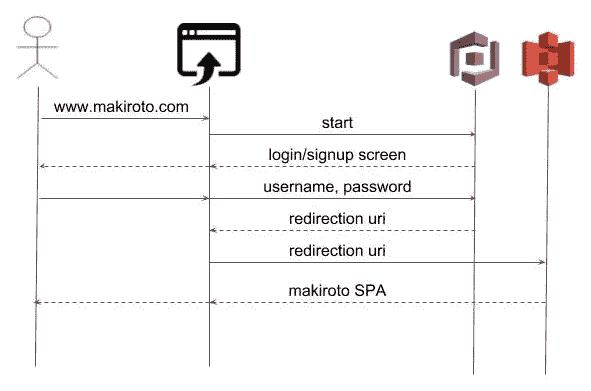

MakirOto “Recognize” Use Case, Login Sequence

在无服务器架构的上下文中，这种类型的模型旨在回答以下问题:“系统逻辑的哪些部分需要定制开发，哪些可以委托给托管服务？”

考虑到这个非常具体的问题，我们现在可以绝对精确地指定该图中每个 AWS 图标的语义——它将指定一些 AWS 完全托管服务的 SDK，我们将向其委派一些活动。

上面的序列图告诉我们的是，整个用户识别过程被委托给 Amazon Cognito，在成功认证结束时，它会将浏览器重定向到 AWS S3 托管的单页面应用程序(SPA)。这是一个完全商业化的服务，我们可以预计，在未来，这种功能将被打包在一些可重用的组件中，这些组件位于 AWS 无服务器应用程序库(参见 T2 西蒙·沃德利对未来无服务器开发过程的预测)。

现在让我们来看看当用户点击“加载图片”按钮时会发生什么(为了节省空间，省略了浏览器图标):

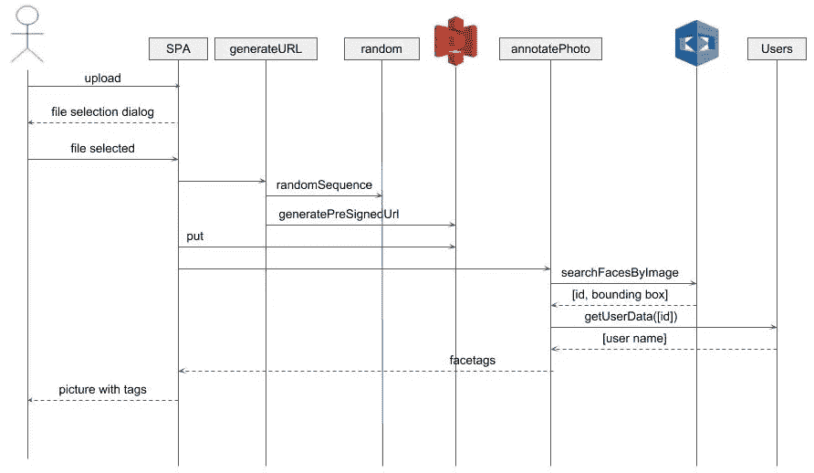

MakirOto “Reconginze” Use Case, Upload Picture Sequence

显然，这是关于用名字标记所有在照片上被认出的脸。这里我们做一个隐含的假设，系统将只识别注册用户的脸。实际步骤非常简单:

*   生成随机字符序列
*   要求 AWS S3 从这个随机序列加上一些固定前缀创建一个预签名的 URI
*   使用这个预先签名的 URI 将图片上传到 S3
*   请亚马逊 Rekognition 服务识别图片上的人脸
*   检索关于每个被识别面部的附加信息(特别是姓名)
*   显示带注释的图片

这也是一项非常常见的任务——有许多应用程序可能需要面部标签服务。因此，它是放置在 [AWS 无服务器应用程序库](https://aws.amazon.com/serverless/serverlessrepo/)的又一个很好的候选者。这仍然不是 MakirOto 系统的核心。

为此，我们需要另一个序列图:

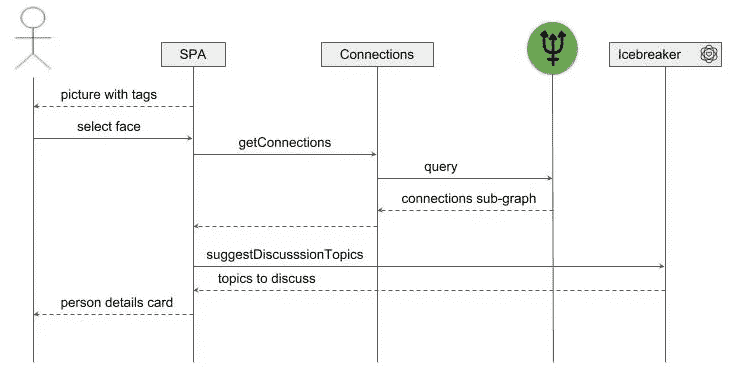

MakirOto “Recognize” Use Case, Select Face Sequence

当用户在图片上选择一个被标记的脸时，SPA 将检索一个连接当前用户和被选择的人的子图。这些联系可能是他们都去过的一些地方(比如学校、军队服务、大学、工作场所或度假旅行)、兴趣和潜在的许多其他事情。下一步是要求定制的人工智能服务(称为 Icebreaker)建议哪些主题最适合作为对话的开始。

这是系统的核心领域和核心价值主张——根据可用的个人信息提出讨论主题，其余都是次要的，旨在支持核心。

在这里，我们需要社会学家、心理学家、数据科学家和软件工程师之间的密切合作。在这里，我们将需要花一些时间与产品经理和业务发展，看看整个结构是否导致一个有吸引力的投资回报率，并适应潜在的竞争。此时，我们可能会考虑相同核心[技术](https://hackernoon.com/tagged/technology)的其他用例(例如，会议准备)。

上图中反映了一些具体的架构决策，即 AWS Neptune 将用于存储和检索连接图，整个过程将由 SPA 协调。这张图表反映了我对 MakirOto 团队基于可用演示材料所做工作的理解。这种理解可能不准确或完全错误，但我认为它以一种非常精确的形式反映出来，这比我们今天所拥有的有了很大的进步。

# 过程结构

我们已经花费了大量的时间和精力来分析系统交互和核心价值主张。这是绝对必要的一步，不能绕过——没有这一步，所有随后的步骤都将失去意义。现在，我们可以开始考虑我们需要哪些盒子来实现系统逻辑:

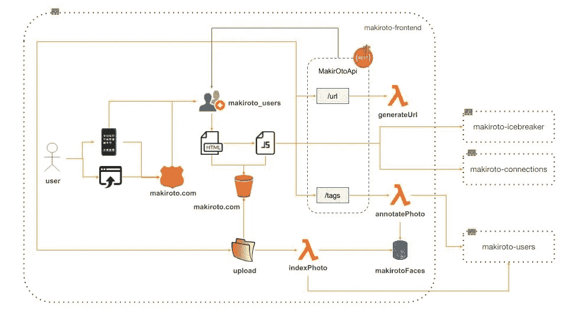

MakirOto Process Structure, v1

这里，每个图标表示一个计算过程实例(例如 Lambda 函数)或来自 AWS 托管服务的资源:S3 桶、DynamoDB 表、Rekognition 图像集合、API、Route 53 托管区域。所有连接线都有标准的 UML 语义，即指针或聚合。属于同一个子系统(即微服务)的计算和资源被打包在一个 CloudFormation 堆栈中。

就精确度而言，这比 stage 中呈现的图表有所改进，在 stage 中，资源图标与服务图标混在一起，并且缺少许多重要的细节:

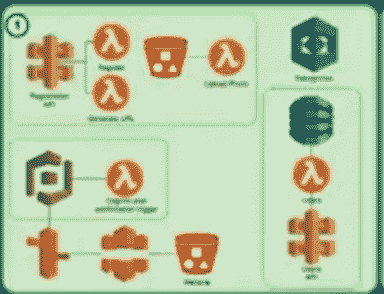

现在，如果我们愿意，我们可以用一些重要的容量细节(例如 RAM 的数量和 Lambda 函数的最大并发性)来注释每个图标，并用最小的访问权限来注释每个箭头。

该图仍不完善——难以理解，因此难以用于吞吐量、成本或安全性的架构分析。问题不仅在于在一个小地方挤在一起的盒子和连接的数量，还在于把太多不相关的概念放在一起。换句话说，提议的架构缺乏内聚力。让我们看看是否可以通过一些温和的重构来改进它。

从对系统逻辑的初步分析中，我们已经知道哪些部分构成了它的核心，哪些部分只是起辅助作用。我们可以利用这些线索将系统分解成更小、更易管理的部分。

首先，让我们将与用户认证相关的所有元素提取到一个单独的微服务中:

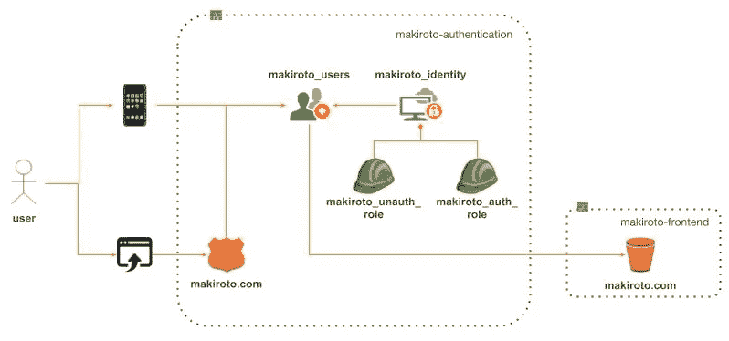

MakirOto Authentication Microservice

现在，我们不仅精确，而且更加清晰。MakirOto 认证微服务的这张图清楚地讲述了它的故事。AWS 认知用户和身份池链接在一起(正常认知实践)。我添加了身份池来支持与流行的社交网络(如脸书和 Twitter)联合的身份验证，从而使直接注册过程成为可选的。

移动应用程序将直接根据 MakirOto 用户池认证或注册用户，而 Web 应用程序用户将使用在亚马逊 Route 53 托管区域注册的 makiroto.com 域名来访问它。身份池将定义两个 IAM 角色:一个用于未经身份验证的用户，一个用于经过身份验证的用户。为了取悦我们的 CISO，我们可能需要详细说明每个角色的具体政策，但这是另一篇文章的主题。

用户池将被配置为将 Web 应用程序用户重定向到 AWS S3 托管的静态网站(同样，正常的 AWS 认知实践)。

现在让我们提取下一个支持功能，即 MakirOto Pictures 微服务:

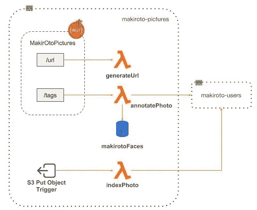

MakirOto Pictures Microservice

我认为高内聚和松耦合是主要的架构准则。因此，我决定将所有处理图片上传和处理(URI 生成、照片索引、注释)的 Lambda 函数放在一起，并使用一个 AWS Rekognition 集合来备份这个过程。不错，但是有几个问题需要考虑。

首先，两个 Lambda 函数使用 AWS API Gateway 包装在一个 REST API 中，而第三个函数(indexPhoto)应该由 S3 PutObject 触发器调用。这种缺乏一致性真的有道理吗？我不确定，但是为了形成我自己的观点，我需要了解 MakirOto 团队所做决定背后的基本原理，所以让我们暂时保持现状。

下一个问题是，S3 桶是否应该包含在这个微服务中，通过保持上传区域与系统的其余部分完全隔离，使其更加独立，更加安全？这听起来是个合理的主意。

最后一个问题是图片微服务对用户微服务的依赖性。这是一个更大的问题，因为微服务之间的直接依赖被认为是一种反模式，最终导致所谓的[死星](https://books.google.co.il/books?id=oyZKDwAAQBAJ&pg=PA51&lpg=PA51&dq=microservices+death+star+pattern&source=bl&ots=R63x6znfmG&sig=1q-LcwdF9KrYF3F7NG9qD7OuVJU&hl=iw&sa=X&ved=0ahUKEwjq9bjFqsjaAhXGL1AKHduABRcQ6AEIVzAJ#v=onepage&q=microservices%20death%20star%20pattern&f=false)结构。我们真的需要它吗？为了理解它，让我们看看用户微服务的内部:

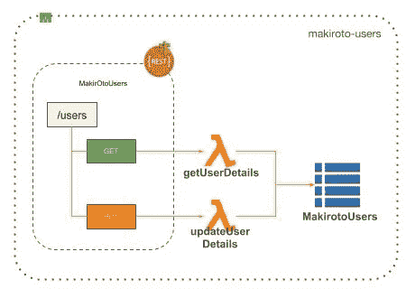

MakirOto Users Microservice

这是一个所谓的 CRUD 微服务，封装了对 MakirOto 用户记录的基本创建、检索、更新、删除操作。看起来 MakirotoUsers DynamoDB 表的全部目的是保存关于用户的附加信息。首先，这是用户的全名，AWS Rekognition 系统不保存。第二，这些是通过 Rekognition 从面部提取的属性，如年龄组和性别，缓存这些属性是为了加快将来的访问。

由于 annotatePhoto 函数应该返回真实姓名，而不是用户 id，所以在 Faces(根据图片重命名，以更好地表达其主要目的)中包含该表可能是有意义的。

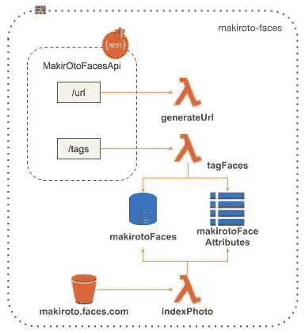

MakirOto Faces Mciroservice

现在，我们有了更有凝聚力、更独立的微服务，这也是进一步统一的一个很好的候选。

在我们将所有东西放回一起之前，让我们简单地看一下剩下的两个微服务。

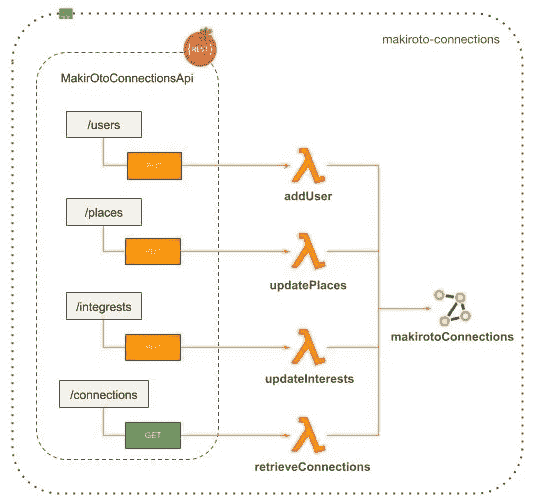

MakirOto Connections Microservice

在这里，我决定将每个更新和检索操作包装到一个单独的 Lambda 函数中，以便允许细粒度的访问控制。这不一定是最佳解决方案，可能需要额外的用例分析。Lambda 函数粒度是一个重要且具有挑战性的架构主题。最好将它推迟到一个单独的博客帖子。

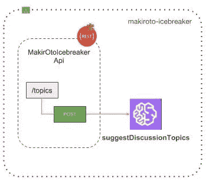

MakirOto Icebreaker Microservice

一些技术细节仍然缺失:社交网络抓取连接，AWS SageMaker 破冰船模型培训，以及维护 MakirOto 数据湖，但这些都是高级主题，最好推迟到单独的帖子。

现在我们可以把一切都恢复原状:

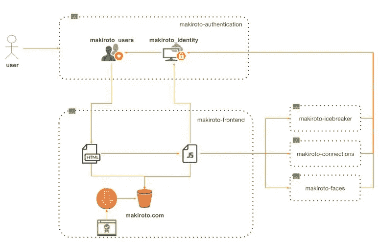

MakirOto Frontend Microservice

希望现在事情在智力上更容易管理。请记住，在这个上下文中，箭头表示具有特定访问权限的指针，仅此而已。例如，它不表示两个元件之间可能的命令或数据流动。当我们谈到无服务器应用程序的可观察性时，这种区别将会很重要。

我们可能还没有完全完成。目前，每个后端微服务都有自己的 API，通过 AWS API Gateway 公开。真的有道理吗？为什么不将后端微服务保持在 Lambda 级别，并将其全部包装在一个 API Facade 中？AWS API 网关有哪些替代方案，哪些考虑因素会导致选择其中一个？好问题将在一个单独的职位。

# 实现模型

现在，我们可能想要指定一些微服务是如何在内部构建的。很可能不是每个微服务都值得这样的关注，只有那些我们认为不重要的微服务才值得关注。在我们的例子中，这就是 Faces 微服务:

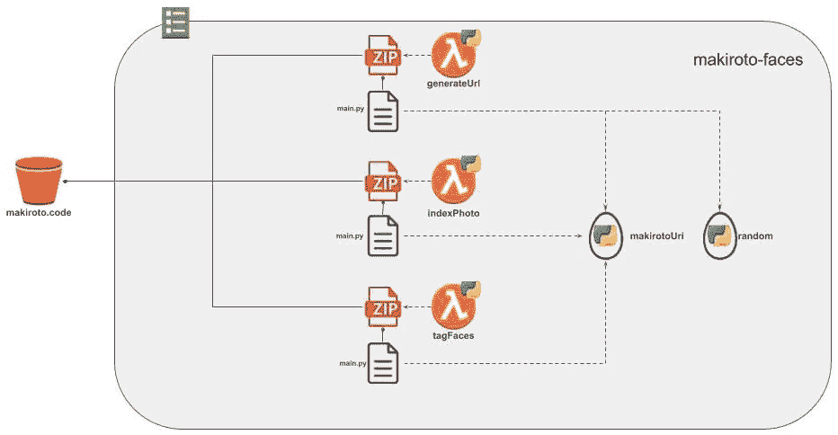

MakirOto Faces Microservice Implementation

这里，盒子意味着源文件和构建工件:共享模块(例如 Python Eggs)、Zip 文件、Lambda 函数等。而箭头意味着构建依赖关系:“为了构建这个，我们需要那个。”

这个图表很有趣，有几个原因。首先，为了避免混乱，我故意决定省略许多细节，如上传的 S3 桶、API 网关资源、Rekognition 图像集合和 DynamoDB 表。正如经常发生的那样，不同类型的模型会重叠。当我们查看 Faces 微服务的流程结构时，已经记录了所有这些细节。手动复制相同的信息会非常烦人，而且我们还没有合适的工具。

第二，这个图反映了一个重要的架构决策，即带有 Lambda 函数代码的 ZIP 文件应该放在哪里。将源保存在上传桶中可能很有诱惑力。然而，从安全角度来看，这似乎不是正确的解决方案。将 Lambda 函数代码保存在一个 S3 桶中并不是一个好主意，外部用户可以通过这个桶进行上传。这个特殊的决定并不仅仅针对 Faces 微服务，而是针对所有微服务。

第三，这个图揭示了一些容易被忽略的东西:所有三个 Lambda 函数都需要在某种程度上与 URI 格式相协调。保持这种隐性的协调将是最有问题的选择。在这种情况下，我决定将公共逻辑提取到 Python egg 包中。另一种解决方案是放弃三个独立的 Lambda 函数，将所有计算放在一个 Lambda 函数中。还要记住——URI 结构上的协调是决定在 URI 直接编码一些重要信息的结果。如果使用 S3 元数据，这些内部结构会有所不同。

# 部署模型

我们需要分析的系统架构的最后一个方面是，我们的系统将如何跨多个区域部署。为此，我们需要生产另一个模型:

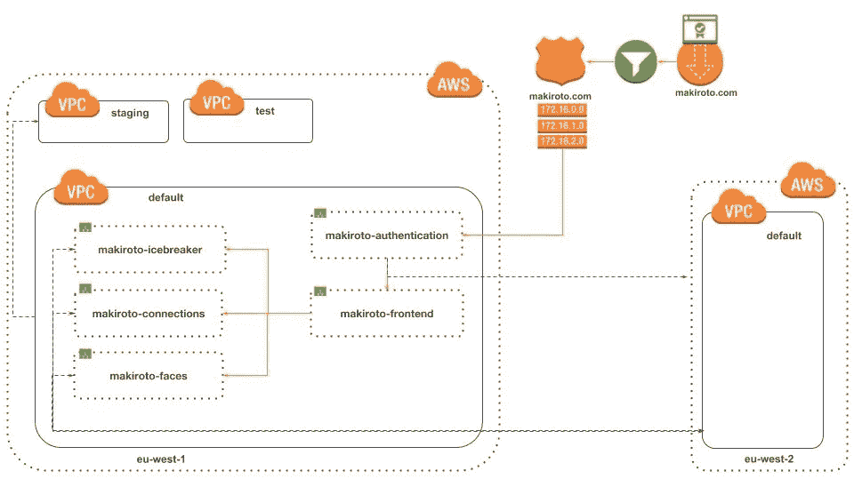

MakirOto Deployment Model

上面的部署模型图展示了一个相对简单的设置，有两个区域:一个用于主要生产操作、测试和试运行，另一个用于灾难恢复备份。IP 路由表仅指向 Cognito 认证入口点，其余部分在区域级别直接连接。除了前端，每个微服务都负责其全局复制。对于 S3 桶和 DynamoDB 表，开箱即用地支持跨区域复制；然而，对于 Cognito 用户池，需要采取一些特殊的措施(例如，通过 Lambda 函数触发器)。此外，需要以某种方式实现将生产数据导出到临时区域。反过来，这可能会带来其他模型(逻辑、流程、实现)中需要解决的额外需求。通常情况下——架构过程很少是线性的。

上面介绍的部署策略可能会引起争论，争论的焦点是它是否正确，或者更有可能的是，它是否为安全性、可用性和成本需求提供了足够的解决方案。机会是**，**它还不是最优的。然而，重要的是，在其目前的状态下，它以一种明确和精确的形式得到反映，使其更有利于额外的审查。

# 结束语

软件架构更多的是关于最简单的可能解决方案的清晰交流，而不是发明一些过于复杂的东西来消化。一般来说，软件架构的当前状态，尤其是无服务器架构，远非理想——我们在日常实践中仍然没有使用一致的架构建模语言。一个主要的原因似乎是我们总是试图在一个图表或图片中放入超过它所能承受的东西。维护语义一致性是困难的，并且只有在定义明确的狭窄上下文中才可能有效。任何重要的系统都需要不止一个模型，每个模型都反映一个特定的系统方面。此外，所有这些模型必须在逻辑上相互映射，以保持整个系统的一致性。

在这篇文章中，我使用了 5 种不同的模型:用例、逻辑、过程、实现和部署。事实上，我采用了 P. Krutchen 开发的所谓的软件架构的 [4+1 视图](https://www.cs.ubc.ca/~gregor/teaching/papers/4+1view-architecture.pdf)方法。在最初的论文中，不同的模型被称为视图，并且整体结构使用这个图来表示:

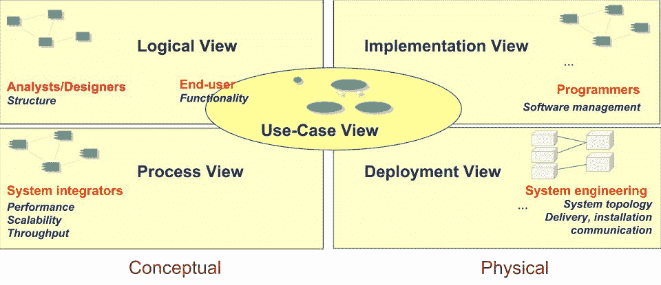

“4+1 Views of Software Architecture”

下表总结了视图的定义和职责:

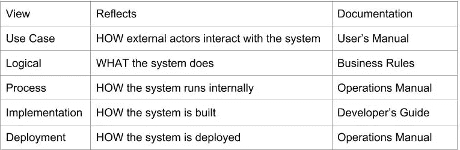

Views Definitions and Responsibilities

在现实生活中，架构过程不太可能是线性的。更有可能的是，它会在多个视图之间来回“振荡”。例如，在 MakirOto Deployment 视图上工作时，我们发现我们需要一些定制的 Cognito 用户池复制解决方案(AWS 目前还没有)。我们还发现，我们需要将生产数据导出到暂存区。这很可能会将我们带回流程视图，并且整个流程很可能需要多次迭代，直到它稳定下来。视图之间的这种来回动态如下图所示:

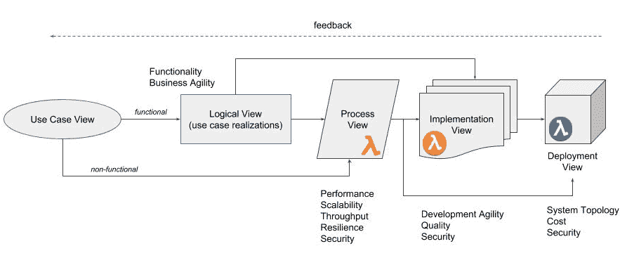

“4+1 Views” Interactions

“4+1 视图”模型提出了一种一致的语言来从多个角度描述软件架构，并将它们相互映射，以保持整个结构的一致性。这确实是一种基于坚实科学基础的非常强大的建模方法。有了这种语言，我们现在可以系统地推理无服务器架构的各个方面，无论是功能粒度、可观察性、性能、安全性、生产率、API 还是开源策略。我们还可以评估多种架构选择，而不会陷入“你的架构对我的架构”的激烈争论。我计划在以后的文章中讨论这些话题。敬请关注。